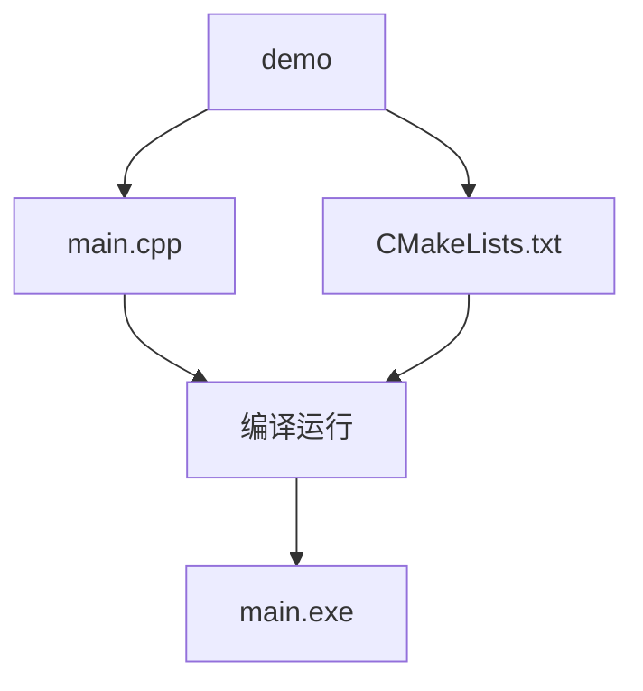
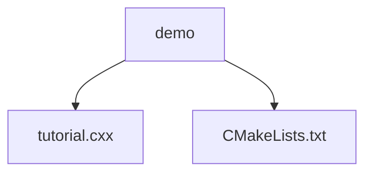

# <center> CMake教程

<center>by Xian2207，wszhangxian@126.com，2020年5月20日


# 1 介绍

**cmake本质**：makefile的产生器，即generator。VS里就是.sln解决方案，Linux里就是根据cmakelists执行 `cmake ..`生成的makefile。

**`cmake ..`含义**：将上一级目录的工程打包，产生makefile。

**cmake设置**：本质是cmakelists.txt的撰写，而且不缺分关键字的大小写，甚至大小写混合。

简单示例：架构和流程如下



【1】main.cpp

```c++
#include <iostream>

int main() {
  std::cout << "hello cmake!" << std::endl;
  getchar();
  return 0;
}
```

【2】cmakelists.txt

```cmake
cmake_minimum_required(VERSION 3.0)
project(demo)

if(NOT CMAKE_BUILD_TYPE)
    set(CMAKE_BUILD_TYPE Debug)
endif()
message(STATUS "${CMAKE_BUILD_TYPE}")

set(CMAKE_CXX_STANDARD 11)
#set(CMAKE_CXX_FLAGS_DEBUG "-g -O0")
#set(CMAKE_CXX_FLAGS_RELEASE "-O3")

set(PROJECT_ROOT ${CMAKE_CURRENT_LIST_DIR})
# 静态编译
if(CMAKE_CXX_COMPILER_ID MATCHES "GNU|Clang")
    set(CMAKE_EXE_LINKER_FLAGS "${CMAKE_EXE_LINKER_FLAGS} ${GCC_COVERAGE_LINK_FLAGS} -static-libgcc -static-libstdc++ -static")
    set(CMAKE_EXE_LINKER_FLAGS=-static-libgcc -static-libstdc++ -static)
    set(CMAKE_CXX_FLAGS "${CMAKE_CXX_FLAGS} -std=c++11 -s -O3")
else()
#    if (MSVC)
        set(CompilerFlags
            CMAKE_CXX_FLAGS
            CMAKE_CXX_FLAGS_DEBUG
            CMAKE_CXX_FLAGS_RELEASE
            CMAKE_C_FLAGS
            CMAKE_C_FLAGS_DEBUG
            CMAKE_C_FLAGS_RELEASE
        )
        foreach(CompilerFlag ${CompilerFlags})
            string(REPLACE "/MD" "/MT" ${CompilerFlag} "${${CompilerFlag}}")
        endforeach()
#    endif(MSVC)
endif()

add_executable(
    main
    ${PROJECT_ROOT}/main.cpp		
)

target_include_directories(main
    PUBLIC
    ${CMAKE_CURRENT_BINARY_DIR}
)

set(CMAKE_INSTALL_PREFIX ${CMAKE_CURRENT_SOURCE_DIR}/build/)
```

【3】编译运行

```
# 下面只需cmake安装时执行一次，以后可省，除非指定Win32版本
# cmake .. -G "Visual Studio 15 2017 Win64"
cmake ..
cmake --build .
```

**说明**：`cmake --build .`等同于 `devenv FileName.sln /build debug `（debug写Debug也行）。 

# 2 `cmake`语法

## 2.1 基础知识

示例架构如下



【1】tutorial.cxx

```
#include <iostream>
using namespace std;
int my_add(int a, int b){
    return a + b;
}
int main(){
    int a = 3;
    int b = 4;
    cout << "result: " << my_add(a,b) << endl;
    return 0;
}
```

【2】cmakelists.txt （**CMakeLists.txt都可以，不区分大小写**）

```cmake
cmake_minimum_required(VERSION 3.10)
# 设置项目名称
project(Tutorial)
# 添加可执行应用
add_executable(Tutorial tutorial.cxx)
```

【3】测试

```cmake
mkdir build && cd build
cmake ..
cmake --build .  # 默认生成32位的Debug模式
```

## 2.2 版本设置

【1】tutorial.cxx添加 "TutorialConfig.h"（**TutorialConfig.h实际不存在**）

```c++
#include <iostream>
//#include "../demo/build/TutorialConfig.h"
#include "TutorialConfig.h"
using namespace std;
int my_add(int a, int b) { return a + b; }
int main() {
  int a = 3;
  int b = 4;
  cout << "result: " << my_add(a, b) << endl;
  cout << "version: " << Tutorial_VERSION_MAJOR << endl;
	  getchar();
  return 0;
}
```

注意：**头文件路径可以用相对路径，也可以直接引用，但`project(name VERSION 1.0)`必须与`*_VERSION_MAJOR`的`*`一致**。

【2】cmakelists

```cmake
cmake_minimum_required(VERSION 3.10)
# 设置项目名称和版本号
project(Tutorial VERSION 1.0)
# 添加版本号必须设置configure.h.in
configure_file(TutorialConfig.h.in TutorialConfig.h)
add_executable(Tutorial tutorial.cxx)
# target_include_directories必须位于add_executable之后
target_include_directories(Tutorial PUBLIC
                           "${PROJECT_BINARY_DIR}"
                           )
```

说明：两种方式设置版本号

+ `project()`：如上面方面；
+ `set`：`set(Tutorial_VERSION_MAJOR 1)
  set(Tutorial_VERSION_MINOR 0)`

注意：**`TutorialConfig.h`不存在**。

【3】TutorialConfig.h.in

```c++
// 版本配置设置
#define Tutorial_VERSION_MAJOR @Tutorial_VERSION_MAJOR@
#define Tutorial_VERSION_MINOR @Tutorial_VERSION_MINOR@
```

注释建议统一为` //`

【4】测试

```
mkdir build && cd build
cmake ..
cmake --build .  
```

## 2.3 Add Library

添加用户自建的库 MathFunctions

【1】MathFunctions

在`PROJECT_SOURCE_DIR`目录里（即与tutorial.cxx, TutorialConfig.h.in, build, 工程的CMakeLists目录同级）创建MathFunctions目录，里面含三个文件

+ MathFunctions.hpp
+ MathFunctions.cxx
+ CMakeLists

hpp内容

```c++
#include <iostream>
using namespace std;
class MathFunctions {
 public:
  int mysqrt(int a);
};
```

cxx内容

```c++
#include "MathFunctions.hpp"
int MathFunctions::mysqrt(int a){
  int c = a * a;
  return c;
}
```

CMakeLists内容

```cmake
add_library(MathFunctions MathFunctions.cxx)
```

【2】项目工程的cmakelists

```cmake
cmake_minimum_required(VERSION 3.10)
# 设置项目名称和版本号
project(Tutorial VERSION 1.0)
# 设置是否使用自己的库的开关
option(USE_MYMATH "User-Provided math implementation" ON)
# 添加版本号必须设置configure.h.in
configure_file(TutorialConfig.h.in TutorialConfig.h)
# 如果开启自己的库
if(USE_MYMATH)
  add_subdirectory(MathFunctions)
  list(APPEND EXTRA_LIBS MathFunctions)
  list(APPEND EXTRA_INCLUDES "${PROJECT_SOURCE_DIR}/MathFunctions")
endif()
# 添加应用
add_executable(Tutorial tutorial.cxx)
# 与自己的库配对的link设置
target_link_libraries(Tutorial PUBLIC ${EXTRA_LIBS})

# 添加binary DIR以便于找到TutorialConfig.h
target_include_directories(Tutorial PUBLIC
                          "${PROJECT_BINARY_DIR}"
                          ${EXTRA_INCLUDES}
                          )
```

【3】tutorial.cxx修改

```c++
#include <iostream>
#include "TutorialConfig.h"

#ifdef USE_MYMATH
#  include "MathFunctions.hpp"  //注意此处
#endif

using namespace std;
int my_add(int a, int b) { return a + b; }
int main() {
  int a = 3;
  int b = 4;
  cout << "result: " << my_add(a, b) << endl;
  cout << "version: " << Tutorial_VERSION_MAJOR << endl;
#ifdef USE_MYMATH
  MathFunctions my_math;
  int outputValue = my_math.mysqrt(a);
#else
  const double outputValue = sqrt(a);
#endif
  cout << "sqrt: " << outputValue << endl;
  getchar();
  return 0;
}
```

注意头文件在#define里的引用方式，前面有 `#`号。

【4】TutorialConfig.h.in修改

```cmake
// 版本配置设置
#define Tutorial_VERSION_MAJOR @Tutorial_VERSION_MAJOR@
#define Tutorial_VERSION_MINOR @Tutorial_VERSION_MINOR@

//告诉cmake该宏生效
#cmakedefine USE_MYMATH  
```

【5】测试：略

## 2.4 `Library的使用`

**背景**：2.3小节中【2】项目工程中的cmakelists使用了`EXTRA_INCLUDES`

```cmake
if(USE_MYMATH)
  add_subdirectory(MathFunctions)
  list(APPEND EXTRA_LIBS MathFunctions)
  list(APPEND EXTRA_INCLUDES "${PROJECT_SOURCE_DIR}/MathFunctions")
```

**原因**：因为MathFunctions目录的CMakeLists用的是

```cmake
add_library(MathFunctions MathFunctions.cxx)
```

并没有添加头文件，所以项目工程的cmakelists里须设置`EXTRA_INCLUDES`来引用MathFunctions目录的头文件。这就引发了一个称为`INTERFACE`的关键字。

**`INTERFACE`**：任何链接到MathFunctions库的程序需要使用其源码，而库自身不用。所以cmake里`INTERFACE`定义为调用者需要的程序，而生产者本身不需要，这个程序就是接口[1]。

修改2.3小节的CMakeLists，简化cmake的编译规则，步骤如下

【1】将MathFunctions/CMakeLists修改

```cmake
add_library(MathFunctions MathFunctions.cxx)
target_include_directories(MathFunctions
          INTERFACE ${CMAKE_CURRENT_SOURCE_DIR}
          )
```

【2】demo/CMakeLists修改

```cmake
# 如果开启自己的库
if(USE_MYMATH)
  add_subdirectory(MathFunctions)
  list(APPEND EXTRA_LIBS MathFunctions)
endif()

# 添加binary DIR以便于找到TutorialConfig.h
target_include_directories(Tutorial PUBLIC
                          "${PROJECT_BINARY_DIR}"
                          )
```

【3】测试：略

## 2.5 `Install`应用和库

2.5小节以前是如何编译库，链接库，如何安装到本地呢？步骤如下

【1】MathFunctions/CMakeLists修改

```cmake
add_library(MathFunctions MathFunctions.cxx)
target_include_directories(MathFunctions
          INTERFACE ${CMAKE_CURRENT_SOURCE_DIR}
          )

install(TARGETS MathFunctions DESTINATION lib)
install(FILES MathFunctions.hpp DESTINATION include)
```

【2】demo/CMakeLists修改

文件最末尾添加

```cmake
install(TARGETS Tutorial DESTINATION bin)
install(FILES "${PROJECT_BINARY_DIR}/TutorialConfig.h"
  DESTINATION include
  )
```

【3】测试：略。

最终生成**MathFunctions.lib**和MathFunctions.pdb，前者是Windows系统常用的静态库。

**笔者发现**：即使把install的语句全部注释掉，仍然可以在demo/build/Debug/MathFunctions/Debug/目录下看到`.lib`和`.pdb`文件。尚不清楚下面命令如何人运行，换成C盘也不行。

```
# cmake --install <dir> [option]
cmake --install E:\demo\build\AAA 
```

## 2.6 `Test Support`

**cmake测试**：即用cmake测试我们的所有程序，**非重点**。

【1】Demo/CMakeLists修改

末尾添加

```cmake
enable_testing()

# does the application run
add_test(NAME Runs COMMAND Tutorial 25)

# does the usage message work?
add_test(NAME Usage COMMAND Tutorial)
set_tests_properties(Usage
  PROPERTIES PASS_REGULAR_EXPRESSION "Usage:.*number"
  )

# define a function to simplify adding tests
function(do_test target arg result)
  add_test(NAME Comp${arg} COMMAND ${target} ${arg})
  set_tests_properties(Comp${arg}
    PROPERTIES PASS_REGULAR_EXPRESSION ${result}
    )
endfunction(do_test)

# do a bunch of result based tests
do_test(Tutorial 4 "4 is 16")
do_test(Tutorial 9 "9 is 81")
do_test(Tutorial 5 "5 is 25")
```

在demo/build目录下执行

```cmake
ctest -C Debug
```

说明：实际跑不通，需修改tutorial.cxx，改为键盘输入才行，详情见[2]。

## 2.7 生成安装包

**背景**：将应用和源码打包成二进制的安装包 ，以便于跨平台应用。

**操作**：

【1】cmakelists修改

把demo/CMakeLists末尾的enable_test()至do_test全部删除，然后在其末尾添加

```
include(InstallRequiredSystemLibraries)
set(CPACK_RESOURCE_FILE_LICENSE "${CMAKE_CURRENT_SOURCE_DIR}/License.txt")
set(CPACK_PACKAGE_VERSION_MAJOR "${Tutorial_VERSION_MAJOR}")
set(CPACK_PACKAGE_VERSION_MINOR "${Tutorial_VERSION_MINOR}")
include(CPack)
```

说明：

+ InstallRequiredSystemLibraries：将应用所需的本地运行库加入到该关键字；
+ License.txt：**用户可在里面写版权声明等内容**；
+ CPack：该关键字说明模块打包，记录应用使用的运行库和版本号等。

【2】创建 License.txt

在demo目录下创建License.txt，里面写自己的版权声明。

【3】**生成exe安装包**

demo/build目录（即binary directory）里执行

```
cpack
```

报错：

```cmake
CPack Error: Cannot find NSIS compiler makensis: likely it is not installed, or not in your PATH
CPack Error: Could not read NSIS registry value. This is usually caused by NSIS not being installed. Please install NSIS from http://nsis.sourceforge.net
```

**解决**：从`http://nsis.sourceforge.net`下载和安装NSIS，成功后执行

```
cpack
```

在demo/build/目录下会有一个`Tutorial-1.0=win32.exe`的应用（默认win32 debug模式）即安装包。用户安装时类似正常Windows程序安装。

【4】生成其他格式安装包

**ZIP格式**：`cpack -G ZIP -C Debug`，方便跨平台；

**源码格式**：`cpack --config CPackSourceConfig.cmake`，其他平台可编译再生成binary应用程序。

**笔者发现**：NSIS默认安装了ZIP，假设PC装了7Z，执行

```
cpack --config CPackSourceConfig.cmake
```

生成`Tutorial-1.0-Source.7z`和`Tutorial-1.0-Source.zip`。其他用户解压后，如果是Windows就是正常的cmake编译和生成可执行应用流程；Linux类似Windows操作，不过换成了`cmake ..; make; make install`等。

**经验**：执行`...Config.cmake`前记得把demo的build目录删除，否则7z和zip源码安装包太大。

## 2.8 静态库动态库混编

感兴趣参考[1]，略。

## 2.9 Debug和Release同时打包

感兴趣参考[1]，略。

# 3 cmake小知识

## 3.1 --build --target --config

```
cmake --build {BUILD_DIR_PATH} --target ALL_BUILD --config {BUILD_TYPE}
```

说明：

+ BUILD_DIR_PATH: `.` 代表当前目录；
+ ALL_BUILD: 代表构建整个项目，除了install和单元测试；
+ BUILD_TYPE: 代表Debug, Release等模式。

## 3.2 ZERO_CHECK

功能：监视CMakeLists.txt，如果CMakeLists.txt发生变化，则告诉编译器重新构建整个工程环境。

## 3.3 打包模式

注意：**CMakeLists不能设置debug和release模式**，用命令行控制。

【1】Windows

```cmake
# Win32 + Debug
cmake ..
cmake --build . --config Debug

# Win32 + Release
cmake ..
cmake --build . --config Release

# Win64 + Debug
cmake .. "Visual Studio 15 2017 Win64"
cmake --build . --config Debug

# Win64 + Release
cmake .. "Visual Studio 15 2017 Win64"
cmake --build . --config Release
```

【2】Linux

```cmake
# (不区分32和64位) Debug
cmake .. -DCMAKE_BUILD_TYPE=Debug
make
make install

# (不区分32和64位) Release
cmake .. -DCMAKE_BUILD_TYPE=Release
make
make install
```

## 3.4 指定路径安装

【1】Windows

方法1：编辑 CMakeLists

```cmake
set(CMAKE_INSTALL_PREFIX ${CMAKE_CURRENT_SOURCE_DIR}/build/)
```

方法2：使用cmake-gui，设置CMAKE_INSTALL_PREFIX目录。

【2】Linux

方法1：编辑CMakeLists，同Windows

方法2：使用cmake-gui，同Windows

方法3：命令行

```
cmake -DCMAKE_INSTALL_PREFIX=/your_path/ ..
make
make install
```

# 4 参考文献

[1] https://cmake.org/cmake/help/latest/guide/tutorial/index.html

[2] https://blog.csdn.net/huyanjie0327/article/details/46652313

