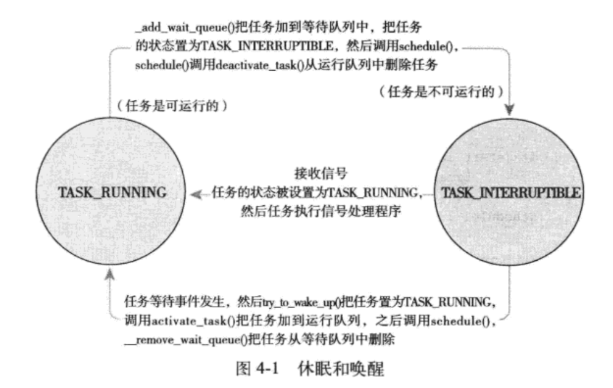

> 2019-09-29 19:39:56

# Linux内核设计与实现(第三版) 学习笔记

_参考连接：_

## 第1章 Linux 内核简介

linux内核版本号如下：


## 第 2 章 从内核出发

可以从[内核网站](https://www.kernel.org/)中下载Linux的内核源码。可以使用`uname -r`查看内核release版本号。

也可以使用如下命令查看最新的版本源代码

```bash
git clone git://git.kernel.org/pub/scm/linux/kernel/git/torvalds/linux-2.6.git
#更新到最新版本
git pull
```
也可以直接使用如下命令直接clone最新版本。然后使用`git checkout`来切换分支

```bash
 git clone git://git.kernel.org/pub/scm/linux/kernel/git/stable/linux-stable.git
```

#### 2.1.3 使用补丁

Linux中一般使用补丁的形式对发布的代码进行修改，增量补丁可以作为版本转移的桥梁。使用如下代码在内部源码树开始进行增量补丁的添加

```bash
patch -p1 < .../patch-x.y.z
```

### 2.2 内核源码树

内核雨那么树由很多目录组成，而大多数目录又包含更多的子目录。源码树的根目录及其子目录如下表所示：

|目录|描述|
|:------|:--------|
|arch|特定体系结构的源码如：ARM，AMD64|
|block|块设备I/O层|
|crypto|加密API|
|Documentation|内核源码文档|
|drivers|设备驱动程序|
|firmware|使用某些驱动程序而需要的设备的固件|
|fs|VFS和各种文件系统|
|include|内核头文件|
|init|内核引导和初始爱护|
|ipc|进程间通信代码|
|kernel|调度程序核心子系统|
|lib|通用内核函数|
|mm|内存管理子系统和VM|
|net|网络子系统|
|samples|示例，示范代码|
|scripts|编译内核所用的脚本|
|security|Linux安全模块|
|sound|语音子系统|
|usr|早期用户空间代码(所谓的initramfs)|
|tools|在Linux开发中有用的工具|
|virt|虚拟化基础结构|

COPYING是内个许可证，CREDITS是内核开发者列表。MAINTAINERS是维护者列表

### 2.3 编译内核

一般使用make命令来进行

```bash
#使用命令行选项

make menuconfig
#基于gtk+的图形工具

make gconfig
#使用默认体系结构配置

make defconfig

```

也可以使用如下的命令，将电脑中已有的配置文件作为编译配置选项

```bash
#将配置文件内容，添加到.config文件中

zcat /proc/config.gz > .config
#使用配置文件编译

make oldconfig

make 进行编译
```

### 2.3.2 减少编译的垃圾信息

```bash
#使用如下命令，进行垃圾信息重定向到文件

make > .. /detritus
#直接扔掉信息

make > /dev/null
```

接下来运行如下命令，进行内核模块的安装
```bash
make modules_install
```

### 2.4 内核开发的特点

- 内核编程时既不能访问c库也不能访问标准的c头文件:
  - 完整的C库太大太低效，因此不方便使用
  - 基本头文件在顶级目录下的include目录中，体系结构相关的头文件在arch/<architecture>/include/asm目录下使用`#include <asm/ioctl.h>`进行头文件的包含。
- 内核编程时必须使用GNU C((GNU C 、ANSI C、标准C、标准c++区别和联系)[http://blog.sae.sina.com.cn/archives/749])
  - GNU C 支持inline内联函数
  - 使用`asm volatile("rdtsc":"=a" (low),"=d" (high))`嵌入汇编代码
- 内核编程时缺乏像用户空间那样的内存保护机制
  - 用户进程中进行非法内存访问，内核会发现错误并发送SIGSEGV信号，结束整个进程。内核自己访问非法内存往往会造成内核死去。
  - 内核中的内存都不分页，没用掉一个字节，物理内存就减少一个字节
- 内核编程时难以执行浮点运算
  - 用户空间中的浮点操作，内核会完成浮点数到整数的转换。因此内核并不能完美的支持浮点数操作，因为它本身不能陷入。
- 内核给每个进程只有一个很小的定长堆栈
  - 内核栈的准确大小随着体系结构而改变，内核栈的大小是两页，32位是8KB,64位是16KB。
- 内核支持异步中断、抢占和SMP(対称多处理器结构)，因此必须时刻注意同步和并发
  - 同时在大于两核处理器上执行内核代码，可能会同时访问共享的同一个资源
  - 中断是异步到来的，完全不顾及当前正在执行的代码
  - 内核可抢占，没有保护，可能导致几段代码同时访问相同的资源，通常使用自旋锁和信号量来解决
- 要仔细考虑可移植的特性
  - 注意保持字节序、64位对齐、不假定字长和页面长度等一系列准则等


## 第 3 章 进程管理

### 3.1 进程

**每一个线程都拥有一个独立的程序计数器、进程栈、一组进程寄存器**。_内核调度的对象是线程，而不是进程_ ([从进程和线程了解浏览器的工作原理](https://www.jianshu.com/p/8ff15d3a1dfd))；在Linux中对线程和进程的区分度不是很大。线程之间共享虚拟内存，但是每个线程都拥有自己独立的虚拟处理器

### 3.2 进程描述符及任务结构

_参考链接：_ [Linux进程描述符task_struct结构体详解](https://blog.csdn.net/gatieme/article/details/51383272);[文件描述符（File Descriptor）简介](https://segmentfault.com/a/1190000009724931)

内核通过任务队列的(双向循环链表)来存放和管理进程列表。其中存放的数据类型是`task_struct`，即进程描述符，定义在<linux/sched.h>文件中，包含有：打开的文件、进程的地址空间、挂起的信号、进程的状态等信息


#### 3.2.1 分配进程描述符

Linux 通过slab分配器分配task_struct结构。slab董涛生成一个task_struct,只需要在栈底(向下增长的栈)或栈顶(向上增加的栈)创建一个新的结构struct_info(定义在<asm/thread_info.h>)中内容如下：

```c
struct thread_info{
    struct task_struct  *task;
    struct exec_domain  *exec_domain;
    __u32               flags;
    __u32               status;
    __u32               cpu;
    int fd              preempt_count;
    mm_segment_t        addr_limit;
    struct restart_block    restart_block;
    void                    *sysenter_return;
    int                     uaccess_err;
}

```


每个任务的thread_info结构在它的内核栈的尾端分配，结构中task域中存放的是指该任务实际task_struct的指针

#### 3.2.2 进程描述符

内核中的访问任务，通常需要获取其指向task_struct的指针。一般是通过current宏来查找当前正在运行进程的task_struct。不同的硬件体系结构实现的方式不同。一般都是汇编配合专用寄存器来实现的。

#### 3.2.3 进程状态

进程描述符中的state域描述了当前集成的状态。必然是下面的5种情况之一

- TASK_RUNNING(运行):进程可执行或者正在执行
- TASK_INTERRUPTIBLE(可中断):进程正在睡眠状态(也就是说它被阻塞)，等待某些条件的达成。就可以从状态回到运行态
- TASK_UNINTERRUPTIBLE(不可中断):就算接收到信号也不会被唤醒或准备
- __TASK_TRACED:被其它进程跟踪的进行，例如通过ptrace对调试程序进行跟踪
- __TASK_STOPPED(停止)：进程停止执行；进程没有投入运行也不能投入运行。


#### 3.2.4 设置当前进程状态

内核可以使用set_task_state(task,state)或set_current_state(state)函数来更改和设置进程的状态

#### 3.2.6 进程家族树

Linux和unix中所有的进程都是PID为1的init进程的后代。内核在系统启动的最后阶段启动init进程。init进程读取系统的初始化脚本(initscript)并执行其它程序，最终完成系统启动的整个过程。

每个task_struct都包含一个指针指向其父进程task_struct的parent指针。也有一个children的子进程链表。可以通过如下代码依次访问父进程和子进程

```c++
//获取父进程

struct task_struct *my_parent=current->parent;
//依次访问子进程

struct task_struct* task;
struct list_head *list;
list_for_each(list,&current->children){
    task=list_entry(list,struct task_struct,siblings);
}
```
init进程的进程描述符是作为init_task静态分配的。下面的代码可以很好的演示所有进程之间的关系:

```c++

struct task_struct *task;
//一直指向直到查找到init进程

for(task==current;task!=&init_task;task=task->parent){

}

//获取链表的下一个进程

list_entry(task->task.next,struct task_struct task);
//获取前一个进程

list_entry(task->task.prev,struct task_struct task);
```

### 3.3 创建进程

#### 3.3.1 写拷贝

linux d fork()使用写时拷贝(copy-on-write)页实现。fork()时内核并不复制整个进程地址空间，而是让父进程和子进程共享一个拷贝。只有在需要写入的时候，数据才会被复制。之前都是以只读方式共享。因此fork()的实际开销在于复制父进程的页表以及给子进程创建唯一的进程描述符。

#### 3.3.2 fork()

fork()函数调用clone()系统调用，再由clone()去调用do_fork(),do_fork()调用copy_process()函数，然后让进程开始运行。copy_process()完成的工作内容如下：

1. 调用dup_task_struct()为新进程创建一个内核栈、thread_info结构和task_struct，这些值与当前进程的值相同。此时，子进程和父进程的描述符是完全相同的
2. 检查确认子进程后，确认当前用户所拥有的进程数目没有超出它分配的资源
3. 子进程开始设置与父进程的差异值。进程描述符中许多成员都要被清0或者重新初始化
4. 子进程状态被设置为TASK_UNINTERRUPTIBLE，防止被投入运行
5. copy_process()调用copy_flags()以更新task_struct的flags成员。
6. 调用alloc_pid()为新进程分配一个有效的pid
7. 根据clone()函数接收到的参数，为copy_process()拷贝或共享打开的文件、文件系统信息、信号处理函数、进程地址空间和命名空间等
8. 最后，copy_process()做扫尾工作，并返回一个指向子进程的指针。

最终层层调用回归，kernel会优先选择执行子进程，因为一般子进程都会马上调用exec()函数。避免额写拷贝开销。如果父进程先执行，则可能会开开始向地址空间中写入。

#### 3.3.3 vfork()

vfork()不拷贝父进程的页表项，其它基本相同；子进程作为父进程的一个单独的线程在它的地址空间中运行。不过现在基本没什么作用了。

### 3.4 线程在Linux中的实现

Linux中将所有的线程都当做进程来实现，内核并没有准备特别的线程调度算法或特定数据结构。线程仅仅被视为一个与其它进程共享某些资源的进程。每个线程都拥有唯一一个task_struct。(Windows或者Solaris都在内核中提供了专门的线程支持机制--轻量级进程)

#### 3.4.1 创建线程

创建线程与进程相似，不过是在调用clone时需要传递参数来指明需要共享的资源。

```c
//普通fork实现

clone(SIGCHLD,0);
//vfork()实现

clone(CLONE_VFORK|CLONE_VM|SIGCHLD,0);
```
clone的标志位可选内容如下：


### 3.4.2 内核线程

内核中也是存在线程，称为内核线程。内核线程没有独立的地址空间(实际上指向地址空间的mm指针被设置为NULL)。他们只在内核空间运行，从来不切换到用户空间去。使用`ps -ef`可以查看到内核线程。

从现有内核中创建一个新的内核线程的方法如下：

```c
struct task_struct *kthread_create(int (*threadfn)(void *data),void *data,const char namefmt[],...)

struct task_struct *kthread_run(int(*threadfn)(void *data),void data,const char namefmt[],...)
```

新创建的进程不会主动运行。需要使用kthread_run()函数来让进程运行起来。kthread_run()是以宏实现的具体实现代码如下：

```c
#define kthread_run(threadfn,data,namefmt,...)                      \
{                                                                   \
    struct task_struct *k;                                          \
    k=kthread_create(threadfn,data,namefmt,##__VA_ARGS__);          \
    if(!IS_ERR(k))                                                  \
        wake_up_process(k);                                         \
    k;                                                              \
}                                                                   \
```

### 3.5 进程终结

一般进程的析构是自身引起的，发生在exit()被调用时。C语言编译器会在main函数的return 之后调用exit()函数。exit()函数的主要任务由do_exit()来完成。主要完成下面的几个工作：

1. 将task_struct中的标志成员设置为PF_EXITING;
2. 调用del_timer_sync()删除任一内核定时器。取消CPU排队。
3. 如果BSD()的进程记账功能是开启的，会调用acct_update_integrals()来输出记账信息。
4. 调用exit_mm()来释放进程占用的mm_struct。内存没有被共享就彻底释放他们。
5. 调用sem_exit()函数。取消正在等待的IPC信号队列
6. 调用exit_files()和exit_fs()，分别递减文件描述符、文件系统数据的引用计数。计数为0释放资源
7. 将存放在task_struct中的exit_code成员中的退出代码设置为exit()提供的退出代码。供父进程随时检索
8. 调用exit_notify()向父进程发送信号，并给子进程重新虚招养父(线程组中的其它线程或者init进程)，把进程状态(task_struct结构中的exit_state)设置为EXIT_ZOMBIE。
9. 调用schedule()切换到新的进程。处于EXIT_ZOMBIE状态的进程不会再被调度。

上述操作之后，进程存在的唯一目的就是向它的父进程提供信息。父进程检索到信息之后(或通知内核子进程信息是无关信息后)。进程持有的剩余内存(task_struct)被释放。所有资源回归给系统。

#### 3.5.1 删除进程描述符

当父进程收到消息，并且确认进程无用时，就可以进程进程描述符的删除。删除工作主要由`release_task()`函数完成主要工作内容如下：

1. 调用`__exit_signal()`函数，它调用`__unhash_process()`,后者继续调用`detach_pid()`。从`pidhash()`上删除该进程，即将该进程从任务列表中删除。
2. `__exit_signal()`函数释放当前僵死进程所用的所有剩余资源，并进行最终统计和记录。
3. 如果这个进程是线程最后一个进程，并且领头进程已经死掉，那么`release_task()`将通知僵死的领头进程的父进程。
4. `release_task()`调用`put_task_ struct()`释放进程内核栈和`thread_info`结构所占的页,并释放`task_struct`所占的slab高速缓存。

#### 3.5.2 孤儿进程造成的进退维谷


父进程在子进程之前退出，会给子进程在当前线程组内找一个线程作为父亲，如果不行，就让init做他们的父进程。函数调用顺序如下:do_exit()->exit_notify()->forget_original_parent()->find_new_reaper();`find_new_reaper()`函数执行过程如下：

```c
static struct task_struct *find_new_reaper(struct task_struct *father)
{
    struct pid_namespace *pid_ns=task_active_pid_ns(father);
    struct task_struct *thread;
    thread=father;
    //遍历每一个线程，寻找最佳的线程

    while_each_thread(father,thread){
        //检查任务是否存在，否则跳过下面的执行

        if(thread->flags&PF_EXITING)
            continue;
        //将它的孩子指针指向father;

        if(unlikely(pid_ns->child_reaper==father))
            pid_ns->child_reaper=thread;
        return thread;
    }
    //pid_ns没有指向father
    if(unlikely(pid_ns->child_reaper==father)){
        //进行任务列表加锁
        
        write_unlock_irq(&tasklist_lock);
        //检查是否是初始化进程

        if(unlikely(pid_ns==&init_pid_ns)){
            panic("Attempted to kill init");
        }
        zap_pid_ns_processes(pid_ns);
        write_lock_irq(&tasklist_lock);

        pid_ns->child_reaper=init_pid_ns.child_reaper;
    }
    return pid_ns->child_reaper;
}
```

在找到养父进程之后，就可以遍历所有子进程并为他们设置新的父进程：

```c
reaper=find_new_reaper(father);

list_for_each_entry_safe(p,n,&father->children,siblings){
    p->real_parent=reaper;
    if(p->parent==father){
        BUG_ON(p->ptrace);
        p->parent=p->real_parent;
    }
    reparent_thread(p,father);
}

```

接下来使用ptrace_exit_finish()同样进行新的寻父过程，不过这次是给ptraced的子进程寻找父亲

```c
void exit_ptrace(struct task_struct *tracer){
    struct task_struct *p,*n;
    LIST_HEAD(ptrace_dead);
    //添加任务线程锁

    write_lock_irq(&tasklist_lock);
    list_for_each_entry_safe(p,n,&tracer->ptraced,ptrace_entry){
        if(__ptrace_detach(tracer,p)){
            list_add(&p->ptrace_entry,&ptrace_dead);
        }
    }
    write_unlock_irq(&tasklist_lock);
    BUG_ON(!list_empty(&tracer->ptraced));
    list_for_each_entry_safe(p,n,&tracer->ptraced,ptrace_entry){
        list_del_init(&p->ptrace_entry);
        release_task(p);
    }
}
```

## 第四章 进程调度

内核决定那个进程进行运行的方式。基本原则：最大限度的利用处理器时间。

### 4.1 多任务

多任务分类：抢占式和非抢占式。Linux中提供了抢占(强行挂起的动作)式的多任务模式。

### 4.2 Linux 的进程调度

_参考链接：_ 

- [谈谈调度 - Linux O(1)](https://zhuanlan.zhihu.com/p/33461281?from_voters_page=true);
- [Linux进程调度-------O(1)调度和CFS调度器](https://blog.csdn.net/a2796749/article/details/47101533)
- [Linux的CFS(完全公平调度)算法](https://blog.csdn.net/liuxiaowu19911121/article/details/47070111)
- [linux内核分析之调度算法——CFS调度分析](https://blog.csdn.net/bullbat/article/details/7164953)
- [Linux进程管理与调度](https://blog.csdn.net/gatieme/article/category/6225543)

Linux中从2.5开始使用了O(1)内核调度算法。但是该算法对响应时间敏感的程序有一些先天不足，对于服务器友好，但是对于桌面操作系统不行。因此引用了“翻转楼梯最后期限调度算法”(RSDL)。被称为“完全公平调度算法”或者简称(CFS)。

### 4.3 策略

#### 4.3.1 I/O消耗型和处理器消耗型的选择

GUI是属于I/O密集型，矩阵运算是处理器消耗密集型。处理策略一般都是在两者之间寻找平衡点。

#### 4.3.2 进程优先级

Linux 中采用了两种不同的优先级范围：

- nice值，范围是-20-+19,默认值为0；越大优先级越高。(mac中)nice值表示分配给进程的时间片的绝对值。Linux中，nice值表示时间片的比例；可以使用`ps -el`查看其中`NI`一列为其nice值
- 实时优先级:是可配置的默认情况下的变化范围是0-99，越高进程等级越优先。可以通过如下命令查看实时优先级：`ps -ao state,uid,pid,ppid,rtprio,time,comm `;其中(RTPRIO)表示实时优先级。

### 4.4 Linux调度算法

#### 4.4.1 调度器类

Linux调度器是以模块方式提供的，这样做的目的是允许不同类型的进程可以有针对性地选择调度算法。这种模块化结构被称为**调度器类(scheduler classes)**。它允许多种不同的可添加的调度算法并存，调度器代码定义在`kernel/sched.c`文件中。完全公平调度(CFS)是针对一个普通进程的调度，在Linux中称为SCHED_NORMAL(在POSIX中称为SCHED_OTHER),CFS定义在文件`kernel/sched_fair.c`中。

#### 4.4.3 公平调度

理想状况是进程完全占有CPU时间，但实际情况，总会存在上下文切换或者进程切换的性能损失，CFS算法就充分考虑到了这一点。CFS允许每个进程运行一段时间、循环轮转、选择运行最少的进程作为下一个运行进程。CFS在所有可运行进程总数基础上计算出一个进程应该运行多久；nice值作为进程获得的处理器运行比的权重--越高的nice值获取更低的处理器使用权重。

为了防止，在总进程数过多时的时间片过小，造成频繁切换；CFS为每个进程设置时间片的**最小粒度**默认是1ms。

任何进程获得的处理器时间是由他自己和其它所有可运行进程的nice值的相对差值决定的。nice值对时间片的作用不再是算术加权而是几何加权。任何nice值对应的绝对时间不再是一个绝对值，而是处理器的使用比。

### 4.5 Linux调度的实现

CFS的主要组成部分 如下：

- 时间记账
- 进程选择
- 调度器入口
- 睡眠和唤醒

#### 4.5.1 时间记账

Linux中每次系统时钟拍发生时，时间片都会被减少一个街拍周期。当时间片被减少到0时，就会被抢占。

##### 1. 调度器实体结构

CFS使用调度器实体结构(struct_sched_entity)来进行运行记账：

```c
//linux/sched.h

struct sched_entity{
    struct load_weight      load;
    struct rb_node          run_node;
    struct list_node        group_node;
    unsigned int            on_rq;
    u64                     exec_start;
    u64                     sum_exec_start;
    u64                     vruntime;
    u64                     prev_sum_exec_runtime;
    u64                     last_wakeup;
    u64                     avg_overlap;
    u64                     nr_migrations;
    u64                     start_runtime;
    u64                     avg_wakeup;
}
```

##### 2. 虚拟实时

vruntime变量存放进程的虚拟运行时间，该运行时间的计算是经过了所有可运行进程总数的标准化。虚拟时间是以ns为单位的，所以vruntime和定时器节拍不再相关。CFS使用vruntime变量来记录一个程序到底运行了多长时间以及它还应该再运行多久。定义在kernel/sched_fair.c文件中的update_curr()函数实现了该记账功能

```c
static void update_curr(strcut cfs_rq *cfs_rq)
{
    struct sched_entity *curr=cfs_rq->curr;
    u64 now=rq_of(cfs_rq)->clock;
    unsigned long delta_exec;
    //没有找到当前的任务列表直接返回

    if(unlikely(!curr)){
        return;
    }
    //获得从最后一次修改负载后当前任务占用的运行总时间(在32位系统上这个不会溢出)

    delta_exec=(unsigned long)(now-curr->exec_start);
    //如果为0，直接返回

    if(!delta_exec)
        return ;
    __update_curr(cfs_rq,curr,delta_exec);
    curr->exec_start=now;
    if(entity_is_task(curr)){
        struct task_struct *curtask=task_of(curr);
        trace_sched_stat_runtime(curtask,delta_exec,curr->vruntime);
        cpuacct_charge(curtask,delta_exec);
        account_group_exec_runtime(curtask,delta_exec);
    }
}
//更新当前任务的运行时统计数据。跳过不再调度类中的当前任务

static inline void __update_curr(struct cfs_rq *cfs_rq,struct sched_entity *curr, unsigned long delta_exec)
{
    unsigned long delta_exec_weighted;
    //设置为当前时间和预计时间的最大时间片

    sched_set(curr->exec_max,max((u64)delta_exec,curr->exec_max));

    curr->sum_exec_runtime+=delta_exec;
    sched_add(cfs_rq,exec_clock,delta_exec);
    delta_exec_weighted=calc_delta_fair(delta_exec,curr);

    curr->vruntime+=delta_exec_weighted;
    update_min_vruntime(cfs_rq);
}
```

####  4.5.2 进程选择

CFS会挑选一个具有最小vruntime的进程。进程中的关键数据存储在一个红黑树中，通过查找红黑树进行最小vruntime的进程匹配。具体就不再做过多叙述了。

注意：最佳节点一般已经缓存在rb_leftmost字段中。将左子节点缓存起来，相关函数的返回值便是CFS调度选择的下一个运行进程。如果没有找到就表示没有最左叶子节点。

#### 4.5.3 调度器入口

进程调度的主要入口点是函数schedule()。它一般会找到一个最高优先级的调度类(拥有自己的可运行队列，并且回复谁才是下一个该运行的进程)。它会调用一个pick_next_task()函数，以优先级为序，依次检查每一个调度类，并从最高优先级的调度类中，选择最高优先级的进程：

```c
static inline struct task_struct *

pick_next_task(struct rq *rq){
    const struct sched_class *class;
    struct task_struct *p;
    //优化：我们直到所有任务都在公平类中，那么我们就可以直接调用那个函数

    if(like(rq->nr_running==rq->cfs.nr_running)){
        p=fair_sched_class.pick_next_task(rq);
        if(likely(p))
            return p;
    }
    class=sched_class_highest;
    //这里循环查找建议的列表

    for(;;){
        p=class->pick_next_task(rq);
        if(p)
            return p;
        class=class->next;
    }
}
```

#### 4.5.4 睡眠和唤醒

内核将进程标记为休眠状态，从可执行红黑树中移除，放入等待队列，然后调用schedule()选择和执行一个其它进程。唤醒的过程和其刚好相反。通过一下步奏将自己加入到一个等待队列中

1. 调用宏DEFINE_WAIT()创建一个等待队列的项
2. 调用add_wait_queue()把自己加入到该队里中，在指定的事件发生时，等待队列执行wake_up()操作。
3. 调用`prepare_to_wait()`方法将进程的状态变更为`TASK_INTERRUPTIBLE`或者`TASK_UNINTERRUPTIBLE`.必要的时候将进程回加到等待队列。
4. 状态被设置为`TASK_INTERRUPTIBLE`,则信号唤醒进程。
5. 进程被唤醒时，它会再次检查条件是否为真。是，则退出循环，不是再次调用schedule()并一直重复这个操作。
6. 当条件满足之后，进程将自己设置为`TASK_RUNNING`并调用`finis_wait()`方法将自己移除队列。

使用`fs/notify/inotify/inotify_user.c`中的`inotify_read()`函数，从文件描述符中读取信息，实现等待队列：

```c
static ssize_t inotify_read(struct file *file,char __user *buf , size_t count ,loff_t *pos)
{
    //休眠队列

    struct fsnotify_group *group;
    //唤醒事件

    struct fsnotify_event *kevent;

    char __user *start;
    int ret;
    DEFINE_WAIT(wait);
    start=buf;
    group=file->private_data;
    //循环处理队列相关函数

    while(1){
        prepare_to_wait(&group->notification_waitq,&wait,TASK_INTERRUPTIBLE);
        //将队列进行加锁

        mutex_lock(&group->notification_mutex);
        //获取队列中的响应事件

        kevent=get_one_event(group,count);
        //队列解锁

        mutex_unlock(&group->notification_mutex);
        //如果设置有响应事件

        if(kevent){
            ret=PTR_ERR(kevent);
            if(IS_ERR(kevent)){
                break;
            }
            //将事件资料拷贝到用户

            ret=copy_event_to_user(group,kevent,buf);
            fsnotify_put_event(kevent);
            if(ret<0){
                break;
            }
            buf+=ret;
            count-=ret;
            continue;
        }
        ret=-EAGAIBN;
        if(file->f_flags&O_NONBLOCK)
            break;
        ret=-EAGAIBN;
        if(signal_pending(current))
            break;
        if(start!=buf)
            break;
        schedule();
    }
    finis_wait(&group->notification_waitq,&wait);
    if(start!=buf&&ret!=-EFAULT)
        ret=buf-start;
    return ret;
}

```

##### 2 唤醒

该操作，通过函数`wake_up()`进行，他会唤醒指定等待队列上的所有进程，调用`try_to_wake_up()`将进程设置为`TASK_RUNNING`状态，并调用enqueue_task()函数将进程放入红黑树中。如果被唤醒的进程比当前正在执行的进程的优先级高，设置need_resched标志。

### 4.6 抢占和上下文切换

在`sched.c`中的`context_switch()`函数负上下文的切换。新进程被选入时，schedule()就会调动该函数，完成将虚拟内存从上一个进程映射切换到新进程中(`switch_mm()`)。将上一个进程的处理器状态切换到新的处理器状态(`switch_to()`)包括保存、恢复栈信息和寄存器信息。以及其它任何体系结构信息。



内核提供了`need_resched`标志来表明是否需要重新执行一次调度。进程被抢占时`scheduler_tick()`会设置这个标志。

再从用户空间以及中断返回的时候，内核也会检查need_resched标志。如果已被设置，内核会在继续执行之前调用调度程序。

#### 4.6.1 用户抢占

用户抢占在以下情况时发生：

- 从系统调用返回用户空间时。
- 从中断处理程序返回用户空间时。

#### 4.6.2 内核抢占

Linux 支持完整的内核抢占。只要没有持锁，内核就可以进行抢占。如果没有持有锁，正在执行的代码可以重新导入的，也就是可以抢占的。

每个进程中thread_info中存在preempt_count计数器。使用锁++，释放锁--。当其为0时，内核可以抢占。调度程序开始被调用。

内核抢占会发生在：

- 中断处理程序正在执行，且返回内核空间之前
- 内核代码再一次具有可抢占性的时候
- 如果内核中的任务显示地调用schedule()
- 如果内核中的任务阻塞(这样同样也会导致调用`schedule()`)


### 4.7 实时调度策略

Linux提供了两种实时调度策略:SCHED_FIFO和SCHED_RR。而普通的、非实时的调度策略是`SCHED_NORMAL`。

这些实时策略并不被完全公平调度器来管理，而是被一个特殊的实时调度器来管理。其定义在`kernel/sched_rt.c`中。

- `SCHED_FIFO`实现了一种简单的、先入先出的调度算法：不使用时间片。总是按照FIST IN FIST OUT的规则进行寻找和运算。执行的进程会一直执行下去，直到它自己受到阻塞或显式地释放处理器为止，并不基于时间片。只有更高优先级的`SCHED_FIFO`或者`SCHED_RR`任务才能抢占其任务。其它进程都不行。
- `SCHED_RR`:与`SCHED_FIFO`大体相同。不过`SCHED_RR`的进程在耗尽事先分配给它的时间后就不会继续执行了--带时间片的`SCHED_FIFO`任务(实时轮流调度算法)。

两种算法实现的都是静态优先级，内核不为实时进程计算动态优先级。

Linux中的实时调度算法提供了一种软实时工作方式。内核调度进程，尽力使得进程在它的限定时间前运行。实时优先级范围从0到MAX_RT_PRIO减一。

### 4.8 与调度相关的系统调用


#### 4.8.1 与调度策略和优先级相关的系统调用

nice函数可以将给定进程的静态优先级增加一个给定的量。只有超级用户才能在调用它时使用负值，从而提高进程的优先级。

#### 4.8.1 与处理器绑定有关的系统调用
_参考链接：_

- [细说Cache-L1/L2/L3/TLB](https://zhuanlan.zhihu.com/p/31875174)
- [线程绑定CPU核](https://blog.csdn.net/honey_yyang/article/details/7848608)
- [C++11线程，亲合与超线程](https://blog.csdn.net/wuhui_gdnt/article/details/51280906)
- [汇编优化例程的目录](https://blog.csdn.net/wuhui_gdnt/article/details/89539848)


Linux调度程序提供强制的处理器绑定机制。它允许用户强制指定"进程必须在处理器上运行"。相关强制性操作存在于task_struct中的`cpus_allowed`这个掩码标志中。掩码标志的每一位对应操作系统的一个可用处理器。默认情况下所有位都被设置为可用。可以通过`sched_setaffinity()`函数进行设置。**注意这里仅仅是一个建议，并不是完全按照这个设置来进行**。内核处理线程时，当其为第一次创建时，继承父进程的相关代码，需要更改时，内核会采用`移植线程`把任务推送到合理的处理器上。对处理器的指定是由该进程描述符的`cpus_allowed`域设置的。下面是一个简单的使用示例如下：

```c
#include<stdlib.h>
#include<stdio.h>
#include<sys/types.h>
#include<sys/sysinfo.h>
#include<unistd.h>
#define __USE_GNU
#include<sched.h>
#include<ctype.h>
#include<string.h>
#include<pthread.h>
#define THREAD_MAX_NUM 100  //1个CPU内的最多进程数
int num=0;  //cpu中核数

void* threadFun(void* arg)  //arg  传递线程标号（自己定义）
{
         cpu_set_t mask;  //CPU核的集合
         cpu_set_t get;   //获取在集合中的CPU
         //将其转换为整数
         int *a = (int *)arg; 
         printf("the a is:%d\n",*a);  //显示是第几个线程
         CPU_ZERO(&mask);    //置空
         CPU_SET(*a,&mask);   //设置亲和力值
         if (sched_setaffinity(0, sizeof(mask), &mask) == -1)//设置线程CPU亲和力
         {
            printf("warning: could not set CPU affinity, continuing...\n");
         }
         int j=100;
         while (j)
         {

            CPU_ZERO(&get);
            if (sched_getaffinity(0, sizeof(get), &get) == -1)//获取线程CPU亲和力
            {
                printf("warning: cound not get thread affinity, continuing...\n");
            }
            int i=1;
            for (i = 0; i < num; i++)
            {
                if (CPU_ISSET(i, &get))//判断线程与哪个CPU有亲和力
                {
                    printf("this thread %d is running processor : %d\n", i,i);

                }

            }
            --j;
        }
        return NULL;

}

int main(int argc, char* argv[])
{
        num = sysconf(_SC_NPROCESSORS_CONF);  //获取核数
        pthread_t thread[THREAD_MAX_NUM];
        printf("system has %i processor(s). \n", num);
        int tid[THREAD_MAX_NUM];
        int i;
        //根据核数创建线程
        for(i=0;i<num;i++)
        {
            tid[i] = i;  //每个线程必须有个tid[i],用来指定计算的cpu核
            pthread_create(&thread[0],NULL,threadFun,(void*)&tid[i]);
        }
        for(i=0; i< num; i++)
        {
            pthread_join(thread[i],NULL);//等待所有的线程结束，线程为死循环所以CTRL+C结束
        }
        return 0;

}

```

#### 4.8.3 放弃处理器时间

Linux通过`sched_yield()`系统调用。让进程显式地将处理器时间让给其他等待执行进程的机制。它通过将进程从活动队列中(进程正在执行)移动到过期队列中实现的。不仅抢占了该进程并将其放入优先级队列的最后面，还会将其放入过期队列中--确保在这一段时间内它都不会再执行了。

对于实时进程。他们只被移动到其优先级队列的最后面(不会放到过期队列之中)。

内核代码为了方便，可以直接调用`yield()`，先要确定给定进程确实处于可执行状态，然后调用`sched_yield()`。用户空间可以直接调用`sched_yield()`系统调用。
