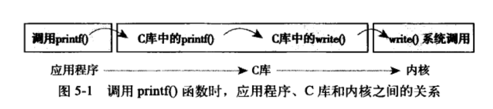
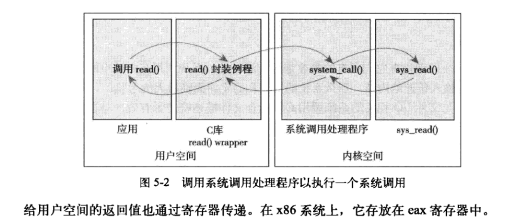

> 2019-10-09 20:25:49

# Linux内核设计与实现 学习笔记 (二)
------

## 第五章系统调用

操作系统提供了系统调用接口，建设了应用程序和内核之间的中间桥梁。保证系统稳定可靠，避免应用程序肆意妄为。

### 5.1 与内核进行通信

系统调用在用户空间进程与硬件设备之间添加了一个中间层。该层的主要作用有3个：

- 为用户空间提供了一种硬件的抽象接口
- 系统调用保证的系统的安全和稳定
- 每个程序都运行在虚拟系统中，防止进程危害系统

除开异常和陷入，系统调用是用户空间访问内核的唯一手段，也是内核唯一的合法入口。本章重点强调Linux系统调用的规则和实现方法。

### 5.2 API、POSIX和C库

Windows也提供了POSIX的兼容库。

### 5.3 系统调用

系统调用在用户空间和内核空间内有不同的返回值类型，在用户空间为int,在内核空间为long。系统调用`get_pid()`在内核中被定义成`sys_getpid()`。这个是Linux中所有系统调用都应该遵守的命名规则。

#### 5.3.1 系统调用号

在Linux中，每个系统调用被赋予一个系统调用号。系统调用号，一旦分配就不能再有任何变更，否则编译好的应用程序也会崩溃。即使系统调用被删除，它所占用的系统调用号也不允许被回收利用。内核记录了所有的系统调用，并存储在`sys_call_table`中。在x86_64中，它定义于`arch/i386/kernel/syscall_64.c`文件中。

#### 5.3.2 系统调用的性能

Linux系统调用比其它许多操作系统执行都要快的多。Linux很短的上下文切换时间是一个重要的原因，进出内核的操作都变得简洁高效。每个系统调用处理程序和每个系统调用本身也都非常简洁。

### 5.4 系统调用处理程序

应用程序使用软中断(引发一个异常来促使系统切换到内核态去执行异常处理程序)通知系统，执行一个系统调用，让系统切换到内核状态。

x86系统预定义的软中断号是128，通过int $0x80指令触发该中断。导致操作系统切换到内核态并执行128号异常处理程序。就是system_call()。它与体系结构紧密相关，在entry_64.s文件中用汇编语言编写。

#### 5.4.1 指定恰当的系统调用

系统调用号通过eax寄存器传递给内核。在陷入内核之前，用户空间就把相应系统调用所对应的号放入eax中。这样来实现快速切换。

#### 5.4.2 参数传递

对应的系统调用参数也被放在寄存器中，实现参数传递。在x86_32系统上，ebx、ecx、edx、esi和edi按照顺序存放前五个参数，此时应该用一个单独的寄存器存放指向所有这些参数在用户空间地址的指针。

### 5.5 系统调用的实现

难点在于系统调用的设计与实现。

#### 5.5.1 实现系统调用

