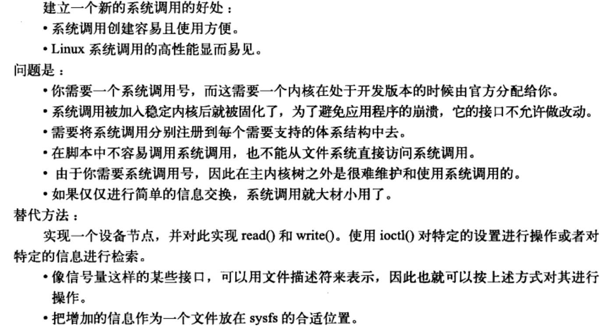
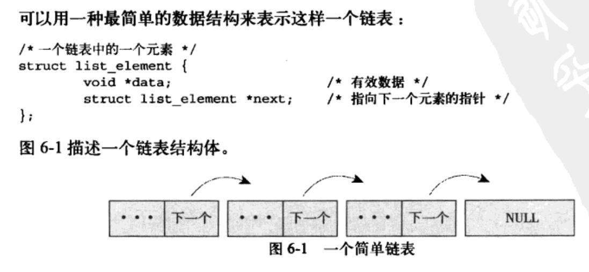
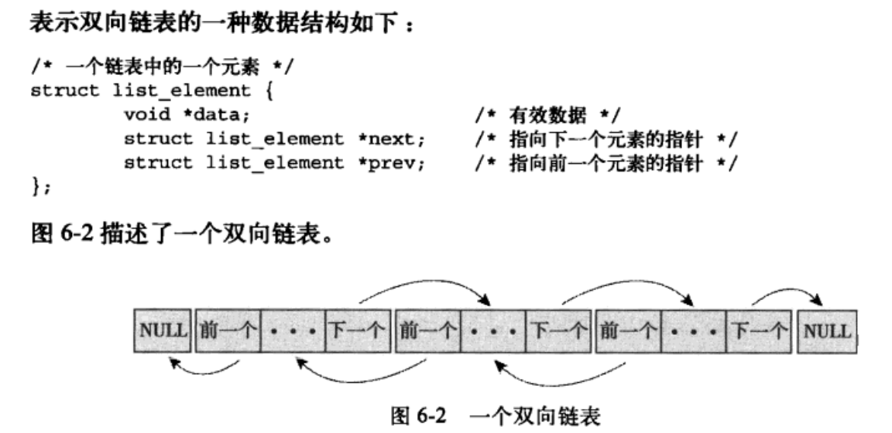
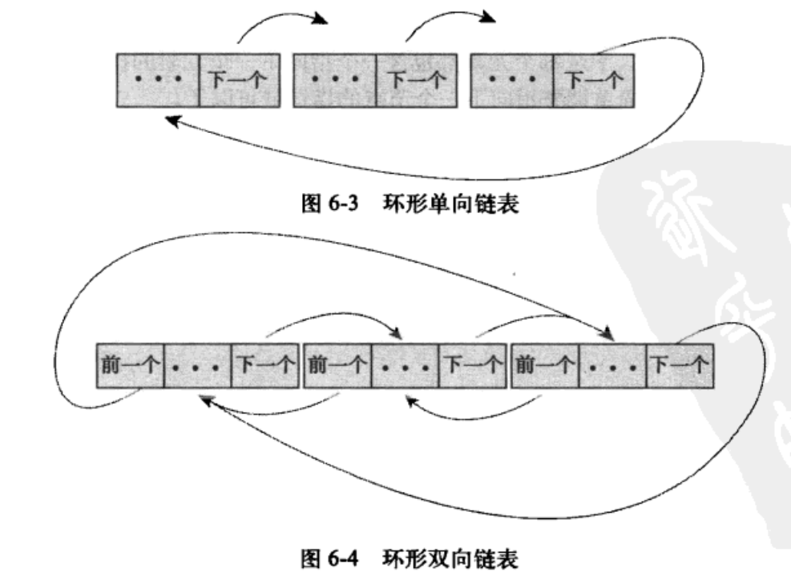
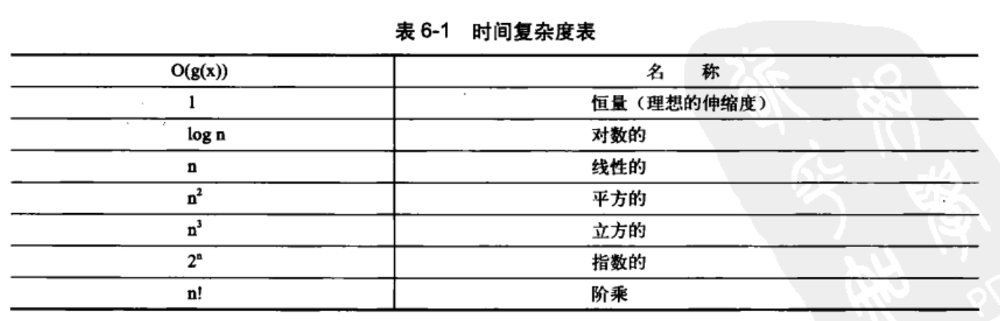

> 2019-10-09 20:25:49

# Linux内核设计与实现 学习笔记 (二)
------

## 第五章系统调用

操作系统提供了系统调用接口，建设了应用程序和内核之间的中间桥梁。保证系统稳定可靠，避免应用程序肆意妄为。

### 5.1 与内核进行通信

系统调用在用户空间进程与硬件设备之间添加了一个中间层。该层的主要作用有3个：

- 为用户空间提供了一种硬件的抽象接口
- 系统调用保证的系统的安全和稳定
- 每个程序都运行在虚拟系统中，防止进程危害系统

除开异常和陷入，系统调用是用户空间访问内核的唯一手段，也是内核唯一的合法入口。本章重点强调Linux系统调用的规则和实现方法。

### 5.2 API、POSIX和C库


Windows也提供了POSIX的兼容库。

### 5.3 系统调用

系统调用在用户空间和内核空间内有不同的返回值类型，在用户空间为int,在内核空间为long。系统调用`get_pid()`在内核中被定义成`sys_getpid()`。这个是Linux中所有系统调用都应该遵守的命名规则。

#### 5.3.1 系统调用号

在Linux中，每个系统调用被赋予一个系统调用号。系统调用号，一旦分配就不能再有任何变更，否则编译好的应用程序也会崩溃。即使系统调用被删除，它所占用的系统调用号也不允许被回收利用。内核记录了所有的系统调用，并存储在`sys_call_table`中。在x86_64中，它定义于`arch/i386/kernel/syscall_64.c`文件中。

#### 5.3.2 系统调用的性能

Linux系统调用比其它许多操作系统执行都要快的多。Linux很短的上下文切换时间是一个重要的原因，进出内核的操作都变得简洁高效。每个系统调用处理程序和每个系统调用本身也都非常简洁。

### 5.4 系统调用处理程序

应用程序使用软中断(引发一个异常来促使系统切换到内核态去执行异常处理程序)通知系统，执行一个系统调用，让系统切换到内核状态。

x86系统预定义的软中断号是128，通过int $0x80指令触发该中断。导致操作系统切换到内核态并执行128号异常处理程序。就是system_call()。它与体系结构紧密相关，在entry_64.s文件中用汇编语言编写。

#### 5.4.1 指定恰当的系统调用

系统调用号通过eax寄存器传递给内核。在陷入内核之前，用户空间就把相应系统调用所对应的号放入eax中。这样来实现快速切换。

#### 5.4.2 参数传递

对应的系统调用参数也被放在寄存器中，实现参数传递。在x86_32系统上，ebx、ecx、edx、esi和edi按照顺序存放前五个参数，此时应该用一个单独的寄存器存放指向所有这些参数在用户空间地址的指针。


### 5.5 系统调用的实现

难点在于系统调用的设计与实现。

#### 5.5.1 实现系统调用

系统调用需要明确它的功能，输入和输出参数。设计出良好的接口。

#### 5.5.2 参数验证

系统调用必须仔细检查它们所有的参数是否安全合法。尤其是指针，需要严格检查相关参数和数据。在接受一个用户空间的指针之前：

- 指针指向的内存区域属于用户空间，进程不能让内核去读取内核空间的数据
- 指针指向的内存区域在进程的地址空间中，进程决不能让内核去读其它进程的数据
- 内存的读写和可执行，都应该被明确标记，绝对不能绕过内存访问限制。


内核提供了`copy_to_user()`和`copy_from_usr()`来进行从内核到用户，以及从用户到内核的内存拷贝的操作。

silly_copy()系统调用拷贝内存，将系统内核作为中转站。复制和移动内存空间。代码如下：

```c
SYSCALL_DEFINE3(
    silly_copy,
    unsigned long *,src,
    unsigned long *,src,
    unsigned long leng
)
{
    //内存缓冲

    unsigned long buf;
    //将用户空间中的src拷贝进buf

    if(copy_from_usr(&buf,src,len))
        return -EFAULT;
    //将buf拷贝进用户地址空间中的dist

    if(copy_to_user(dst.&buf,len))
        return -EFAULT;
    // 返回拷贝的数量

    return len;
}

```

注意：`copy_to_user()`和`copy_from_usr()`都有可能引起阻塞。当包含用户数据的页被置换到硬盘上时上述问题就会发生。

调用者可以使用`capable()`函数来检查是否有权限对指定的资源进行操作。

### 5.6 系统调用上下文

当系统调用阻塞或者显式调用`schedule()`的时候，内核可以休眠，进程可以抢占。

#### 5.6.1 绑定一个系统调用的最后步奏

编写完成一个系统调用之后，把它正式注册为一个系统调用，流程如下:

- 在系统调用表的最后添加一个表项
- 对于支持的各种体系结构，系统调用号都必须定义于<asm/unistd.h>中
- 系统调用必须被放入`/kernel`下的相关文件中，被编译进内核映像

#### 5.6.2 从用户空间访问系统调用

Linux设置了`_syscalln()`宏(n的范围是0-6，代表需要传递给系统调用的参数个数);直接对系统调用进行访问。

可以直接不依靠支持库，直接调用此系统调用的宏的形式为:

```c

#define NR_open 5 _syscall3(long ,open,const char *,filename,int ,flags,int ,mode)
```

每个宏有2+2*n个参数，第一个参数㐊系统调用的返回类型，第二个参数是系统调用的名称。`NR_open`在`asm/unistd.h`中定义，是系统调用号；会被扩展成为内嵌汇编的C函数。

#### 5.6.3 为什么不通过系统调用的方式实现

建立一个新的系统调用非常容易，但是不建议这么做。



## 第 6 章 内核数据结构

Linux内核中实现了通用的数据结构，内核开发者应该尽可能地使用这些数据结构，而不是自己重复实现。

### 6.1 链表







#### 6.1.4 Linux中内核的实现

Linux内核中**不是将数据结构加入链表，而是将链表节点加入数据结构**。链表代码在头文件`linux/list.h`中声明。其结构如下：

```c
struct list_head{
    struct list_head *next;
    struct list_head *prev;
};
```

下面是一个简单的使用结构
```c
//自定义数据结构

struct fox{
    unsigned long tail_length;
    unsigned long weight;
    bool          is_fantastic;
    //注意在这里添加list结构，将数据转变为链表

    struct list_head list;
}
```
链表提供的方法也仅仅针对list_head进行操作：。这样可以方便的进行从链表指针查找父结构体包含的任何变量。结构体的地址偏移半两在编译时地址就被ABI固定下来了。下面是一个典型的宏

```c
#define container_of(ptr,type,member) ({        \
    const typeof(((type*)0)->member) *_mptr=(ptr); \  //这里是一个强制的地址偏移的类型转换
    (type*)((char *)__mptr-offsetof(type,member)); \ 查找对应结构的父类型结构体
})
```

下面是一个简单的使用示例：

```c
struct fox *red_fox;
red_fox=kmalloc(sizeof(*red_fox),GFP_KERNEL);
red_fox->tail_length=40;
red_fox->weight=6;
red_for->is_fantastic=false;
//初始化头结点

INIT_LIST_HEAD(&red_fox->list);


```

#### 6.1.5 操作链表

- `list_add(struct list_head *new,struct list_head *head)`:添加节点
- `list_add_tail(struct list_head *new,struct list_head *head)`:添加节点到链尾
- `list_del(struct list_head *entry)`:删除一个节点
- `list_del_init()/list_del_init(struct list_head *entry)`:删除一个节点并重新初始化。
- `list_move(struct list_head *list,struct list_head *head)`:将list链表添加到head后面。
- `list_move_tail(struct list_head *list,struct list_head *head)`:将list项插入到head项前
- `list_empty(struct list_head *head)`:检查链表是否为空。
- `list_splice(struct list_head *list,struct list_head *head)`:将list指向的链表插入到head的后面。
- `list_splice_init(struct list_head *list,struct list_head *head)`:功能基本相同，不过重新初始化了原来的链表。
- `list_for_each(p,list){}`:遍历表中的全部元素。
- `list_for_each_entry(pos,head,member)`:遍历节点，一般使用方法：

```c
//inotify 内核文件系统的更新通知机制

static struct inotify_watch *inode_find_handle(struct inode *inode,struct inotify_handle *ih){
    struct inotify_watch *watch;
    //注意这里的i_list 是inode->inotify_watch中list链表指针的名字

    list_for_each_entry(watch,&inode->inotify_watch,i_list){
        if(watch->ih==ih)
            return watch;
    }
    return NULL;
}
```
- `list_for_each_entry_reverse(pos,head,member)`:反向遍历链表。
- `list_for_each_entry_safe(pos,next,head,member)`:遍历的同时删除，标准操作中是只允许修改，不能删除否则会掉链。这里启动next指针将下一项存入表中。使得当前表项能够安全删除。
- `list_for_each_entry_safe_reverse(pos,next,head,member)`:反向遍历并安全删除。

### 6.2 队列

_参考链接：_ [读Linux内核kfifo](https://blog.csdn.net/linux_Allen/article/details/79907700)

内核队列文件声明在文件`linux/kfifo.h`中维护了两个偏移量：入口偏移和出口偏移。相当于队头指针和队尾指针；主要提供了两个操作：

- enqueue(入队列):
- dequeue(出队操作):
- 
内核kfifo简约高效，匠心独运，有一下特点：
- 保证缓冲区大小为2的次幂，不是的向上取整为2的次幂。
- 使用无符号整数保存输入(in)和输出(out)的位置，在输入输出时不对in和out的值进行模运算，而让其自然溢出，并能够保证in-out的结果为缓冲区中已存放的数据长度。
- 将需要取模的运算用 & 操作代替（a%size=(a&(size−1))), 这需要size保证为2的次幂。
- 使用内存屏障(Memory Barrier)技术，实现单消费者和单生产者对kfifo的无锁并发访问，多个消费者、生产者的并发访问还是需要加锁的（本文不涉及）。


#### 6.2.1 相关函数

- `int kfifo_alloc(struct kfifo *kfifo,unsigned int size, gfp_t gfp_mask)`:初始化一个大小为size的kfifo队列。也可以使用静态的声明`DECLARE_KFIFO(name,size)`
- `void kfifo_init(strcut kfifo *fifo,void *buffer,unsigned int size)`:自己分配缓冲区，也可以使用`INIT_KFIFO(name)`。
- `unsigned int kfifo_in(struct kfifo *fifo,const void *from,unsigned int len)`:数据入队列。把from指向的len字节的数据拷贝到fifo所指的队列中。
- `unsigned int kfifo_out(struct kfifo *fifo,const void *to,unsigned int len)`:将fifo所指向的队列中拷贝出长度为len字节的数据到to所指的缓冲区中。相当于pop_back();
- `unsigned int kfifo_out_peek(struct kfifo *fifo,const void *to,unsigned int len,unsigned offset)`:获取队列中的元素，相当与pop()
- `static inline unsigned int kfifo_size(struct kfifo *fifo)`:返回用于存储kfifo队列的空间的总体大小
- `static inline unsigned int kfifo_len(struct kfifo *fifo)`:返回用于存储kfifo队列的已经推入的数据大小
- `static inline unsigned int kfifo_avail(struct kfifo *fifo)`:返回用于存储kfifo队列的剩余空间的大小
- `static inline int kfifo_is_empty(struct kfifo *fifo)`:给定的kfifo是否为空
- `static inline int kfifo_is_full(struct kfifo *fifo)`:是否已满
- `static inline void kfifo_reset(struct kfifo *fifo)`:抛弃数据重置内容。
- `static inline void kfifo_free(struct kfifo *fifo)`:重新释放内存

下面是一个简单的使用示例：

```c
//创建一个队列

struct kfifo fifo;
int ret;
//为队列分配内存，内存大小为操作系统页的大小

ret=kfifo_alloc(&kfifo,PAGE_SIZE,GFP_KERNEL);
if(ret) return ret;

unsigned int i;
//将0-32 压入到名为fifo的队列中

for(i=0;i<32; i++){
    kfifo_in(fifo,&i,sizeof(i));
}

unsigned int val;
int ret2;
//取出一个元素

ret=kfifo_out_peek(fifo,&val,sizeof(val),0);
if(ret!=sizeof(val))
    return -EINVAL;

//输出0

printk(KERN_INFO "%u\n",val);
//当队列中还存在数据时，将剩下的数据输出

while(kfifo_avail(fifo)){
    unsigned int val;
    int ret;
    //读取队列中剩余的数据

    ret=kfifo_out(fifo,&val,sizeof(val));
    if(ret!=sizeof(val)){
        return -EINVAL;
    }
    printk(FERN_INFO "%u\n",val);
}
```

### 6.3 映射Map

就是C++中的Map和set等映射操作的集合。Linux 内核提供了简单、有效的映射数据结构。但是它并非一个通用的映射：**映射一个唯一的标识数(UID)到一个指针**。映射的add操作中实现了allocate操作，不但向map中加入了键值对，而且还可以产生UID。Linux内核中使用idr数据结构映射用户空间的UID，比如将inodify  watch的描述符或者POSIX的定时器ID映射到内核中相关联的数据结构上。如`inotify_watch`或者`k_itimer`结构。这里的UID相当于关键子key

#### 6.3.1 相关函数

- `void idr_init(struct idr *idp)`:初始化一个idr结构体
- `int idr_pre_get(struct idr *idp,gfp_t gfp_mask)`:调整idp指向的idr的大小(如果需要)。使用内存分配标识符gfp_mask。返回0(失败)，1(成功)
- `int idr_get_new(struct idr *idp,void *ptr,int *id)`:使用idp所指向的idr去分配一个新的UID，并且将其关联到指针ptr上。新的UID存于id。相当与存入一个值
- `int idr_get_new_above(struct idr *idp,void *ptr,int starting_id,int *id)`:返回UID大于starting_id的最小值。相当于查找一个值。
- `void *idr_find(struct idr *idp,int id)`:查找一个指定的值。
- `void *idr_remove(struct idr *idp,int id)`:删除id以及与id关联的指针。
- `void *idr_destroy(struct idr *idp)`:释放idr中未使用的内存。它并不释放当前已经分配的内存。
- `void idr_remove_all(struct idr *idp)`:彻底释放对应的内存。

### 6.4 二叉树

#### 红黑树
_参考链接：_ [红黑树的定义](https://www.cnblogs.com/chengxuyuancc/archive/2013/04/06/3002044.html);[Linux kernel rbtree](https://www.cnblogs.com/jimbo17/p/8298163.html);[源码](https://www.cnblogs.com/zhanglong71/p/5178796.html)

linux kernel中实现的红黑树名为rbtree。定义在文件`lib/rbtree.c`中，声明在文件`<linux/rbtree.h>`中。Linux中只是定义了rb_root作为描述节点，搜索和插入，希望由rbtree的用户自己定义。

### 6.5 数据结构选择

对于主要操作是遍历应该使用链表。数据较少时也应该首先考虑链表。
符合生产者/消费者模式时使用队列
使用UID作为映射对象，应该使用映射。
作为检索，应该尽量使用红黑树。



## 第 七 章 中断和中断处理

### 7.1 中断

_参考链接：_ [linux中断与异常](https://www.cnblogs.com/chengxuyuancc/p/3380922.html)

本质上是一种特殊的信号。由硬件设备发送给处理器，处理器接受到之后，向操作系统反映中断的到来。再由操作系统负责处理。中断并不考虑处理器的时钟同步--中断随时可以产生。

设备发送一个中断电信号，输入中断控制器的输入引脚。中断控制器将多路中断管线采用复用计数通过一个管线直接与处理器通信；并发送一个电信号。处理器再通知操作系统。

不同设备中断不同，每一个设备都有唯一的第一个设备中断号(数字标志)。通常成为中断请求(IRQ)线。一般IRQ 0是时钟中断，IRQ 1 是键盘中断。

**异常(同步中断)**是特殊的中断，必须考虑时钟同步；一般是处理过程中遇到的错误或者特殊情况(如缺页)。