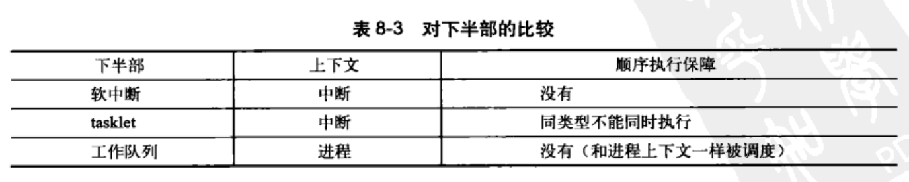

> 2019-10-09 20:25:49

# Linux内核设计与实现 学习笔记 (二)
------

## 第五章系统调用

操作系统提供了系统调用接口，建设了应用程序和内核之间的中间桥梁。保证系统稳定可靠，避免应用程序肆意妄为。

### 5.1 与内核进行通信

系统调用在用户空间进程与硬件设备之间添加了一个中间层。该层的主要作用有3个：

- 为用户空间提供了一种硬件的抽象接口
- 系统调用保证的系统的安全和稳定
- 每个程序都运行在虚拟系统中，防止进程危害系统

除开异常和陷入，系统调用是用户空间访问内核的唯一手段，也是内核唯一的合法入口。本章重点强调Linux系统调用的规则和实现方法。

### 5.2 API、POSIX和C库


Windows也提供了POSIX的兼容库。

### 5.3 系统调用

系统调用在用户空间和内核空间内有不同的返回值类型，在用户空间为int,在内核空间为long。系统调用`get_pid()`在内核中被定义成`sys_getpid()`。这个是Linux中所有系统调用都应该遵守的命名规则。

#### 5.3.1 系统调用号

在Linux中，每个系统调用被赋予一个系统调用号。系统调用号，一旦分配就不能再有任何变更，否则编译好的应用程序也会崩溃。即使系统调用被删除，它所占用的系统调用号也不允许被回收利用。内核记录了所有的系统调用，并存储在`sys_call_table`中。在x86_64中，它定义于`arch/i386/kernel/syscall_64.c`文件中。

#### 5.3.2 系统调用的性能

Linux系统调用比其它许多操作系统执行都要快的多。Linux很短的上下文切换时间是一个重要的原因，进出内核的操作都变得简洁高效。每个系统调用处理程序和每个系统调用本身也都非常简洁。

### 5.4 系统调用处理程序

应用程序使用软中断(引发一个异常来促使系统切换到内核态去执行异常处理程序)通知系统，执行一个系统调用，让系统切换到内核状态。

x86系统预定义的软中断号是128，通过int $0x80指令触发该中断。导致操作系统切换到内核态并执行128号异常处理程序。就是system_call()。它与体系结构紧密相关，在entry_64.s文件中用汇编语言编写。

#### 5.4.1 指定恰当的系统调用

系统调用号通过eax寄存器传递给内核。在陷入内核之前，用户空间就把相应系统调用所对应的号放入eax中。这样来实现快速切换。

#### 5.4.2 参数传递

对应的系统调用参数也被放在寄存器中，实现参数传递。在x86_32系统上，ebx、ecx、edx、esi和edi按照顺序存放前五个参数，此时应该用一个单独的寄存器存放指向所有这些参数在用户空间地址的指针。


### 5.5 系统调用的实现

难点在于系统调用的设计与实现。

#### 5.5.1 实现系统调用

系统调用需要明确它的功能，输入和输出参数。设计出良好的接口。

#### 5.5.2 参数验证

系统调用必须仔细检查它们所有的参数是否安全合法。尤其是指针，需要严格检查相关参数和数据。在接受一个用户空间的指针之前：

- 指针指向的内存区域属于用户空间，进程不能让内核去读取内核空间的数据
- 指针指向的内存区域在进程的地址空间中，进程决不能让内核去读其它进程的数据
- 内存的读写和可执行，都应该被明确标记，绝对不能绕过内存访问限制。


内核提供了`copy_to_user()`和`copy_from_usr()`来进行从内核到用户，以及从用户到内核的内存拷贝的操作。

silly_copy()系统调用拷贝内存，将系统内核作为中转站。复制和移动内存空间。代码如下：

```c
SYSCALL_DEFINE3(
    silly_copy,
    unsigned long *,src,
    unsigned long *,src,
    unsigned long leng
)
{
    //内存缓冲

    unsigned long buf;
    //将用户空间中的src拷贝进buf

    if(copy_from_usr(&buf,src,len))
        return -EFAULT;
    //将buf拷贝进用户地址空间中的dist

    if(copy_to_user(dst.&buf,len))
        return -EFAULT;
    // 返回拷贝的数量

    return len;
}

```

注意：`copy_to_user()`和`copy_from_usr()`都有可能引起阻塞。当包含用户数据的页被置换到硬盘上时上述问题就会发生。

调用者可以使用`capable()`函数来检查是否有权限对指定的资源进行操作。

### 5.6 系统调用上下文

当系统调用阻塞或者显式调用`schedule()`的时候，内核可以休眠，进程可以抢占。

#### 5.6.1 绑定一个系统调用的最后步奏

编写完成一个系统调用之后，把它正式注册为一个系统调用，流程如下:

- 在系统调用表的最后添加一个表项
- 对于支持的各种体系结构，系统调用号都必须定义于<asm/unistd.h>中
- 系统调用必须被放入`/kernel`下的相关文件中，被编译进内核映像

#### 5.6.2 从用户空间访问系统调用

Linux设置了`_syscalln()`宏(n的范围是0-6，代表需要传递给系统调用的参数个数);直接对系统调用进行访问。

可以直接不依靠支持库，直接调用此系统调用的宏的形式为:

```c

#define NR_open 5 _syscall3(long ,open,const char *,filename,int ,flags,int ,mode)
```

每个宏有2+2*n个参数，第一个参数㐊系统调用的返回类型，第二个参数是系统调用的名称。`NR_open`在`asm/unistd.h`中定义，是系统调用号；会被扩展成为内嵌汇编的C函数。

#### 5.6.3 为什么不通过系统调用的方式实现

建立一个新的系统调用非常容易，但是不建议这么做。


## 第 6 章 内核数据结构

Linux内核中实现了通用的数据结构，内核开发者应该尽可能地使用这些数据结构，而不是自己重复实现。

### 6.1 链表


#### 6.1.4 Linux中内核的实现

Linux内核中**不是将数据结构加入链表，而是将链表节点加入数据结构**。链表代码在头文件`linux/list.h`中声明。其结构如下：

```c
struct list_head{
    struct list_head *next;
    struct list_head *prev;
};
```

下面是一个简单的使用结构
```c
//自定义数据结构

struct fox{
    unsigned long tail_length;
    unsigned long weight;
    bool          is_fantastic;
    //注意在这里添加list结构，将数据转变为链表

    struct list_head list;
}
```
链表提供的方法也仅仅针对list_head进行操作：。这样可以方便的进行从链表指针查找父结构体包含的任何变量。结构体的地址偏移半两在编译时地址就被ABI固定下来了。下面是一个典型的宏

```c
#define container_of(ptr,type,member) ({        \
    const typeof(((type*)0)->member) *_mptr=(ptr); \  //这里是一个强制的地址偏移的类型转换
    (type*)((char *)__mptr-offsetof(type,member)); \ 查找对应结构的父类型结构体
})
```

下面是一个简单的使用示例：

```c
struct fox *red_fox;
red_fox=kmalloc(sizeof(*red_fox),GFP_KERNEL);
red_fox->tail_length=40;
red_fox->weight=6;
red_for->is_fantastic=false;
//初始化头结点

INIT_LIST_HEAD(&red_fox->list);


```

#### 6.1.5 操作链表

- `list_add(struct list_head *new,struct list_head *head)`:添加节点
- `list_add_tail(struct list_head *new,struct list_head *head)`:添加节点到链尾
- `list_del(struct list_head *entry)`:删除一个节点
- `list_del_init()/list_del_init(struct list_head *entry)`:删除一个节点并重新初始化。
- `list_move(struct list_head *list,struct list_head *head)`:将list链表添加到head后面。
- `list_move_tail(struct list_head *list,struct list_head *head)`:将list项插入到head项前
- `list_empty(struct list_head *head)`:检查链表是否为空。
- `list_splice(struct list_head *list,struct list_head *head)`:将list指向的链表插入到head的后面。
- `list_splice_init(struct list_head *list,struct list_head *head)`:功能基本相同，不过重新初始化了原来的链表。
- `list_for_each(p,list){}`:遍历表中的全部元素。
- `list_for_each_entry(pos,head,member)`:遍历节点，一般使用方法：

```c
//inotify 内核文件系统的更新通知机制

static struct inotify_watch *inode_find_handle(struct inode *inode,struct inotify_handle *ih){
    struct inotify_watch *watch;
    //注意这里的i_list 是inode->inotify_watch中list链表指针的名字

    list_for_each_entry(watch,&inode->inotify_watch,i_list){
        if(watch->ih==ih)
            return watch;
    }
    return NULL;
}
```
- `list_for_each_entry_reverse(pos,head,member)`:反向遍历链表。
- `list_for_each_entry_safe(pos,next,head,member)`:遍历的同时删除，标准操作中是只允许修改，不能删除否则会掉链。这里启动next指针将下一项存入表中。使得当前表项能够安全删除。
- `list_for_each_entry_safe_reverse(pos,next,head,member)`:反向遍历并安全删除。

### 6.2 队列

_参考链接：_ [读Linux内核kfifo](https://blog.csdn.net/linux_Allen/article/details/79907700)

内核队列文件声明在文件`linux/kfifo.h`中维护了两个偏移量：入口偏移和出口偏移。相当于队头指针和队尾指针；主要提供了两个操作：

- enqueue(入队列):
- dequeue(出队操作):
- 
内核kfifo简约高效，匠心独运，有一下特点：
- 保证缓冲区大小为2的次幂，不是的向上取整为2的次幂。
- 使用无符号整数保存输入(in)和输出(out)的位置，在输入输出时不对in和out的值进行模运算，而让其自然溢出，并能够保证in-out的结果为缓冲区中已存放的数据长度。
- 将需要取模的运算用 & 操作代替（a%size=(a&(size−1))), 这需要size保证为2的次幂。
- 使用内存屏障(Memory Barrier)技术，实现单消费者和单生产者对kfifo的无锁并发访问，多个消费者、生产者的并发访问还是需要加锁的（本文不涉及）。


#### 6.2.1 相关函数

- `int kfifo_alloc(struct kfifo *kfifo,unsigned int size, gfp_t gfp_mask)`:初始化一个大小为size的kfifo队列。也可以使用静态的声明`DECLARE_KFIFO(name,size)`
- `void kfifo_init(strcut kfifo *fifo,void *buffer,unsigned int size)`:自己分配缓冲区，也可以使用`INIT_KFIFO(name)`。
- `unsigned int kfifo_in(struct kfifo *fifo,const void *from,unsigned int len)`:数据入队列。把from指向的len字节的数据拷贝到fifo所指的队列中。
- `unsigned int kfifo_out(struct kfifo *fifo,const void *to,unsigned int len)`:将fifo所指向的队列中拷贝出长度为len字节的数据到to所指的缓冲区中。相当于pop_back();
- `unsigned int kfifo_out_peek(struct kfifo *fifo,const void *to,unsigned int len,unsigned offset)`:获取队列中的元素，相当与pop()
- `static inline unsigned int kfifo_size(struct kfifo *fifo)`:返回用于存储kfifo队列的空间的总体大小
- `static inline unsigned int kfifo_len(struct kfifo *fifo)`:返回用于存储kfifo队列的已经推入的数据大小
- `static inline unsigned int kfifo_avail(struct kfifo *fifo)`:返回用于存储kfifo队列的剩余空间的大小
- `static inline int kfifo_is_empty(struct kfifo *fifo)`:给定的kfifo是否为空
- `static inline int kfifo_is_full(struct kfifo *fifo)`:是否已满
- `static inline void kfifo_reset(struct kfifo *fifo)`:抛弃数据重置内容。
- `static inline void kfifo_free(struct kfifo *fifo)`:重新释放内存

下面是一个简单的使用示例：

```c
//创建一个队列

struct kfifo fifo;
int ret;
//为队列分配内存，内存大小为操作系统页的大小

ret=kfifo_alloc(&kfifo,PAGE_SIZE,GFP_KERNEL);
if(ret) return ret;

unsigned int i;
//将0-32 压入到名为fifo的队列中

for(i=0;i<32; i++){
    kfifo_in(fifo,&i,sizeof(i));
}

unsigned int val;
int ret2;
//取出一个元素

ret=kfifo_out_peek(fifo,&val,sizeof(val),0);
if(ret!=sizeof(val))
    return -EINVAL;

//输出0

printk(KERN_INFO "%u\n",val);
//当队列中还存在数据时，将剩下的数据输出

while(kfifo_avail(fifo)){
    unsigned int val;
    int ret;
    //读取队列中剩余的数据

    ret=kfifo_out(fifo,&val,sizeof(val));
    if(ret!=sizeof(val)){
        return -EINVAL;
    }
    printk(FERN_INFO "%u\n",val);
}
```

### 6.3 映射Map

就是C++中的Map和set等映射操作的集合。Linux 内核提供了简单、有效的映射数据结构。但是它并非一个通用的映射：**映射一个唯一的标识数(UID)到一个指针**。映射的add操作中实现了allocate操作，不但向map中加入了键值对，而且还可以产生UID。Linux内核中使用idr数据结构映射用户空间的UID，比如将inodify  watch的描述符或者POSIX的定时器ID映射到内核中相关联的数据结构上。如`inotify_watch`或者`k_itimer`结构。这里的UID相当于关键子key

#### 6.3.1 相关函数

- `void idr_init(struct idr *idp)`:初始化一个idr结构体
- `int idr_pre_get(struct idr *idp,gfp_t gfp_mask)`:调整idp指向的idr的大小(如果需要)。使用内存分配标识符gfp_mask。返回0(失败)，1(成功)
- `int idr_get_new(struct idr *idp,void *ptr,int *id)`:使用idp所指向的idr去分配一个新的UID，并且将其关联到指针ptr上。新的UID存于id。相当与存入一个值
- `int idr_get_new_above(struct idr *idp,void *ptr,int starting_id,int *id)`:返回UID大于starting_id的最小值。相当于查找一个值。
- `void *idr_find(struct idr *idp,int id)`:查找一个指定的值。
- `void *idr_remove(struct idr *idp,int id)`:删除id以及与id关联的指针。
- `void *idr_destroy(struct idr *idp)`:释放idr中未使用的内存。它并不释放当前已经分配的内存。
- `void idr_remove_all(struct idr *idp)`:彻底释放对应的内存。

### 6.4 二叉树

#### 红黑树
_参考链接：_ [红黑树的定义](https://www.cnblogs.com/chengxuyuancc/archive/2013/04/06/3002044.html);[Linux kernel rbtree](https://www.cnblogs.com/jimbo17/p/8298163.html);[源码](https://www.cnblogs.com/zhanglong71/p/5178796.html)

linux kernel中实现的红黑树名为rbtree。定义在文件`lib/rbtree.c`中，声明在文件`<linux/rbtree.h>`中。Linux中只是定义了rb_root作为描述节点，搜索和插入，希望由rbtree的用户自己定义。

### 6.5 数据结构选择

对于主要操作是遍历应该使用链表。数据较少时也应该首先考虑链表。
符合生产者/消费者模式时使用队列
使用UID作为映射对象，应该使用映射。
作为检索，应该尽量使用红黑树。


## 第 七 章 中断和中断处理

### 7.1 中断

_参考链接：_ [linux中断与异常](https://www.cnblogs.com/chengxuyuancc/p/3380922.html)

本质上是一种特殊的信号。由硬件设备发送给处理器，处理器接受到之后，向操作系统反映中断的到来。再由操作系统负责处理。中断并不考虑处理器的时钟同步--中断随时可以产生。

设备发送一个中断电信号，输入中断控制器的输入引脚。中断控制器将多路中断管线采用复用计数通过一个管线直接与处理器通信；并发送一个电信号。处理器再通知操作系统。

不同设备中断不同，每一个设备都有唯一的第一个设备中断号(数字标志)。通常成为中断请求(IRQ)线。一般IRQ 0是时钟中断，IRQ 1 是键盘中断。

**异常(同步中断)**是特殊的中断，必须考虑时钟同步；一般是处理过程中遇到的错误或者特殊情况(如缺页)。

### 7.2 中断处理程序

在响应特别中断时，内核会执行一个函数，这个函数就是中断处理程序。

### 7.3 上半部分与下半部分符对比

为了尽可能减少上下文切换，和避免中断时处理程序的CPU抢占，浪费资源(很多时候，中断处理程序，需要其它的资源)。因此将中断的应对措施分为上下两个部分。上部分主要负责CPU上下文的切换(抢占task时，相关进程PID，寄存器的保存)，因此需要迅速执行，并且拥有严格的时间限制。下半部分主要是会针对中断的进一步处理。

### 7.4 注册中断处理程序

一般Linux可以通过`linux/interrupt.h`中的`request_irq()`函数来注册一个中断处理程序，函数代码如下所示:
```c
int request_irq(unsigned int irq, //分配的中断号
                irq_handler_t handler,//实际中断处理程序的一个指针
                unsigned long flags,//中断处理标志
                chonst char *name,//中断相关设备的文本表示
                void *dev   //中断线共享信息
                )
```

中断处理标志参数flags可以为0，可以使下列一个或者多个标志的位掩码。其定义在文件<linux/interrupt.h>中。这些标志中最重要的是

- `IRQF_DISABLED`--内核在处理中断处理程序本身期间，禁止其它所有中断。一般在希望快速执行的轻量级中断中设置。
- `IRQF_SAMPLE_RANDOM`--设备产生的中断对内核熵池(entropy pool);有贡献。内核熵池会记录计算机中的各种事件，以提供正真的随机数。如果设备中断速率有影响或者可能受到外来攻击者(如联网设备的影响)，那么就不要设置这个标志，以免造成熵池的非随机
- `IRQF_TIMER`--为系统定时器的中断处理而准备的
- `IRQF_SHARED`--可以在多个中断处理程序之间共享中断线。

dev参数可以用于共享中断线。当一个中断处理程序需要释放时，dev将提供唯一的标志信息(cookie)，以便指定共享中断线中需要删除的程序。无序共享时就直接设置为NULL;内核每次调用中断处理程序时，都会把这个指针传递给它(主要包括程序的设备结构)。

**注意：request_irq()函数可能会睡眠等待处理，因此不能在中断上下文或者其他不允许阻塞的代码中调用该函数；可能会引起阻塞**

主要原因是，注册中断处理程序时会调用`proc_mkdir()`在`/proc/irq`文件中创建一个与中断对应的项。它会调用`proc_create()`其中存在`kmalloc()`的调用。这个函数可能会睡眠。
下面是一个简单的示例：

```c
if(request_irq(irqn,my_interrupt,IPQF_SHARED,"my_device",my_dev)){
    printk(KERN_ERR,"my_device:cannot register IRQ %d\n",irdn);
    return -EIO;
}
```

注册之后可以使用`free_irq(unsigned int irq,void *dev)`进行处理函数的注销。


### 7.5 编写中断处理程序

`static irqreturn_t intr_handler(int irq,void *dev)`;其中irq基本没有什么作用。dev主要包含传递给中断处理程序注册时的相关参数，主要是设备信息，可能直接是一个设备信息结构体。

函数返回类型`irqreturn_t`类型为`IRQ_NONE`和`IRQ_HANDLED`。当检测到中断，但是不是注册函数设置的中断源时返回`NONE`。被正确调用时返回`HANDLED`

linux 中断处理程序无序重入。当给定的中断处理程序正在执行时，中断线会被屏蔽掉，防止同一中断线上接收另外一个新的中断。

#### 共享的中断处理程序

原来对于计算机设备比较少的时候，可能一个中断线好可以对应一个中断处理程序(非共享中断线)，这时候参数4为NULL，没有任何用，**但随着计算机设备的增加，一个中断线号对应一个中断处理程序已经不太现实，**这个时候就使用了共享的中断线号，多个设备使用同一个中断线号，**同一个中断设备线号的所有处理程序链接成一个链表，这样当在共享中断线号的方式下一个中断产生的时候，就要遍历其对应的处理程序链表，但这个中断是由使用同一个中断线号的多个设备中间的一个产生的，不可能链表里面的所有处理程序都调用一遍吧，呵呵，这个时候就该第四个参数派上用场了。**

因此使用共享中断时，设备的关键结构体信息`dev`参数尤为重要。内核接受一个中断后，将依次调用该中断线上注册的每一个处理程序。
下面是`drivers/char/rtc.c`中的时钟中断处理程序

```c
//对相关中断处理函数的执行

if(request_irq(rtc_irq,rtc_interrupt,IRQF_SHARED,"rtc",(void *)&rtc_port)){
    printk(KERN_ERR "rtc:cannot register IRQ %d\n",rtc_irq);
    return -EIO;
}


//主要中断函数

irqreturn_t rtc_interrupt(int irq, void *dev_id, struct pt_regs *regs)
{
        /*
         *      Can be an alarm interrupt, update complete interrupt,
         *      or a periodic interrupt. We store the status in the
         *      low byte and the number of interrupts received since
         *      the last read in the remainder of rtc_irq_data.
         */

        spin_lock (&rtc_lock);
        rtc_irq_data += 0x100;
        rtc_irq_data &= ~0xff;
        if (is_hpet_enabled()) {
                /*
                 * In this case it is HPET RTC interrupt handler
                 * calling us, with the interrupt information
                 * passed as arg1, instead of irq.
                 */
                rtc_irq_data |= (unsigned long)irq & 0xF0;
        } else {
                rtc_irq_data |= (CMOS_READ(RTC_INTR_FLAGS) & 0xF0);
        }

        if (rtc_status & RTC_TIMER_ON)
                mod_timer(&rtc_irq_timer, jiffies + HZ/rtc_freq + 2*HZ/100);

        spin_unlock (&rtc_lock);

        /* Now do the rest of the actions */
        spin_lock(&rtc_task_lock);
        if (rtc_callback)
                rtc_callback->func(rtc_callback->private_data);
        spin_unlock(&rtc_task_lock);
        wake_up_interruptible(&rtc_wait);       

        kill_fasync (&rtc_async_queue, SIGIO, POLL_IN);

        return IRQ_HANDLED;
}

```

### 7.6 中断上下文

上下文中断函数中不能使用睡眠函数。中断上下文中的代码应该迅速、简洁、尽量不要去使用循环。中断处理程序并不具有自己的栈，他们共享所中断进程的内核栈。内核栈的大小是两页。

### 7.7 中断处理机制的实现

中断处理系统非常依赖体系结构，中断代码很多是由汇编所构成。


对于每条中断线，处理器都会跳到对应的一个唯一的位置。这样内核就可以知道所接受中断的IRQ号了。在栈中保存这个号，并存放当前寄存器的值；然后使用内核调用`do_IRQ()`。提取函数对应的参数。然后禁止这条线上的中断传递。然后调用`handle_IRQ_event()`方法来运行为这条中断线所安装的中断处理程序。

```c
irqreturn_t handle_IRQ_event(unsigned int irq,struct irqaction *action)
{
    irqreturn_t ret,retval=IRQ_NONE;
    unsigned int status=0;
    if(!(action->flags&IRQF_DISABLED))
        local_irq_enable_in_hardirq();
    do{
        trace_irq_handler_entry(irq,action);
        ret=action->handler(irq,action->dev_id);
        trace_irq_handler_exit(irq,action,ret);
        switch(ret){
            case IRQ_WAKE_THREAD:
                /**
                * 把返回值设置为已处理，以便可疑的检查不再触发
                */
                ret=IRQ_HANDLED;
                /**
                * 捕获返回值为WAKE_THREAD的驱动程序，但是并不创建一个线程函数
                */
                if(unlikely(!action->thread_fn)){
                    warn_no_thread(irq,action);
                    break;
                }
                /*
                * 为这次中断唤醒处理线程。万一线程崩溃且被杀死，我们仅仅假装已经处理了中断。上述的硬件中断(harding)处理程序已经禁止设备中断，因此杜绝irq产生。
                */
                if(likely(!test_bit(IRQTF_DIED,&action->thread_flags))){
                    set_bit(IRQTF_RUNTHREAD,&action->thread_flags);
                    wake_up_process(action->thread);
                }
            case IRQ_HANDLED:
                status |=action->flags;
                break;
            default: 
                break;
        }
        retval|=ret;
        action=action->next;
    }while(action)

    if(status&IRQF_SAMPLE_RANDOM)
        add_interrupt_randomness(irq);
    local_irq_disable();
    return retval;
}
```

### 7.8 /proc/interrupts

procfs是一个虚拟文件系统，它只存在于内核内存，一般安装于/proc目录。在procfs中对文件的读写都需要调用内核函数。

### 7.9 中断控制

控制中断系统的原因，归根到结低是需要提供同步。通过禁止中断确定某个中断处理程序不会抢占当前的代码。

#### 7.9.1 禁止和激活中断

可以使用如下语句禁止当前处理器，随后激活他们：

```c

local_irq_disable();
/* 禁止中断 */
local_irq_enable();

```

上述函数一般以汇编指令来实现。如果在禁止中断之前就已经进行了中断禁止。存在潜在的危险。为了保证中断的安全，禁止中断之前需要保存中断系统的状态。在激活中断时只需要将中断恢复到他们原来的状态。这些功能借助宏和堆栈的定义来进行实现。因此**不能使用全局的cli()**所有的中断同步必须结合使用本地中断控制和自旋锁。

#### 7.9.2 禁止指定中断线 

可以使用如下的函数禁止整个系统中一条特定的中断线：

```c
/*等待当前中断处理程序执行完毕，禁止给定中断向系统中所有处理器的传递，只有当所有程序处理完成之后函数才能返回*/
void disable_irq(unsigned int irq);
/*不等待其它函数执行完毕，直接进行中断禁止*/
void disable_irq_nosync(unsigned int irq);
/*启用中断*/
void enable_irq(unsigned int irq);
/*等待一个特定的中断处理程序的退出。必须退出后函数才能返回*/
void synchronize_irq(unsigned int irq);
```

#### 7.9.3 中断系统的状态

使用`<asm/system.h>`中的`irqs_disable()`宏可以用来检查中断系统的状态，如果被禁止则返回非0；否则返回0；

`<linux/hardirq.h>`中定义的两个宏提供来进行内核的当前上下文的检查接口，它们是:

```c
//内核处于任何类型的中断处理中，它返回0；表示正在执行中断处理程序（上边部分/下半部分）

in_interrupt();
//内核确实时在进行上半部分中断处理程序时，才返回0

in_irq();
```

![中断控制方法]](https://wangpengcheng.github.io/img/2019-10-17-21-37-31.png)

## 第 8 章 下半部分和推后执行的工作

中断处理程序只完成的处理流程的上半部分。主要有一下局限：

- 中断处理程序以异步方式执行，可能会打断其它重要代码。因此中断处理程序应该执行的越快越好
- 当前中断处理程序正在执行时，与该中断同级的其它中断会被屏蔽 。禁止中断后硬件与操作系统无法通信。中断处理程序应该越快越好
- 往往需要对硬件进行操作。有很高的时限要求
- 中断处理程序不再进程的上下文中运行，所以它们不能阻塞。这限制了它们所做的事情

### 8.1 下半部分(BH机制)

与硬件相关不大的所有部分应该尽量，交给下半部分来进行。

可以参照一下规则对上下程序进行划分:

- 任务对时间非常敏感，将其放在中断处理程序中执行。
- 硬件相关，房子啊中断处理程序中执行。
- 任务要保证不被其它中断(特别是相同的中断)打断，将其放在中断处理程序中执行。
- 其它所有任务需要放在下半部分进行执行。

为了处理下班部分内核开发者引入了**软中断(softirqs)**和**tasklet**机制。软中断是一组静态定义的下半部分接口，有32个；可以在所有处理器上同时执行--即使两个类型完全相同也可以，tasklet，基本相同但是不能进行相同的执行。**为了避免错误，软中断必须在编译期间就进行静态注册。**tasklet可以通过代码进行动态注册。

2.6 内核版本中内核实现了三种不同形式的下本部分实现机制:软中断、tasklets和工作队列。

**内核定时器**

将操作推迟到某个确定的时间段之后执行。

### 8.2 软中断

软中断相对使用较少。tasklet是一种更加常用的形式。tasklet也是由软中断来实现的。软中断代码在`kernel/softirqs.c`文件中。

#### 8.2.1 软中断的实现

软中断管结构体定义在`<linux/interrupt.h>`中
```c
struct softirq_action
{
        void    (*action)(struct softirq_action *);
};
```
`kernel/softirq.c`中定义了一个包含有32个该结构体的数组

`static struct softirq_action softirq_vec[NR_SOFTIRQS] __cacheline_aligned_in_smp;`

软中断使用较少，大部分都是使用tasklet进行中断切换。

使用`void softirq_handler(struct softirq_action *)`可以定义软中断的具体执行函数。软中断可以被中断处理程序中断。

一个注册的软中断必须在标记之后才会执行。下面的情况中待处理的软中断会被检查和执行

- 从一个硬件中断代码返回时
- 在ksoftirqd内核线程中
- 在那些显式检查和执行待处理的软中断的代码中，如网络子系统。

最终软中断在`do_softirq()`中执行。函数遍历每一个调用他们的处理程序。
```c
asmlinkage __visible void do_softirq(void)
{
	__u32 pending;
	unsigned long flags;

	if (in_interrupt())
		return;

	local_irq_save(flags);
    /*获取软中断位图，即其中的种类*/
	pending = local_softirq_pending();
    //这里主要是循环遍历处理位图

	if (pending && !ksoftirqd_running(pending))
		do_softirq_own_stack();

	local_irq_restore(flags);
}

```
#### 8.2.2 软中断的使用

在编译期间，使用的一种静态声明软中断。从0开始的索引表示一种优先级。索引号小的软中断优先执行。新的软中断必须在这个索引中添加自己的数据。下面是tasklet的类型


使用如下函数进行软中断处理程序的注册

```c
open_softirq(NET_TX_SOFTIRQ,net_tx_action);
open_softirq(NET_RX_SOFTIRQ,net_tx_action);
```
注意：因为软中断可以允许同时执行，因此其共享数据需要严格的锁来进行保护。因此适合在单处理器中的数据中进行。它允许在不同的多个处理器中进行任务，但是需要严格的锁控制。tasklet本质上也是软中断。不过不允许在多个处理器上同时运行。

使用raise_softirq()函数可以将一个软中断设置为挂起状态，等待`do_softirq()`函数的调用。

### 8.3 tasklet

它的接口更加简单，锁保护也更低。一般情况下推荐使用tasklet操作。

#### 8.3.1 tasklet的实现

tasklet_struct 定义在`<linux/interrupt.h>`中

```c
struct tasklet_struct
{
        struct tasklet_struct *next;    /* 链表中的下一个tasklet */
        unsigned long state;            /* tasklet的状态 */
        atomic_t count;                 /* 引用计数器 */
        void (*func)(unsigned long);    /* tasklet处理函数 */
        unsigned long data;             /* 给tasklet处理函数的参数 */
};
```

state成员只能在0、TASK_STATE_SCHED(已经被调度，准备运行)和TASK_STATE_RUN(正在运行)之间取值。counte为0时tasklet才能被激活，并被设置为挂起状态，该tasklet才能够执行。

已调度的tasklet被操作系统存放在两个链表队列中；tasklet_vec(普通tasklet)和tasklet_hi_vec(高优先级的tasklet)。然后由`tasklet_schedule()`和`tasklet_hi_schedule()`函数进行调度。前者使用`TASKLET_SOFTIRQ`后者使用`HI_SOFTIRQ`；下面是`tasklet_schedule()`函数的执行细节：

1. 检查tasklet状态是否为`TASKLET_STATE_SCHED`。是表示已经被调度，函数立刻返回。
2. 调用`_tasklet_schedule()`
3. 保存中断状态，然后禁止本地中断。保证数据的稳定
4. 将需要调度的tasklet添加到每个处理器的一个tasklet_vec链表或者task_hi_vec链表的表头上
5. 唤起`TASKLET_SOFTIRQ`或者`HI_SOFTIRQ`软中断，这样在下一次调用`do_softirq()`时就会执行该tasklet。
6. 恢复中断到原状态并返回。


一般最近一个中断返回时就是执行`do_softirq()`的最佳时机。TASKLET_SOFTIRQ和HI_SOFTIRQ已经被触发，do_softirq()会执行相应的软中断处理程序。关键在于`tasklet_action()`和`tasklet_hi_action()`。它们的工作内容如下：

1. 禁止中断，并为当前处理其检索tasklet_vec或tasklet_hi_vec链表。
2. 将当前处理器上的链表设置为NULL，达到清空的效果
3. 允许响应中断。没有必要再恢复它们回原状态，因为这段程序本身就是作为软中断处理程序被调用的，所以中断应该是被允许的。
4. 循环遍历获得链表上的每一个待处理的tasklet
5. 如果是多处理器气筒，通过检查`TASKLET_STATE_SCHED`来判断这个tasklet是否正在其它处理器上运行。如果正在运行就不要执行，跳到下一个。
6. 如果当前tasklet没有执行；将其状态设置为`TASKLET_STATE_RUN`，这样别的处理器就不会再去执行它。
7. 检查count值是否为0，确保tasklet没有被禁止。如果tasklet被禁止了，则跳到下一个挂起的tasklet去
8. 当tasket引用计数为0，并且没有在其它地方执行；则对其进行处理。
9. tasklet运行完毕，清除tasklet的state域的TASK_STATE_RUN 状态标志。
10. 重复执行下一个tasklet,直到没有剩余的等待处理的tasklet

#### 8.3.2 使用 tasklet

使用下面的宏可以静态的春关键一个tasklet

```c
//将tasklet的引用计数器设置为0；tasklet处于激活状态

DECLARE_TASKLET(name,func,data)
//引用计数器设置为1.将tasklet设置为禁止状态

DECLARE_TASKLET_DISABLE(name,func,data);
```

上面的`DECLARE_TASKLET(my_tasklet,my_tasklet_handler,dev)`等价于

```c
struct tasklet_struct my_tasklet={NULL,0,ATOMIC_INIT(0),my_tasklet_handler,dev};
//也可以通过下面的方法来进行创建一个;但是是动态创建

tasklet_init(t,my_tasklet_handler.dev);
```

使用`void tasklet_handler(unsigned long data)`来进行tasklet中断任务的设置。

再使用`tasklet_schedule(&my_tasklet)`函数来传递tasklet并进行调度。

为了防止tasklet被其它核上的处理器调度，可以使用`tasklet_disable(&my_tasklet)`禁止某个指定的tasklet被执行。然后使用`tasklet_enable(&my_tasklet)`来激活和进行下一步操作。

**ksoftirqd**

每个处理器都有一组辅助处理软中断(和tasklet)的内核线程。当任务量巨大时，通过内核进程对这个进行辅助处理。

网络子系统中，软中断执行时可以重新触发自己以便再次得到执行。

由于软中断可以重新触发自己，因此当大量软中断出现的时候；内核会唤醒一组内核线程(nice值是19，保证其在最低的优先级上运行)来处理任务。每个处理器中都有这样一个线程名为`ksoftirqd/n`(n)对应每个内核的编号。一旦线程被初始化，则会循环等待软中断的出现并进处理。

### 8.4 工作队列

工作队列可以将工作推后，让一个内核线程去执行；工作队列允许重新调度甚至睡眠。

当工作队列中断后需要睡眠时，会优先选择它否则就优先选择软中断或者tasklet。后半部分的执行应该优先选择工作队列

#### 8.4.1 工作队列的实现

_参考链接：_ [Linux内核中的软中断、tasklet和工作队列详解](https://blog.csdn.net/godleading/article/details/52971179)

工作队列子系统是一个用于创建内核线程的接口。通过它创建的进程负责执行由内核其它部分排到队列里的任务。这个被称为工作者线程(work thread)。工作队列主要是让你的驱动程序创建一个专门的工作者线程类处理需要推后的工作。工作队列子系统提供了一个缺省的工作者线程来处理这些工作。


缺省的工作者线程叫做events/n，这里n表示处理器的编号。每个cpu核中有一个对应的工作队列线程，接受工作总队列的队列并，加入到自己的CPU队列中。单处理器系统中只有一个这样的线程。

下面是线程队列的结构

```c
struct workqueue_struct {
    struct cpu_workqueue_struct *cpu_wq; /* 指针数组，其每个元素为per-cpu的工作队列，用来指定其工作的处理器 */
    struct list_head list;/* 链表头节点，用来形成链表结构 */
    const char *name; /* 工作队列的名字 */
    int singlethread; /* 标记是否只创建一个工作者线程 */
    int freezeable;     /* Freeze threads during suspend */
    int rt;
#ifdef CONFIG_LOCKDEP
    struct lockdep_map lockdep_map;
#endif
};
//cpu工作队列的结构如下所示：

struct cpu_workqueue_struct {
    spinlock_t lock; /* 保护锁结构 */
    struct list_head worklist; /* 队头节点 */
    wait_queue_head_t more_work;
    struct work_struct *current_work;
    struct workqueue_struct *wq;  /* 关联工作队列结构 */
    struct task_struct *thread;   /* 关联线程 */
} ____cacheline_aligned;

```
所有的工作者线程是用普通的内核线程实现的，它们都要执行work_thread()函数，在初始化完成之后就会在一个死循环中开始休眠直到，有操作被插入到队列中，线程才会被唤醒。执行之后继续休眠。

其中的关键部分如下所示：

```c
struct work_struct{
    atomic_long_t data;
    struct list_head entry;
    work_func_t func;
}
```

每个处理器上的工作队列链表都是由上述工作结构组成的。当一个工作者线程被唤醒时，它就会执行它链表上的所有工作。工作被执行完毕就将这个work_struct对象从链表中移除。不再有对象的时候就会继续休眠。关键流程如下

```c
for(;;){
    //将自己设置为休眠状态(重设state状态)；将自己加入到等待队列中

    prepare_to_wait(&cwq->more_work,&wait,TASK_INTERRUPTIBLE);
    //如果队里为空，调用schedule()持续等待

    if(list_empty(&cwq->worklist)){
        schedule();
    }
    //等待调度相关信号接收

    finish_wait(&cwq->more_work,&wait);
    //执行被推后的工作

    while(!list_empty(&cwq->worklist)){
        //工作队列指针

        struct work_struct *work;
        //工作函数
        
        work_func_t f;
        //空数据指针

        void *data;
        //获取队列中的工作指针

        work=list_entry(cwq->worklist.next,struct work_struct,entry);
        //获取当前工作需要执行的函数,并调用

        f=work->func;
        //初始化删除准备--将元素从队列中删除

        list_del_init(cwq->worklist.next);
        //重新设置工作的pending

        work_clear_pending(work);
        //重新执行

        f(work);

    }
}
```

工作队列的实现机制总结

![cpu工作队里总结]](../img/2019-10-23-16-45-35.png)

大部分情况下使用的都是默认的工作者线程。可以使用驱动程序创建自己的工作者线程。

#### 8.4.2 使用工作队列

1. 创建推后的工作
- `DECLARE_WORK(name,void (*func) (void*),void data)`:静态创建一个名为name，处理函数为func,参数为data的结构体
- `INIT_WOK(struct work_struct *work,void (*func) (void *),void *data)`:动态的初始化一个由work指向的工作，处理函数为func，参数为data
2. 工作队列处理函数

- `void work_handler(void *data)`:工作队列处理函数。函数会运行在进程上下文中。允许相应中断，并不持有任何锁。函数可以睡眠**但是不能访问用户空间--内核线程在用户空间没有相关的内存映射**。由系统调用进入用户态时(即用户态返回)，它才能访问用户空间。

3. 对工作进行调度

- `void schedule_work(&work)`:work马上会被调度。
- `void schedule_delayed_work(&work,delay)`:延迟delay之后再进行执行。

4. 刷新操作

- `void flush_scheduled_work(void)`:刷新指定工作队列函数，函数会一直等待，直到队列中所有对象都被执行之后在返回。等待过程中函数会进入休眠状态。因此只能在进程上下文中使用([进程上下文与中断上下文的理解](https://blog.csdn.net/qq_38500662/article/details/80598486))
- `int cancel_delayed_work(struct work_struct *work)`:取消任何与work_struct相关的挂起工作
- **进程上下文**
  - **进程上文**: 其是指进程由用户态切换到内核态是需要保存用户态时cpu寄存器中的值，进程状态以及堆栈上的内容，即保存当前进程的进程上下文，以便再次执行该进程时，能够恢复切换时的状态，继续执行。
  - **进程下文**: 其是指切换到内核态后执行的程序，即进程运行在内核空间的部分。
- **中断上下文**
  - **中断上文**: 硬件通过中断触发信号，导致内核调用中断处理程序，进入内核空间。这个过程中，硬件的一些变量和参数也要传递给内核，内核通过这些参数进行中断处理。中断上文可以看作就是硬件传递过来的这些参数和内核需要保存的一些其他环境（主要是当前被中断的进程环境)。
  - **中断下文**: 执行在内核空间的中断服务程序。


1. 创建新的工作队列

- `struct workqueue_struct *create_workqueue(const char *name)`: 创建自己的工作者线程。
- `int queue_work(struct workqueue_struct *wq,struct work_struct *work)`:为自己的工作线程创建任务
- `int queue_delayed_work(struct workqueue_struct *wq,struct work_struct *work,unsigned long delay)`:延迟调度
- `void flush_workqueue(struct work_struct *wq)`:对指定任务队列进行刷新


下面是一个使用示例([Linux内核实践之工作队列](https://www.cnblogs.com/wanghuaijun/p/7257393.html))：

```c
#include <linux/init.h>

#include <linux/kernel.h>

#include <linux/module.h>

MODULE_AUTHOR("Mike Feng");

/*测试数据结构*/

struct my_data

{

         structwork_struct my_work;

         intvalue; 

};

struct workqueue_struct *wq=NULL;

struct work_struct work_queue;

/*初始化我们的测试数据*/

struct my_data* init_data(structmy_data *md)

{

         md=(structmy_data*)kmalloc(sizeof(struct my_data),GFP_KERNEL);

         md->value=1;

         md->my_work=work_queue;

         returnmd;

}

/*工作队列函数*/

static void work_func(struct work_struct *work)

{

         structmy_data *md=container_of(work,structmy_data,my_work);

         printk("<2>""Thevalue of my data is:%d\n",md->value);

}

static __init intwork_init(void)

{

         structmy_data *md=NULL;

         structmy_data *md2=NULL;

         md2=init_data(md2);

         md=init_data(md);     

         md2->value=20;

         md->value=10;

         /*第一种方式：使用统默认的workqueue队列——keventd_wq，直接调度*/

         INIT_WORK(&md->my_work,work_func);

         schedule_work(&md->my_work);

 

         /*第二种方式：创建自己的工作队列，加入工作到工作队列（加入内核就对其调度执行）*/

         wq=create_workqueue("test");

         INIT_WORK(&md2->my_work,work_func);

         queue_work(wq,&md2->my_work);    

         return0;

}

static void work_exit(void)
{

         /*工作队列销毁*/
         destroy_workqueue(wq);

}
module_init(work_init);
module_exit(work_exit);

```
注意上述代码要添加到内核中，从内核中开始编译([Ubuntu18向内核增加一个系统调用实验](https://blog.csdn.net/cool_bre/article/details/83616014);[Ubuntu编译内核](https://www.jianshu.com/p/eece4167999d);[Linux 内核编译步骤及配置详解](https://www.cnblogs.com/klb561/p/9192630.html);[Linux配置并编译内核](https://blog.csdn.net/wangyachao0803/article/details/81380889))


### 8.5 下半部分机制的选择

- 软中断：多线索化工作良好。比如网络子系统。在多个处理器上并发的运行。适合专注于性能的提升。
- tasklet:多线索化考虑得并不充分。如驱动程序。
- 工作队列：将任务推后到进程上下文中完成。



### 8.6 在下半部分之间加锁

tasklet自己负责执行的序列化保障；两个相同类型的tasklet不允许同时执行，即使在不同的处理器上也不行。两个tasklet之间的同步(两个不同的tasklet共享同一数据时，需要正确使用锁机制)。

如果进程上下文和一个下半部分共享数据，在访问这些数据之前，你需要禁止下半部分的处理并得到锁的使用权；防止本地和SMP的保护并防止死锁的出现。

如果进程上下文和一个下半部分共享数据，在数据之前，你需要禁止中断并得到锁的使用权；防止本地和SMP的保护并防止死锁的出现。

### 8.7 禁止下半部分

为了保护共享数据的安全，一般是先得到一个锁再禁止下半部分(所有软中断和所有的tasklet)的处理。使用如下的函数来实现


函数通过为每个进程维护一个`preempt_count`为每个进程维护一个计数器。当计数器变为0时，下半部分才能够被处理。函数的核心处理流程如下：

```c
/* 通过增加preempt_count禁止本地下半部分 */
void local_bh_disable(void){
    //获取当前的线程信息

    struct thread_info *t=current_thread_info();
    //将线程中的计数器+1
    t->preempt_count+=SOFTIRQ_OFFSET;
}
/* 减少preempt_count 如果该返回值为0，将导致自动激活下半部，执行挂起的下半部分 */

void local_bh_enable(void)
{
    struct thread_info *t=current_thread_info();
    /* 减少引用计数 */
    t->preempt_count-=SOFTIRQ_OFFSET;
    /* 检查preempt_count是否为0，另外是否有挂起的下半部分，如果都没有则执行待执行的下半部分 */
    if(unlikely(!t->preempt_count&& softirq_pending(smp_processor_id()))){
        do_softirq();
    }
}
```
