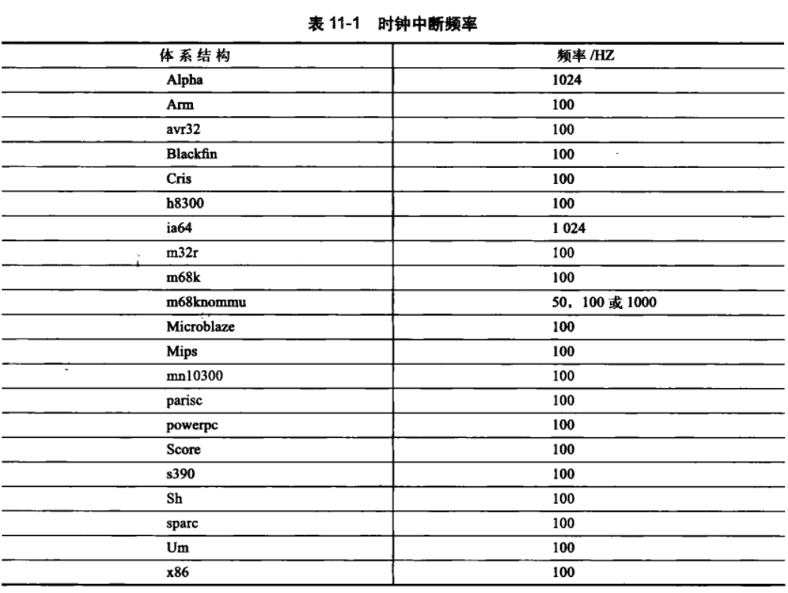
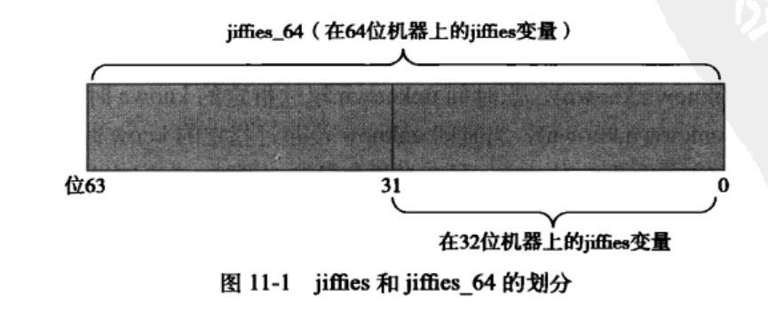

> 2019-10-24 20:25:49

# Linux内核设计与实现 学习笔记 (三)

------

## 第 9 章 内核同步介绍

在单处理器时，只有在中断发生的时候，或者在内核代码明确地请求重新调度、执行另外一个任务时，数据才能被访问。

**[Linux多核并行编程关键技术](https://www.cnblogs.com/wahaha02/p/9175637.html)**
- 锁技术： Linux kernel提供了多种锁机制，如自旋锁、信号量、互斥量、读写锁、顺序锁等。各种锁的简单比较如下，具体实现和使用细节这里就不展开了，可以参考《Linux内核设计与实现》等书的相关章节。
  - 自旋锁，不休眠，无进程上下文切换开销，可以用在中断上下文和临界区小的场合；
  - 信号量，会休眠，支持同时多个并发体进入临界区，可以用在可能休眠或者长的临界区的场合；
  - 互斥量，类似与信号量，但只支持同时只有一个并发体进入临界区；
  - 读写锁，支持读并发，写写/读写间互斥，读会延迟写，对读友好，适用读侧重场合；
  - 顺序锁，支持读并发，写写/读写间互斥，写会延迟读，对写友好，适用写侧重场合；<br>
锁技术虽然能有效地提供并行执行下的竞态保护，但锁的并行可扩展性很差，无法充分发挥多核的性能优势。锁的粒度太粗会限制扩展性，粒度太细会导致巨大的系统开销，而且设计难度大，容易造成死锁。除了并发可扩展性差和死锁外，锁还会引入很多其他问题，如锁惊群、活锁、饥饿、不公平锁、优先级反转等。不过也有一些技术手段或指导原则能解决或减轻这些问题的风险。
  - 按统一的顺序使用锁（锁的层次），解决死锁问题；
  - 指数后退，解决活锁/饥饿问题；
  - 范围锁（树状锁），解决锁惊群问题；
  - 优先级继承，解决优先级反转问题；

- 原子技术:原子技术主要是解决cache和内存不一致性和乱序执行对原子访问的破坏问题。Linux kernel中主要的原子原语有：
  - ACCESS_ONCE()、READ_ONCE() and WRITE_ONCE()：禁止编译器对数据访问的优化，强制从内存而不是缓存中获取数据；
  - barrier()：乱序访问内存屏障，限制编译器的乱序优化；
  - smb_wmb()：写内存屏障，刷新store buffer，同时限制编译器和CPU的乱序优化；
  - smb_rmb()：读内存屏障，刷新invalidate queue，同时限制编译器和CPU的乱序优化；
  - smb_mb()：读写内存屏障，同时刷新store buffer和invalidate queue，同时限制编译器和CPU的乱序优化；
  - atomic_inc()/atomic_read()等：整型原子操作；
严格来说，Linux kernel作为系统软件，实现受硬件影响很大，不同硬件有不同的内存模型，因此，不同于高级语言，Linux kernel的原子原语语义并没有一个统一模型。比如在SMP的ARM64 CPU上，barrier、smb_wmb、smb_rmb的实现与smb_mb都是一样的，都是volatile ("" ::: "memory")。
另外，再多提一句的是，atomic_inc()原语为了保证原子性，需要对cache进行刷新，而缓存行在多核体系下传播相当耗时，其多核下的并行可扩展性差。

- 无锁技术:原子技术，是无锁技术中的一种，除此之外，无锁技术还包括RCU、Hazard pointer等。值得一提的是，这些无锁技术都基于内存屏障实现的。
  - Hazard pointer主要用于对象的生命周期管理，类似引用计数，但比引用计数有更好的并行可扩展性；
  - RCU适用的场景很多，其可以替代：读写锁、引用计数、垃圾回收器、等待事物结束等，而且有更好的并行扩展性。但RCU也有一些不适用的场景，如写侧重；临界区长；临界区内休眠等场景。
  - 不过，所有的无锁原语也只能解决读端的并行可扩展性问题，写端的并行可扩展性只能通过数据分割技术来解决。

- 数据分割技术：分割数据结构，减少共享数据，是解决并行可扩展性的根本办法。对分割友好（即并行友好）的数据结构有：
  - 数组
  - 哈希表
  - 基树（Radix Tree）/稀疏数组
  - 跳跃列表（skip list）<br>
使用这些便于分割的数据结构，有利于我们通过数据分割来改善并行可扩展性。
除了使用合适的数据结构外，合理的分割指导规则也很重要：
  - 读写分割：以读为主的数据与以写为主的数据分开；
  - 路径分割：按独立的代码执行路径来分割数据；
  - 专项分割：把经常更新的数据绑定到指定的CPU/线程中；
  - 所有权分割：按CPU/线程个数对数据结构进行分割，把数据分割到per-cpu/per-thread中；
4种分割规则中，所有权分割是分割最彻底的。

以上这些多核并行编程内容基本上涵盖了Linux kernel中所有的并发编程关键技术。当然并行编程还有很多其他技术没有应用到Linux kernel中的，如无副作用的并行函数式编程技术（Erlang/Go等）、消息传递、MapReduce等等。

### 9.1 临界区和竞争条件

- 临界区:访问和共享数据操作的代码段；
- 同步:避免并发和防止竞争条件；
- 执行线程:所有正在执行的代码实例的总称。

处理器一般都提供对数据访问的原子操作。来防止数据的乱序

### 9.2 加锁

锁强制确保一次有且只有一个线程对数据结构进行操作，或者禁止其它访问。


锁是使用原子操作实现的，而原子操作不存在竞争。

#### 9.2.1 造成并发执行的原因 

用户空间之所以需要同步；是因为用户程序会被调度程序抢占和重新调度。因为单核系统中线程之间是相互交叉进行的，因此也可以称为伪并发进行。

内核中并发执行的原因：中断、软中断和tasklet、内核抢占、睡眠及用户空间的同步、对称多处理。

注意：两个处理器绝对不能同时访问同一共享数据。

#### 9.2.2 了解要保护什么

在Linux 内核编译时,可以配置CONFIG_SMP配置选项控制内核是否支持SMP.当期没有被设置时就不会被编入不必要的代码.

### 9.3 死锁

死锁产生的条件和避免手段,请参照往期博客.

### 9.4 争用和扩展性

高度争用的锁会成为系统的瓶颈。锁的设计在开始阶段都很粗，但是当竞争问题变得严重式，设计就更加精细的加锁方向进行。

## 第 10 章 内核同步方法

### 10.1 原子操作
_参考连连接：_
- [linux 原子整数操作详解](https://blog.csdn.net/hunanchenxingyu/article/details/8994379)
- [linux 原子变量](https://www.cnblogs.com/fanweisheng/p/11141758.html)


原子操作是其它同步方法的基石--原子操作可以保证指令以原子的方式执行--执行过程不被打断。即使原子操作存在，但是由于执行顺序的不同；问题也有可能发生。


内核中提供了两组原子操作接口--整数操作和位操作；

#### 10.1.1 原子操作

整数的原子操作只能针对`atomic_t`类型的数据进行处理。这样原子函数就只接受`atomic_t`的操作。是固体部分`atomic_t`确保编译器不对相应的值进行访问优化--原子操作最终接收到正确的内存地址，而不是只是一个别名。并且可以屏蔽不同体系结构之间的差异；

```c
//linux/types.h

typedef struct{
    volatile int counter;
} atomic_t;
```
SPARC体系结构上，缺乏原子指令操作；32位int类型的低8位被嵌入了一个锁；避免并发访问。


原子操作整数最常见的用途就是实现计数器。使用下面的原子整数操作可以避免锁的使用。


**原子性与顺序性的比较**

原子性确保指令在执行期间不被打断，要么完全执行完，要么不执行。顺序性确保即使两台或者多条指令处理下载独立的执行线程中，甚至独立的处理器上，他们本来应该的执行顺序确依然要保持。

#### 10.1.2 64位原子操作

因为移植性原因，atomic_t变量大小无法在体系结构之间改变，所以其即便是在64位体系结构下也是32位的。因此存在`atomic64_t`类型基本功能完全相同，不同的只有整型变量大小变化。

```c
typdef struct{
  volatile long counter;
}atomic64_t;
```


#### 10.1.3 原子位操作

内核在`asm/bitops.h`中定义了对应的操作。位操作是对普通的内存地址进行操作的。它的参数是一个指针和一个位号。一般32位中；第0位是最低有效位，31位是给定地址的最高有效位。原子位操作是对普通的指针进行的操作，所以不像原子整形对应atomic_t;没有特殊的数据类型。只要指针指向了任何数据都可以进行操作。

```c
unsigned long word=0;
set_bit(0,&word);  /* 第0位被设置(原子地) */
set_bit(1,&word);  /* 第1位被设置(原子地) */
printk("%u1\n",word);          /* 打印3 */
clear_bit(1,&word);  /* 清空第1位 */
change_bit(0,&word);  /* 翻转第0位的值，这里它被清空 */

/* 原子的设置第0位并且返回设置前的值(0) */
if(test_and_set_bit(0,&word)){
  /* 永远不为真 */
}
/* 将原子位指令与一般的c指令语句混合在一起 */
word=7;
```


```c
/* 搜索第一个被设置的位 */
int find_first_bit(unsigned long *addr,unsigned int size);
/* 搜索第一个未被设置的位 */
int find_first_zero_bit(unsigned long *addr,unsigned int size);
```

### 10.2 自旋锁

_参考链接：_ 
- [Linux内核同步方法——自旋锁（spin lock）](https://blog.csdn.net/hhhanpan/article/details/80624244)
- [linux自旋锁](https://blog.csdn.net/weixin_29379325/article/details/80326734)
- [深入分析Linux自旋锁【转】](https://www.cnblogs.com/sky-heaven/p/9549498.html)
  
为了对复杂的数据结构进行访问和修改，需要锁来提供保护。

Linux内核中的自旋锁(spin lock)--最多只能被一个可执行线程持有。一个执行简称试图获得一个自旋锁，就会一直进行忙循环旋转等待，直到锁可以被使用。一般是请求线程睡眠，直到锁重新可用时再唤醒它。持有自旋锁的时间最好小于完成两次上下文切换的时间。

#### 10.2.1 自旋锁方法

自旋锁的实现基本通过汇编实现，相关代码定义在`asm/spinlock.h`中。需要用到的接口定义在`<linux/spinlick.h>`中。基本使用形式如下；

```c
DEFINE_SPINLOCK(mr_lock);
spin_lock(&mr_lock);
/* 临界区 */
spin_unlock(&mr_lock);
```

**注意:内核实现的自旋锁不能在递归中使用;必须自己手动释放这个锁**

中断处理程序不能使用信号量(会导致睡眠)；但可以使用自旋锁。但是一定要先禁止本地中断(同一个处理器)。否则会程序之间的竞争会引起自旋。不同处理器上无此考虑。内核提供的禁止中断同时请求锁的接口使用方法如下：

```c
DEFINE_SPINLOCK(mr_lock);
unsigned long flags;
/* 保存中断的当前状态 */
spin_lock_irqsave(&mr_lock,flags);
/* 临界区域 */
/* 解锁指定的锁 */
spin_unlock_irqrestore(&mr_lock,flags);
```
单处理器中，在编译时抛弃掉了锁机制，但是任然需要关闭中断以禁止中断处理程序访问共享数据。加锁和解锁分别可以禁止和允许内核抢占。

锁应该主要针对数据。

编译内核时，可以开启`CONFIG_DEBUG_SPINLOCK`选项，为使用自旋锁的代码加入调试检测手段。可以进行锁的调试。需要进一步全程调试锁，应该打开`CONFIG_DEBUG_LOCK_ALLOC`选项。

#### 10.2.2 其它针对自旋锁的操作


pin lock接口API如下

|接口API的类型|spinlock中的定义|raw_spinlock的定义|
|:---|:---|:---|
|定义spinlock并初始化|`DEFINE_SPINLOCK`|`DEFINE_RAW_SPINLOCK`|
|动态初始化spin lock|`spin_lock_init`|`raw_spin_lock_init`|
|获取指定的spin lock|`spin_lock`|`raw_spin_lock`|
|获取指定的spin lock同时disable本CPU中断|`spin_lock_irq`|`raw_spin_lock_irq`|
|保存本CPU当前的irq状态，disable本CPU中断并获取指定的spin lock|`spin_lock_irqsave`|`raw_spin_lock_irqsave`|
|获取指定的spin lock同时disable本CPU的bottom half|`spin_lock_bh`|`raw_spin_lock_bh`|
|释放指定的spin lock|` spin_unlock	`|`raw_spin_unlock`|
|释放指定的spin lock同时enable本CPU中断|`spin_unlock_irq`|`raw_spin_unock_irq`|
|释放指定的spin lock同时恢复本CPU的中断状态|`spin_unlock_irqstore`|`raw_spin_unlock_irqstore`|
|获取指定的spin lock同时enable本CPU的bottom half|`spin_unlock_bh`|`raw_spin_unlock_bh`|
|尝试去获取spin lock，如果失败，不会spin，而是返回非零值|`spin_trylock`|`raw_spin_trylock`|
|判断spin lock是否是locked，如果其他的thread已经获取了该lock，那么返回非零值，否则返回0|`spin_is_locked`|`raw_spin_is_locked`|


#### 10.2.3 自旋锁和下半部分

函数`spin_lock_bh()`用于获取指定锁，同时禁止下半部分的执行。`spin_unlock_bh()`执行相反的操作。

下半部分和进行上下文共享数据时，必须对进程上下文中的共享内存进行数据保护，所以需要同时进行加锁和禁止下半部分的执行，在恰当的时间还需要禁止中断。

同类型的tasklet不可能同时运行。所以对于同来tasklet中的共享数据不需要保护。但是不同tasklet需要保护；但是不需要进行下半部分的禁止，因为同一个处理器上绝对不会有tasklet相互抢占的情况

### 10.3 读-写自旋锁
_参考链接：_ [Linux系统编程7：读写锁](https://www.jianshu.com/p/a62bd5ae5d8c)

Linux中提供了针对生产者消费者的读写自旋锁。其写锁最多只能被一个写任务持有。读写锁也称共享/排斥锁；并发/排斥锁.使用流程大致如下：

```c
/* 初始化读写锁 */
DEFINE_RWLOCK(mr_rwlock);
/* 读者代码 */
read_lock(&rm_rwlock);
/* 只读临界区 */
read_unlock(&mr_rwlock);

/* 写者部分代码 */
write_lock(&mr_rwlock);
/* 代码临界区 */
write_lock(&mr_rwlock);
```

注意：
- 同时使用读写锁，否则会造成死锁。因为写锁会不断自旋；直到等待所有的读者释放锁--包括他自己。
- 大量的读者会使得，写锁处于饥饿状态


### 10.4 信号量
_参考链接：_ 
- [linux进程睡眠的介绍](https://www.cnblogs.com/fanweisheng/p/11141829.html)
- [linux一个进程如何睡眠](https://www.cnblogs.com/fanweisheng/p/11141864.html)

Linux中的信号量是一种睡眠锁(自旋锁不会引起睡眠;进程的睡眠相当于重新调度);信号量会将其推进一个等待队列；然后让其睡眠。处理器重新获得自由，从而去执行其它代码。信号量的开销比自旋锁大；利用率比较高。

有用结论：

- 信号量适合锁被长时间持有的进程。
- 由于执行线程在锁被争用时会睡眠；所以只能在进程上下文中才能获得信号量锁，因为在中断上下文中是不能进行调度的。
- 可以在持有信号量时去睡眠；因为当其他进程试图获得同一信号量时不会因此而死锁
- 占用信号量的同时不能占用自旋锁，否则睡眠时，会造成自旋锁的等待方的死锁。

#### 10.4.1 计数信号量和二值信号量

信号量同时允许持有者数量可以在声明信号量是指定。每次持有一个则--i;释放一个++i。当i=1时，称为二值信号量(互斥信号量)。不为1时为计数信号量。其本质在于两个原子操作P()和V();现在系统将这两个操作称之为`down()`和`up()`。

#### 10.4.2 创建和初始化信号量

信号量相关代码在文件`asm/semaphore.h`中。`strcut semaphore`表示信号量。声明方法如下：

```c
/* 静态声明和初始化 */
struct semaphore name;
sema_init(&name,count);

/* 静态预定义初始化 */
static DECLARE_MUTEX(name);

/* 动态创建一个信号量 */
init_MUTEX(sem);
```
使用方法如下：

```c
/* 定义并声明一个信号量 */
static DECLARE_MUTEX(mr_sem);
/* 尝试获取信号量 */
if(down_interruptible(&mr_sem)){
  /* 信号被接受，信号量还未获取 */
}
/* 临界区 */
/* 释放给定的信号量 */
up(&mr_sem);
```


### 10.5 读写信号量

定义在`linux/rwsem.h`中；可以由`static DECLARE_RWSEM(name)`或者`init_rwsem(struct rw_semaphore *sem)`进行生成。

所有的读写信号量都是互斥信号量--引用计数等于1;但是只针对写者。

```c
static DECLARE_RWSEM(mr_rwsem);
/* 试图获取信号量用于读 */
down_read(&mr_rwsem);
/* 只读临界区 */


/* 释放信号量 */
up_read(&mr_rwsem);


/* 试图获取写信号量 */
down_write(&mr_rwsem);
/* 写临界区 */

/* 释放信号量 */
up_write(&mr_sem);
```

### 10.6 互斥体

互斥体--一个更加简单的睡眠锁。指的是任何可以强制睡眠的强制互斥锁。初始化方法如下：

```c
/* 静态定义 */
DEFINE_MUTEX(name);
/* 动态初始化 */
mutex_init(&mutex);

/* 互斥量加锁 */
mutex_lock(&mutex);
/* 临界区 */
mutex_unlock(&mutex);
```


MUTEX的特性如下：

- 计数永远是1；任何时刻只有一个任务可以持有
- mutex上锁者必须负责给其解锁--必须在同一个上下文中。因此其不适合内核同用户空间的复杂同步场景；常用场景是：在同一上下文中上锁和解锁
- 递归地上锁和解锁是不允许的。不能递归的持有同一个锁。
- 当持有一个mutex时，进程不可以退出
- mutex不能在中断或者下半部分中使用；即使使用`mutex_tryolck()`也不行
- mutex只能通过官方API管理；不可被拷贝、手动初始化或者重复初始化。

#### 10.6.1 信号量和互斥体

建议首选mutex.

#### 10.6.2 自旋锁和互斥体


### 10.7 完成变量

完成变量(completion variable):一个任务打出信号通知另外一个任务发生了某个特定事件；来完成两个任务的同步。例如vfork()系统调用完成时；使用完成变量唤醒父进程。其定义在`linux/completion.h`中。使用一下的方法进行初始化

```c
DECLARE_COMPLETION(mr_comp);
init_completion(mr_comp);
```


### 10.8 BLK:大内核锁

BLK是一个全局自旋锁，主要是实现Linux最初的SMP过渡到细粒度加锁机制。其特性如下

- 持有它的任务仍然可以睡眠。当任务无法调度时(睡眠)；锁被自动丢弃；调度时，锁重新获得
- 是一种递归锁，进程可以多次请求
- 只能在进程上下文中使用。
- 新用户不允许使用BLK

旧的接口，并不推荐使用。在被持有时会禁止内核抢占。单一处理器内核中，BKL并不执行实际的加锁操作


**注意：自旋锁在单核处理器环境无效；编译器会自动优化取消它；防止锁因为上下文切换被获取，造成死锁.([为什么说“自旋锁在单处理器环境下无效”](https://www.zhihu.com/question/322348374/answer/671698403))**

### 10.9 顺序锁

顺序锁简称seq锁。提供了简单是机制，用于读写共享数据。主要依靠一个序列计数器来实现。当有数据被写入时，会得到一个锁，并且顺序值会增加，在读取数据之前和之后，序列号都被读取。如果相同则过程没有被写操作打断过。如果是偶数就表明写操作没有发生(写操作会编程奇数，释放编程偶数)

使用方法如下：

```c
/* 定义一个锁 */
seqlock_t mr_seq_lock=DEFINE_SEQLOCK(mr_seq_lock);
/* 写锁 */
write_seqlock(&mr_seq_lock);
write_sequnlock(&mr_seq_lock);

/* 读锁被操作 */
unsigned long seq;
do{
    seq=read_seqbegin(&mr_seq_lock);
    /* 读这里的数据 */

}while(read_seqretry(&mr_seq_lock,seq));

```
顺序锁使用与数据读者较多的情况；因为这样的校验机制，可以允许写者在能够抢占到对应的信号量。写着不像读写锁那样容易饿死。例如Linux中的`jiffies`变量存储了Linux机器启动到当前的时间。它的获取实际上就使用了顺序锁

```c
u64 get_jiffies_64(void)
{
  unsigned long seq;
  u64 ret;
  do{
    seq=read_seqbegin(&xtime_lock);
    ret=jiffies_64;
  }while(read_seqretry(&xtime_lock,seq));
  reurn ret;
}

/* 更改时间值操作 */
write_seqlock(&xtime_lock);
jiffies_64+=1;
write_sequnlock(&xtime_lock);
```

### 10.10 禁止抢占

内核是抢占性的；可能随时被停下来。因此一个任务与被抢占的任务可能会在同一个临界区内运行(新调度的任务可能访问被切换的同一个变量)。内核抢占代码使用自旋锁作为非抢占区域的标记。一个自旋锁被持有，内核便不能进行抢占。

可以通过`preempt_disable()`禁止内核抢占。直到`preempt_enable()`被启用之后才能重新启用。


也可以使用`get_cpu()`函数；这个函数在返回当前处理器号前首先会关闭内核抢占。

```c
int cpu;
/* 禁止内核抢占，将cpu设置为当前处理器 */
cpu=get_cpu();
/* 对每个处理器的数据进行操作 */
/* 给于内核抢占性 */
put_cpu();
```

### 10.11 顺序和屏障

为了防止编译器对指令的乱序，可以屏障(barriers)保证代码顺序的固定执行。例如：`rmb()`提供一个“读”内存屏障。确保跨越rmb()的载入动作不会发生重排序--其之前的凑走不会被重新排在该调用之后；之后的操作不会排在该调用之前。


**注意：对于不同体系结构，屏障的实际效果差别很大。Intel x86 不执行乱序存储，wrmb()就什么都不做**

## 第 11 章 定时器和时间管理

### 11.2 节拍率：HZ

系统定时器频率(HZ)是通过静态预处理定义的。体系结构的不同，HZ的值也不同。具体的值定义在`<asm/param.h>`中定义了这个值。注意大多数体系结构的节拍率是可以调节的。



#### 11.2.1 理想的HZ值

使用高频会让时钟中断产生的更加频繁；会给整个系统带来如下好处：
- 更高的时钟中断解析度；可以提高时间驱动时间的解析度
- 提高了时间驱动事件的准确度
- 执行时间有更高的运行精度

劣势：

- 系统负担过重；处理器需要花费大量的时间来处理中断程序。
- 打乱处理器高度缓存增加耗电。

可以在编译内核时，选择不同的时钟频率来指定不同的HZ值。也可以设置`CONFIG_HZ`配置选项让cpu根据动态时钟的周期来进行选择。

### 11.3 jiffies

_参考链接：_ 
- [Linux时间子系统之三：jiffies](https://www.cnblogs.com/arnoldlu/p/7234443.html);
- [linux 使用 jiffies 计数器](https://www.cnblogs.com/fanweisheng/p/11141978.html);
- [linux下常用的几个时间函数：gettimeofday和clock_gettime](https://blog.csdn.net/fchyang/article/details/81166470)

这个变量用来记录自系统启动依赖产生的节拍的总数。启动时该变量初始化为0。没次时钟中断处理程序就会增加该变量的值。jiffies一秒内增加的值为HZ;系统运行时间为jiffies/HZ。其定义在文件`linux/jiffies.h`中：`extern unsigned long volatile jiffies;`

#### 11.3.1 jiffies的内部表示

为了避免jiffies的溢出；使用了64位的数来对其进行存储；使用jiffies_64变量的初值覆盖jiffies变量：
```c
jiffies=jiffies_64;
```


一般访问代码只会读取jiffies_64 的低32位。可以通过get_jiffies_64()函数读取整个64位数值。

#### 11.3.2 jiffies 的回绕

当其变量的存储值超过它的最大范围之后会发生溢出。继续增加会恢复到0。注意当使用jiffies为比较标准作为判断时，可能因为发生回绕；造成其值为0，发生错误的判断；内核提供了对应的宏来处理这种判断：`time_after`、`time_before`、`time_after_eq`、`time_before_eq`

#### 11.3.3 用户空间和HZ

为了避免内核中的HZ值更改，造成用户空间程序的异常结果;使用USER_HZ来代表用户空间看到的HZ值。通过一定的公式来进行计算；函数`jiffies_64_to_clock_t()`将64位的单位从HZ转换为USER_HZ。

### 11.4 硬时钟和定时器

操作系统提供了系统定时器和实时时钟。

#### 11.4.1 实时时钟(RTC)

存放系统时间的设备，即便系统关闭之后，它也可以依靠主板上的微型电池提供电力保持系统的计时。系统启动时会读取RTC来初始化墙上时间，时间存在xtime中。

#### 11.4.2 系统定时器

提供一种周期性触发中断机制(电子晶振分频或者衰减测量器)。x86体系结构中；主要采用可编程中断时钟(PIT)

### 11.5 时钟中断处理程序

时钟中断处理程序：

- 体系结构相关部分(硬件中断)；主要内容如下：
  - 获得xtime_lock锁，保护时间戳访问
  - 应答或者重新设置系统时钟(需要时)
  - 周期性地使用墙上时间更新实时时钟
  - 调用体系结构无关的时钟例程：`tick_periodic()`
- 体系结构无关部分(中断处理)，使用`tick_periodic()`执行下面的更多工作
  - 给jiffies_64变量增加1
  - 更新资源消耗的统计值，比如当前进程所消耗的系统时间和用户时间
  - 执行已经到期的动态定时器
  - 执行sheduler_tick()函数
  - 更新墙上时间，该时间存放在xtime变量中
  - 计算平均负载值

### 11.6 实际时间

当前实际时间(墙上时间)定义在文件`kernel/time/timekeeping.c`中
`struct timespec xtime;`
timespec定义在文件`<linux/time.h>`中，形式如下：

```c
struct timespec{
  _kernel_time_t tv_sec  /* 秒 */
  long tv_nsec;           /* ns */
}
```

xtime.tv_sec以秒为氮气，存放着UTC以来经过的所有时间。其读写需要xtime_lock锁，它不是普通自旋锁而是一个seqlock锁。使用下面的代码进行时间的读取

```c
unsigned long seq;
do{
  unsigned long lost;
  seq=read_seqbegin(&xtime_lock);
  usec=timer->get_offset();
  lost=jiffies-wall_jiffies;
  if(lost)
    usec+=lost*(1000000/HZ);
  sec=xtime.tv_sec;
  usec+=(xtime.tv_nsec/1000);
}while(read_seqretry(&xtime_lock,seq));
```

用户获得墙上时间的主要接口是`gettimeofday()`；调用`sys_gettimeofday()`接口，定义于`kernel/time.c`

```c
asmlinkage long sys_gettimeofday(struct timeval *tv,struct timezone *tz)
{
  if(likely(tv)){
    struct timeval ktv;
    do_gettimeofday(&ktv);
    if(copy_to_user(tv,&ktv,sizeof(ktv)))
      return -EFAULT;
  }
  if(unlikely(tz)){
    if(copy_to_user(tz,&sys_tz,sizeof(sys_tz)))
      return -EFAULT;
  }
  return 0;
}
```
当输入参数非空时，其参数会进行调用。函数使用示例如下：

```c
void sysUsecTime() 
{ 
    struct timeval    tv; 
    struct timezone tz; 
       
    struct tm         *p; 
       
    gettimeofday(&tv, &tz); 
    printf("tv_sec:%ld\n",tv.tv_sec); 
    printf("tv_usec:%ld\n",tv.tv_usec); 
    printf("tz_minuteswest:%d\n",tz.tz_minuteswest); 
    printf("tz_dsttime:%d\n",tz.tz_dsttime); 
       
    p = localtime(&tv.tv_sec); 
    printf("time_now:%d%d%d%d%d%d.%ld\n", 1900+p->tm_year, 1+p->tm_mon, p->tm_mday, p->tm_hour, p->tm_min, p->tm_sec, tv.tv_usec); 
} 
   
int main(void) 
{ 
    sysLocalTime(); 
    printf("============gettimeofday==============\n"); 
       
    sysUsecTime(); 
       
    return 0; 
} 
```

### 11.7 定时器

定时器由结构timer_list表示，定义在文件`<linux/timer.h>`中

```c
struct timer_list{
  struct list_head entry;           /* 定时器链表的入口 */
  unsigned long expires;            /* 以jiffies为单位的定时值 */
  void (*function)(unsigned long)   /* 定时器处理函数 */
  unsigned long data;               /* 传给处理函数的长整型参数 */
  struct tvec_t_base_s *base;       /* 定时器内部值，用户不要使用 */
}
```

定时器使用方法如下：

```c
/* 创建定时器 */
struct timer_list my_timer;
/* 初始化内部定时器结构,分配内存 */
init_timer(&my_timer);
/* 预定义超时函数 */
void my_timer_function(unsigned long data);
/* 填充结构中需要的值 */
my_timer.expires=jiffies+delay /* 定时器超时时的节拍数 */
my_timer.data=0;                /* 给定时器处理函数传入0值 */
my_timer.function=my_function;   /* 定时器超时时函数的调用 */
/* 启动激活定时器 */
add_timer(&my_timer);
/* 更改定时器超时时间;设置新的定时器 */
mod_timer(&my_timer,jiffies+new_delay);
/* 删除定时器 */
del_timer(&my_timer);
/* 异步等待并删除定时器 */
del_timer_sync(&my_timer);
```
注意不要删除超时的定时器，它们会自动删除。del_timer()保证定时器不会被激活。但是对于多处理，需要使用`del_timer_sync(&my_timer)`来进行异步操作，等待其它核上的定时器的结束。

#### 11.7.2 定时器条件竞争

因为定时器和当前执行代码的异步性，因此可能存在条件竞争；应该尽量使用`del_timer_sync()`取代`del_timer()`函数。

因为内核异步执行中断处理程序，所以应该重点保护定时器中断处理程序中的共享数据。

#### 11.7.3 实现定时器

内核在时钟中断之后会执行定时器，更新当前时间。

```c
void run_local_timers(void)
{
  hrtimer_run_queues();
  /* 执行定时器软中断 */
  raise_softirq(TIMER_SOFTIRQ);
  softlockup_tick();
}
```
执行中断，在当前处理器上运行所有的超定时器。为了提高定时器的搜索效率，内核将定时器按照超时时间划分为五组。当定时器超时时间接近时，定时器将随组一起下移。保证了定时器管理代码的高效性。

### 11.8 延迟执行

内核提供了许多延迟方法处理各种延迟要求。

#### 11.8.1 忙等待

最简单的延迟方法，仅仅在延迟时间是节拍的整数倍，或者精确度要求不高时才可以使用。本质上是在循环中不断旋转直到希望的时钟节拍数耗尽

```c
/* 10个节拍 */
unsigned long timeout=jiffies+10;
while(time_before(jiffies,timeout))
  ;
```
这个方法会消耗CPU资源，效率比较低，当等待时间较长时，应该尽量让任务挂起，允许内核重新执行调度任务。
```c
unsigned long timeout=jiffies+5*HZ;
while(time_before(jiffies,timeout)){
  /* 重新执行调度 */
  cond_resched();
}

```
volatile 使得jiffies每次都直接从主内存中货色，不是通过寄存器中的变量别名来访问。从而确保前面的循环能按照预期的方式执行。

#### 11.8.2 短延迟

时间很多(比时钟节拍还短)。并且对延迟的时间很精确。内核提供了下面单个延迟函数，定义在`<linux/delay.h>`和`<asm/delay.h>`中。并使用`jiffies`

```c
/* 指定微妙(us)延迟 */
void udelay(unsigned long usecs);
/* 指定纳秒延迟 */
void ndelay(unsigned long nsecs);
/* 指定毫秒延迟 */
void mdelay(unsigned long msecs);
```
mdelay间接使用ndelay,ndelay使用`udelay()`;udelay依靠执行次数循环达到延迟效果(由内核判断1s内执行多少次循环)。udelay更多的是根据循环的比例进行设置。

**BogoMIPS:bogus(伪的)和MIPS(每秒处理百万指令)；主要记录处理器空闲时的速度。该值存放在`loop_per_jiffy`中，可以由`/proc/cpuinfo`进行读取**

内核在启动时利用`calibrate_delay()`计算`loop_per_jiffy`值。udelay()应当只在小延迟中调用，因为快速机器上的大延迟可能导致溢出。尽量减少使用`mdelay`以避免忙等待，消耗CPU资源。

### 11.8.3 schedule_timeout()

让延迟执行的任务睡眠到指定的延迟时间耗尽后再重新运行。主要是重新调度，因此该方法也不能保证睡眠时间正好等于指定的延迟时间，只能尽量靠近过。指定时间到达后，内核唤醒被延迟的任务并将其重新放回运行队列，用法如下：

```c
/* 将任务设置为可中断睡眠状态 */
set_current_state(TASK_INTERRUPTIBLE);
/* 小睡一会儿，“s”秒后唤醒 */

schedule_timeout(s*HZ);
```
注意：
- 使用schedule_timeout任务之前,必须将其窗台设置为`TASK_INTERRUPTIBLE`(可接受信号)或者`TASK_UNINTERRUPTIBLE`(不可接收信号)。
- schedule_timeout()需要调用调度程序，必须保证用时短，调用代码应该处于进程上下文中，并且不能持有锁。
- 可以使用`schedule_timeout()`函数代替`schedule()`函数来，让任务等待某个特定事件的到来。


## 第 12 章 内存管理

内核的特性决定其内存分配，不像用空间那样简单，处理分配错误也是十分困难。

### 12.1 页

内核键页作为内存管理的基本单位。内存管理单元(MMU,管理内存并把虚拟地址转换为物理地址的硬件)是以页为氮气进行处理。虚拟内存中页是最小单位。


