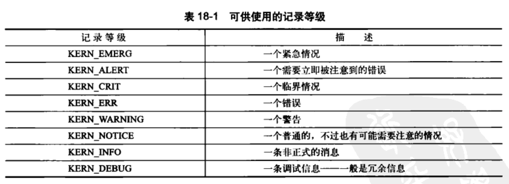

> 2019-11-05 20:25:49

# Linux内核设计与实现 学习笔记 (五)

------

## 第 16 章 页高速缓存和页回写

页高速缓存(cache)是Linux内核实现的磁盘缓存。主要用来减少对磁盘的I/O操作。通过将磁盘中的数据缓存在物理内存中，把对磁盘数据的访问变为对物理内存的访问。

### 16.1 缓存手段

页缓存是由内存中的物理页面组成的对应磁盘上的物理块。read()操作时，首先检查页是否为在内存中。如果在则直接读取，称为缓存命中。不再则进行中断。


#### 16.1.1 写缓存手段

存在写缓存手段如下：

- 不缓存(nowrite):不去缓存任何写操作；直接写到磁盘
- 写透缓存(write-through cache):自动更新内存缓存；缓存数据时刻与后备存储保持同步。
- 回写(Linux采用)：程序页操作直接写入到缓存中，后端存储不会立刻更新；将高速缓存中的页标记成“脏”，并将其添加到脏页链表中。然后由一个进程(回写进程)周期性将脏页链表中的页写回到磁盘。最后清理脏页标识。

#### 16.1.2 缓存回收

Linux中的脏页回收策略是，通过选择干净页进行简单的替换。如果缓存中没有足够的干净页，内核将强制地进行回写操作，腾出尽可能多的页。页的回收策略方式如下：

- 最近最少使用(RLU)：
- 双链策略(RLU/2)：RLU链表的改进，维护两个链表：活跃链表和非活跃链表。活跃上的不会被换出，非活跃上的会被换出，基本上都是尾部加入头部移除。活跃链表数量超过非活跃链表时，将会将多余的头页面重新移回到非活跃链表中，以便能再被回收。

### 16.2 Linux 页高速缓存

#### 16.2.1 address_space对象

页高速缓存可能包含了多个不连续的物理磁盘块。它可以通过扩展inode结构体支持I/O操作。为了更好的性能，其使用address_space结构体。其与vm_are_struct的物理地址对等。文件只能有一个address_sapce可以有多个vm_area_struct即虚拟地址可以有多个，但是物理内存只能有一份。其数据结构定义如下：

```c
struct address_space {
	struct inode		*host;		/* 拥有节点 */
	struct radix_tree_root	page_tree;	/* 包含全部页面的radix树 */
	spinlock_t		tree_lock;	/* 保护页面的自旋锁 */
	unsigned long		nrpages;	/* 页面总数 */
	pgoff_t			writeback_index;/* writeback starts here */
	struct address_space_operations *a_ops;	/* methods */
	struct list_head	i_mmap;		/* 私有映射连败哦 */
	struct list_head	i_mmap_shared;	/* 共享map链表 */
	struct semaphore	i_shared_sem;	/* 保护所有的链表 */
	atomic_t		truncate_count;	/* 截断计数 */
	unsigned long		flags;		/* gfp_mask掩码和错误标志 */
	struct backing_dev_info *backing_dev_info; /* 预读信息等 */
	spinlock_t		private_lock;	/* 私有address_space锁 */
	struct list_head	private_list;	/* address_space链表 */
	struct address_space	*assoc_mapping;	/* 相关缓冲 */
};
```

其对应的操作如下：

```c
struct address_space_operations {
	int (*writepage)(struct page *page, struct writeback_control *wbc);
	int (*readpage)(struct file *, struct page *);
	int (*sync_page)(struct page *);

	/* Write back some dirty pages from this mapping. */
	int (*writepages)(struct address_space *, struct writeback_control *);

	/* Set a page dirty */
	int (*set_page_dirty)(struct page *page);

	int (*readpages)(struct file *filp, struct address_space *mapping,
			struct list_head *pages, unsigned nr_pages);

	/*
	 * ext3 requires that a successful prepare_write() call be followed
	 * by a commit_write() call - they must be balanced
	 */
	int (*prepare_write)(struct file *, struct page *, unsigned, unsigned);
	int (*commit_write)(struct file *, struct page *, unsigned, unsigned);
	/* Unfortunately this kludge is needed for FIBMAP. Don't use it */
	sector_t (*bmap)(struct address_space *, sector_t);
	int (*invalidatepage) (struct page *, unsigned long);
	int (*releasepage) (struct page *, int);
	ssize_t (*direct_IO)(int, struct kiocb *, const struct iovec *iov,
			loff_t offset, unsigned long nr_segs);
};
```

#### 16.2.3 基树

每个address_space对象都有一个唯一的基树(radix tree)来进行文件偏移量的搜索。页面高速缓存的搜索函数find_get_page()要调用函数radix_tree_lookup(),该函数会指定基树中搜索指定页面。

#### 16.2.5 以前的页散列表

2.6之前，系统通过维护一个全局散列表进行检索。存在种种缺点：如锁的争用情况严重，搜索范围大等。

### 16.3 缓冲区高速缓存

内核提供bread()函数实现从磁盘读取越高块的底层操作；通过缓存，磁盘块映射到他们相关的内存页。

### flusher线程

一下三种情况发生时,脏页被写回磁盘：

- 当空闲内存低于一个特定的阀值时
- 脏页在内存中驻留时间超过一个特定的阀值时；flusher线程后台例程会被周期性唤醒来执行这个操作。
- 用户进程调用sync()和fsync()系统调用时；内核会按照要求执行回写动作。


内核中由一群内核线程(flusher线程)执行这三种工作。当空闲内存比阀值(dirty_background_ratio)还低时，内核便会调用flusher_thread()唤醒一个或者多个flusher线程，随后flusher线程进一步调用函数bdi_writeback_all()开始将脏页写回磁盘。

系统管理员可以在`/proc/sys/vm`中设置回写相关的参数，也可以通过sysctl系统调用设置它们。pdflush相关的所有可设置变量如下：


#### 16.4.1 膝上型计算机模式

它是一种特殊的页回写策略：将硬盘的转动的机械行为最小化，允许硬盘尽可能长时间的停滞，以此延长电池供电。可以通过`/proc/sys/vm/laptop_mode`文件进行配置。向其中写入1开启。其会找准磁盘运转的实际，把所有其它的物理磁盘I/O、刷新脏页缓冲等统统写回到磁盘。来减少写磁盘要求的主动运行。

#### 16.4.3 避免拥塞的方法：使用多线程

页回写时可能存在拥塞。使用多个回写线程并发执行，避免一个bdflush堵塞在某个队列的处理(正在等待将请求提交给磁盘的I/O请求队列)上。这也是使用多个flusher的原因。不同的flusher线程处理不同的设备队列。

pflush线程采取了拥塞回避策略：主动尝试从那些没有拥塞的对了回写页。


## 第 17 章 设备与模块

设备驱动和设备管理，将讨论四种内核成分：

- 设备类型：所有Unix系统中为了统一普通设备的操作所采用的分类
- 模块：Linux内核中用于按需加载和卸载目标码的机制
- 内核对象：内核数据结构中支持面向对象的简单操作，还支持维护对象之间的父子关系
- sysfs:表示系统设备树的一个文件系统

### 17.1 设备类型

在Linux以及所有Unix系统中，设备被分为以下三种类型：

- 块设备(blkdev)：以寻址块为单位；块大小随设备不同而不同；块节点通常被挂载为文件系统。
- 字符设备：cdev，通常是不可寻址的；通过字符设备节点的特殊文件来访问
- 网络设备(ethernet devices)：不是通过设备节点来访问，而是通过套接字API这样的特殊接口来访问。
- 虚拟设备：设备驱动是虚拟的，仅仅提供访问内核功能。如随机数发生器(/dev/random和/dev/urandom).空设备(/dev/null)、零设备(/dev/zero)、满设备(/dev/full)、内存设备(/dev/mem)


### 17.2 模块

Linux内核是模块化的，允许内核在运行时动态地向其中插入或者从中删除代码。代码集成的二进制文件；即所谓的可装载内核模块。下面是如何编写一个自己的内核模块

#### 17.2.1 Hello Word
下面是一个简单的helloword内核模块

```c
#include <linux/init.h>
#include <linux/module.h>
#include <linux/kernel.h>

/*
hello word 初始化函数
*/
static int hello_init(void)
{
	printk(KERN_ALERT,"I bear a charmed life .\n");
	return 0;
}
/*
hello word 退出函数，当模块卸载时被调用 
*/
static void hello_exit(void)
{
	printk(KERN_ALERT "out,Out,brief candle!\n");
}
/*
初始化模块，所有的初始化函数都必须满足下面的格式： int my_init(void);
*/
module_init(hello_init);
/*
初始化模块，所有的初始化函数都必须满足下面的格式： int my_init(void);
*/
module_exit(hello_exit);
/* 宏定义，指定模板的版权 */
MODULE_LICENSE("GPL");
/* 指定代码作者 */
MODULE_AUTHOR("Shakespeare");
/* 指定代码的简要描述 */
MODULE_DESCRIPTION("A Hello,Word Module");
```

#### 17.2.2 构建模块
_参考链接：_

- [linux内核中添加模块](https://blog.csdn.net/runner668/article/details/80919765)
- [Linux添加一个内核模块](https://blog.csdn.net/XU18829898203/article/details/84988383)
Linux中采用了新的“kbuild”构建系统，相对比从前更加容易。需要将代码房子啊内核源代码树中。

主要构建步奏如下：

1. 放在内核源代码中：将文件放在正确的位置。如字符设备放在drivers/char/目录下，块设备放在drivers/block/目录下，usb则放在drivers/usb/目录下。如果文件太多可以创建自己的目录。此时需要更改对应的Makefile文件，在`obj-m += `后面添加子文件名称；`obj-$(CONFIG_FISHING_POLE) +=`添加新的配置选项文件夹。最后在子文件夹中添加Makefie文件，并添加目标文件`obj-m +=fishing.o`最终会生成扩展名为`.ko`的文件。
2. 放在内核源代码外：非内核源代码目录中，正常创建文件夹fishing和Makefile文件。添加命令如下：

```makefie
#设置单个文件编译目标
obj-m:=fishing.o
#设置多个文件编译目标(多个文件组成)
fishing-objs:=fishing-main.o fishing-line.o
```
使用make时需要缇娜及内核源码位置如下：
```c
make -C /kernel/source/location SUBDIRS=$PWD modules
```
3. 使用`make modules_install`命令来进行编译好的模块的安装。编译后的模块被安装到目录`/lib/modeules/version/kernel/`下。
4. 产生模块依赖性：模块之间存在依赖性，每次启动时，内核依赖信息更新。也可以使用`sudo depmod/depmod -A`命令更新依赖。模块依赖的相关信息存放在`/lib/modules/version/modeules.dep`文件中
5. 载入模块：使用`insmod`命令进行模块的载入。如`insmod ${module_name}.ko`;也可以使用`rmmod ${module_name}.ko`进行卸载模块。也可以使用`modprobe`模块
6. 管理配置选项：在新模块文件夹中，设置`kconfig`文件，并在一个已经存在的配置文件中将它引入`source "drivers/char/flshing/Kconfig"`;里面可以设置一些相关的配置参数；(详细信息:[Linux内核配置Kconfig语法](https://blog.csdn.net/jianwen_hi/article/details/53398141))
7. 模块参数:可以通过`module_param(name,type,perm)`进行相关模块参数的读取(定义在`linux/module.h`头文件中)。下面是一个简单的使用示例；详细请参考:[linux驱动: 如何向模块传递参数, module_param和module_param_array](https://www.cnblogs.com/mylinux/p/5670279.html)；[内核模块参数传递--module_param()函数](https://www.cnblogs.com/s1nn/p/6538084.html)

```c
/* 定义模块变量 */
static int fish[MAX_FISH];
static int nr_fish;
module_param_array(fish,int,&nr_fish,0444);
/* 将内部参数数组命名区别于外部参数，使用宏如下： */
module_param_array_named(name,array,type,nump,perm);
/*MODULE_PARM_DESC 描述关键宏 */
static unsigned short size=1;
module_param(size,ushort,0644);
MODULE_PARM_DESC(size, "A integer variable");
/* 模块实例代码 */
/*hello.c*/
#include <linux/module.h>
#include <linux/moduleparam.h>
#include <linux/kernel.h>

#define MAX_ARRAY 6

static int int_var = 0;
static const char *str_var = "default";
static int int_array[6];
int narr;
/* 初始化参数 */
module_param(int_var, int, 0644);
MODULE_PARM_DESC(int_var, "A integer variable");

module_param(str_var, charp, 0644);
MODULE_PARM_DESC(str_var, "A string variable");

module_param_array(int_array, int, &narr, 0644);
MODULE_PARM_DESC(int_array, "A integer array");
static int __init hello_init(void)
{
       int i;
       printk(KERN_ALERT "Hello, my LKM.\n");
       printk(KERN_ALERT "int_var %d.\n", int_var);
       printk(KERN_ALERT "str_var %s.\n", str_var);

       for(i = 0; i < narr; i ++){
               printk("int_array[%d] = %d\n", i, int_array[i]);
       }
       return 0;
}

static void __exit hello_exit(void)
{
       printk(KERN_ALERT "Bye, my LKM.\n");
}
module_init(hello_init);
module_exit(hello_exit);
MODULE_LICENSE("GPL");
MODULE_AUTHOR("ydzhang");
MODULE_DEION("This module is a example.");
```
8. 导出符号表：模块被载入后，动态地链接到内核中，需要使用`EXPORT_SYMBOL()`和`EXPORT_SYMBOL_GPL()`进行显式导出后的外部函数，才可以被动态库调用。insmod使用公共内核符号表来解析模块中未定义的符号。

公共内核符号表中包含了所有的全局内核项（即函数和变量）的地址，这是实现模块化驱动程序所必需的。当模块被装入内核后，它所导出的任何内核符号都会变成内核符号表的一部分。在通常情况下，模块只需实现自己的功能，而无需导出任何符号。但是，如果其他模块需要从某个模块中获得好处时，我们也可以
导出符号。

详细请参考：[Linux 内核符号表](https://blog.csdn.net/haolipengzhanshen/article/details/88025220);[内核模块编程之内核符号导出](https://blog.csdn.net/gs1069405343/article/details/50478758);[Linux内核符号表](https://blog.csdn.net/T146lLa128XX0x/article/details/80102588)

### 17.3 设备模型

2.6之后，提供了统一的设备模型(device model)，来表示设备，并描述其在系统中的拓扑结构。

#### 17.3.1 kobject

它是设备模型的核心。由struct kobject结构体表示，定义于头文件<linux/kobject.h>中。它类似于C#或者java这些面向对象语言中的对象(object)类，提供了诸如引用计数、名称和父指针等字段。可以创建对象的层次结构:

```c

struct kobject {
	/* 指向kobject的名称 */
	char			*k_name;
	/* 名称 */
	char			name[KOBJ_NAME_LEN];
	/* 引用计数 */
	atomic_t		refcount;
	/* 链表节点 */
	struct list_head	entry;
	/* 父指针 */
	struct kobject		*parent;
	/* 关键设置 */
	struct kset		*kset;
	/* 对象类型 */
	struct kobj_type	*ktype;
	struct dentry		*dentry;
};
```

设备常用的结构体cdev定义在`<linux/cfev.h>`中;关键内容如下：
```c
struct cdev {
	struct kobject kobj;
	struct module *owner;
	struct file_operations *ops;
	struct list_head list;
	dev_t dev;
	unsigned int count;
};
```
嵌入kobject的结构体可以成为对象层次架构中的一部分。

#### 17.3.2 ktype

```c
//linux/kobject.h

struct kobj_type {
	void (*release)(struct kobject *);
	/* 指向系统文件选项结构体，描述了sysfs文件的读写时的特性 */
	struct sysfs_ops	* sysfs_ops;
	/* 指向了attribute结构体数组。定义了相关的默认属性，主要用于映射成文件 */
	struct attribute	**default_attrs;
};
```
对象模型中描述kobject所具有的普遍特性；

#### 17.3.3 kset

是kobject对象的集合体。把它看成是一个容器，可将所有相关的kobject对象，置于同一个位置。其相关代码如下：

```c
struct kset {
	struct subsystem	*subsys;
	struct kobj_type	*ktype;
	/* 链接set中所有的kobject对象 */
	struct list_head	list;
	struct kobject		kobj;
	struct kset_hotplug_ops	* hotplug_ops;
};
```

三者的数据关系如下：


#### 17.3.5 管理和操作kobject

```c
struct kobject *kobj;
kobj=kmalloc(sizeof(*kobj),GFP_KERNEL);
if(!obj) return -ENOMEM;
memset(kobj,0,sizeof(*kobj));
kobj->kset=my_set;
kobject_init(kobj,my_ktype);

/* 使用create函数直接创建 */
struct kobject *kobj;
kobj=kobject_create();
if(!kobj) return -ENOMEM;
```
#### 17.3.6 引用计数

递增和递减引用计数的方式如下：

```c
/* 增加一个引用计数 */
struct kobject *kobject_get(struct kobject *kobj);
/* 降低一个引用计数 */
void kobject_put(struct kobject *kobj);
```
当引用计数为0时，会调用release()函数。进行变量的重置和内存的释放。

### 17.4 sysfs

文件系统，是一个处于内存中的虚拟文件系统，他为我们提供了kobject对象层次结构的视图。其将kobject对象与目录项(directory entries)紧密联系起来，通过dentry字段来实现。将其映射到文件上。将kobject形成内存中的目录文件。最终形成对象目录树。不同的文件夹对应着不同的设备。

#### 17.4.1 sysfs中添加和删除kobject

```c
/* 将kobject添加到sysfs中,kobject有父指针，则其文件存在在父文件夹下面 */
int kobject_add(struct kobject *kobj,struct kobject *parent,const char *fmt,...);
/* 将创建和添加放在一起使用 */
struct kobject *kobject_create_and_add(const char *name,struct kobject *parent);
/* 从中删除一个kobject目录 */
void kobject_del(struct kobject *kobj);
```

#### 17.4.2 向sysfs中添加文件

1. 默认属性:

默认的文件集合是通过kobject和kset中的ktype字段提供的。上文结构中的attribute属性包含将内核数据映射成为sysfs中的文件。其定义在`<linux/sysfs.h>`中：

```c
struct attribute {
	/* 属性名称 */
	char				*name;
	/* 所属模块，如果存在 */
	struct module 		*owner;
	/* 权限 */
	mode_t 				mode;
};
```
sysfs_ops字段则描述了如何使用它们。其定义在`linux/sysfs.h`中

```c
struct sysfs_ops {
	/* 在sysfs文件时该方法被使用 */
	ssize_t	(*show)(struct kobject *, struct attribute *,char *);
	/* 在写sysfs文件时该方法被调用 */
	ssize_t	(*store)(struct kobject *,struct attribute *,const char *, size_t);
};
```
show会拷贝attr提供的属性值到buffer指定的缓冲区中，缓冲区大小为PAGE_SIZE字节；读取成功，返回实际写入buffer的字节数，如果失败，则返回负的错误码。

store()在写操作时调用，它会从buffer中读取size大小的字节，并将其存入attr表示的属性结构体变量中。缓冲区的大小是PAGE_SIZE或者更小。

这组函数必须对所有的属性都进行I/O请求处理，所以它们通常需要维护某些通用映射来调用每个属性所特有的处理函数。

2. 创建新属性和删除属性

```c
/* 将新的属性添加到kobject中 */
int sysfs_create_file(struct kobject *kobj,const struct attribute *attr);
/* 创建一个符号链接 */
int sysfs_create_link(struct kobject *kobj,struct kobject *target,char *name);
/* 删除新属性 */
void sysfs_remove_file(struct kobject *kobj,const struct attribute *attr);
void sysfs_remove_link(struct kobject *kobj,char *name);
```
3. sysfs约定

当前sysfs文件系统代替了以前需要由ioctl()和procfs文件系统完成的功能。sysfs提供内核到用户空间的服务。

#### 17.4.3 内核事件层

内核事件层，由内核空间传递到用户空间需要经过netlink.netlink是一个用于传送网络信息的多点传送套接字。
```c
/* 内核空间向用户空间发送信号使用函数kobject_uevent() */
int kobject_uevent(struct kobject *kobj,enum kobject_action action);
```

## 第 18 章 调试

### 18.3 通过打印来调试

使用printk()来代替printf进行打印。

```c
printk(KERN_DEBUG "This is a debug notice\n");
```
日志等级如下：



#### 18.3.3 缓冲区记录

内核消息都被保存在一个LOG_BUF_LEN大小的环形队列中。其值可以在编译时的CONFIG_LOG_BUF_SHIFT中进行调整修改。当消息队列达到最大值时，会覆盖队列首部；方便解决同步和上下文中断。

#### 18.3.4 syslogd和klogd

用户空间的守护进程klogd从记录缓冲区中获取内核消息，再通过syslogd守护进程将它们保存在系统日志文件中。klogd可以从`/proc/kmsg`系统文件中，也可以通过`syslog()`系统调用读取这些信息。


### 18.4 oops

它是内核告知用户，内核错误；向终端输出错误信息，输出寄存器中保存的信息并输出可供追踪的线索。生成的错误文件，可以使用`ksymoops`或者`kallsyms`工具进行读取。

### 18.5 内核调试配置选项

在内核编译，配置选项中，可以开启debug相关选项。

### 18.7 神奇的系统请求键

可以在定义`CONFIG_MAGIC_SYSRQ`选项来，直接通过键盘，向系统内核通信。可以使用`Sysrq-h`获取更多信息。


### 18.8 内核调试的传奇

kgdb是一个补丁，在远端主机上通过串口利用gdb的所有功能对内核进行调试。


### 18.9 探测系统

fork()中使用uid来辨别子进程和主进程

## 第 19 章 可移植性

C标准的char类型可以不带符号，但是有些体系结构上不同，要注意区别。

如果一个变量的内存地址正好是它长度的整数倍，它是自然对齐的.指针转换后可能会出现内存对齐的问题。

当内存中结构体不能满足各个成员自然对齐。编译器会创建填充，保证按照自然进行对齐。

###  19.5 字节序(大小端)

它是指各个字节的顺序。处理器对字节取值时，可能将最低位(左边)当做第一个字节。也有可能是右边。可以使用如下代码进行判断

```c
int x=1;
if(*(char*)&x==1)
	/* 低位优先 */
else
	/* 高位优先 */
```


x86基本都是低位优先

### 19.6 时间

不同体系结构时钟HZ不同，时钟也不同。10章中已经讨论过了。

### 19.7 页长度

