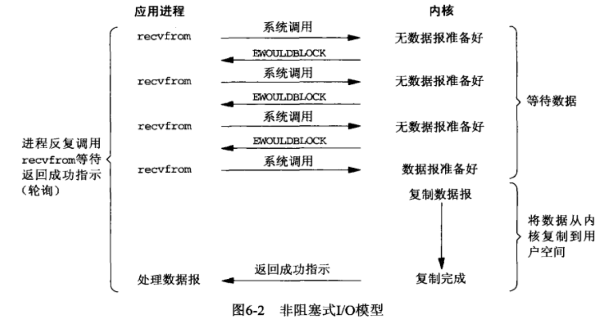
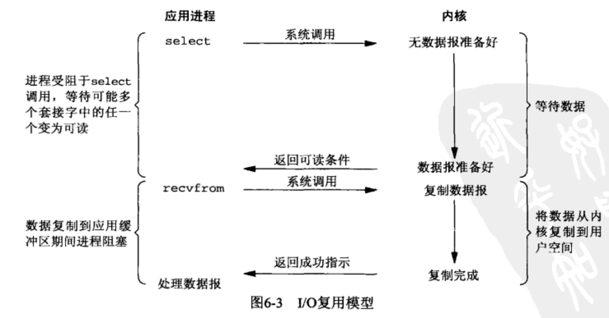
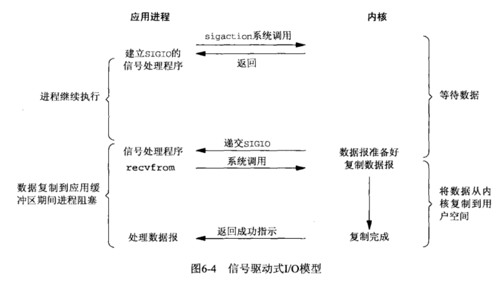
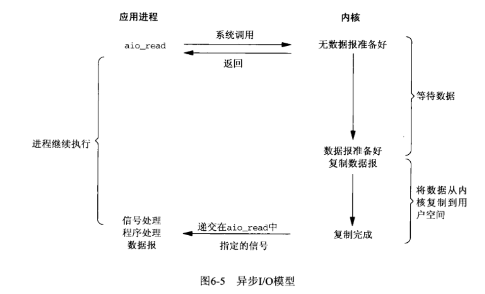

# UNIX网络编程 学习笔记
_参考链接：_

- [《Unix网络编程》卷1 初级](https://blog.csdn.net/zzxiaozhao/article/details/102637708)
- [《Unix网络编程》卷1 中级](https://blog.csdn.net/zzxiaozhao/article/details/102662861)

## I/O复用：select和poll函数

进程可能在监听socket时还可能存在I/O的相关操作，会造成socket处理程序的阻塞。因此进程需要一种预先告知内核的能力，使得内核一旦发现进程指定的一个或多个I/O条件就绪;就直接通知进程--I/O复用。其由select和poll两个函数支持。

I/O复用使用场景如下：
- 客户端处理互交式输入和网络socket时，必须使用I/O复用
- 一个客户端，同时处理多个套接字
- TCP服务器既要监听套接字，又要处理已连接套接字。
- 一个服务器，既处理TCP又处理UDP
- 一个服务器处理多个服务器或者多个协议。

### 6.2 I/O模型

UNIX下可用的5种I/O模型：

- 阻塞式I/O:socket默认情况下的模式，进程从用户调用到系统调用，再到读取数据，中间过程是阻塞的；只有完成之后，才会开始处理数据
- 非阻塞式I/O：高速内核在进行I/O请求时，不要将进程投入水米娜，而是返回一个错误--不进入自旋等待，而是直接返回。对于I/O频繁的类型不友好。

- I/O复用:使用select或者poll，阻塞在这两个系统调用中的某一个智商，而不是阻塞在真正的I/O系统调用上。关键在于不是等待一个的I/O而是多个的I/O;类似于多个线程中使用阻塞式I/O

- 信号驱动式I/O:内核在描述符就绪时，发送SIGIO信号通知我们

- 异步I/O:定义内核相关操作，操作完成之后，由内核通知我们。信号驱动模式是内核通知，何时启动一个I/O操作。异步I/O是由内核通知我们I/O操作(数据复制)何时完成。


#### 6.2.6 各种I/O模型的比较


注意：
- 同步I/O(synchronous I/O opetation),导致请求阻塞，直到I/O操作完成。
- 异步I/O(asynchronous I/O opetation),不导致请求进程阻塞

#### 6.2.7 关于I/O复用

I/O复用采用轮询的方式处理多个描述符，当有文件准备好时，就通知进程。关注点如下：

- I/O复用的应用场合
  - 当客户处理多个描述符时（通常是交互式输入和网络套接字），必须使用I/O复用，才能即使告知用户程序套接字的情况
  - 如果一个TCP服务器既要处理监听又要处理连接套接字，一般要用I/O复用
  - 如果既要处理TCP，又要处理UDP，一般要用I/O复用
  - 如果一个服务器要处理多个服务或多个协议如inet守护进程，一般要用I/O复用
- 采用I/O复用的客户端和服务器程序

### 6.3 select函数
_参考链接：_ [linux select函数详解](https://www.cnblogs.com/alantu2018/p/8612722.html)

select集合中的任何描述符准备好读写，他就开始工作。
```c
int select(int maxfdp1,fd_set *readset, fd_set *writeset, fd_set *exceptset, const struct timeval *timeout)
```
参数解释：
- `timeval`:告知内核等待指定描述符中的任何一个就绪需要花多少时间，即最低时间，该时间后必须有返回；
  - 永远等待就设置为空置指针，仅在有描述符准备好I/O时返回。
  - 等待一段固定的时间：在有一个描述符准备号I/O时返回，但是不超过由该参数所指向的timeval结构体中指定的秒数和微秒数。一旦查过又没有符合条件的就返回0。
  - 不等待:定时器设置为0，即为轮询(poll)；不等待，直接返回。加入描述符集的描述符都会被测试，并且返回满足要求的描述符的个数。这种方法通过轮询，无阻塞地获得了多个文件描述符状态。
- `readset`、`writeset`和`exceptset`指定我们要让内核测试读、写和异常条件的描述符。使用它们可以指定select的监听的描述符集合；**一定要初始化，否则将产生不可描述的问题**使用示例如下：
```c
fd_set rset;
/* 初始化所有位 */
FD_ZERO(&set);
/* 开启1的位 */
FD_SET(1,&rset);
/* 开启4的位 */
FD_SET(4,&rset);
/* 开启5的位 */
FD_SET(5,&rset);
```

计时器到时返回0，-1表示出错

#### 6.3.1 描述符就绪的条件

- 一个套接字准备好读的情况：
  - 接收缓冲区中字节数`>=`接收缓冲区**低水位标记**的当前大小（默认1，由`SO_RCVLOWAT`设置）
  - 读半部关闭(接收了`FIN`)将不阻塞并返回`0`
  - 监听套接字的已连接数不为`0`，这时`accept`通常不阻塞
  - 其上有一个套接字错误待处理，返回-1，`error`设置成具体的错误条件，可通过`SO_ERROR`套接字选项调用`getsockopt`获取并清除
- 一个套接字准备好写：
  - 以连接套接字或`UDP`套接字发送缓冲区中的可用字节数 `>=` 发送缓冲区低水位标记的当前大小(默认`2048`，可用`SO_SNDLOWAT`)
  - 写半部关闭的套接字，写操作将产生一个`SIGPIPE`信号
  - 非阻塞式`connect`的套接字已建立连接，或者`connect`以失败告终
  - 其上有一个套接字错误待处理，返回-1，`error`设置成具体的错误条件，可通过`SO_ERROR`套接字选项调用`getsockopt`获取并清除
  


混合使用stdio和select被认为是非常容易犯错误的：
- readline缓冲区中可能有不完整的输入行
- 也可能有一个或多个完整的输入行

#### 6.3.2 select的最大描述符
由FD_SETSIZE指定，一般为256，更改时，需要重新编译内核。
