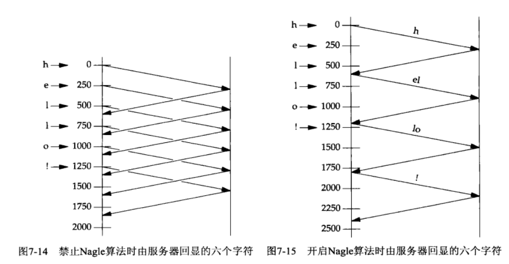
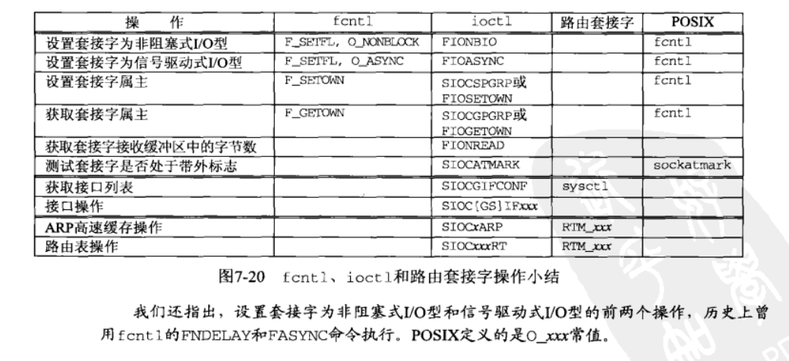
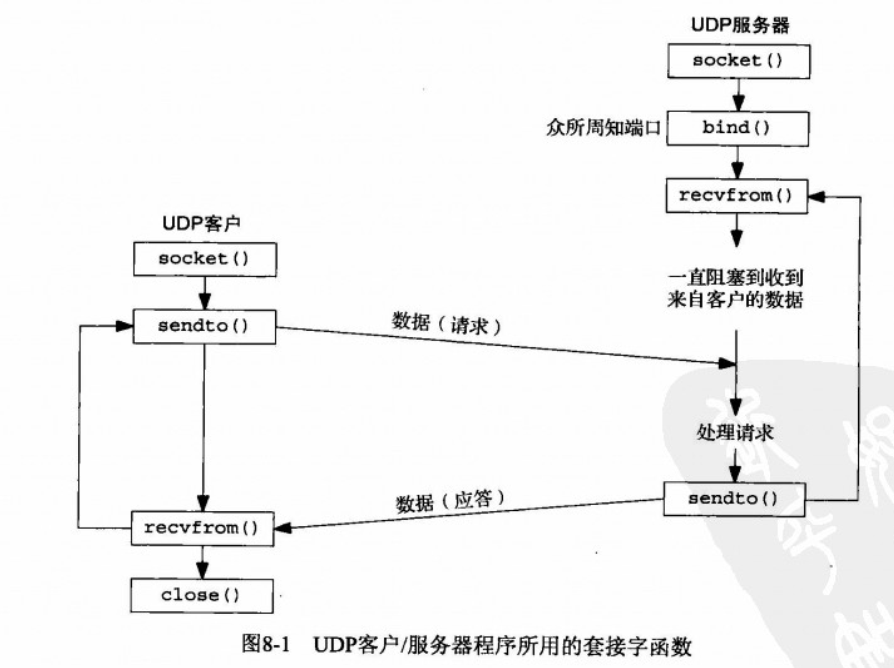
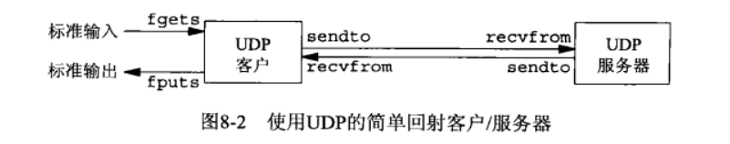
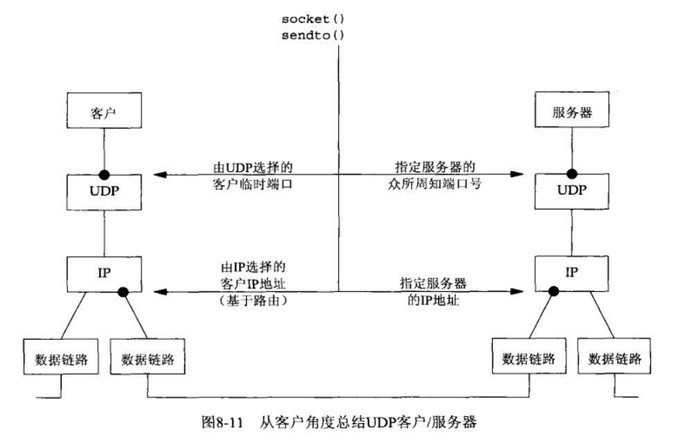
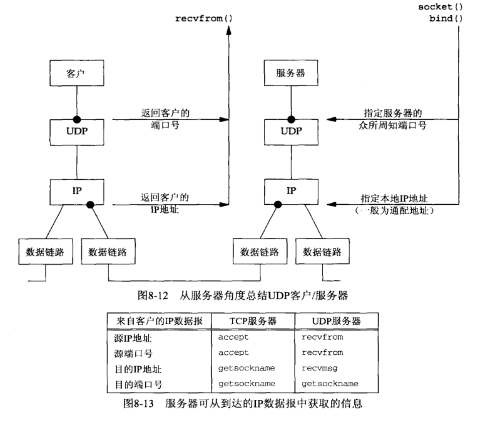
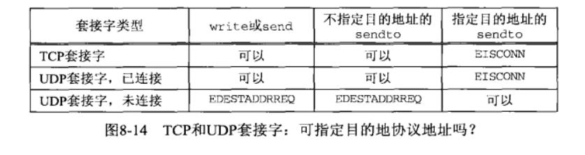
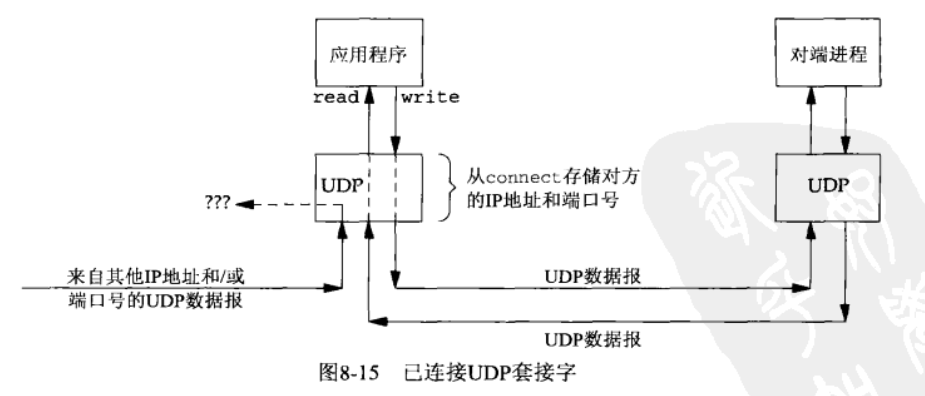

# UNIX网络编程 学习笔记
_参考链接：_

- [《Unix网络编程》卷1 初级](https://blog.csdn.net/zzxiaozhao/article/details/102637708)
- [《Unix网络编程》卷1 中级](https://blog.csdn.net/zzxiaozhao/article/details/102662861)

> 2019-11-26 22:10:53

## I/O复用：select和poll函数

进程可能在监听socket时还可能存在I/O的相关操作，会造成socket处理程序的阻塞。因此进程需要一种预先告知内核的能力，使得内核一旦发现进程指定的一个或多个I/O条件就绪;就直接通知进程--I/O复用。其由select和poll两个函数支持。

I/O复用使用场景如下：
- 客户端处理互交式输入和网络socket时，必须使用I/O复用
- 一个客户端，同时处理多个套接字
- TCP服务器既要监听套接字，又要处理已连接套接字。
- 一个服务器，既处理TCP又处理UDP
- 一个服务器处理多个服务器或者多个协议。

### 6.2 I/O模型

UNIX下可用的5种I/O模型：

- 阻塞式I/O:socket默认情况下的模式，进程从用户调用到系统调用，再到读取数据，中间过程是阻塞的；只有完成之后，才会开始处理数据
- 非阻塞式I/O：高速内核在进行I/O请求时，不要将进程投入水米娜，而是返回一个错误--不进入自旋等待，而是直接返回。对于I/O频繁的类型不友好。

- I/O复用:使用select或者poll，阻塞在这两个系统调用中的某一个智商，而不是阻塞在真正的I/O系统调用上。关键在于不是等待一个的I/O而是多个的I/O;类似于多个线程中使用阻塞式I/O

- 信号驱动式I/O:内核在描述符就绪时，发送SIGIO信号通知我们

- 异步I/O:定义内核相关操作，操作完成之后，由内核通知我们。信号驱动模式是内核通知，何时启动一个I/O操作。异步I/O是由内核通知我们I/O操作(数据复制)何时完成。


#### 6.2.6 各种I/O模型的比较


注意：
- 同步I/O(synchronous I/O opetation),导致请求阻塞，直到I/O操作完成。
- 异步I/O(asynchronous I/O opetation),不导致请求进程阻塞

#### 6.2.7 关于I/O复用

I/O复用采用轮询的方式处理多个描述符，当有文件准备好时，就通知进程。关注点如下：

- I/O复用的应用场合
  - 当客户处理多个描述符时（通常是交互式输入和网络套接字），必须使用I/O复用，才能即使告知用户程序套接字的情况
  - 如果一个TCP服务器既要处理监听又要处理连接套接字，一般要用I/O复用
  - 如果既要处理TCP，又要处理UDP，一般要用I/O复用
  - 如果一个服务器要处理多个服务或多个协议如inet守护进程，一般要用I/O复用
- 采用I/O复用的客户端和服务器程序

### 6.3 select函数
_参考链接：_ [linux select函数详解](https://www.cnblogs.com/alantu2018/p/8612722.html)

select集合中的任何描述符准备好读写，他就开始工作。
```c
int select(int maxfdp1,fd_set *readset, fd_set *writeset, fd_set *exceptset, const struct timeval *timeout)
```
参数解释：
- `timeval`:告知内核等待指定描述符中的任何一个就绪需要花多少时间，即最低时间，该时间后必须有返回；
  - 永远等待就设置为空置指针，仅在有描述符准备好I/O时返回。
  - 等待一段固定的时间：在有一个描述符准备号I/O时返回，但是不超过由该参数所指向的timeval结构体中指定的秒数和微秒数。一旦查过又没有符合条件的就返回0。
  - 不等待:定时器设置为0，即为轮询(poll)；不等待，直接返回。加入描述符集的描述符都会被测试，并且返回满足要求的描述符的个数。这种方法通过轮询，无阻塞地获得了多个文件描述符状态。
- `readset`、`writeset`和`exceptset`指定我们要让内核测试读、写和异常条件的描述符。使用它们可以指定select的监听的描述符集合；**一定要初始化，否则将产生不可描述的问题**使用示例如下：
```c
fd_set rset;
/* 初始化所有位--清空集合 */
FD_ZERO(&set);
/* 开启1的位--将1加入文件集合中 */
FD_SET(1,&rset);
/* 开启4的位 */
FD_SET(4,&rset);
/* 开启5的位 */
FD_SET(5,&rset);
/* 将1从集合中清除  */
FD_CLR(14,&rset);
```

计时器到时返回0，-1表示出错

#### 6.3.1 描述符就绪的条件

- 一个套接字准备好读的情况：
  - 接收缓冲区中字节数`>=`接收缓冲区**低水位标记**的当前大小（默认1，由`SO_RCVLOWAT`设置）
  - 读半部关闭(接收了`FIN`)将不阻塞并返回`0`
  - 监听套接字的已连接数不为`0`，这时`accept`通常不阻塞
  - 其上有一个套接字错误待处理，返回-1，`error`设置成具体的错误条件，可通过`SO_ERROR`套接字选项调用`getsockopt`获取并清除
- 一个套接字准备好写：
  - 以连接套接字或`UDP`套接字发送缓冲区中的可用字节数 `>=` 发送缓冲区低水位标记的当前大小(默认`2048`，可用`SO_SNDLOWAT`)
  - 写半部关闭的套接字，写操作将产生一个`SIGPIPE`信号
  - 非阻塞式`connect`的套接字已建立连接，或者`connect`以失败告终
  - 其上有一个套接字错误待处理，返回-1，`error`设置成具体的错误条件，可通过`SO_ERROR`套接字选项调用`getsockopt`获取并清除
  


混合使用stdio和select被认为是非常容易犯错误的：
- readline缓冲区中可能有不完整的输入行
- 也可能有一个或多个完整的输入行

#### 6.3.2 select的最大描述符
由FD_SETSIZE指定，一般为256，更改时，需要重新编译内核。


### 6.6 shutdown 函数

终止网络的常用方法是调用close函数，close函数的限制可以使用shutdown 来避免close的相关问题：
```c
#include <sys/socket.h>
int shutdown(int sockfd,int howto);
```

- `close()`把描述符的引用计数减1，`shutdown`直接激发TCP的正常连接序列的终止。
- shutdown告诉对方我已近完成了数据的发送(对方仍然可以发给我）;howto相关参数如下：
  - `SHUT_RD`：关闭连接的读这一半
    - 可以把第二个参数置为`SHUT_RD`防止回环复制
    - 关闭`SO_USELOOPBACK`套接字选项也能防止回环
  - `SHUT_WR`：关闭连接的写这一半，也叫半关闭
  - `SHUT_RDWR`：连接的读半部和写半部都关闭

### 6.8 TCP回射服务器程序

使用一个client数组，来记录对应的已经建立连接的客户端的编号。当客户端连接断开口，将其对应的文件描述符从集合中删除，然后将对应的客户端编号设置为-1。

改用了Read，Write，解决这一问题；并且改用了shutdown来关闭连接而不是用close。修复了批量输入的问题

```c
void str_cli(FILE * fp, int sockfd){
  int maxfdp1, stdineof, n;
  fd_set rset;
  char buf[MAXLINE];

  stdineof = 0;
  FD_ZERO(&rset);
  for( ; ; ){
    if(stdineof == 0){ // 是一个初始化为0, 的新标志,当标志位0时,打开标准输入检测
      FD_SET(fileno(fp), &rset);
    }
    /* 将当前的socket描述符，添加到rset中 */
    FD_SET(sockfd, &rset);
    maxfdp1 = max(fileno(fp), sockfd) + 1;
    //使用Select监听函数
    Select(maxfdp1, &rset, NULL, NULL, NULL);
    if(FD_ISSET(sockfd, &rset)){
      if((n = Read(sockfd, buf, MAXLINE)) == 0){
        if(stdineof == 1)
          return ;
        else
          err_quit("str_cli: server terminated prematurely");
      }
      Write(fileno(stdout), buf, n);
    }
    if(FD_ISSET(fileno(fp), &rset)){
      if((n = Read(fileno(fp), buf, MAXLINE)) == 0){ // 表示读入EOF标志符,文件已经空了
        stdineof = 1;// 关闭标准输入 
        Shutdown(sockfd, SHUT_WR);// 关闭socked 的读操作
        FD_CLR(fileno(fp), &rset); // 从检测位中删除 输入输入检测
        continue;
      }
      Writen(sockfd, buf, n);
    }
  }
}
```
下面是使用select的服务端程序

```c
#include "unp.h"
int main(int argc, char const *argv[]) {
    /* 定义对应的文件描述符 */
    int i, maxi, maxfd, listenfd, connfd, sockfd;
    /* 定义客户端连接集合 */
    int nready, client[FD_SETSIZE];
    ssize_t n;
    /* 定义连接客户端集合 */
    fd_set rset, allset;
    /* 定义缓冲区 */
    char buf[MAXLINE];
    /* 定义客户端关键字 */
    socklen_t clilen;
    /* 定义相关地址 */
    struct sockaddr_in cliaddr, servaddr;
    /* 开始进行监听 */
    listenfd = Socket(AF_INET, SOCK_STREAM, 0);
    /* 初始化服务器地址 */
    bzero(&servaddr, sizeof(servaddr));
    servaddr.sin_family = AF_INET;
    servaddr.sin_port = htons(SERV_PORT);
    servaddr.sin_addr.s_addr = htonl(INADDR_ANY);
    /* 连接监听socket和服务器地址 */
    Bind(listenfd, (SA *)&servaddr, sizeof(servaddr));
    /* 开始监听 */
    Listen(listenfd, LISTENQ);
    maxfd = listenfd;
    maxi = -1;
    /* 初始化client集合 */
    for (i = 0; i < FD_SETSIZE; i++){
        client[i] = -1;
    }
    /* 初始化监听集合 */
    FD_ZERO (&allset);
    /* 添加监听集合 */
    FD_SET(listenfd, &allset);
    for( ; ; ){
        rset = allset;
        /* 指向select */
        nready = Select(maxfd + 1, &rset, NULL, NULL, NULL);
        /* select监听函数 */
        if(FD_ISSET(listenfd, &rset)){
            clilen = sizeof(cliaddr);
            /* 获取连接描述符 */
            connfd = Accept(listenfd, (SA *)&cliaddr, &clilen);
            /* 将其加入队列中 */
            for(i = 0; i < FD_SETSIZE; i++){
                if(client[i] < 0){
                    client[i] = connfd;
                    break;
                }
            }
            /* 超过范围开始警告 */
            if(i == FD_SETSIZE)
                err_quit("too many clients");
            /* 将连接符，添加到监听集合中 */
            FD_SET(connfd, &allset);
            if(connfd > maxfd)
                maxfd= connfd;
            if(i > maxi)
                maxi = i;
            /* 没有准备好直接继续，不进行下面的链接检查和读写操作了 */
            if(--nready <= 0)
                continue;
        }
        /* 遍历所有连接 */
        for(i = 0; i <= maxi; i++){
            /* 获取保存的连接描述符 */
            if((sockfd = client[i]) < 0)
                continue;
            if(FD_ISSET(sockfd, &rset)){
                /* 如果没有读取到，将其清除 */
                if((n = Read(sockfd, buf, MAXLINE)) == 0){
                    Close(sockfd);
                    FD_CLR(sockfd, &allset);
                    client[i] = -1;
                }else{/* 否则写入内容 */
                    
                    Writen(sockfd, buf, n);
                }
                /* 状态错误，直接跳出 */
                if(--nready <= 0)
                break;
            }
        }
    }
}

```
相关的过程如下:


**拒绝服务攻击：** 当一个服务器在处理多个客户端时，对于单个客户端的函数调用，如果阻塞了，那么可能导致服务器被挂起，拒绝为所有其它客户提供服务。

解决办法：
- 使用非阻塞式I/O
- 让每个客户由单独的控制线程提供服务。
- 对I/O操作设置超时

### 6.9 pselect函数

由POSIX发明，如今许多Unix变种支持它

```c
#include <sys/select.h>
#include <signal.h>
#include <time.h>
int pselect(int maxfdp1,fd_set *readset,fd_set *writeset,fd_set *execptset,const struct timespec *timeout,const sigset_t *sigmask)
```

pselect函数使用timespec结构，时间划分更加细腻。使用了第六个参数，指向信号掩码的指针。该参数允许程序先禁止递交某些信号，再测试由这些当前被禁止信号的信号处理函数设置的全局变量。

###  6.10 poll函数

poll功能和select类似，但是能够提供额外的信息
```c
#include <poll.h>
int poll(struct pollfd *fdarray,unsigned long nfds,int timeout);
```
pollfd用于指定测试某个给定描述符的条件；关键结构如下：

```c
struct pollfd{
    int fd;/* 确认描述符 */
    short events /* 测试条件 */
    short revents /* 描述符的状态 */
}
```
events常量如下：


nfds指定结构数组中元素的个数，是由nfds参数指定的

### 6.11 TCP回射服务器程序

使用poll代替select来作为TCP的回射服务器。可以只需要一个pollfd结构的数组类维护客户心虚，不必再分配数组。传递给poll的pollfd的结构数组中的任何fd成员为负值的项都被poll忽略。下面是服务器的主要代码

```c++
#include "unp.h"
#include <limmits.h>

int main(int argc ,char **argv)
{
    int i,maxi,listenfd,connfd,sockfd;
    int nready;
    ssize_t n;
    char buf[MAXLINE];
    /* socket描述符 */
    socklen_t clilen;
    /* poll客户端描述符 */
    struct pollfd client[OPEN_MAX];
    /* 相关地址结构 */
    struct sockaddr_in cliaddr,servaddr;
    /* 创建socket */ 
    listenfd=Socket(AF_INET,SOCK_STREAM,0);
    /* 初始化地址结构体 */
    bzero(&servaddr,sizeof(servaddr));
    servaddr.sin_family=AF_INET;
    servaddr.sin_addr.s_addr=htonl(INADDR_ANY);
    servaddr.sin_port=htons(SERV_PORT);
    /* 初始化socket地址 */
    Bind(listenfd,(SA*)&servaddr,sizeof(servaddr));
    /* 监听被动化 */
    Listen(listenfd,LISTENQ);
    /* 初始化第一个结构体 */
    client[0].fd=listenfd;
    client[0].events=POLLRDNORM;
    /* 将数据初始化为-1 */
    for(i=1;i<OPEN_MAX;i++){
        client[i].fd=-1;
    }
    /* 设置栈顶指针 */
    maxi=0;
    /* 下面是poll的监听操作 */
    for(;;){
        nready=Poll(client,maxi+1,INFTIM);
        /* 创建新的客户端连接 */
        if(client[0].revents&POLLRDNORM){
            clilen=sizeof(cliaddr);
            /* accept连接 */
            connfd=Accept(listenfd,(SA *)&cliaddr,&clilen);
            /* 遍历剩下的连接集合 */
            for(i=1;i<OPEN_MAX;++i){
                if(client[i].fd<0){
                    /* 存储当前连接 */
                    client[i].fd=connfd;
                    break;
                }
            }
            /* 已经溢出 */
            if(i==OPEN_MAX)
                err_quit("too many clients");
            /* 设置监听条件 */
            client[i].events=POLLRDNORM;
            /* 检查越界 */
            if(i>max)
                maxi=i;
            /* 没有更多可读描述，直接继续 */
            if(--nready<=0)
                continue;  
        }
        /* 遍历整个队列进行处理 */
        for(i=1;i<maxi;++i){
            /* 查找当前网络连接符 */
            if((sockfd=client[i].fd)<0) continue;
            /* 检查描述符状态是否正确 */
            if(client[i].revents&(POLLRDNORM|POLLERR)){
                /* 数据处理和读入 */
                /* 如果连接直接断开了 */
                if((n=read(sockfd,buf,MAXLINE))<0){
                    if(errno==ECONNRESET){
                        /* 当前连接，被客户端重置 */
                        Close(sockfd);
                        client[i].fd=-1;
                    }else{
                        err_sys("read error");
                    }
                }else if(n==0){
                    /* 当前连接被客户端关闭 */
                    Close(sockfd);
                    client[i].fd=-1;
                }else{
                    Writen(sockfd,buf,n);
                }
                /* 没有更多的描述符 */
                if(--nready<=0) break;
            }
        }
    }
}
```
### 6.12 Linux中的epoll--高并发事件触发处理

_参考链接：_ 

- [linux 高并发事件触发处理 — epoll](https://blog.csdn.net/qq_19923217/article/details/81943705)
- [Linux 下 Epoll 源码深入解读](https://blog.csdn.net/liushengxi_root/article/details/87926566)

#### 6.12.1 select 和epoll的区别

1. 函数使用上：epoll 使用一组函数来完成任务，而不是单个函数
2. 效率：select 使用轮询来处理，随着监听 fd 数目的增加而降低效率。而 epoll 把用户关心的文件描述符事件放在内核里的一个事件表中，只需要一个额外的文件描述符来标识内核中的这个事件表即可。

epoll主要使用内核事件表，来实现I/O复用。

#### 6.12.2 相关API讲解

```c
#include <sys/epoll.h>
/* 创建epoll；需要一个额外的文件描述符来标识使用的内核事件表，返回内核事件表的作用描述符 */
int epoll_create(int size);
/* epoll的事件注册函数，用来操作内核事件表。它不同于select；需要先注册监听事件的类型 */
int epoll_ctl(int epfd,int top,int fd,struct epoll_event *event);
/* 等待事件发生，并将发生的事件从内核事件表fd中复制到第二个参数events指向的数组中 */
int epoll_wait(int epfd, struct epoll_event* events, int maxevents, int timeout);
```
epoll_ctl的参数含义如下：

- epfd： 要操作的内核事件表的文件描述符，即 epoll_create 的返回值
- op：指定操作类型，操作类型有三种：
    - EPOLL_CTL_ADD：往内核事件表中注册指定fd 相关的事件
    - EPOLL_CTL_MOD：修改指定 fd 上的注册事件
    - EPOLL_CTL_DEL：删除指定 fd 的注册事件
- fd：所要操作的文件描述符，也就是要内核事件表中监听的 fd
- event：指定所要监听的事件类型，epoll_event 结构指针类型。

struct epoll_even结构如下：
```c
typedef union epoll_data {
    void *ptr;
    int fd;
    __uint32_t u32;
    __uint64_t u64;
 } epoll_data_t;

 struct epoll_event {
    __uint32_t events; /* Epoll events */
    epoll_data_t data; /* User data variable */
};
```
其中 events 成员描述事件类型，可以是以下几种类型宏的集合：

|类型宏|成员描述事件|
|:---:|:---|
|`EPOLLIN`|表示对应的文件描述符可以读（包括对端SOCKET正常关闭）；|
|`EPOLLOUT`|表示对应的文件描述符可以写；|
|`EPOLLPRI`|表示对应的文件描述符有紧急的数据可读（这里应该表示有带外数据到来）；|
|`EPOLLERR`|表示对应的文件描述符发生错误；|
|`EPOLLHUP`|表示对应的文件描述符被挂断；|
|`EPOLLET`|将EPOLL设为边缘触发(Edge Triggered)模式，这是相对于水平触发(Level Triggered)来说的。|
|`EPOLLONESHOT`|只监听一次事件，当监听完这次事件之后，如果还需要继续监听这个socket的话，需要再次把这个socket加入到EPOLL队列里|

epoll_ctl 成功时返回 0，失败则返回 -1，并设置 errno

epoll_wait指定的相关参数如下:

- `epfd`:要操作的内核事件表的文件描述符，即epoll_create的返回值
- `events`:内核事件表中得到的检测事件集合
- `maxevents&timeout`:maxevents 告诉内核 events 的最大 size，timeout 指定超时时间

成功时返回就绪的文件描述符的个数，失败返回-1并设置errno

#### 6.12.3 epoll工作模式

- LT(level trigger)模式:电平触发(epoll默认工作模式)，网epoll_wait检测到描述事件发生并将此事件通知应用程序，应用程序可以不立即处理该事件。下次调用epoll_wait时，会再次响应应用程序并通知此事件。
- ET(edge trigger)模式:边缘触发,当epoll_wait检测到描述符事件发生并将此事件通知应用程序，应用程序必须立即处理此事。不处理，下一次调用epoll_wait时，不会再次响应应用程序并通知此事件。
- ET模式在很大程度上减少了epoll事件被重复触发的次数，因此效率要比LT模式高。epoll工作在ET模式的时候，必须使用**非阻塞套接口**，以避免由于一个文件句柄的阻塞读/阻塞写操作把处理多个文件描述符的任务饿死。

下面是一个简单的服务器和客户端的示例:

服务器端
```c++
#include <stdio.h>
#include <stdlib.h>
#include <string.h>
#include <errno.h>

#include <netinet/in.h>
#include <sys/socket.h>
#include <arpa/inet.h>
#include <sys/epoll.h>
#include <unistd.h>
#include <sys/types.h>

#define IPADDRESS   "127.0.0.1"
#define PORT        8787
#define MAXSIZE     1024
#define LISTENQ     5
#define FDSIZE      1000
#define EPOLLEVENTS 100

/* 函数声明 */

/*创建套接字并进行绑定*/
static int socket_bind(const char* ip,int port);
/* IO多路复用epoll */
static void do_epoll(int listenfd);
/* 事件处理函数 */
static void
handle_events(int epollfd,struct epoll_event *events,int num,int listenfd,char *buf);
/* 处理接收到的连接 */
static void handle_accpet(int epollfd,int listenfd);
/* 读处理 */
static void do_read(int epollfd,int fd,char *buf);
/* 写处理 */
static void do_write(int epollfd,int fd,char *buf);
//添加事件
static void add_event(int epollfd,int fd,int state);
//修改事件
static void modify_event(int epollfd,int fd,int state);
//删除事件
static void delete_event(int epollfd,int fd,int state);

int main(int argc,char *argv[])
{
    int  listenfd;
    /* 创建链接socket */
    listenfd = socket_bind(IPADDRESS,PORT);
    /* 开始监听 */
    listen(listenfd,LISTENQ);
    /* 执行epoll */
    do_epoll(listenfd);
    return 0;
}

static int socket_bind(const char* ip,int port)
{
    int  listenfd;
    struct sockaddr_in servaddr;
    /* 初始化socket，指定TCP协议 */
    listenfd = socket(AF_INET,SOCK_STREAM,0);
    if (listenfd == -1)
    {
        perror("socket error:");
        exit(1);
    }
    /* 初始化地址结构体 */
    bzero(&servaddr,sizeof(servaddr));
    servaddr.sin_family = AF_INET;
    inet_pton(AF_INET,ip,&servaddr.sin_addr);
    /* 初始化端口 */
    servaddr.sin_port = htons(port);
    /* 连接地址和协议 */
    if (bind(listenfd,(struct sockaddr*)&servaddr,sizeof(servaddr)) == -1)
    {
        perror("bind error: ");
        exit(1);
    }
    /* 返回描述符 */
    return listenfd;
}

static void do_epoll(int listenfd)
{
    /* epoll内核注册事件表 */
    int epollfd;
    /* 定义监听事件列表 */
    struct epoll_event events[EPOLLEVENTS];
    int ret;
    /* 读取缓冲区 */
    char buf[MAXSIZE];
    memset(buf,0,MAXSIZE);
    /* 创建一个描述符 */
    epollfd = epoll_create(FDSIZE);
    /* 添加监听描述符事件 */
    add_event(epollfd,listenfd,EPOLLIN);
    for ( ; ; )
    {
        /* 获取已经准备好的描述符事件 */
        ret = epoll_wait(epollfd,events,EPOLLEVENTS,-1);
        /* 处理对应事件 */
        handle_events(epollfd,events,ret,listenfd,buf);
    }
    /* 注意这里需要关闭epoll，否则文件描述符会被耗尽 */
    close(epollfd);
}

static void
handle_events(int epollfd,struct epoll_event *events,int num,int listenfd,char *buf)
{
    int i;
    int fd;
    /* 进行选好遍历 */
    for (i = 0;i < num;i++)
    {
        fd = events[i].data.fd;
        /* 根据描述符的类型和事件类型进行处理 */
        if ((fd == listenfd) &&(events[i].events & EPOLLIN))/* 如果是主监听socket */
            /* 处理事件;主要是将建立的连接，添加到队列中 */
            handle_accpet(epollfd,listenfd);
        else if (events[i].events & EPOLLIN)
            do_read(epollfd,fd,buf);
        else if (events[i].events & EPOLLOUT)
            do_write(epollfd,fd,buf);
    }
}
static void handle_accpet(int epollfd,int listenfd)
{
    int clifd;
    struct sockaddr_in cliaddr;
    socklen_t  cliaddrlen;
    /* 获取新的连接 */
    clifd = accept(listenfd,(struct sockaddr*)&cliaddr,&cliaddrlen);
    if (clifd == -1)
        perror("accpet error:");
    else
    {
        printf("accept a new client: %s:%d\n",inet_ntoa(cliaddr.sin_addr),cliaddr.sin_port);
        /* 添加一个客户描述符和事件 */
        add_event(epollfd,clifd,EPOLLIN);
    }
}

static void do_read(int epollfd,int fd,char *buf)
{
    int nread;
    nread = read(fd,buf,MAXSIZE);
    if (nread == -1)
    {
        perror("read error:");
        close(fd);
        delete_event(epollfd,fd,EPOLLIN);
    }
    else if (nread == 0)
    {
        fprintf(stderr,"client close.\n");
        close(fd);
        delete_event(epollfd,fd,EPOLLIN);
    }
    else
    {
        printf("read message is : %s",buf);
        /* 修改描述符对应的事件，由读改为写 */
        modify_event(epollfd,fd,EPOLLOUT);
    }
}
/* 执行写操作 */
static void do_write(int epollfd,int fd,char *buf)
{
    int nwrite;
    nwrite = write(fd,buf,strlen(buf));
    /* 写失败 */
    if (nwrite == -1)
    {
        perror("write error:");
        close(fd);
        delete_event(epollfd,fd,EPOLLOUT);
    }
    else
        modify_event(epollfd,fd,EPOLLIN);
    /* 重设缓冲区 */
    memset(buf,0,MAXSIZE);
}
/* 添加事件 */
static void add_event(int epollfd,int fd,int state)
{
    /* 创建事件 */
    struct epoll_event ev;
    ev.events = state;
    ev.data.fd = fd;
    /* 添加事件控制 */
    epoll_ctl(epollfd,EPOLL_CTL_ADD,fd,&ev);
}
/* 将事件删除 */
static void delete_event(int epollfd,int fd,int state)
{
    struct epoll_event ev;
    ev.events = state;
    ev.data.fd = fd;
    epoll_ctl(epollfd,EPOLL_CTL_DEL,fd,&ev);
}
/* 触发事件 */
static void modify_event(int epollfd,int fd,int state)
{
    struct epoll_event ev;
    ev.events = state;
    ev.data.fd = fd;
    epoll_ctl(epollfd,EPOLL_CTL_MOD,fd,&ev);
}

```

注意：

1. 执行epoll_create时，创建了红黑树和就绪list链表。
2. 执行epoll_ctl时，如果增加fd（socket），则检查在红黑树中是否存在，存在立即返回，不存在则添加到红黑树上，然后向内核注册回调函数，用于当中断事件来临时向准备就绪list链表中插入数据。
3. 执行epoll_wait时立刻返回准备就绪链表里的数据即可。

**相对select，epoll少了从内核态到用户态的fd描述符集合的拷贝**

## 第 7 章 套接字选项

getsockopt和setsockopt仅用于套接字

```c
#include <sys/socket.h>
int getsockopt(int sockfd, int level, int optname, void *optname, void *optval, socklen_t *optlen);
int setsockopt(int sockfd, int level, int optname, const void *optval, socklen_t optlen);
// 均返回：成功0，出错-1
```
#### 7.2 参数说明

- `sockfd`:一个打开的套接字描述符.
- `level`:(级别)指定系统中解释选项的代码或为通用套接字代码，或为特定于某个协议的代码(IPV4、IPV6、TCP、SCTP)
- `optval`:指向某个变量的指针
  - `setsockopt`通过它获取新值，
  - `getsockopt`把已获取的选项当前值存放到`*optval`
- `optlen`：`optval`的长度.
- **套接字选项粗分为两大基本类型:**
  - **标志选项**：启用或禁止某个特性的二元选项
    - `getsockopt`:`optval`为0表示禁止，否则表示启用
    - `setsockopt`:`optval`为0用来禁止
  - **值选项**：取得并返回我们可以设置或检查的特定值选项
    - 用户进程与系统之间传递所指数据类型的值


下面是opt可以设置的选项的名称：


传输层的选项汇总如下:


### 7.4 套接字状态

`accept`一直要到三次握手完成以后才返回给服务器已连接的套接字，想在三次握手完成时确保这些套接字选项中的某一个是给 **已连接套接字**设置的,必须先设置**监听套接字**。

### 7.5 通用套接字选项

- `SO_BROADCAST`:
  - 本选项开启或禁止进程发送广播(仅数据报套接字支持，且需在支持广播消息的网络上如以太网和令牌环网), 可以防止没有设置成广播时发送广播数据：如UDP发送一个的目的地址是一个广播地址，但是该选项没设置，就会返回EACCES错误
- `SO_DEBUG`
  - 仅由`TCP`支持，选项开启时内核将为`TCP`在该套接字**发送和接收**所有分组**保留详细信息**，可用`trpt`查看.
- `SO_DONTROUTE`
  - 规定外出分组将绕过底层协议的正常路由机制，用来绕过路由表，以**强制将分组从特定的接口发出**
- `SO_ERROR`（可获取不能设置）
  - 套接字发生错误时，将套接字的so_error变量设置为为Unix Exxx值中的一个，也叫待处理错误(pending error),可以用下面两种方式中的一种立即通知进程
    - 阻塞在`select`时，返回设置RW中一个或两个条件
    - 信号驱动IO模型：
      - 产生SIGIO信号通知进程或者进程组
        - 进程通过访问SO_ERROR获取so_error的值
      - `getsockopt()`返回的整个数值就是待处理错误,
      - 处理后由内核复位为0
    - 当进程调用read且没有数据返回时,如果so_error非0(本来该发生阻塞,但是发现有错误产生,则返回)返回-1,error设置为so_error的值，so_error设置为0。
    - 调用write时so_error非0，返回-1,error设置为so_error的值，so_error设置为0
- `SO_KEEPALIVE`
  - 设置保活选项后，2小时后(期间没有数据)TCP自动发送保活探测分节(keep-alive probe),会导致三种情况
    - 以期望`ACK`响应，进程得不到通知。
    - 响应`RST`,表对端已崩溃并重启，套接字的待处理错误设置为`ECONNRESET`
    - 没有任何响应，间隔75s再发8个探测分节，11m15s后放弃且带错李错误设置为ETIMEOUT.如果收到ICMP错误就返回相应错误。
  - **这是一个清理通向不可达客户的半开连接的好方法**
- `SO_LINGER`
  - 本选项指定close()函数对面向连接的协议如何操作，默认立即返回，如果有数据残留将尝试把这些数据发送给对端;主要是(TCP和SCTP，但不是UDP)

  - 要求传送给内核如下结构:
```c
struct linger {
    int l_onoff;    /*0=off,l_linger被忽略，>nonzero=on*/
    int l_linger;   /*linger time*/
}
```
  - `linger=0`:丢弃缓冲区的任何数据，发送给`RST`给对端。没有四分节终止序列，可避免`TCP`的`TIME_WAIT`状态
    - 可能引发错误:在`2MSL`内创建另一个化身，刚终止的连接上的旧的分节不被正确的传递到新的化身上。
  - `linger!=0`:套接字关闭时内核拖延一段时间；进程将睡眠到所有数据已发送并确认或延滞时间到。
  - 套接字是非阻塞类型的，延滞时间到之前数据没发送完返回`EWOULDBLOCK`错误。
  - `close()`成功返回只能说明，发送的数据和FIN已有对端确认，但不代表进程已经读取，所以改用`shutdown`号一点，当然也能应用级`ACK`
  - 
- `SO_OOBINLINE`
  - 带外数据将被留存在正常的输入队列中(即在线留存)，此时接收函数的`MSG_OOB`标志不能用来读取带外数据
- `SO_CVBUF`和`SO_SNDBUF`
  - 套接字接收缓冲区中可用空间大小限定了`TCP`通告对端窗口的大小
  - 注意顺序：窗口规模选项是在建立连接时用`SYN`分节得到的，所以客户需在connect`之前，serv`需在`listen`之前
  - 根据快恢复算法，缓冲区大小至少应是`MSS`值的四倍，最好是偶数倍
- `SO_RCVLOWAT`和`SO_SNDLOWAT`(低水位标记)
  - 接收低水位标记：`select`返回可读时接收缓冲区所需的数据量，`TCP/UDP`、`SCTP`默认为1
  - 发送缓冲区：`select()`返回可写时发送缓冲区所需的可用空间。`tcp`默认`2048`，`UDP`的发送缓冲区的可用字节数从不改变(不保留副本)
- `SO_RCVTIMEO`和`SO_SNDTIMEO`
  - 设置超时值，默认设置为0，即禁止超时
-` SO_REUSEADDR`和`SO_REUSEPORT`(重用地址端口)
  - 监听服务器终止，子进程继续处理连接，重启监听服务器时会出错，而开启了SO_REUSEADDR就不会。
  - `SO_REUSEADDR`允许同一个端口的多个服务器实例(只要不同的本地IP地址即可)，通配地址捆绑一般放到最后
  - `SO_REUSEADDR`**允许同一个端口捆绑同一个进程的不同套接字**
  - `SO_REUSEADDR`允许UDP完全重复捆绑(一般来说)，用于多播
- `SO_TYPE`
  - 本选项返回套接字类型，返回值是一个诸如`SOCK_STREAM`或`SOCK_DGRAM`之类的值，通常由启动时继承了套接字的进程使用
- `SO_USELOOPBACK`
  - 仅用于路由域(`AF_ROUTE`)套接字，默认打开。开启时，相应套接字将接收在其上发送的任何数据报的一个副本。

注意：
- 所有TCP服务器程序中，在调用bind之前设置`SO_REUSEADDR`套接字选项；
- 当编写一个可在同一时刻在同一主机上运行多次的多播应用程序时，设置`SO_REUSEADDR`套接字选项，并将所参加多播组的地址作为本地IP的地址捆绑。
- 当对已绑定统配地址端口，绑定不同的IP地址时，IP地址的数据将被传递到新的套接字，而不是传递到绑定了统配地址的已有套接字。对于保留端口一般不是问题(一般用户无法绑定)

### 7.6 IPv4套接字选项

- `IP_HDRINCL`
  - 如果是给原始IP套接字设置的，必须自己构造首部(一般情况下由，内核设置)，下列情况例外：
    - IP总是计算并存储IP首部校验和
    - 将IP标识字段设置为0，内核将设置该字段
    - 如果源IP地址是INADDR_ANY，IP将把它设置为外出接口的主机IP地址
    - 如何设置IP选项取决于实现。有些实现取出我们预先使用IP_OPTIONS套接字选项设置的任何IP选项，把它们添加到我们构造的首部中，而其它实现规则则要求我们亲自在首部指定任何期望的IP选项。
    - IP首部中有些字段必须以主机字节序填写，有些字段必须以网络字节序填写，具体取决于实现。使得套接字编程选项不便于移植。
- `IP_OPTIONS`
  - 允许在`IPv4`首部总设置`IP`选项
- `IP_RECVDSTADDR`
  - 开启导致所收到的UDP数据报的接收接口索引由`recvmsg`函数作为辅助函数返回
- `IP_RECVIF`
  - 开启导致所收到的UDP数据报的接收接口索引由`recvmsg`函数作为辅助函数返回
- `IP_TOS`
  - 本套接字选项允许我们为`TCP`、`UDP`、`SCTP`设置`IP`首部中的服务类型字段
- `IP_TTL` 
  - 用于设置或获取系统用在从某个给定套接字发送的单播分组上的默认`TTL`值

### 7.7 ICMPv6套接字选项

- `ICMP6_FILTER`套接字选项
  - 允许我们获取或设置一个icmp6_filter结构，该结构指出256个可能的ICMPv6消息类型中哪些将经由某个原始套接字传递给所在进程。

### 7.8 IPv6套接字选项

- `IPV6_CHECKSUM`:指定用户数据中校验和所处位置的字节偏移。该值为负，则内核执行如下操作：
  - 给所有外出分组计算并存储校验和
  - 验证外来分组的校验和，丢弃所有校验和和无效的分组
- `IPV6_DONTFRAG`
  - 禁止UDP套接字或者原始套接字自动插入分片首部，外出分组中大小超过发送接口MTU的那些分组将被丢弃。
- `IPV6_NEXTHOP`
  - 将外出数据报的下一跳地址，指定为一个套接字地址结构
- `IPV6_PATHMTU`
  - 不能设置，只能获取；获取本选项时，返回值为路由MTU发现功能确定的当前MTU
- `IPV6_RECVDSTOPTS`
  - 开启选项，任何接收到的IPv6目的地址选项都将由recvmsg作为辅助数据返回；默认关闭
- `IPV6_RECVHOPLIMT`
  - 任何接收到的跳限字段都将由recvmsg作为辅助数据返回；默认关闭
- `IPV6_RECVHOPOPTS`
  - 任何接收到的IPV6步跳选项都将由recvmsg作为辅助数据返回；默认关闭
- `IPV6_RECVPATHMTU`
  - 某条路径的路径MTU在发生变化时将由recvmsg作为辅助数据返回
- `IPV6_RECVPKTINFO`
  - 接收到的IPV6数据报的以下两条信息将由recvmsg作为辅助数据返回；目的IPV6地址和到达接口索引
- `IPV6_RECVRTHDR`
  - 任何接收到的IPV6路由首部将由recvmsg作为辅助数据分会；默认关闭
- `IPV6_RECVTCLASS`
  - 接收到的流通类(包含DSCP和ECN字段)将有recvmsg作为辅助数据返回。
- `IPV6_UNICAST_HOPS`
  - 类似于IPV4的IP_TTL套接字选项。设置本选项会给在相应套接字上发送的外出数据报指定默认跳限，获取本选项会返回内核用于相应套接字的跳限值。
- `IPV6_USE_MIN_MTU`
  - 设置为1，表示路径MTU发现功能不必执行，为避免分片，分组就使用IPV6的最小MTU发送。
  - 设置为0，路径MTU发现功能对于所有目的都得执行。
  - 设置为-1，路径MTU发现功能仅仅对单播目的地执行，对于多播目的地使用最小MTU;是默认值。
- `IPV6_V6ONLY`
  - 开启选项；将限制它只执行IPV6通信。本地选项默认为关闭，不过有些系统讯在默认开启本选项的手段。
- `IPV6_xxx`
  - 用于修改协议首部的IPV6选项假设；
    - UDP:由recvmsg和sendmsg作为辅助数据在内核和应用进程之间传递。
    - TCP：使用getsocketopt和setsocket获取和设置

### 7.9 TCP套接字选项

- `TCP_MAXSEG`
  - 获取和设置TCP连接的最大分节大小(MSS);返回值是TCP可以发送给对端的最大数据量；通常是由对端使用SYN分节通告的MSS
- `TCP_NODELAY`
  - 禁止TCP的Nagle算法(减少局域网上小分组(小于MSS的任何分组)的数目);默认情况下，该选项关闭


### 7.10 SCTP套接字选项

略

### 7.11 fcntl函数

执行各种描述符控制操作。



函数使用：`int fcntl(int fd, int cmd, .../* int arg */);`

每种描述符都有一组由F_GETFL命令获取或由F_SETFL命令设置的文件标志，影响套接字描述符的有两个：
  -  `O_NONBLOCK`(非阻塞式IO)
  -  `O_ASYNC`(信号驱动式IO)

正确设置非阻塞式IO的写法：
```c
int flag;
/* Set a socket as nonblocking */
if((flag=fcntl(fd, F_GETFL, 0)) < 0){    //必须要先获取其他文件标志
    err_sys("F_GETFL, error");
}
flag |=O_NONBLOCK;                       //或运算，打开非阻塞标志
if(fcntl(fd, F_SETFL, flags) <0 ){
    err_sys("F_SETFL error");
}
flag &=~O_NONBLOCK;                      //与运算，关闭非阻塞标志
if(fcntl(fd, F_SETFL, flags) <0 ){
    err_sys("F_SETFL error");
}
```
`F_SETOWN`的参数是正值则指出接收信号的进程ID，是负数则绝对值指出信号的组ID
`F_GETOWN`与上面类似
使用`socket()`函数创建的套接字没有属组。如果一个新的套接字是从一个监听套接字创建而来，属组将继承过来。

## 第 八 章 基本UDP套接字编程

UDP常见的应用程序：DNS(域名系统)；NFS(网络文件系统)和SNMP(简单网络管理协议)



UDP的关键函数

```c
/* 接收信息函数 */
ssize_t recvform(int sockfd,void *buff,size_t nbytes,int flag,struct sockaddr *from,socklen_t *addrlen);
/* 发送信息函数 */
ssize_t sendto(int sockfd,const void *buff,size_t nbytes,int flags,const struct sockaddr *to,socklen_t *addrlen);
```
参数解析：

- 前三个参数等同于read和write的三个参数：描述符，**指向读/写入缓冲区的指针**和**读/写字节数**
- `buff`：接收的内容；可以为0
- `flag`:设置相关参数
- `from`:指向一个由函数返回时，填写的数据报发送者的协议地址的套接字地址结构，返回字节在addrlen.
- `to`:指向一个套接字地址结构(内含数据包接收者协议地址：`IP`以及`Port`),长度由`addrlen`指定。
- 对于`UDP客户端`而言，是不需要指定端口的，在第一次调用`sendto`的时候，内核会给他指派一个临时端口，但是如果没有指定端口，又没有调用`sendto`将无法接收到消息。

`recvfrom`像是`accept`和`read`的结合;

### 8.3 UDP回射服务器程序：

主要流程如下：



`UDP`服务端是一个典型的迭代器模型，大多数TCP服务器是并发的。对于本套接字，`UDP`层中隐含有排队发送，每个`UDP`套接字都有一个接收缓冲区，实行FIFO机制。主要服务器端代码如下：

```c
#include "unp.h"
/* 声明输出函数 */
void dg_echo(int , SA *, socklen_t);

int main(int argc, char const *argv[]) {
    int sockfd;
    struct sockaddr_in servaddr, cliaddr;
    /* 指定协议和数据报类型，注意这里的协议选择 */
    sockfd = Socket(AF_INET, SOCK_DGRAM, 0); 
    bzero(&servaddr, sizeof(servaddr));
    servaddr.sin_family = AF_INET;
    servaddr.sin_port = htons(SERV_PORT);
    servaddr.sin_addr.s_addr = htonl(INADDR_ANY);
    /* 指定连接的源地址结构 */
    Bind(sockfd, (SA*)&servaddr, sizeof(servaddr));
    /* 处理相关网络编程 */
    dg_echo(sockfd, (SA*)&cliaddr, sizeof(cliaddr));
}

void dg_echo(int sockfd, SA * pcliaddr, socklen_t clilen){
    int n;
    socklen_t len;
    char msg[MAXLINE];
    for( ; ; ){
        len = clilen;
        /* 接收相关消息 */
        n = Recvfrom(sockfd, msg, MAXLINE, 0, pcliaddr, &len);
        /* 对消息进行回传 */
        Sendto(sockfd, msg, n, 0, pcliaddr, len);
    }
}
```

UDP回射客户端:

```c++
#include "unp.h"
/* 声明客户端回射函数 */
void dg_cli(FILE *, int, const SA *, socklen_t);

int main(int argc, char const *argv[]) {
  /* 使用提示 */
    if(argc != 2) err_quit("usage: ./udpcli01 <IPaddress>");

    int sockfd;
    struct sockaddr_in servaddr;
    bzero(&servaddr, sizeof(servaddr));
    servaddr.sin_family = AF_INET;
    servaddr.sin_port = htons(SERV_PORT);
    /* 获取目的IP地址 */
    Inet_pton(AF_INET, argv[1], &servaddr.sin_addr);
    sockfd = Socket(AF_INET, SOCK_DGRAM, 0); 
    /* 对于UDP客户端而言,是不需要保证端口的,在第一次调用sendto的时候,内核会给他指派一个临时宽口 */ 
    dg_cli(stdin, sockfd, (SA *)&servaddr, sizeof(servaddr));
}

void dg_cli(FILE * fp,int sockfd, const SA * servaddr, socklen_t servlen){
    char buf[MAXLINE];
    int n;
    socklen_t len = servlen;
    for( ; ; ){
        if(Fgets(buf, MAXLINE, fp) == NULL)
            return ;
        else
            Sendto(sockfd, buf, strlen(buf), 0, servaddr, servlen);
        /* 读取相关信息，注意，没有指定客户端地址，不会对客户端进行分辨*/
        if((n = Recvfrom(sockfd, buf, n, 0, NULL, NULL)) == 0){
            err_quit("connection close");
    }
    else if(n < 0)
        err_quit("Recvfrom error");
    buf[n] = 0;
    Fputs(buf, stdout);
}

```

注意：
- 因为UDP和TCP不同，是无连接的(没有TCP中的EOF)；服务器端，不会在connet(指定发送端口)之后建立稳定链路。因此需要客户端发送一个singal过去，让服务器进行接收。
- 一般来说TCP的服务器是并发的，UDP的服务器是迭代的。
- UDP层中隐含有排队发生。每个UDP套接字都有一个接收缓冲区，到达套接字的每个数据报都进入这个套接字接收缓冲区。进程调用recvfrom时，缓冲区中的下一个数据报以FIFO(先入先出)的顺序反给进程。
- UDP缓冲区大小有限，可以使用SO_RCVBUF来进行修改。
- UDP是非稳定连接，因此存在数据报永远无法到达的可能；程序容易陷入。因此最好指定响应时间。超时重传或者断开连接。14.2节讨论
- 验证接受响应的确认：
    -  重新`malloc`一个`sockaddr*`变量，子啊`Recvfrom`获得其值，比较该变量和原先发送的`servaddr`,相同就是需要的变量。
- 服务器程序未运行时：
    - 服务器主机响应`“port unreachable”`ICMP消息，但是此时的进程不能识别这个异步错误，它永远阻塞于`recvfrom`调用。
    - 我们需要用`connect`获取这个ICMP消息。

### 8.10 UDP 程序例子小节





### 8.11 UDP的connect函数

- 这里的`connect()`不同于`TCP`，**只检查是否存在立即可知的错误，记录对端IP地址和端口号，然后返回给进程**。连接后(使用connet后)主要发生三点变化：
    - 不指定目的地址，即不用sendto(或第六个参数为空指针),改用write()或send()；写到已连接的UDP上的任何内容都将自动发送到connect指定的协议地址。
    - 不必使用recvfrom()来获取数据报的发送者，而改用read(),recv(),recvmsg(),**这说明一个UDP套接字仅与一个IP地址作数据交换（可以是多播、广播地址）**
    - 异步错误将返回给进程；未连接UDP套接字不会接收任何异步错误。






**UDP客户进程或者服务器，只有在使用自己的UDP套接字与确定的唯一对端进行通信时，才能调用connect（通常是UDP客户端）；简而言之使用connect之后输出端基本就被确定下来，因此只适用于客户端**

- 给一个UDP套接字多次调用`connect()`，以**断开套接字**或**指定新的IP地址和端口号**(注意：对于TCP套接字connect只能调用一次)
- 最便于移植的方法是清零一个地址结构后把它的地址簇成员设置为`AF_UNSPEC`
- 如果要给同一个目的地址发送多个数据报，显式`connect()`好一点。

一个未连接的套接字上给两个数据报调用sendto函数涉及内核执行下列6个步奏：
1. 连接套接字
2. 输出第一个数据报
3. 断开套接字连接
4. 连接套接字
5. 输出第二个数据报
6. 断开套接字连接

当连接之后，效率会更高。调用connect后调用两次write涉及内核执行如下步骤：
1. 连接套接字
2. 输出第一个数据报
3. 输出第二个数据报

当调用两次sendto时，需复制两次。临时未连接的UDP套接字大于会消耗每个UDP**传输三分之一的开销**。如果要给同一个地址发送多个数据报，显式使用`connect()`好一点

当连接一个没有运行的udp服务器的程序时,连接不会出错，但是发送数据时会返回一个目的端口不可达的ICMP错误(connect造成TCP三次握手，其中第一个分节导致服务器TCP返送RST)，被内核映射成ECONNREFUSED,UnixWare内核不会返回这种错误(page200)；下面是改进过的dg_cli函数

```c
void dg_cli(FILE *fp, int sockfd, const SA *pservaddr, socklen_t servlen)
{
    int n;
    char sendline[MAXLINE], recvline[MAXLINE + 1];
    /* 显式的连接ip地址 */
    Connect(sockfd, (SA *) pservaddr, servlen);
    /* 进行回写操作 */
    while (Fgets(sendline, MAXLINE, fp) != NULL) {
        /* 使用read和write代替sento和recvfrom调用 */
        Write(sockfd, sendline, strlen(sendline));
        n = Read(sockfd, recvline, MAXLINE);
        /* null terminate */
        recvline[n] = 0;
        Fputs(recvline, stdout);
    }
}
```

### 8.13 UDP缺乏流量控制

UDP缺乏流量，控制，因此需要在客户端和服务器上进行流量的控制传输。

下面显示一个客户端的发送流量控制

```c
#include "unp.h"
#define NDG 2000 /* 发送数据包个数 */
#define DGLEN 1400 /* 每个数据包的长度 */
/* 定义处理函数 */
void dg_cli(FILE *fp,int sockfd,const SA *pservaddr,socklen_t servlen)
{
    int i;
    char sendline[DGLEN];
    /* 在这里发送多个数据包 */
    for(i=0;i<NDG;++i){
        Sendto(sockfd,sendline,DGLEN,0,pservaddr,servlen);
    }
}
```
服务器的接收流量控制
```c
#include "unp.h"
static void recvgrom_int(int);
static int count;
/* 相关输出函数 */
void dg_echo(int sockfd,SA *pcliaddr,socklen_t clien)
{
    socklen_t len;
    char mesg[MAXLINE];
    Signal(SIGINT,recvfrom_int);
    for(;;){
        len=clilen;
        Recvfrom(sockfd,mesg,MAXLINE,0,pcliaddr,&len);
        /* 统计接收数量 */
        count++;
    }
}
static void recvfrom_int(int signo)
{
    printf("\n received %d dataprams \n",count);
    exit(0);
}
```
UDP套接字的接收缓冲区一般FreeBSD下默认大小为42080字节，可以通过SO_RCVBF进行相关缓冲区大小的更改。

### 8.14 UDP中的外出接口的确定

connect()函数的一个副作用是可用来确定；特定目的地的外出接口(本地IP通过，从路由表搜索目的地址得到)

相关操作如下：

```c++
int main(int argc, char **argv){
	int					sockfd;
	socklen_t			len;
	struct sockaddr_in	cliaddr, servaddr;

	if (argc != 2)
		err_quit("usage: udpcli <IPaddress>");

	sockfd = Socket(AF_INET, SOCK_DGRAM, 0);

	bzero(&servaddr, sizeof(servaddr));
	servaddr.sin_family = AF_INET;
	servaddr.sin_port = htons(SERV_PORT);
	Inet_pton(AF_INET, argv[1], &servaddr.sin_addr);
    /* 进行连接操作 */
	Connect(sockfd, (SA *) &servaddr, sizeof(servaddr));

	len = sizeof(cliaddr);
	Getsockname(sockfd, (SA *) &cliaddr, &len);
	printf("local address %s\n", Sock_ntop((SA *) &cliaddr, len));

	exit(0);
}
```
调用connect并不给主机端发送任何消息，它完全是一个本地操作，只是保存对端的IP地址和端口号。

也可以使用这条性质实现UDP的epoll并发框架：

- [UDP下的epoll并发框架](https://blog.csdn.net/u010643777/article/details/72190891)
- [UDP的epoll并发处理问题](https://blog.csdn.net/weixin_34315189/article/details/92919826)

### 8.15 使用select函数的TCP和UDP回射服务器程序

关键代码如下：

```c++
#include	"unp.h"
int main(int argc, char **argv){
    /* 定义监听，连接 */
	int					listenfd, connfd, udpfd, nready, maxfdp1;
	/* 定义mesg数组 */
    char				mesg[MAXLINE];
	pid_t				childpid;
	fd_set				rset;
	ssize_t				n;
	/* 定义套接字长度 */
    socklen_t           len;
	const int           on = 1;
	struct sockaddr_in	cliaddr, servaddr;
	/* 定义子信号处理函数 */
    void                sig_chld(int);

	/* create listening TCP socket */
	listenfd = Socket(AF_INET, SOCK_STREAM, 0);

	bzero(&servaddr, sizeof(servaddr));
	servaddr.sin_family      = AF_INET;
	servaddr.sin_addr.s_addr = htonl(INADDR_ANY);
	servaddr.sin_port        = htons(SERV_PORT);
    /* 设置socket相关参数，防止该端口上已有连接存在*/
	Setsockopt(listenfd, SOL_SOCKET, SO_REUSEADDR, &on, sizeof(on));
	/* 连接socket和端口 */
    Bind(listenfd, (SA *) &servaddr, sizeof(servaddr));
    /* 开始监听，转为被动 */
	Listen(listenfd, LISTENQ);

	/* create UDP socket */
	/* 创建UDP scoket */
    udpfd = Socket(AF_INET, SOCK_DGRAM, 0);

	bzero(&servaddr, sizeof(servaddr));
	servaddr.sin_family      = AF_INET;
	servaddr.sin_addr.s_addr = htonl(INADDR_ANY);
	servaddr.sin_port        = htons(SERV_PORT);

	Bind(udpfd, (SA *) &servaddr, sizeof(servaddr));
	/* end udpservselect01 */
	/* include udpservselect02 */
	/* 设置信号处理函数， */
    Signal(SIGCHLD, sig_chld);	/* must call waitpid(), 因为TCP连接由子进程处理  */

	FD_ZERO(&rset);
	maxfdp1 = max(listenfd, udpfd) + 1;
	for ( ; ; ) {
		FD_SET(listenfd, &rset);
		FD_SET(udpfd, &rset);
        /* 监听网络监听；主要是使用TCP */
		if ( (nready = select(maxfdp1, &rset, NULL, NULL, NULL)) < 0) {
			if (errno == EINTR)
				continue;		/* back to for() */
			else
                err_sys("select error");
        }

		if (FD_ISSET(listenfd, &rset)) {
			len = sizeof(cliaddr);
            /* 接收访问数据 */
			connfd = Accept(listenfd, (SA *) &cliaddr, &len);
	
			if ( (childpid = Fork()) == 0) {	/* child process */
				Close(listenfd);	/* close listening socket */
				str_echo(connfd);	/* process the request */
				exit(0);
			}
			Close(connfd);			/* parent closes connected socket */
		}
        /* 如果一个UDP套接字可读，那么已有一个数据报到达。使用recvfrom进行读取 */
		if (FD_ISSET(udpfd, &rset)) {
			len = sizeof(cliaddr);
			n = Recvfrom(udpfd, mesg, MAXLINE, 0, (SA *) &cliaddr, &len);
			Sendto(udpfd, mesg, n, 0, (SA *) &cliaddr, len);
		}
	}
}
/* end udpservselect02 */

```

## 第 9 章 基本SCTP套接字编程

略

## 第 10 章 SCTP客户/服务器程序例子

略

### 第 11 章 名字与地址转换(DNS)

域名系统(Domain Name System, DNS):主要用于主机名字和IP地址之间的映射