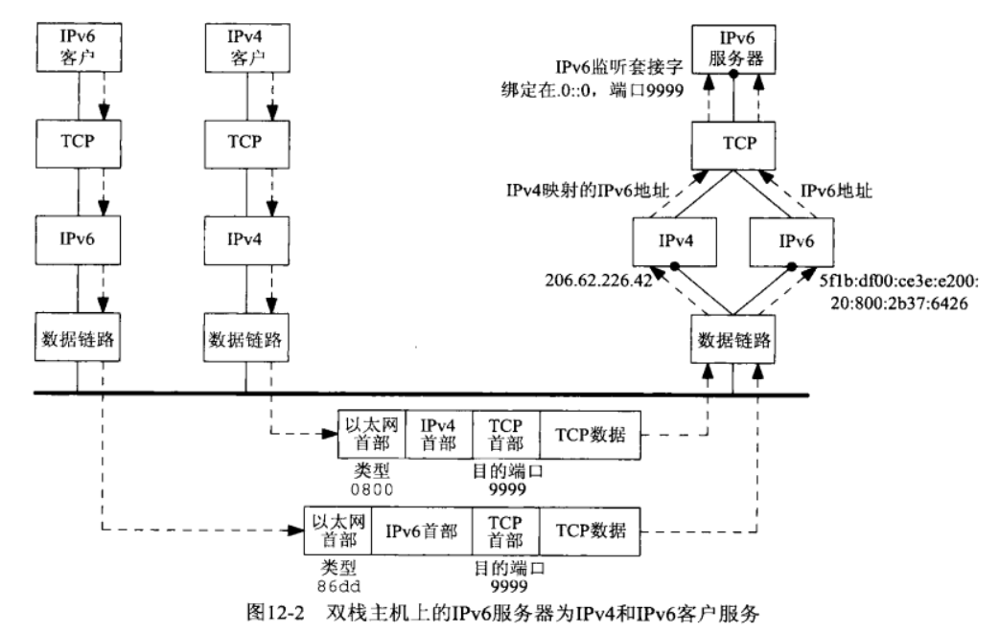
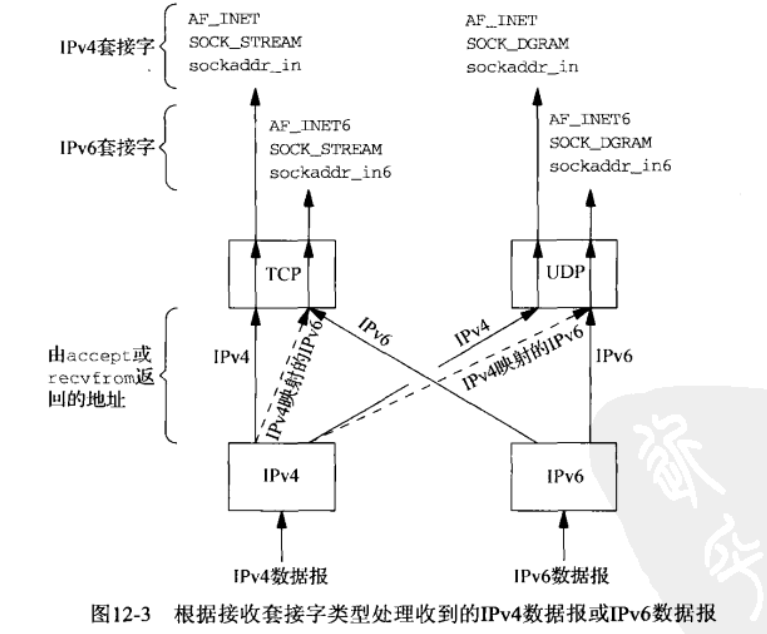
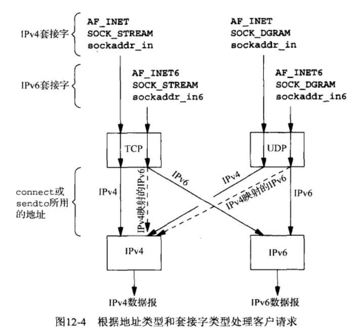
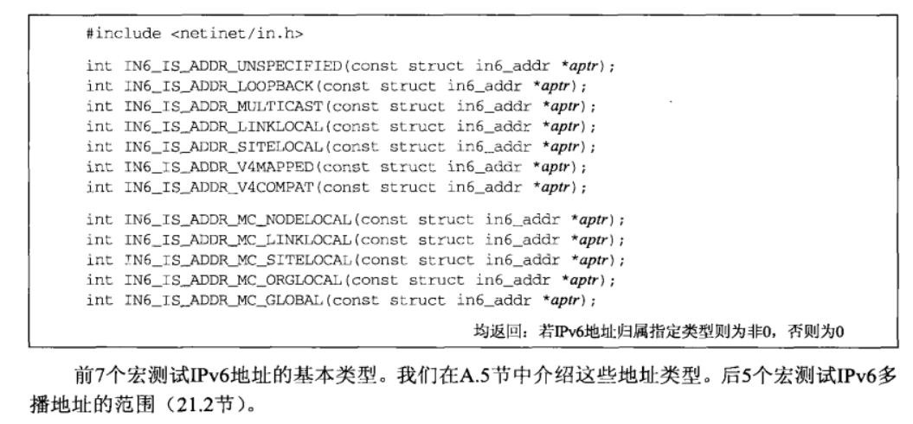

# UNIX网络编程 学习笔记
_参考链接：_

- [《Unix网络编程》卷1 初级](https://blog.csdn.net/zzxiaozhao/article/details/102637708)
- [《Unix网络编程》卷1 中级](https://blog.csdn.net/zzxiaozhao/article/details/102662861)
- [《Unix网络编程》卷1 高级](https://blog.csdn.net/zzxiaozhao/article/details/102771985)
- [《UNIX网络编程卷一》读书笔记](https://zevvez.github.io/2017/12/13/unp/#%E7%AC%AC%E4%B8%80%E7%AB%A0-%E7%AE%80%E4%BB%8B)

> 2019-12-01 21:10:53

## 第 12 章 IPv4和IPv6的互操作性

### 12.2 IPv4客户与IPv6服务器

双栈主机的IPv6服务器既能处理IPv4客户，又能处理IPv6客户。通过使用IPv4映射的IPv6地址实现的。主要服务器流程图如下：

注意：**IPv6地址不能直接转IPv4地址**

一个IPv4客户端和IPv6服务端通信步骤如下：
1. `IPv6`服务器启动后创建一个IPv6监听套接字
2. IPv4客户调用getsockname找到服务器地A记录。服务器既有A也有AAAA记录，因为它是双栈的。
3. **客户调**用`connect`，发送一个IPv4的SYN给服务器.
4. **服务器**收到这个SYN，把它标志为IPv4映射为IPv6，响应一个IPv4 SYN/ACK。连接建立后， 由accept返回给服务器的地址就是这个IPv4映射的IPv6地址.
5. 当**服务器向这个客户端发送数据**时，会使用客户端的IPv4地址，所以通信使用的全部都是IPv4连接
6. 如果服务器不检查这个地址是IPv6还是IPv4映射过来，它永远不会知道客户端的 IP 类型，客户端也不需要知道服务器的类型

大多数双栈主机遵循以下规则：
1. IPv4 监听套接字只能接受来自IPv4 客户的外来连接
2. 如果服务器有一个绑定了IPv6 的监听套接字，该套接字**没设置**IPV6_V6ONLY套接字选项，它**可以接收**IPv4连接.
3. 如果服务器有一个 IPv6监听套接字，绑定了通配地址，该套接字**设置了**IPV6_V6ONLY 套接字选项，它**只能接收**IPv6连接。

IPv6 UDP服务器的情况与之类似, 差别在于数据报的地址格式有所不同.例如IPv6服务器收到来自某个IPv4客户的数据报,recvfrom返回的地址将是该客户端的IPv6地址(由于IPv4映射而来)

### 12.3 IPv6客户与IPv4服务器

客户机运行在双栈主机上并使用**IPv6套接字描述符**；具体过程如下：

- 一个IPv4服务器在只支持IPv4的主机上启动一个IPv4监听套接字
- IPv6 客户启动后调用getaddrinfo单纯查找IPv6的地址，因为服务器只支持IPv4，所以返回给客户端的是一个IPv4映射的IPv6地址。
- IPv6 客户在作为函数参数的 IPv6 套接字地址结构中设置这个 IPv4 映射的 IPv6 地址然后调用 connect。内核检测到这个映射地址后自动发送一个`IPv4 SYN`到服务器。
- 服务器响应一个`IPv4 SYN/ACK`，连接于是通过使用IPv4数据报建立。

### 12.2-12.3 互操作性总结
IPv4客户端与IPv6服务器(双栈)：
- `套接字`接受`数据报`分析:
  - 对于`IPv4套接字`它只能接受`IPv4数据报`(`IPv6地址`不能映射为`IPv4地址`)
  - 对于`IPv6套接字(带双栈)`它可以接受`IPv4数据报`和`IPv6数据报`(`IPv4地址`可以被唯一映射为`IPv6地址`)
- 具体分析: 如果目的地为`IPv6套接字`的`IPv4数据报`,那么内核(`目的地内核`)把该数据包的`源IPv4地址`映射为`IPv6地址`作为`accept(TCP)`或`recvfrom(UDP)`返回的对端IP地址。

IPv4服务器与IPv6客户端(双栈)：
- 套接字发送数据报分析:
  - IPv4数据报可以接受IPv4套接字和IPv6套接字的数据发送(IPv6套接字的目的地为由IPv4地址映射的IPv6地址是内核将其转变为IPv4数据报)
  - **IPv6数据报**只能接受I**Pv6套接字**的数据发送

- `IPv4套接字`不能发送一个`IPv6数据报`,因为不可能往`IPv4套接字`上设置`IPv6地址`,毕竟`IPv4套接字`接受的`sockaddr_in`的`in_addr`成员只有`4字节`的长度。
- 当IPv6套接字发送数据时,**内核检测到目的IP地址为由IPv4地址映射的IPv6地址**,所以此地址转换为IPv4地址发送IPv4数据报。

IPv4和IPv6的互相操作性总结：

### 12.4 IPv6地址测试宏

有一些 IPv6 应用必须知道和它通信的是 IPv6 还是 IPv4 协议，使用 <netinet/in.h> 中的函数可以进行测试：

`int IN6_IS_ADDR_V4MAPPED(const struct in6_addr *aptr)`宏测试IPv6地址是否由IPv4映射而来。

还有其它的地址来源测试如下：

### 12.5 源代码可移植性

考虑到源码的可移植性，编写代码时应尽量避免 `gethostbyname`, `gethostbyaddr`等套接字函数，使用 `getaddrinfo`, `getnameinfo`等函数，使得代码变得与协议无关。

### 12.6 小节

双栈主机的IPv6 服务器可以和两种客户端进行通讯, 对于IPv4客户端使用IPv4数据报进行通信
双栈主机的IPv6 客户端也可以和两种服务器进行通讯, 对于IPv4服务器使用IPv4数据报进行通信
单栈主机，只能接受一种通信方式。

## 第 13 章 守护进程和inetd超级服务器

