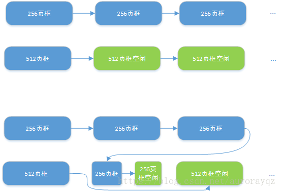
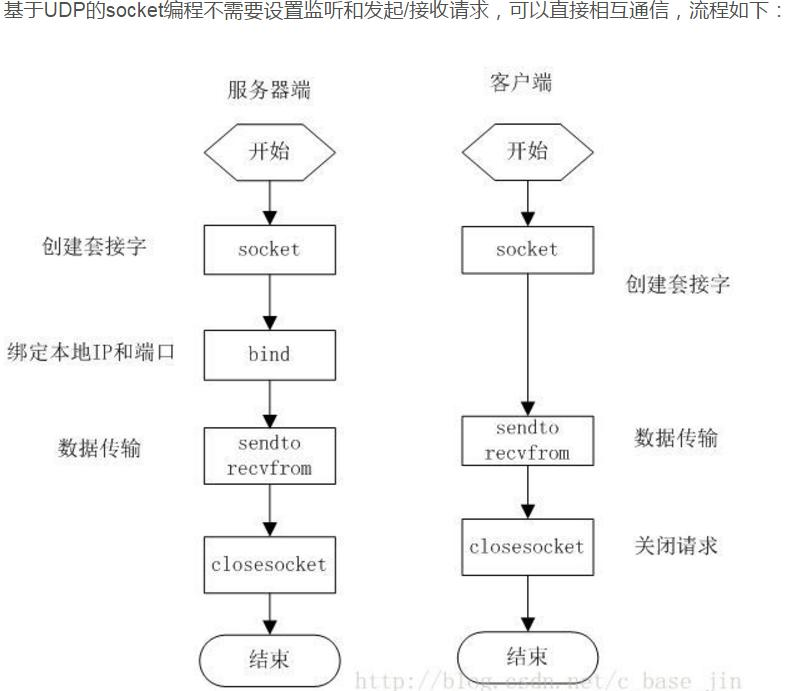
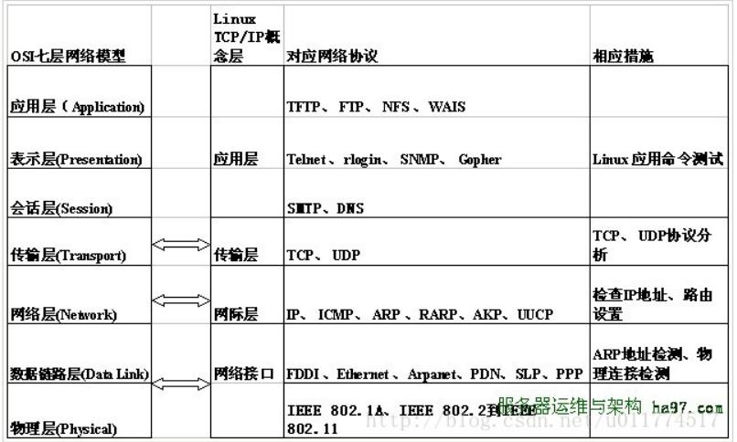

# 1. C++ 基础

## 1.1 说一下static关键字的作用

1. 全局静态变量
	- 在全局变量前加上关键字static，全局变量就定义成一个全局静态变量.
	- 内存中的位置：静态存储区，在整个程序运行期间一直存在。
	- 初始化：未经初始化的全局静态变量会被自动初始化为0（对于自动对象,如果没有显示初始化,会调用零参数构造函数,如不存在则编译失败);
	- 作用域：**全局静态变量在声明他的文件之外是不可见的，准确地说是从定义之处开始，到文件结尾。**
2. 局部静态变量
	- 在局部变量之前加上关键字`static`，局部变量就成为一个局部静态变量。
	- 内存中的位置：静态存储区
	- 初始化：未经初始化的全局静态变量会被自动初始化为`0`(对于自动对象,如果没有显示初始化,会调用零参数构造函数,如不存在则编译失败)；
	- 作用域：作用域仍为局部作用域，
		- 当定义它的函数或者语句块结束的时候，作用域结束。
		- 但是当局部静态变量离开作用域后，并没有销毁，而是仍然驻留在内存当中，只不过我们不能再对它进行访问，直到该函数再次被调用，并且值不变；

	---
	- `C语言`中局部静态变量不能使用变量进行初始化的, 因为它在编译期间就被编译器初始化了.
	- `C++`因为引入了对象,必须调用构造函数,所以编译器把对局部静态变量的初始化推迟至第一次调用之前,也就是可以使用变量进行初始化.

	---

3. 静态函数
	- 在函数返回类型前加static，函数就定义为静态函数。**函数的定义和声明在默认情况下都是extern的**，但**静态函数只是在声明他的文件当中可见，不能被其他文件所用**。
	- 函数的实现使用static修饰，**那么这个函数只可在本cpp内使用，不会同其他cpp中的同名函数引起冲突；**
	- warning：不要再头文件中声明static的全局函数，不要在cpp内声明非static的全局函数，如果你要在多个cpp中复用该函数，就把它的声明提到头文件里去，否则cpp内部声明需加上static修饰；

4.  类的静态成员
	- 在类中，静态成员可以实现多个对象之间的数据共享，并且使用静态数据成员还不会破坏隐藏的原则，即保证了安全性。
	- 因此，**静态成员是类的所有对象中共享的成员，而不是某个对象的成员**。对多个对象来说，静态数据成员只存储一处，供所有对象共用

5. 类的静态函数
	- **静态成员函数和静态数据成员一样，它们都属于类的静态成员，它们都不是对象成员**。因此，对静态成员的引用不需要用对象名。
	- **在静态成员函数的实现中不能直接引用类中说明的非静态成员，可以引用类中说明的静态成员（这点非常重要）**。*如果静态成员函数中要引用非静态成员时，可通过对象来引用。从中可看出，调用静态成员函数使用如下格式：<类名>::<静态成员函数名>(<参数表>);*
	- 不能被virtual修饰,静态成员函数没有this 指针，虚函数的实现是为每一个对象分配一个vptr 指针，而vptr 是通过this 指针调用的，所以不能为virtual；虚函数的调用关系，this->vptr->ctable->virtual function

## 1.2 `C++`和`c`的区别

- 设计思想上：
	- `C++`是面向对象(封装, 继承, 多态)的语言，而C是面向过程的结构化编程语言
	- C中的函数编译时不会保留形参列表, 也不能重载; 而C++中的函数在编译时会保留形参列表, 有重载
- 语法上：
	- `C++`具有`封装`、`继承`和`多态`三种特性
	- `C++`相比`C`，增加许多类型安全的功能，比如强制类型转换、
	- `C++`支持范式编程，比如模板类、函数模板等
- 具体的:
	- 动态管理内存的方法不一样: `malloc/free` 和 `new/delete`
	- struct
		- C中: struct是自定义数据类型; 是变量的集合, 不能添加拥有成员函数; 没有访问权限控制的概念; 结构体名称不能作为参数类型使用, 必须在其前加上struct才能作为参数类型
		- C++中: struct是抽象数据类型, 是一个特殊的类, 可以有成员函数, 默认访问权限和继承权限都是public, 结构体名可以作为参数类型使用
	- C语言没有引用的概念, 更没有左值引用, 右值引用
	- C语言不允许只读数据(const修饰)用作下标定义数组, C++允许
	- C语言的局部静态变量初始化发生于编译时，所以在函数中不能使用变量对局部静态变量进行初始化， 而C++因为增加了对象的概念，而对象需要调用构造函数进行初始化，所以编译器将局部静态变量的初始化推迟至该变量使用之前，也就是说可以使用变量来初始化局部静态变量。

---
- 参考: [2019-11-26-面经汇总-C++基础再探-c和c++的区别](https://zhaostu4.github.io/2019/11/28/%E9%9D%A2%E7%BB%8F%E6%B1%87%E6%80%BB-C++%E5%9F%BA%E7%A1%80%E5%86%8D%E6%8E%A2/#59%E8%AF%B4%E8%AF%B4%E4%BD%A0%E5%AF%B9c-%E5%92%8Cc%E7%9A%84%E7%9C%8B%E6%B3%95c-%E5%92%8Cc%E7%9A%84%E5%8C%BA%E5%88%AB)

---
## 1.3 `c++`中四种`cast`转换

> `C++`中四种类型转换是：`static_cast`, `dynamic_cast`, `const_cast`, `reinterpret_cast`

- `const_cast`: 
	- 用来移除`const`或`volatile` 属性。但需要特别注意的是`const_cast`不是用于去除变量的常量性，而是去除**指向常数对象的指针或引用**的常量性，其去除常量性的对象必须为**指针或引用**。
	- 如果对一个指向常量的指针,通过`const_cast`移除`const`属性, 然后进行修改, 编译通过,但是运行时会报段错误
- `static_cast`: 静态类型转换(不能移除`const/volatile`属性)是最常看到的类型转换, 几个功能. 
	- **内置类型之间的转换**, 精度耗损需要有程序员把握
	- **继承体系中的上下行转换**(上行:子类转父类,安全转换; 下行:父类转子类, 不安全转换)
	- **指针类型转换**: `空指针转换成目标类型的空指针`, `把任何类型转换成void 类型`。
- `dynamic_cast`: 主要用在继承体系中的安全向下转型
	- 它能安全地将指向基类的`指针/引用`转型为指向子类的`指针/引用`, 转型失败会返回`null`(转型对象为指针时)或抛出异常`bad_cast`(转型对象为引用时)。
	- `dynamic_cast` 会利用运行时的信息`(RTTI)`来进行动态类型检查，因此dynamic_cast 存在一定的效率损失。
	- 而且`dynamic_cast`进行动态类型检查时, 利用了虚表中的信息, 所以只能用于函数虚函数的类对象中. 
- `reinterpret_cast` 强制类型转换,**非常不安全**
	- 它可以把一个指针转换成一个整数，也可以把一个整数转换成一个指针(先把一个指针转换成一个整数，在把该整数转换成原类型的指针，还可以得到原先的指针值)。

***
- 参考: 
	- [C++开发必看 四种强制类型转换的总结](https://www.cnblogs.com/lidabo/p/3651049.html)
	- [C++系列总结——volatile关键字](https://www.cnblogs.com/yizui/archive/2019/03/30/10628020.html)
	
	- [2019-11-26-面经汇总-C++基础再探-C++类型转换有四种](https://zhaostu4.github.io/2019/11/28/%E9%9D%A2%E7%BB%8F%E6%B1%87%E6%80%BB-C++%E5%9F%BA%E7%A1%80%E5%86%8D%E6%8E%A2/#93c%E7%B1%BB%E5%9E%8B%E8%BD%AC%E6%8D%A2%E6%9C%89%E5%9B%9B%E7%A7%8D)

***

## 1.4 C/C++ 中指针和引用的区别
- 初始化:
	- 引用在定义的时候必须进行初始化，并且不能够改变
	- 指针在定义的时候不一定要初始化，并且指向的空间可变

- 访问逻辑不同:
	- 通过指针访问对象, 用户需要使用间接访问
	- 通过引用访问对象, 用户只需使用直接访问, 编译器负责将其处理为间接访问

- 运算结果不同:
	- 自增运算结果不同
	- `sizeof`运算的结果不同
	- 下标运算: 
		- 指针通过下标运算结果是指针所指值为基地址加上偏移, 且基地址可变.
		- 引用通过下标运算结果是引用的是数组才能有这个操作.
	- 函数参数:
		- 传指针的实质是传值，传递的值是指针内储存的变量地址；
		- 传引用的实质是传地址，传递的是变量的地址。
	- 多级: 有多级指针，但是没有多级引用，只能有一级引用。

***
- 参考: 
	- [C++ 引用占用内存？ - toyijiu的专栏 - CSDN博客](https://blog.csdn.net/toyijiu/article/details/99729949)
	- [浅谈返回函数内部new分配的内存的引用_C 语言_脚本之家](https://www.jb51.net/article/100823.htm)
	- [2019-11-26-面经汇总-C++基础再探-1、引用和指针的区别？](https://zhaostu4.github.io/2019/11/28/%E9%9D%A2%E7%BB%8F%E6%B1%87%E6%80%BB-C++%E5%9F%BA%E7%A1%80%E5%86%8D%E6%8E%A2/#1%E5%BC%95%E7%94%A8%E5%92%8C%E6%8C%87%E9%92%88%E7%9A%84%E5%8C%BA%E5%88%AB)

***

## 1.5 C++中的四个智能指针

- 为什么要使用智慧指针
	- 智慧指针的作用是管理指针,因为在堆上申请的内存空间,是需要手动释放的,如果未释放就会造成内存泄漏,而智慧指针的使用可以很大程度的避免这个问题. 
	- 因为使用智慧指针管理内存的本质是: 栈对象管理堆内存, 而栈对象是超出作用域或者程序意外终止,都会自动调用析构函数,而智慧指针的析构函数会自动释放资源,从而避免内存泄漏. 
	- `RAII`:资源获取就是初始化
- `auto_ptr`: 采用所有权模式, 但是其允许所有权剥离,所以有内存崩溃的风险, 在`c++11`中已经放弃了。
- `unique_ptr`:采用独占式拥有,保证同一时间只有一个智慧指针可以指向该对象. `unique_ptr`不允许所有权剥离,除非本身是临时变量或者使用move指令. 
- `shared_ptr`:采用共享式拥有,多个共享指针可以指向相同的对象,该对象和其相关的资源会在`最后一个共享指针`被销毁时释放. 注意`shared_ptr`有交叉引用相互锁死的问题,即两个对象相互持有对方的共享指针, 造成用不释放的问题
- `weak_ptr`: 是一种不控制对象生命周期的智慧指针,他是共享指针的附属品, 主要是为了避免`shared_ptr`的死锁问题,具体表现为`weak_ptr`只能从`shared_ptr`或另一个`weak_ptr`构造,持有它不会造成`shared_ptr`的引用计数增加,以及并不能通过`weak_ptr`直接访问推向.

## 1.6 野指针是什么

- 野指针：指向内存被释放的内存或者没有访问权限的内存的指针。
- “野指针”的成因主要有`3` 种：
	- **指针变量没有被初始化**。任何指针变量刚被创建时不会自动成为`NULL` 指针，它的缺省值是随机的。
	- **指针被`free`** 或者`delete` 之后，没有置为`NULL`；
	- **指针操作超越了变量的作用范围**。
- 如何避免野指针：
	- 对指针进行初始化, 或指向有效地址空间
	- 指针用完后释放内存，将指针赋`NULL`。
		- `char * p = NULL;`
		- `char * p = (char * )malloc(sizeof(char));`
		- `char num[ 30] = {0}; char *p = num;`
		- `delete(p); p = NULL;`

## 1.7 智慧指针内存泄漏的情况
- 当两个对象使用`shared_ptr`相互引用,就会使计数器失效,从而导致内存泄漏,解决方案是使用`weak_ptr`打破循环引用

## 1.8 什么情况下会发生segmet
1. 堆栈溢出
2. 非法的数据修改;如static上的数据
3. 访问了不存在的内存
4. 内存越界，数组越界，变量类型不一致等。
可以使用gdb进行调试修改

## 1.9 为什么析构函数必须是虚函数? 为什么C++默认的析构函数不是虚函数
- 将可能被继承的基类的析构函数设置为虚函数,可以保证当我们使用基类指针指向派生类对象时,依旧可以正常的`delete`, 不至于引起内存泄漏.
- 在类中定义虚函数会增加额外的开销,包括虚函数表和虚表指针,对于非基类而言,构造函数如果设置为虚函数会浪费内存.
  - 虚函数对应一个虚指针，虚指针其实是存储在对象的内存空间的。如果构造函数是虚的，就需要通过 虚指针执行那个虚函数表（编译期间生成属于类）来调用，可是对象还没有实例化，也就是内存空间还没有，就没有虚指针，所以构造函数不能是虚函数。
  - 虚函数的作用在于通过父类的指针或者引用来调用它的时候能够变成调用子类的那个成员函数。而构造函数是在创建对象时自动调用的，不可能通过父类的指针或者引用去调用，因此也就规定构造函数不能是虚函数。

## 1.10 `C++` 中的析构函数的作用
- 析构函数名与类名相同,只是在函数名前增加了取反符号`~`以区别于构造函数,其不带任何参数, 也没有返回值.  也不允许重载. 
- 析构函数与构造函数的相反, 当对象生命周期结束的时候,如对象所在函数被调用完毕时,析构函数负责结束对象的生命周期. **注意如果类对象中分配了堆内存一定要在析构函数中进行释放.** 
- 和拷贝构造函数类似,如果用户未定义析构函数, 编译器**并不是一定**会自动合成析构函数, 只有在**成员变量或则基类**拥有析构函数的情况下它才会自动合成析构函数. 
- 如果**成员变量或则基类**拥有析构函数, 则编译器一定会合成析构函数, 负责调用成员变量或则基类的析构函数, 此时如果用户提供了析构函数,则编译器会在用户析构函数之后添加上述代码.
- 类析构的顺序为: 派生类析构函数, 对象成员析构函数, 基类析构函数. 

## 1.11 C++中自动添加构造函数的情况

1. 包含有带默认构造函数的对象成员的类(**某成员变量为带默认构造函数的类的对象**)：
   - 若一个类X没有定义任何构造函数，但却包含一个或以上定义有默认构造函数的对象成员，此时编译器会为X合成默认构造函数，该默认函数会调用对象成员的默认构造函数为之初始化。
   - 如果对象的成员没有定义默认构造函数，那么编译器合成的默认构造函数将不会为之提供初始化。
2. 继承自带有默认构造函数的基类的类(**基类带有默认构造函数**)
3. 带有虚函数(**来自声明或继承**):因为它多了一个vptr，而vptr的设置是由编译器完成的，**因此编译器会为类的每个构造函数添加代码来完成对vptr的初始化。***
4. 带有一个虚基类的类:在这种情况下，编译器要将虚基类在类中的位置准备妥当，提供支持虚基类的机制。也就是说要在所有构造函数中加入实现前述功能的的代码。**没有构造函数将合成默认构造函数。**

## 1.12 编译器合成拷贝构造函数的情况

- 编译器在必要的时候会合成拷贝构造函数：**必要的时刻是指编译器在普通手段无法完成解决“当一个类对象以另一个同类实体作为初值”时，才会合成拷贝构造函数。也就是说，当常规武器能解决问题的时候，就没必要动用非常规武器。**
- 如果**一个类没有定义拷贝构造函数，通常按照“成员逐一初始化(Default Memberwise Initialization)”的手法来解决“一个类对象以另一个同类实体作为初值”.**
- **成员逐一初始化(Default Memberwise Initialization)具体的实现方式则是位逐次拷贝（Bitwise copy semantics）**[^6]。[^6]: Bitwise copy semantics 是Default Memberwise Intializiation的具体实现方式。[别人的解释]

下面是没有定义时默认合成的情况：
1. 类**内含一个声明有拷贝构造函数成员对象**(不论是设计者定义的还是编译器合成的）。
2. 类**继承自一个声明有拷贝构造函数的类**（不论拷贝构造函数是被显示声明还是由编译器合成的）。
3. 类中**声明有虚函数**。
4. 当类的派生串链中**包含有一个或多个虚基类**。

## 1.13 重载和覆盖
- [C++中重载、重写（覆盖）和隐藏的区别](https://blog.csdn.net/zx3517288/article/details/48976097)
- **重载**: 同一可访问区域内声明了多个具有不同参数列表的同名函数, 根据参数列表确定那个函数被调用, 重载不关心函数返回类型. 
- **覆盖/重写**: 是指派生类中重新定义了基类中的`virtual`函数. 其函数名，参数列表，返回值类型，所有都与基类中被重写的函数一致。派生类对象通过**派生类指针或则基类指针**调用时都会调用派生类的重写函数。
- **隐藏**：是指派生类的函数屏蔽了与其同名的基类函数，只要函数名相同，基类函数都会被隐藏. 不管参数列表是否相同。

***
- 重载和重写的区别：
	1) 范围区别：重写和被重写的函数在不同的类中，重载和被重载的函数在同一类中。
	2) 参数区别：重写与被重写的函数参数列表一定相同，重载和被重载的函数参数列表一定不同。
	3) `virtual`区别：重写的基类必须要有`virtual`修饰，重载函数和被重载函数可以被`virtual`修饰，也可以没有。
- 隐藏和重写，重载的区别：
	1) 与重载范围不同：隐藏函数和被隐藏函数在不同类中。
	2) 参数的区别：隐藏函数和被隐藏函数参数列表可以相同，也可以不同，但函数名一定同；

## 1.14 在main()之前执行前运行
- 使用`static`lambda函数：
```cpp
//关闭流输出
static auto static_lambda = []()
{
    std::ios::sync_with_stdio(false);
    std::cin.tie(0);
    return 0;
}();
```
- `GCC`编译器
```cpp
	// 在main之前
	__attribute((constructor)) void before_main(){
		printf("befor\n");
	}
	// 在main之后
	__attribute((deconstructor)) void after_main(){
		printf("befor\n");
	}
```

## 1.15 字面值常量和左右值
- 简述四行代码的区别
	```c
	const char* arr = "123"; // "123" 为字符串类型字面值, 其储存于常量区, 其值不可修改, arr表示一个指向字符串类型的const指针, 如果试图通过此指针修改字符串的指,编译器会组织这一行为,导致编译失败
	char * brr = "123"; // "123" 为字符串类型字面值, 其储存于常量区, 其值不可修改, brr表示一个指向字符串类型的指针, 这里潜在的逻辑错误, 当我们试图通过brr修改所指向的字符串时, 编译器并不会阻止这一行为, 可编译通过, 但是运行时候,可能发生 DEADLYSIGNAL(致命错误)
	const char crr[] = "123" // 声明了一个以"123"为初值的常量数组, 通常情况下应该是存在于栈区, 但是使用了const修饰,编译器可能会将其放在常量区
	char drr[] = "123"; // 声明了一个以"123"为初值的字符串数组, 应该是储存于栈区, 可通过drr对数组进行修改
	```

***
- [C/C++的四大内存分区和常量的存储位置](https://blog.csdn.net/weixin_30312557/article/details/96680356)
- `std::forward`的作用: [C++完美转发为什么必须要有std::forward](https://www.zhihu.com/question/48367350)
- 左值右值的区别: [C++中的左值与右值(二)](https://www.cnblogs.com/niuxichuan/p/5844109.html)

***

## 1.16 `C++`如何处理返回值
- 函数的返回值用于初始化在调用函数时创建的临时对象:
	1) 返回值为非引用类型：会将函数的返回值复制给临时对象。
	2) 返回值为引用类型：没有复制返回值，返回的是对象本身。(但是不能返回局部变量的引用, 可以是主函数以引用方式传递的对象,或则是堆对象的引用-堆对象的引用可能会造成内存溢出)

- 关于返回值: 
	- 如果 `返回值 <= 4字节`，则返回值通过寄存器`eax`带回。
	- 如果 `4< 返回值 <=8字节`，则返回值通过两个寄存器`eax`和`edx`带回。
	- 如果 `返回值 > 8字节`，则返回值通过产生的临时量带回。

## 1.17 const?

- 一般可以分为如下六种类型
	- `const`变量(`const int *p1`): 表明标了为`const`类型, 通常需要被初始化否则后面将不能被修改, 对该变量的修改操作都会被编译器阻止.(起始就是`top-level const`)
	- `const`指针对象(`int * const p2`): 标明该指针为普通的左值类型可以进行修改, 但是不能通过该变量修改做指向的对象, 则通过该指针只能访问`const`类型的成员函数.(`bottom-level const`)
	- `const`引用: 它所绑定的对象不能被修改
	- `const`形参: 和普通的实参分类一样分为const 变量, const指针对象, const 引用, 作用也类似,表示不能修改该变量.
	- `const`返回值: 通常是为了表明返回值是一个**const类型防止返回值被修改**, 或则**被当做左值放在赋值运算的左边**
	- `const`成员函数: 是指成员函数不会修改类对象的任何成员变量, 如果返回值为对象成员的引用则必须返回`const`引用, 同时`const`成员函数不能调用非`const`函数, 其主要是因为`const`成员函数所持有的`this`指针是一个`const`类型的指针, 因为不能调用非`const`类型的成员函数.
- const顶层指针和底层指针：
  - **(常指针对象)** `int *const p2 `中`const `修饰`p2 `的值,所以理解为`p2 `的值不可以改变，即`p2 `只能指向固定的一个变量地址，但可以通过`*p2 `
  - **(常指针)** `int const *p1 `或者`const int *p1 `两种情况中`const `修饰`*p1`，所以理解为`*p1 `的值不可以改变，即不可以给`*p1 `赋值改变`p1 `指向变量的值，但可以通过给`p `赋值不同的地址改变这个指针指向。底层指针表示指针所指向的变量是一个常量。
***
- 参考: [c++函数返回类型什么情况带const - A_zhu - 博客园](https://www.cnblogs.com/Azhu/p/4352613.html)


## 1.18 `C `语言`struct `和`C++` `struct `区别

- `struct `在`C语言`中:
	- 是**用户自定义数据类型`(UDT)`**；
	- 只能是一些**变量的集合体**, 成员不能为函数
	- 没有权限设置
	- 一个**结构标记**声明后，在`C`中必须在**结构标记**前加上`struct`，才能做**结构类型名**;

***
- `struct `在`C++`中:
	- 是**抽象数据类型`(ADT)`**，支持成员函数的定义，(能继承，能实现多态)。
	- 增加了访问权限, 默认访问限定符为`public`(为了与`C `兼容)，`class `中的默认访问限定符为`private`
	- 定义完成之后, 可以直接使用**结构体名字**作为**结构类型名**
	- 可以使用模板

***

## 1.19 类成员的构造函数
一个派生类构造函数的执行顺序如下：
	- **虚基类**的构造函数(多个虚拟基类则按照继承的顺序执行构造函数)。
	- **基类**的构造函数(多个普通基类也按照继承的顺序执行构造函数)。
	- **类类型的成员对象**的构造函数(按照初始化顺序)
	- 派生类**自己的构造函数**。
- **对于类对象类型成员变量, 则是先调用零参数构造函数, 如果零参数构造函数不存在编译器将会报错.**

***

## 1.20 `构造函数`, `析构函数`可否抛出异常

- 构造函数异常
	- 后果:
		- **(原因):**`C++`拒绝为**没有完成构造函数的对象**调用**析构函数**，原因是避免开销
		- 构造函数中发生异常，控制权转出构造函数。如果构造函数中申请了堆内存, 则堆内存将无法释放, 从而造成内存泄漏
		- 例如: 在对象`b `的构造函数中发生异常，对象`b `的析构函数不会被调用。**因此会造成内存泄漏**。
	- 解决方案:
		- 使用**智慧指针**来管理堆内存. 其不需要在析构函数中手动释放资源. 在发生异常时, 智慧指针会自动释放资源从而避免了内存泄漏. 
		- **一般建议不要在构造函数里做过多的资源分配。**
- 析构函数异常
	- 后果:
		- 在异常传递的**堆栈辗转开解**的过程中, 如果发生析构异常, `C++`会调用`terminate`终止程序
		- 如果析构函数发生发生异常，则异常后面的代码将不执行，无法确保完成我们想做的清理工作。
	- 解决方法：
		- 如果异常不可避免，则应在析构函数内捕获，而不应当抛出。
		- 在析构函数中使用`try-catch`块屏蔽所有异常。
	- 附加说明:
		-  **(后果1):** 如果某一个异常发生,某对象的析构函数被调用,而此时析构发生了异常并流出了函数之外,则函数会被立即terminate掉(函数外有catch也不能拯救)

## 1.21、什么是类的继承？
- 类与类之间的关系
	- `(has-A)`包含关系，即一个类的成员属性是另一个已经定义好的类
	- `(use-A)`使用关系, 一个类使用另一个类，通过类之间的成员函数相互联系，定义友元或者通过传递参数的方式实现；
	- `(is-A)`继承关系, 继承关系，关系具有传递性；
- 继承的相关概念
	- 所谓的继承就是一个类继承了另一个类的属性和方法，这个新的类包含了上一个类的属性和方法，
	- 被称为子类或者派生类，被继承的类称为父类或者基类；
- 继承的特点
	- 子类拥有父类的所有属性和方法，子类对象可以当做父类对象使用；
	- 子类可以拥有父类没有的属性和方法；
- 继承中的访问控制
	- `public`、`protected`、`private`
- 继承中的构造和析构函数
	- 子类中构造函数的调用顺序为: 基类构造函数, 成员对象构造函数, 派生类构造函数
	- 子类中析构函数的调用顺序为: 派生类析构函数, 成员对象析构函数, 基类析构函数
- 继承中的兼容性原则
	- 类型兼容规则是指在需要基类对象的任何地方，都可以使用公有派生类的对象来替代。
	- 参考: [继承中的类型兼容性原则 - Say舞步 - 博客园](https://www.cnblogs.com/zhangyaoqi/p/4591571.html)

## 1.22 什么是组合？
- 一个类里面的数据成员是另一个类的对象，即内嵌其他类的对象作为自己的成员；
- 如果内嵌类没有零参数构造函数， 则必须使用初始化列表进行初始化
- 构造函数的执行顺序：
	- 按照内嵌对象成员在组合类中的定义顺序调用内嵌对象的构造函数。
	- 然后执行组合类构造函数的函数体，析构函数调用顺序相反。

## 1.23 C 语言的编译链接过程？
- 源代码－－>预处理－－>编译－－>优化－－>汇编－－>链接-->可执行文件
- 参考: [源码到可执行文件的过程](https://blog.csdn.net/zzxiaozhao/article/details/102990773#_1128)

## 1.24 说说你对c 和c++的看法，c 和c++的区别？
- 面向过程 / 面向对象
- C中的函数编译时不会保留形参列表, 也不能重载; 而C++中的函数在编译时会保留形参列表, 有重载
- struct
	- C中: struct是自定义数据类型; 是变量的集合, 不能添加拥有成员函数; 没有访问权限控制的概念; 结构体名称不能作为参数类型使用, 必须在其前加上struct才能作为参数类型
	- C++中: struct是抽象数据类型, 是一个特殊的类, 可以有成员函数, 默认访问权限和继承权限都是public, 结构体名可以作为参数类型使用
- 动态管理内存的方法不一样: `malloc/free` 和 `new/delete`
- C语言没有引用的概念, 更没有左值引用, 右值引用
- C语言不允许只读数据(const修饰)用作下标定义数组, C++允许
- C语言的局部静态变量初始化发生于编译时，所以在函数中不能使用变量对局部静态变量进行初始化， 而C++因为增加了对象的概念，而对象需要调用构造函数进行初始化，所以编译器将局部静态变量的初始化推迟至该变量使用之前，也就是说可以使用变量来初始化局部静态变量。
- C++相比C，增加多许多类型安全的功能，比如强制类型转换
- C++支持范式编程，比如模板类、函数模板等

***
- `PS:`C/C++的全局变量默认连接属性都是`extern`的啊, 参考:[C语言：链接属性与存储类型](https://blog.csdn.net/sinat_27706697/article/details/47679329)
- 参考: 
	- [C语言：链接属性与存储类型](https://blog.csdn.net/sinat_27706697/article/details/47679329)
	- [为什么用C语言中const常量定义数组大小会报错？](https://blog.csdn.net/weixin_43054397/article/details/90417740)
	- [15、C 语言struct 和C++ struct 区别](https://blog.csdn.net/zzxiaozhao/article/details/103188945#15_C_struct_C_struct__228)

***

## 1.25 `new`和`delete`的实现原理，`delete`是如何知道释放内存的大小的额？
- `new` 
	- 简单类型直接调用`operator new` 分配内存；
	- 对于复杂结构，先调用`operator new` 分配内存，然后在分配的内存上调用构造函数；
- `delete` 
	- 简单数据类型默认只是调用`free` 函数；
	- 复杂数据类型先调用析构函数再调用`operator delete`；

***
- `new[]`
	- 对于简单类型，`new[]`计算好大小后调用`operator new`；
	- 对于复杂数据结构
		- `AA* P = new AA[10];`
		- `new[]`先调用`operator new[]`分配内存, **分配内存时多分配四个字节用于存放元素个数.**, 返回地址为`p`
		- `p`的最开始的`4`个字节用于存放元素个数`n`, 然后从调用`n`次构造函数从`p-4`开始构造对象. 
		- 返回地址,也就是`P`, 即为`p-4`
- `delete[]`
	- 对于简单类型, 直接调用`free`进行释放(注意简单类型并没有利用`4`个字节保存元素个数, 由编译器自行优化)
	- 对于复制类型, 
		- 首先将指针前移`4`个字节获得元素个数`n`, 然后执行`n`次析构函数, 最后并释放掉内存. 
		- 因为指针指向的是`p-4`并不是内存的起始地址, 所以使用`delete`将无法完成释放, 因为`free`需要通过起始地址进行释放, 而`p-4`不是起始地址

***
- 参考: **一定要看看:**[深入理解C++ new/delete, new/delete  动态内存管理](https://imgconvert.csdnimg.cn/aHR0cHM6Ly93d3cuY25ibG9ncy5jb20vdHAtMTZiL3AvODY4NDI5OC5odG1s?x-oss-process=image/format,png)	

***

## 1.26 内存对齐？位域？
- 字节对齐的原因:
	- 更快: 如果数据未对齐自然边界, 则处理器需要两次寻址才能得到完整的数据
	- 通用: 部分硬件平面不支持访问未对齐的数据, 会抛出硬件异常
- 具体操作
	- 自定义对齐系数
		- 可以通过预编译命令`#pragma pack(n)`，`n=1`,`2`,`4`,`8`,`16`来改变这一系数，其中的`n`就是指定的“对齐系数”
	- 数据成员对齐规则: 
		- 结构`(struct)(`或联合`(union)`)的数据成员，第一个数据成员放在`offset`为`0`的地方，以后每个数据成员的对齐按照`#pragma pack`指定的数值和这个数据成员自身长度中，比较小的那个进行。
		- 结构体作为成员：
			- 如果一个结构里有某些结构体成员，则结构体成员要从其内部最大元素大小的整数倍地址开始存储。
	- 结构(或联合)的整体对齐规则：
		- 在数据成员完成各自对齐之后，结构(或联合)本身也要进行对齐，对齐将按照`#pragma pack`指定的数值和结构(或联合)最大数据成员长度中，比较小的那个进行。

- 位域
	- 有些信息在存储时，并不需要占用一个完整的字节， 而只需占几个或一个二进制位。
	- `Ｃ语言`又提供了一种数据结构，称为“位域”或“位段”。
	- 所谓“位域”是把一个字节中的二进位划分为几 个不同的区域，并说明每个区域的位数。
	- 位段成员必须声明为`int`、`unsigned int`或`signed int`类型`(short char long)`。
```c
	struct 位域结构名{ 
		位域列表 // 其中位域列表的形式为： 类型说明符 位域名：位域长度
	};  
	
	struct bs {     
		int a:8;
		int b:2;
		int c:6;
	};  
```

## 1.27 hello world 程序开始到打印到屏幕上的全过程?
- 应用程序
- 应用程序载入内存变成进程
- 进程获取系统的标准输出接口
- 系统为进程分配CPU
- 触发缺页中断
- 通过puts系统调用, 往标准输出接口上写字符串
- 操作系统将字符串发送到显示器驱动上
- 驱动判断该操作的合法性, 然后将该操作变成像素, 写入到显示器的储存映射区
- 硬件将该像素值改变转变成控制信号控制显示器显示

***
- 用户告诉操作系统执行`HelloWorld` 程序(通过键盘输入等)
- 操作系统：找到`helloworld` 程序的相关信息，检查其类型是否是可执行文件；并通过程序首部信息，确定代码和数据在可执行文件中的位置并计算出对应的磁盘块地址。
- 操作系统：创建一个新进程，将`HelloWorld` 可执行文件映射到该进程结构，表示由该进程执行`helloworld` 程序。
- 操作系统：为`helloworld` 程序设置`cpu` 上下文环境，并跳到程序开始处。
- 执行`helloworld` 程序的第一条指令，发生缺页异常
- 操作系统：分配一页物理内存，并将代码从磁盘读入内存，然后继续执行`helloworld` 程序
- `helloword` 程序执行`puts` 函数(系统调用)，在显示器上写一字符串
- 操作系统：找到要将字符串送往的显示设备，通常设备是由一个进程控制的，所以，操作系统将要写的字符串送给该进程
- 操作系统：控制设备的进程告诉设备的窗口系统，它要显示该字符串，窗口系统确定这是一个合法的操作，然后将字符串转换成像素，将像素写入设备的存储映像区
- 视频硬件将像素转换成显示器可接收和一组控制数据信号
- 显示器解释信号，激发液晶屏
- `OK`，我们在屏幕上看到了`HelloWorld`

## 1.28 全局变量和static 变量的区别
- static变量分为两个类型: 全局静态变量(在全局变量的类型前加上static)和局部静态变量(在局部变量的类型前加上static).
- 从储存形式看: 他们没有区别, 都储存于静态数据区
- 从作用域看: 
	- 全局变量默认具有extern属性, 它的作用域为整个项目, 可能和其他cpp文件中的全局变量发生命名冲突.
	- 全局静态变量,作用域受限, 它的作用域仅限于定义它的文件内有效, 不会和其他cpp文件中的全局变量发生命名冲突.
	- 局部静态变量, 作用域依旧不管, 当时当离开作用域时不会变量不会被释放, 其值保持不变只是被屏蔽了, 直到再次进入作用域, 其也只会被初始化一次.
## 1.29 何时需要成员初始化列表？过程是什么？
- 需要成员初始化列表:
	- 引用类型的成员变量
	- const类型的成员变量
	- 基类不存在零参数构造函数
	- 成员对象不存在零参数构造函数
- 过程: 
	- 编译器会根据成员变量定义顺序一一初始化成员变量, 如果相应成员在成员初始化列表中有初始化参数, 则用成员初始化列表中的参数进行构造
	- 发生在用户自定义代码段之前. 
## 1.30 成员函数里`memset(this,0,sizeof(*this))`会发生什么
1) 如果类中的所有成员都是内置的数据类型的, 则不会存在问题
2) 如果有以下情况之一会出现问题:
	- 存在对象成员
	- 存在虚函数/虚基类
	- 如果在构造函数中分配了堆内存, 而此操作可能会产生内存泄漏

## 1.31 方法调用的原理(栈，汇编)
- 每一个函数都对应一个栈帧: 
	- 帧栈可以认为是程序栈的一段
	- 它有两个端点
		- 一个标识起始地址, 开始地址指针ebp;
		- 一个标识着结束地址，结束地址指针esp;
- 函数调用使用的参数, 返回地址等都是通过栈来传递的.
- 函数调用过程:
	- 参数逆序入栈(主调函数)
	- 返回值地址入栈(主调函数)(被调函数栈底往上4个子节为返回地址)
	- 主调函数栈底入栈(被调函数)
	- 栈顶给栈底赋值(被调函数)
	- 被调函数局部变量...

	- 被调函数局部变量析构
	- 恢复主调函数栈帧
	- 获取返回地址, 继续执行主调函数代码
	- 关于返回值: 
		- 如果 `返回值 <= 4字节`，则返回值通过寄存器`eax`带回。
		- 如果 `4< 返回值 <=8字节`，则返回值通过两个寄存器`eax`和`edx`带回。
		- 如果 `返回值 > 8字节`，则返回值通过产生的临时量带回。

## 1.32 `C++11`中的可变参数模板、右值引用和`lambda`
- 可变参数模板：
	- `C++11`的可变参数模板，对参数进行了高度泛化，可以表示任意数目、任意类型的参数
	- 其语法为：在`class`或`typename`后面带上省略号。
	- 例如：
		```cpp
		Template<class ... T>
		void func(T ... args){
			cout<<”num is”<<sizeof ...(args)<<endl;
		}
		func();//args不含任何参数
		func(1);//args包含一个int类型的实参
		func(1,2.0)//args包含一个int一个double类型的实参
		```
	- 其中`T`叫做模板参数包，`args`叫做函数参数包
	- 省略号作用如下：
		- 声明一个包含`0`到任意个模板参数的参数包
		- 在模板定义得右边，可以将参数包展成一个个独立的参数

	- `C++11`可以使用递归函数的方式展开参数包，获得可变参数的每个值。通过递归函数展开参数包，需要提供一个参数包展开的函数和一个递归终止函数。
	- 例如：
		```cpp
		#include using namespace std;
		// 最终递归函数
		void print(){
			cout << "empty" << endl;
		}
		// 展开函数
		template void print(T head, Args... args){
			cout << head << ","; print(args...);
		}
		int main(){
			print(1, 2, 3, 4); return 0;
		}
		```
	- 参数包`Args ...`在展开的过程中递归调用自己，没调用一次参数包中的参数就会少一个，直到所有参数都展开为止。当没有参数时就会调用非模板函数`printf`终止递归过程。

---
- 右值引用:
	- `C++`中，左值通常指可以取地址，有名字的值就是左值，而不能取地址，没有名字的就是右值。
	- 而在`C++11`中，右值是由两个概念构成，`将亡值`和`纯右值`。纯右值是用于识别临时变量和一些不跟对象关联的值，比如`1+3`产生的临时变量值`2`, `true`等，而将亡值通常是指具有转移语义的对象，比如返回右值引用`T&&`的函数返回值等。
	- `C++11`中，右值引用就是对一个右值进行引用的类型。
	- 由于右值通常不具有名字，所以我们一般只能通过右值表达式获得其引用
	- 比如：
		- `T && a=ReturnRvale();`
		- 假设`ReturnRvalue()`函数返回一个右值，那么上述语句声明了一个名为`a`的右值引用，其值等于`ReturnRvalue`函数返回的临时变量的值。
	- 基于右值引用可以实现转移语义和完美转发新特性。

- 移动语义：
	- 对于一个包含指针成员变量的类，由于编译器默认的拷贝构造函数都是浅拷贝，所有我们一般需要通过实现深拷贝的拷贝构造函数，为指针成员分配新的内存并进行内容拷贝，从而避免悬挂指针的问题。
	- 如下列代码所示：
	```cpp
	#include<iostream>
	using namespace std;
	class HasPtrMem{
	public:
	    HasPtrMem(): d(new int(0)){
	        cout << "Construct: " << ++n_cstr <<endl;
	    }
	    HasPtrMem(const HasPtrMem &h): d(new int(*h.d)){
	        cout << "Copy construct: " << ++n_cptr << endl;
	    }
	    ~HasPtrMem(){
	        cout << "Destruct: " << ++n_dstr << endl;
	    }
	    int *d;
	    static int n_cstr;
	    static int n_dstr;
	    static int n_cptr;
	};
	int HasPtrMem::n_cstr = 0;
	int HasPtrMem::n_dstr = 0;
	int HasPtrMem::n_cptr = 0;
	HasPtrMem GetTemp(){return HasPtrMem();}
	int main(){
	    HasPtrMem a = GetTemp();
	}
	```
	- 当类`HasPtrMem`包含一个成员函数`GetTemp`,其返回值类型是`HasPtrMem`,如果我们定义了深拷贝的拷贝构造函数，那么在调用该函数时需要调用两次拷贝构造函数。第一次是生成`GetTemp`函数返回时的临时变量，第二次是将该返回值赋值给`main`函数中的变量`a`。与此对应需要调用三次析构函数来释放内存。
	- 而在上述过程中，使用临时变量构造`a`时会调用拷贝构造函数分配对内存，而临时对象在语句结束后会释放它所使用的堆内存。这样重复申请和释放内存，在申请内存较大时会严重影响性能。因此`C++`使用移动构造函数，从而保证使用临时对象构造`a`时不分配内存，从而提高性能。
	- 如下列代码所示，移动构造函数接收一个右值引用作为参数，使用右值引用的参数初始化其指针成员变量。
	```cpp
	HasPtrMem(HasPtrMem &&h): d(h.d){ // 移动构造函数
	    h.d = nullptr;                // 将临时值得指针成员置空
	    cout << "Move construct: " << ++n_mvtr << endl;
	}
	```
	- 其原理就是使用在构造对象`a`时，使用`h.d`来初始化`a`，然后将临时对象h的成员变量`d`指向`nullptr`，从而保证临时变量析构时不会释放对内存。

- 完美转发：
	- 完美转发是指在函数模板中，完全依照模板的参数的类型，将参数传递给函数模板中调用的另一个函数，即**传入转发函数的是左值对象，目标函数就能获得左值对象**，**转发函数是右值对象，目标函数就能获得右值对象**，而不产生额外的开销。
	- 因此转发函数和目标函数参数一般采用引用类型，从而避免拷贝的开销。其次，由于目标函数可能需要能够既接受左值引用，又接受右值引用，所以考虑转发也需要兼容这两种类型。
	- `C++11`采用引用折叠的规则，结合新的模板推导规则实现完美转发。其引用折叠规则如下：
	- 参考: [什么是右值引用，跟左值又有什么区别？](https://blog.csdn.net/zzxiaozhao/article/details/102943714#_41)

	| TR类型定义 | 声明v的类型 | v的实际类型 |
	| ---------- | ----------- | ----------- |
	| T&         | TR          | A&          |
	| T&         | TR&         | A&          |
	| T&         | TR&&        | A&          |
	| T&&        | TR          | A&&         |
	| T&&        | TR&         | A&          |
	| T&&        | TR&&        | A&&         |
	
	- 因此，我们将转发函数和目标函数的参数都设置为右值引用类型
		```cpp
		void IamForwording(T && t){
			IrunCodeActually(static_cast<T &&>(t));
		}
		```
	- 当传入一个X类型的左值引用时，转发函数将被实例为：
		```cpp
		void IamForwording(X & && t){
			IrunCodeActually(static_cast<T& &&>(t));
		}
		```
	- 经过引用折叠，变为：
		```cpp
		void IamForwording(X & t){
			IrunCodeActually(static_cast<X &>(t));
		}
		```
	- 当传入一个X类型的右值引用时，转发函数将被实例为：
		```cpp
		void IamForwording(X&& && t){
			IrunCodeActually(static_cast<X && &&>(t));
		}
		```
	- 经过引用折叠，变为：
		```cpp
		void IamForwording(X&& t){
			IrunCodeActually(static_cast<X &&>(t));
		}
		```
	- 除此之外，还可以使用`forward()`函数来完成左值引用到右值引用的转换：
		```cpp
		template <typename T>
		void IamForwording(T && t){
			IrunCodeActually(forward(t));
		}
		```
- `Lambda`表达式:
- `Lambda`表达式定义一个匿名函数，并且可以捕获一定范围内的变量
- 其定义如下：
	- `[capture](params)mutable->return-type{statement}`
	- 其中:
		- `[capture]`：捕获列表，捕获上下文变量以供`lambda`使用。同时`[]`是`lambda`寅初复，编译器根据该符号来判断接下来代码是否是`lambda`函数。
		- `(Params)`：参数列表，与普通函数的参数列表一致，如果不需要传递参数，则可以连通括号一起省略。
		- `mutable`是修饰符，默认情况下`lambda`函数总是一个`const函数`，`Mutable`可以取消其常量性。在使用该修饰符时，参数列表不可省略。
		- `->return-type`:返回类型是返回值类型
		- `{statement}`:函数体，内容与普通函数一样，除了可以使用参数之外，还可以使用所捕获的变量。
		- `Lambda`表达式与普通函数最大的区别就是其可以通过捕获列表访问一些上下文中的数据。其形式如下:
			- `[val]` 表示值传递方式捕捉变量`var`
			- `[=]` 表示值传递方式捕捉所有父作用域的变量(包括`this`)
			- `[&val]`表示引用传递捕捉变量`var`
			- `[this]`表示值传递方式捕捉当前的`this`指针
	- `Lambda`的类型被定义为“闭包”的类，其通常用于`STL`库中，在某些场景下可用于简化仿函数的使用，同时`Lambda`作为局部函数，也会提高复杂代码的开发加速，轻松在函数内重用代码，无须费心设计接口。


## 1.33 C++ 如何管理内存

1. Linux的进程内存分配
2. 栈上的内存由编译器管和操作系统管理，基本不用关心
3. c++设置了对象的构造函数和析构函数，实现类的生命周期的管理。
4. 对于堆上的内存管理，c++主要由new和delect。
5. c++为了更好的管理内存，提供了智能指针，帮助管理内存。避免了内存的手动释放的复杂性。

## 1.34 C++11/17的新特性

- Lambda表达式，多用于STL
- 智能指针
- 新的多线程库，<thread> <mutex>
- auto关键字：注意：auto 变量必须在定义时初始化，这类似于const关键字；定义在一个auto序列的变量必须始终推导成同一类型。
  - 如果初始化表达式是引用，则去除引用语义。
  - 如果初始化表达式为const或volatile（或者两者兼有），则除去const/volatile语义。
  - 函数或者模板参数不能被声明为auto


## 1.35  include 包含文件的时候，尖括号和双引号有什么区别

- ##### 双引号是优先在工程文件makefile标识的文件夹中寻找，找不到再去库文件夹中找

- 系统自带的头文件用尖括号，会在系统文件目录下查找

- 用户自定义文件用双引号，编译器首先在用户目录下查找，然后到c++安装目录中查找，最后在系统文件查找


## 1.36 inline 关键字总结

- 使用inline关键字的函数可能会被编译器忽略而不在调用处展开，如虚函数。
  - 如果定义的inline函数过大，为了防止生成的obj文件太大，编译器会忽略这里的inline声明
  - inline是在编译器将函数类容替换到函数调用处，是静态编译的。而虚函数是动态调用的，在编译器并不知道需要调用的是父类还是子类的虚函数，所以不能够inline声明展开，所以编译器会忽略
- 头文件中不仅要包含inline函数的声明，还要包含inline函数的**定义**
  - 编译器需要把inline函数体替换到函数调用处，所以编译器必须要知道inline函数的函数体是啥，所以要将inline函数的函数定义和函数声明一起写在头文件中，便与编译器查找替换。
- 可以在同一个项目的不同源文件内定义**函数名相同，实现相同**的inline函数
  - 同一个inline函数可以多处声明和定义，但是必须要完全相同
- 定义在class声明内的成员函数默认是inline函数
- 类的构造函数不能是虚函数
  - 构造函数是为了构造对象的，所以在调用构造函数时候必然知道是哪个对象调用了构造函数，所以构造函数不能为虚函数。
-  类的静态成员函数不能是虚函数
  - 类的静态成员函数是该类共用的，与该类的对象无关，静态函数里没有this指针，所以不能为虚函数。

## 1.37  说一个malloc底层和memset；

- [malloc底层实现及原理](https://www.cnblogs.com/zpcoding/p/10808969.html)

- [malloc()和free()的原理及实现](https://www.cnblogs.com/zzdbullet/p/9635318.html)

- 结论：

  - 当开辟的空间小于 128K 时，调用 brk（）函数，malloc 的底层实现是系统调用函数 brk（），其主要移动指针 _enddata(此时的 _enddata 指的是 Linux 地址空间中堆段的末尾地址，不是数据段的末尾地址)
  - 当开辟的空间大于 128K 时，mmap（）系统调用函数来在虚拟地址空间中（堆和栈中间，称为“文件映射区域”的地方）找一块空间来开辟。
  - **brk分配的内存需要等到高地址内存释放以后才能释放（例如，在B释放之前，A是不可能释放的，因为只有一个_edata 指针，这就是内存碎片产生的原因，什么时候紧缩看下面），而mmap分配的内存可以单独释放。因此对于大内存需要使用mmap防止产生更多的内存碎片**

- 系统调用过程

  - 检查要访问的虚拟地址是否合法：

    - 在linux系统下面一个程序的堆的管理是通过内存块进行管理的，也就是将堆分成了很多大小不一的内存块。

      ```c
      /**内存控制块数据结构，用于管理所有的内存块
      * is_available: 标志着该块是否可用。1表示可用，0表示不可用
      * size: 该块的大小
      **/
      struct mem_control_block {
          int is_available;
          int size;
      };
      ```

    - 

  - 查找/分配一个物理页

  - 填充物理页内容（读取磁盘，或者直接置0，或者什么都不做）

  - 建立映射关系（虚拟地址到物理地址的映射关系）

  - 重复执行发生缺页中断的那条指令

  - 注意：如果第3步，需要读取磁盘，那么这次缺页就是 majfit(major fault：大错误),否则就是 minflt(minor fault：小错误)

  - 下面是分别执行`A=malloc(30K)`，`B=malloc(40K)`，`C=malloc(200K)`，`D=malloc(100K)`；

  - 

- free:

  - 进程调用free(C)以后，C对应的虚拟内存和物理内存一起释放.
  - 进程调用free(B)以后，如图7所示;**B对应的虚拟内存和物理内存都没有释放，因为只有一个_edata指针，如果往回推，那么D这块内存怎么办呢**？**当然，B这块内存，是可以重用的，如果这个时候再来一个40K的请求，那么malloc很可能就把B这块内存返回回去了**
  - 进程调用free(D)以后，如图8所示：**B和D连接起来，变成一块140K的空闲内存**
  - 默认情况下：**当最高地址空间的空闲内存超过128K（可由M_TRIM_THRESHOLD选项调节）时，执行内存紧缩操作（trim）。**在上一个步骤free的时候，发现最高地址空闲内存超过128K，于是内存紧缩，变成图9所示
  - 

- [C++的memset的使用原理以及几种基础用法](https://blog.csdn.net/CSUstudent007/article/details/80334031?depth_1-utm_source=distribute.pc_relevant.none-task-blog-BlogCommendFromBaidu-1&utm_source=distribute.pc_relevant.none-task-blog-BlogCommendFromBaidu-1)

- 因为memset是按照字节进行操作的。因此注意设置的值需要从重复的char转换为int。

- 注意：memcopy和memmove 需要考虑内存重叠，发现重叠时，需要从尾部到头部进行拷贝。

## 1.38 Player a;Player b = a;Player c; c = a;区别

初始化的`=`调用的是默认拷贝构造函数，初始化后的`=`调用的是重载的`=`符号函数。

## 1.39 说一下C++中的this指针

- [C++中this指针的用法详解](https://www.cnblogs.com/zhengfa-af/p/8082959.html)

- 一个对象的this指针并不是对象本身的一部分，不会影响sizeof(对象)的结果。this作用域是在类内部，当在类的非静态成员函数中访问类的非静态成员的时候，编译器会自动将对象本身的地址作为一个隐含参数传递给函数。也就是说，即使你没有写上this指针，编译器在编译的时候也是加上this的，它作为非静态成员函数的隐含形参，对各成员的访问均通过this进行。　　例如，调用date.SetMonth(9) <===> SetMonth(&date, 9)，this帮助完成了这一转换 .
- 调用成员函数时，常常使用ecx寄存器传递this参数。
- **this****在成员函数的开始前构造，在成员函数的结束后清除。**
- **几个this指针的易混问题**
  - **A. this****指针是什么时候创建的？**
    - this在成员函数的开始执行前构造，在成员的执行结束后清除。
    - 但是如果class或者struct里面没有方法的话，它们是没有构造函数的，只能当做C的struct使用。采用 TYPE xx的方式定义的话，在栈里分配内存，这时候this指针的值就是这块内存的地址。采用new的方式创建对象的话，在堆里分配内存，new操作符通过eax返回分配的地址，然后设置给指针变量。之后去调用构造函数（如果有构造函数的话），这时将这个内存块的地址传给ecx，之后构造函数里面怎么处理请看上面的回答。
  - **B. this****指针存放在何处？堆、栈、全局变量，还是其他？**
    - this指针会因编译器不同而有不同的放置位置。可能是栈，也可能是寄存器，甚至全局变量。在汇编级别里面，一个值只会以3种形式出现：立即数、寄存器值和内存变量值。不是存放在寄存器就是存放在内存中，它们并不是和高级语言变量对应的。
  - **C. this****指针是如何传递类中的函数的？**绑定？还是在函数参数的首参数就是this指针？那么，this指针又是如何找到“类实例后函数的”？
    - 大多数编译器通过ecx寄存器传递this指针。事实上，这也是一个潜规则。一般来说，不同编译器都会遵从一致的传参规则，否则不同编译器产生的obj就无法匹配了。
    - 在call之前，编译器会把对应的对象地址放到eax中。this是通过函数参数的首参来传递的。this指针在调用之前生成，至于“类实例后函数”，没有这个说法。类在实例化时，只分配类中的变量空间，并没有为函数分配空间。自从类的函数定义完成后，它就在那儿，不会跑的。
  - **D. this****指针是如何访问类中的变量的？**
    - 如果不是类，而是结构体的话，那么，如何通过结构指针来访问结构中的变量呢？如果你明白这一点的话，就很容易理解这个问题了。
    - 在**C++中** **,****类和结构是只有一个区别的：类的成员默认是**private**，而结构是**public**。
    - **this****是类的指针，如果换成结构，那**this**就是结构的指针了。
  - **E.** **我们只有获得一个对象后，才能通过对象使用this**指针。如果我们知道一个对象this指针的位置，可以直接使用吗？
    - this指针只有在成员函数中才有定义。因此，你获得一个对象后，也不能通过对象使用this指针。所以，我们无法知道一个对象的this指针的位置（只有在成员函数里才有this指针的位置）。当然，在成员函数里，你是可以知道this指针的位置的（可以通过&this获得），也可以直接使用它。
  - **F. 每个类编译后，是否创建一个类中函数表保存函数指针，以便用来调用函数？**
    - 普通的类函数（不论是成员函数，还是静态函数）都不会创建一个函数表来保存函数指针。只有虚函数才会被放到函数表中。但是，即使是虚函数，如果编译器能明确知道调用的是哪个函数，编译器就不会通过函数表中的指针来间接调用，而是会直接调用该函数。


## 1.40 stl可以在共享内存上分配吗

- [把STL容器放入共享内存](https://blog.csdn.net/ydianh/article/details/11816593?depth_1-utm_source=distribute.pc_relevant.none-task-blog-BlogCommendFromBaidu-1&utm_source=distribute.pc_relevant.none-task-blog-BlogCommendFromBaidu-1)

STL中支持，自定义allocator分配器，并且允许重载new关键字。对于共享内存可以以共享内存为基础实现内存池。分配并映射对应的数据结构。因此是可以进行分配的。

但是注意因为是基于内存池的内存管理，需要注意越界方式，一旦类超出了共享内存的有效范围，该类无法再分配新的共享内存。


## 1.14 C++的大小端和判断方法

- 大端模式，是指数据的高字节保存在内存的低地址中，而数据的低字节保存在内存的高地址中，这样的存储模式有点儿类似于把数据当作字符串顺序处理：地址由小向大增加，而数据从高位往低位放；这和我们的阅读习惯一致。

- 小端模式，是指数据的高字节保存在内存的高地址中，而数据的低字节保存在内存的低地址中，这种存储模式将地址的高低和数据位权有效地结合起来，高地址部分权值高，低地址部分权值低。

- 例如：对于内存中存放的数0x12345678来说

  - 如果是采用大端模式存放的，则其真实的数是：0x12345678
  - 如果是采用小端模式存放的，则其真实的数是：0x78563412

- 确认方法：在union中所有的数据成员共用一个空间，同一时间只能储存其中一个数据成员，所有的数据成员具有相同的起始地址。即上述的union虽然定义了两个成员，但其实这个union只占用了4个字节(32位机器中)，往a成员赋值，然后读取b就相读取a成员的低位第一个字节的值。

  - ```
    int checkCPUendian()//返回1，为小端；反之，为大端；
    {
        union
        {
            unsigned int  a;
            unsigned char b;
        }c;
        c.a = 1;
        return 1 == c.b;/* a的最低位字节为1，为小端模式 */
    }
    ```

  - 

# 2. C++ STL

## 2.1 `map`和`set`有什么区别，分别又是怎么实现的？
- `map`和`set`都是`STL`中的关联容器，其底层实现都是红黑树(`RB-Tree`)。由于 `map` 和`set`所开放的各种操作接口，`RB-tree` 也都提供了，所以几乎所有的`map`和`set`的操作行为，都只是转调`RB-tree`的操作行为。

- `map`和`set`区别在于：
	- `map`中的元素是`key-value(关键字—值)对`：关键字起到索引的作用，值则表示与索引相关联的数据；`set`只是关键字的简单集合，它的每个元素只包含一个关键字。
	- `set`的迭代器是`const`的，不允许修改元素的值；而`map`虽然不允许修改`关键字(Key)`,但是允许修改`value`。
		 其原因是`map`和`set`都是根据关键字排序来保证其有序性的，如果允许修改`key`的话，那么首先需要删除该键，然后调节平衡，再插入修改后的键值，调节平衡，如此一来，严重破坏了`map`和`set`的结构，导致`iterator`失效。所以`STL`中将`set`的迭代器设置成`const`，不允许修改迭代器的值；而`map`的迭代器则不允许修改`key`值，允许修改`value`值。
	- `map`支持下标操作，`set`不支持下标操作。
		`map`可以用`key`做下标，`map`的下标运算符`[ ]`将关键码作为下标去执行查找，如果关键码不存在，则插入一个具有该关键码和`mapped_type`类型默认值的元素至`map`中，因此下标运算符`[ ]`在map应用中需要慎用，`const_map`不能用，只希望确定某一个关键值是否存在而不希望插入元素时也不应该使用，`mapped_type`类型没有默认值也不应该使用。如果`find`能解决需要，尽可能用`find`。

## 2.2 请你来介绍一下`STL`的`allocator`
- `STL`的分配器用于封装`STL`容器在内存管理上的底层细节。
- 在`C++`中，其内存配置和释放包括两个关键之: `new`和`delete`：
	- `new`运算分两个阶段：1) 调用`::operator new`配置内存;2) 调用对象构造函数初始化对象
	- `delete`运算分两个阶段：1) 调用对象析构函数；2) 调用`::operator delete`释放内存
- 在`STL allocator`将以上阶段分作四个函数分别负责: `allocate函数`负责分配内存空间, `deallocate函数`负责内存释放, `construct`负责对象构造, `destroy`负责对象析构. 
- 为了提升内存管理效率, 减少申请小内存造成的内存碎片化问题, `SGI STL`采用两级分配至, 当分配空间的大小超过`128B`的时候,会使用第一级空间配置器, 当分配空间大小小于`128B`时,采用第二级空间配置器. 
	- 一级空间配置器直接使用`malloc`, `realloc`, `free`函数进行内存空间分配和释放.
	- 二级空间配置器使用内存池技术管理内存, 使用`16`个链表维护`8-128byte`的16级别的小内存块.

## 2.3 `STL`迭代器删除元素
- 这个主要考察的是迭代器失效的问题。
	- 对于序列容器`vector`,`deque`来说，使用`erase(itertor)`后，后边的每个元素的迭代器都会失效，但是后边每个元素都会往前移动一个位置，但是`erase`会返回下一个有效的迭代器
	- 对于关联容器map set来说，使用了erase(iterator)后，当前元素的迭代器失效，但是其结构是红黑树，删除当前元素的，不会影响到下一个元素的迭代器，所以在调用erase之前，记录下一个元素的迭代器即可。
	- 对于list来说，它使用了不连续分配的内存，并且它的erase方法也会返回下一个有效的iterator，因此上面两种正确的方法都可以使用。
- 注意：**map的底层结构是红黑树，`unordered map`底层结构是哈希表**

## 2.4 `STL`有什么基本组成
- `STL`主要由六大部分组成：`配置器`, `容器`, `迭代器`, `算法`, `适配器`, `仿函数`
- 他们之间的关系：
	- 配置器为容器提供空间, 它是对空间动态分配，管理和释放的实现
	- 迭代器实现了容器和算法的衔接, 算法通过迭代器获取容器中的内容
	- 仿函数可以协助算法完成各种操作，适配器用来套接适配仿函数
- **注意:迭代器不是指针是类模板，通过模拟指针的功能；封装了指针**

## 2.5 `vector`和`list`的区别，应用，越详细越好
- `vector`: 在堆上分配空间, 连续存储的容器, 支持动态调整空间大小
	- 底层实现：数组(`array`)
	- 容器内存空间增长:
		- `vector` 增加(插入)新元素时，如果未超过此时的容量(还有剩余空间)，那么直接添加到最后(插入指定位置), 然后调整迭代器。
		- 如果没有剩余空间了，则会重新配置原有元素个数的两倍空间，然后将原空间元素通过复制的方式初始化新空间，再向新空间增加元素，最后析构并释放原空间，之前的迭代器会失效。
	- 性能：
		- 访问：O(1)
		- 插入：
			- 在最后插入（空间够）：很快
			- 在最后插入（空间不够）：需要内存申请和释放，以及对之前数据进行拷贝。
			- 在中间插入（空间够）：内存拷贝
			- 在中间插入（空间不够）：需要内存申请和释放，以及对之前数据进行拷贝。
		- 删除：
			- 在最后删除：很快
			- 在中间删除：内存拷贝
	- 适用场景：经常随机访问，且不经常对非尾节点进行插入删除。
- `List`动态链表: 在堆上分配空间，每插入一个元数都会分配空间，每删除一个元素都会释放空间。
	- 底层：双向链表
	- 性能：
		- 访问：随机访问性能很差，只能快速访问头尾节点。
		- 插入：很快，一般是常数开销
		- 删除：很快，一般是常数开销
	- 适用场景：经常插入删除大量数据

- 区别：`底层`, `内存的连续性`, `插入和删除的影响`, `内存分配时机`, `随机访问性能`
	- `vector`底层实现是数组；`list`是双向 链表。
	- `vector`支持随机访问，`list`不支持。
	- `vector`是连续的内存空间，`list`不是。
	- `vector`在中间节点进行插入删除会导致内存拷贝，`list`不会。
	- `vector`一次性分配好内存，不够时才进行`2`倍扩容；`list`每次插入新节点都会进行内存申请。
	- `vector`随机访问性能好，插入删除性能差；`list`随机访问性能差，插入删除性能好。

- 应用
	- `vector`拥有连续的内存空间，因此支持随机访问，如果需要高效的随即访问，而不在乎插入和删除的效率，使用`vector`。
	- `list`拥有不连续的内存空间，如果需要高效的插入和删除，而不关心随机访问，则应使用`list`。

## 2.6 `STL vector`的实现，删除其中的元素，迭代器如何变化？为什么是两倍扩容？释放空间？

- vector相关函数:
	- `size / capacity`: 已用空间 / 总空间
	- `resize / reserve`: 改变容器的元素数目 / 概念容器的空间大小
	- `push_back / pop_back`: 尾插 / 尾减
	- `insert / erase`: 任意位置插入 / 任意位置删除
- 迭代器失效问题:
	- 在`capacity`内`insert`和`erase`都会导致在后续元素发生移动, 进而迭代器失效或则改变
	- 如果`insert`或则`push_back`导致空间不足, 则会发生整体的移动操作, 所有迭代器都将失效.
- 两倍扩容问题:
	- 为什么呈倍数扩容(时间复杂度更优)
		- 对于`n`次插入操作, 采用成倍方式扩容可以保证时间复杂度`O(n)`, 而指定大小扩容的时间复杂度为`O(n^2)`
	- 为什么是`1.5`倍扩容(空间可重用)
		- 当`k == 2`时:
			- 第n次扩容的时候需要分配的内存是：`an = a1*q^(n-1) = 4*2^(n-1)`
			- 而前n-1项的内存和为：`Sn = a1*(1-q^(n-1))/(1-q) = 4*(1-2^(n-1)) /(1-2) = 4*2^(n-1)-4`
			- `差值 = an - Sn = 4 > 0`
			- 所以第`n`次扩容需要的空间恰好比前`n-1`扩容要求的空间总和要大，那么即使在前`n-1`次分配空间都是连续排列的最好情况下，也无法实现之前的内存空间重用
		- 当`k = 1.5`时:
			- 第`n`次扩容的时候需要分配的内存是：`an = a1*q^(n-1) = 4*1.5^(n-1)`
			- 而前`n-1`项的内存和为：`Sn = a1*(1-q^(n-1))/(1-q) = 4*(1-1.5^(n-1)) /(1-1.5) = 8*1.5^(n-1)-8`
			- `差值 = an - Sn = 8 - 4*1.5^(n-1)`
			- 当`n`增长到一定的数值后，差值就会变为小于`0`，那么如果前`n-1`次分配的空间都是连续的情况下, 就可以实现内存空间复用
- 释放空间:
	- 使用`swap`: `vector<int>().swap(a);`

***
- 参考: 
	- [STL中vector 扩容为什么要以1.5倍或者2倍扩容？ - Bryant_xw Is Growing~~ - CSDN博客](https://blog.csdn.net/bryant_xw/article/details/89524910)
	- [C++ STL中vector内存用尽后，为啥每次是两倍的增长，而不是3倍或其他数值？ - 知乎](https://www.zhihu.com/question/36538542/answer/67929747)

***

# 3 多线程编程和设计模式

## 3.1 怎么实现线程池
- 1. 设置一个生产者消费者队列，作为临界资源
- 2. 初始化`n`个线程，并让其运行起来，加锁去队列取任务运行
- 3. 当任务队列为空的时候，所有线程阻塞
- 4. 当生产者队列来了一个任务后，先对队列加锁，把任务挂在到队列上，然后使用条件变量去通知阻塞中的一个线程

## 3.2 说一下面向对象设计的基本原则

- 封装：隐藏内部实现
- 继承：复用现有代码
- 多态：改写对象行为

设计模式关键在于分解和抽象;

设计模式的主要目的是**易于变化**

**面向对象设计原则--比设计模式更加重要**
违背了设计原则，设计模式是错误的。

1. **依赖倒置原则(DIP)/面向接口编程-**-实现隔离变化；实现尽量依赖抽象，不依赖具体实现。

  - 高层模块(稳定)不应该依赖于底层模块(变化)，二者都应该依赖于抽象(稳定)。
  - 抽象(稳定)不应该依赖于实现细节(变化)，细节应该依赖于抽象(稳定)。
  - 解释，将需要变动的部分，作为稳定公共抽象基类的子类，将公共方法写在基类中，关键方法作为虚函数交给子类实现。调用公共函数时，只用管理基类指针，使用基类指针调用公共虚函数，就可以调用对应的子函数。实现稳定与不稳定的隔离。

2. **开放封闭原则(OCP)**:

  - 对扩展开放，对更改封闭
  - 类模块应该是可扩展的，但是不可修改。
  - 解释：增加中间抽象，避免过多的更改，保证可扩展性。

3. **单一职责原则(SRP)**

  - 一个类应该仅有一个引起它变化的原因。
  - 变化的方向隐含着类的责任

4. **Liskov替换原则(LSP)--里氏替换原则**

  - 子类必须能够替换他们的基类(IS-A)
  - 继承表达抽象。

5. **接口隔离(ISP)**

  - 不应该强迫客户程序依赖它们不用的方法。
  - 接口应该小而完备。
  - 适度细化接口，将臃肿的接口拆分为独立的几个接口。

6. **合成复用原则(Composite Reuse Principle)**优先使用对象组合，而不是类继承

  - 继承类通常为"白箱复用"，对象组合通常为"黑箱复用"。
  - 继承在某种程度上破坏了封装性，子类父类耦合度高。
  - 对象组合则只被要求被组合的对象具有良好定义的接口，耦合度低。
7. **迪米特法则(Demeter Principle)**
  - 类与类之间的关系越密切，耦合度也就越来越大，只有尽量降低类与类之间的耦合才符合设计模式
  - 一个对象对另一个对象知道的越少越好，即一个软件实体应当尽可能少的与其他实体发生相互作用，在一个类里能少用多少其他类就少用多少，尤其是局部变量的依赖类，能省略尽量省略。同时如果两个类不必彼此直接通信，那么这两个类就不应当发生直接的相互作用。如果其中一个类需要调用另一个类的某一方法的话，可以通过第三者转发这个调用。

- 封装变化点
  
  - 使用封装来创建对象之间的分界层，让设计者可以在分界层中任意一侧进行修改，而不会对另外一侧产生不良的影响，从而实现层次间的松耦合。
  
- 针对接口编程，而不是针对实现编程
  - 不将变量类型声明为某个具体的类，而是声明为某个接口。
  - 客户端程序无需获知对象的具体类型，只需要知道对象所具有的接口。
  - 减少系统中各个部分的依赖关系，从而实现“高内聚”、“松耦合”的类型设计方案。

## 3.3 接口标准化

- 设计习语：描述与特定编程语言相关的低层模式，技巧，惯用法(例如，effictive C++等)
- 设计模式：描述“类与相互通信的对象之间的组织关系，包括它们的角色，职责，协作方式等方面”。
- 架构模式：描述系统中与基本结构组织关系密切的高层模式，包括子系统划分，职责，以及如果组织它们之间关系的规则。

## 3.4 说一说设计模式的分类

- 从目的来看
  - 创建型：将对象的部分创建工作延迟到子类，或者其它对象，从而应对需求变化为对象创建具体的类时，带来的冲击
  - 结构型：通过类的继承或者对象的组合获得更加灵活的结构，从而应对需求变化为对象的结构带来的冲击。
  - 行为型：通过类继承或者对象的组合，明确类与对象间的职责，从而应对需求变化为多个交互的对象的冲击。
- 从范围来看：
  - 类模式处理与子类的静态关系
  - 对象模式处理对象之间的动态关系。
- 重构的关键技法
    - 静态-> 动态
    - 早绑定 -> 晚绑定：前调用后—>后调用前
    - 继承 -> 组合
    - 编译时依赖  -> 运行时依赖
    - 紧耦合 -> 松耦合
- “组建协作”模式：
	- “框架与应用”分离，“组件协作”模式通过晚期绑定,来实现框架与应用之间的松耦合，是二者之间协作时常用的模式。
- 模板方法
定义一个操作中的算法的骨架(稳定)，而将一些操作(变化)延迟到子类(通常使用虚函数)。Temlpate Method使得子类可以(复用)一个算法的结构即可重定义(override重写)；某些特定的步奏。

**设计模式的核心，在于查找稳定部分非稳定部分，用不同的模式，来设计两者之间的关系**


## 3.5 说一下Reactor和Preactor模式

- [IO复用（Reactor模式和Preactor模式）](https://blog.csdn.net/libaineu2004/article/details/77452704?depth_1-utm_source=distribute.pc_relevant.none-task-blog-OPENSEARCH-1&utm_source=distribute.pc_relevant.none-task-blog-OPENSEARCH-1)
- [如何深刻理解Reactor和Proacto](https://www.zhihu.com/question/26943938)

Reactor和preactor都是IO多路复用模式，一般地,I/O多路复用机制都依赖于一个事件多路分离器(Event Demultiplexer)。分离器对象可将来自事件源的I/O事件分离出来，并分发到对应的read/write事件处理器(Event Handler)。开发人员预先注册需要处理的事件及其事件处理器（或回调函数）。

Reactor模式采用同步IO，而Proactor采用异步IO，事先写入处理方式直接进行操作就可以了。因此Reactor和Proactor模式的主要区别就是真正的读取和写入操作是有谁来完成的，Reactor中需要应用程序自己读取或者写入数据，而Proactor模式中，应用程序不需要进行实际的读写过程，它只需要从缓存区读取或者写入即可，操作系统会读取缓存区或者写入缓存区到真正的IO设备

- Reactor模式：使用同步IO模型，即业务线程处理数据需要主动等待或询问，主要特点是利用epoll监听listen描述符是否有相应，及时将客户连接信息放于一个队列，epoll和队列都是在主进程/线程中，由子进程/线程来接管各个描述符，对描述符进行下一步操作，包括connect和数据读写。主程读写就绪事件。
  - 
- Preactor模式：Preactor模式完全将IO处理和业务分离，使用异步IO模型，即内核完成数据处理后主动通知给应用处理，主进程/线程不仅要完成listen任务，还需要完成内核数据缓冲区的映射，直接将数据buff传递给业务线程，业务线程只需要处理业务逻辑即可。
  - 

# 4 操作系统

## 4.1 进程与线程的概念，以及为什么要有进程线程，其中有什么区别，他们各自又是怎么同步的
- 基本概念:
	- 进程
		- 是对运行时程序的封装，
		- 是系统进行资源调度和分配的的基本单位，
		- **实现了操作系统的并发**；
	- 线程
		- 是进程的子任务，是`CPU调度`和`分派`的基本单位，用于保证程序的实时性，**实现进程内部的并发**；
		- 线程是操作系统可识别的`最小执行和调度单位`。
		- 每个线程都独自占用一个虚拟处理器：独自的寄存器组，指令计数器和处理器状态(**栈也是独立的**)。
		- 每个线程完成不同的任务，但是**共享**
			- 同一地址空间(也就是同样的动态内存(堆区)，映射文件(映射区)，目标代码等等)
			- 打开的文件队列和其他内核资源。(例如 `Socket`, 文件句柄什么的)

- 有了进程又增加线程的原因:
	- 原来存在的问题:
		- 进程在同一时间只能干一件事, 进程在执行的过程中如果阻塞，整个进程就会挂起，即使进程中有些工作不依赖于等待的资源，仍然不会执行。
	- 引入线程有如下优势:
		- 线程所需的资源相对较小
		- 线程间切换的代价较小
		- 线程间通信方便
		- 可以改善程序结构。一个既长又复杂的进程可以考虑分为多个线程，成为几个独立或半独立的运行部分，这样的程序才会利于理解和修改。
		- 可以有效利用多核CPU

- 区别：
	1) 一个线程只能属于一个进程，而一个进程可以有多个线程，但至少有一个线程。线程依赖于进程而存在。
	2) 进程在执行过程中拥有独立的内存单元，而多个线程共享进程的内存。
		- 资源分配给进程，同一进程的所有线程共享该进程的所有资源。
		- 同一进程中的多个线程共享代码段(代码和常量)，数据段(全局变量和静态变量)，扩展段(堆存储)。
		- **但是每个线程拥有自己的栈段，栈段又叫运行时段，用来存放所有局部变量和临时变量。**
	3) **进程**是**资源分配**的最小单位，**线程**是**CPU调度**的最小单位；
	4) 系统开销：进程切换的开销也远大于线程切换的开销。
		- 由于在**创建或撤消进程**时，系统都要为之分配或回收资源，如内存空间、I/O设备等。因此，操作系统所付出的开销将显著地大于在**创建或撤消线程**时的开销。
		- 在进行**进程切换**时，涉及到整个当前进程CPU环境的保存以及新被调度运行的进程的CPU环境的设置。
		- 而**线程切换**只须保存和设置少量寄存器的内容，并不涉及存储器管理方面的操作。
	5) 通信：
		- **同一进程中的多个线程**具有相同的地址空间，致使它们之间的同步和通信的实现，也变得比较容易。线程间可以直接读写进程数据段(如全局变量)来进行通信——需要进程同步和互斥手段的辅助，以保证数据的一致性。
		- 而`进程间通信IPC`主要包括: 管道, `系统IPC`(包括消息队列、信号量、信号、共享内存等) 以及`套接字socket`。
	- 进程编程调试简单可靠性高，但是创建销毁开销大；线程正相反，开销小，切换速度快，但是编程调试相对复杂。
	- 进程间不会相互影响 ；线程一个线程挂掉将导致整个进程挂掉
	- 进程适应于多核、多机分布；线程适用于多核

## 4.2 两个进程访问临界区资源，会不会出现都获得自旋锁的情况？
- 自旋锁: 
- 自旋锁的实现主要有三种方式:
	- 单核不可抢占内核, 自旋锁为空,即什么都不干
	- 单核可抢占内核, 除了设置`禁止内核抢占`之外,什么都不干
	- 多核可抢占内核, 设置`禁止内核抢占`+`自旋`
- **注意:** 禁止内核抢占只是关闭“可抢占标志”，而不是禁止进程切换。显式使用`schedule`或进程阻塞(此也会导致调用`schedule)`时，还是会发生进程调度的。
- 所以单核可抢占模式下,就会发生两个进程都获得了临界资源的情况:
	- 即 某一个进程获得了自旋锁,然后阻塞掉了,另一个进程继续获取自选锁,因为资源所为空嘛,所以依旧是可能的
---
- 自旋锁应发死锁的情况
	- 阻塞
	- 函数调用
	- 中断

## 4.3 请你来说一下`awk`的使用
- [Linux三剑客之awk命令](https://www.cnblogs.com/ginvip/p/6352157.html)
- `awk`是一个文本分析工具, 它将文件逐行读取, 然后使用分隔符进行切片, 再对切开的部分进行各种处理
- 使用方法: `awk -F ':' '{pattern + action }' filename` 
	- `-F`:后面跟着分隔符, 使用`'[xxx]'`可以设置多种分割符
	- `pattern`: 支持正则表达式
	- `action`:`BEGIN`, `END`, `print`, `printf` 以及类似`c语言`的逻辑操作
- 内置变量:
	- `ARGV/ARGC`:命令行参数列表/数量
	- `ENVIRON`: 系统变量
	- `FILENAME`: 文件名
	- `FNR`: 浏览文件的数量
	- `NR`: 行数
	- `FS`: 列数(切片数)
	- `$0`: 行
	- `${1...n}`: 第几个列(切片)

## 4.4 进程间通信的方式：
- 进程间通信主要包括`管道`、系统`IPC`(包括`消息队列`、`信号量`、`信号`、`共享内存`等)、以及`套接字socket`。
	- 管道：管道主要包括**无名管道**和**命名管道**, 管道可用于具有亲缘关系的父子进程间的通信，有名管道除了具有管道所具有的功能外，它还允许无亲缘关系进程间的通信
		- 普通管道`PIPE`：
			1) 它是半双工的（即数据只能在一个方向上流动），具有固定的读端和写端
			2) 它只能用于具有亲缘关系的进程之间的通信（也是父子进程或者兄弟进程之间）
			3) 它可以看成是一种特殊的文件，对于它的读写也可以使用普通的`read`、`write`等函数。但是它不是普通的文件，并不属于其他任何文件系统，并且只存在于内存中。
			```c
			#include <stdio.h>
			/* 父进程和子进程管道 */
			FILE *popen(const char* command,const char *open_mode);
			int pclose(FILE *stream_to_close);

			#include <unistd.h>

			/* 注意两个文件描述符0 read 1 write */
			int pipe(int file_descriptor[2]);
			```
		- 命名管道`FIFO`：
			1) `FIFO`可以在无关的进程之间交换数据
			2) `FIFO`有路径名与之相关联，它以一种特殊设备文件形式存在于文件系统中。
			3) 可以使用`mkfifo filename` 或者`mknod filename` p来创建命名管道
			```c
			#include <sys/types.h>
			#include <sys/stat.h>
			/* 获取管道信息 */
			int mkinfo(const char *filename,mode_t mode);
			/* 更改管道 */
			int mknod(const char *filename,mode_t mode | S_IFIFO, (dev_t)0);
			//使用open打开FIFO文件，不能设置读写模式；只能设置成为单一模式，即:O_RDONLY、O_WRONLY和O_NONBLOCK方式进行。
			```
	- 系统`IPC`
		- 消息队列
			- 消息队列，是消息的链接表，存放在内核中。一个消息队列由一个标识符(即`队列ID`)来标记。 (消息队列克服了信号传递信息少，管道只能承载无格式字节流以及缓冲区大小受限等特点)具有写权限得进程可以按照一定得规则向消息队列中添加新信息；对消息队列有读权限得进程则可以从消息队列中读取信息；
		- 特点：
			1) 消息队列是面向记录的，其中的消息具有特定的格式以及特定的优先级。
			2) 消息队列独立于发送与接收进程。进程终止时，消息队列及其内容并不会被删除。
			3) 消息队列可以实现消息的随机查询,消息不一定要以先进先出的次序读取,也可以按消息的类型读取。
		```c
		#include <sys/msg.h>
		/* 控制 */
		int msgctl(int msqid,int cmd,struct msqid_ds *buf);
		/* 消息队列的获取 */
		int msgget(key_t key,int msgflg);
		/* 消息队列的接收 */
		int msgrcv(int msgid,void *msg_ptr,size_t msg_sz,long int msgtype,int msgflg);
		/* 消息队列发送 */
		int msgsnd(int msqid,const void *msg_ptr,size_t mag_sz,int magflg);
		```

	- 信号量`semaphore`
		- 信号量(semaphore)与已经介绍过的`IPC`结构不同，它是一个`计数器`，可以用来控制多个进程对共享资源的访问。信号量用于实现进程间的互斥与同步，而不是用于存储进程间通信数据。
		- 特点：
			1) 信号量用于进程间同步，若要在进程间传递数据需要结合共享内存。
			2) 信号量基于操作系统的 `PV` 操作，程序对信号量的操作都是原子操作。
			3) 每次对信号量的 `PV` 操作不仅限于对信号量值`加 1` 或`减 1`，而且可以加减任意正整数。
			4) 支持信号量组。
			```c
			#include <sys/sem.h>
			//控制信号量
			int semctl(int sem_id,int sem_num,int comman,...);
			//创建一个新信号量或者取得一个已有信号量的键，num_sems函数基本都为1

			int semget(key_t key,int num_sems,int sem_flags);
			//更改信号量

			int semop(int sem_id,struct sembuf *sen_ops,size_t num_sem_ops);
			```
	- `信号signal`: 信号是一种比较复杂的通信方式，用于通知接收进程某个事件已经发生。
	- `共享内存(Shared Memory)`:它使得多个进程可以访问同一块内存空间，不同进程可以及时看到对方进程中对共享内存中数据得更新。这种方式需要依靠某种同步操作，如互斥锁和信号量等
		- 特点：
			1) 共享内存是最快的一种`IPC`，因为进程是直接对内存进行存取
			2) 因为多个进程可以同时操作，所以需要进行同步
			3) 信号量+共享内存通常结合在一起使用，信号量用来同步对共享内存的访问
			```c
			#include <sys/shm.h>
			/* 共享内存连接到进程地址空间 */
			void *shmat(int shm_id,const void *shm_addr,int shmflg);
			/* 控制 */
			int shmctl(int shm_id,int cmd,struct shmid_ds *buf);
			/* 分离共享内存 */
			int shmdt(const void *shm_addr);
			/*  根据key创建共享内存 */
			int shmget(key_t key,size_t size,int shmflg);
			```
	- 套接字`SOCKET`：
		
		- `socket`也是一种进程间通信机制，与其他通信机制不同的是，它可用于不同主机之间的进程通信。


## 4.5 线程间通信的方式:
- 线程间通信的方式: 临界区, 互斥量, 信号量, 信号
	- `临界区`：通过多线程的串行化来访问公共资源或一段代码，速度快，适合控制数据访问；
	- `互斥量Synchronized/Lock`：采用互斥对象机制，只有拥有互斥对象的线程才有访问公共资源的权限。因为互斥对象只有一个，所以可以保证公共资源不会被多个线程同时访问
	- `信号量Semphare`：实际上是一个计数器,为控制具有有限数量的用户资源而设计的，它允许多个线程在同一时刻去访问同一个资源，但一般需要限制同一时刻访问此资源的最大线程数目。
	- `事件(信号) Wait/Notify`：通过通知操作的方式来保持多线程同步，还可以方便的实现多线程优先级的比较操作

## 4.6 虚拟内存的特点

---
- 好处:
	- 扩大`寻址空间`和`可寻址空间`
	- 内存保护
	- 内存共享
	- 和缺页中断配合实现虚拟储存技术(参考: [进程状态转换图，动态就绪，静态就绪，动态阻塞，静态阻塞](https://blog.csdn.net/zzxiaozhao/article/details/102990773#_689))

---
- 虚拟内存的代价：
	- 虚存的管理需要建立很多数据结构，这些数据结构要占用额外的内存
	- 虚拟地址到物理地址的转换，增加了指令的执行时间。
	- 页面的换入换出需要`磁盘I/O`，这是很耗时的
	- 如果一页中只有一部分数据，会浪费内存。

## 4.7 Linux中的程序内存结构

操作系统中的程序的内存结构


## 4.8 `fork`和`vfork`的区别：
1. `fork( )`的子进程拷贝父进程的数据段和代码段；`vfork( )`的子进程与父进程共享数据段
2. `fork( )`的父子进程的执行次序不确定；`vfork( )`保证子进程先运行，在调用`exec`或`exit`之前与父进程数据是共享的，在它调用`exec`或`exit`之后父进程才可能被调度运行。
3.  **`vfork( )`保证子进程先运行，在它调用`exec`或`exit`之后父进程才可能被调度运行 。 如果在调用这两个函数之前子进程依赖于父进程的进一步动作，则会 导致死锁**。
4. 当需要改变共享数据段中变量的值，则拷贝父进程。

---
- 补充知识点：写时复制
	- `Linux`采用了写时复制的方法，以减少`fork`时对父进程空间进程整体复制带来的开销。
	- 写时复制是一种采取了惰性优化方法来避免复制时的系统开销。
	- 它的前提很简单：
		- 如果有多个进程要读取它们自己的那部分资源的副本，那么复制是不必要的。
		- 每个进程只要保存一个指向这个资源的指针就可以了。
		- 只要没有进程要去修改自己的“副本”，就存在着这样的幻觉：每个进程好像独占那个资源。
		- 从而就避免了复制带来的负担。如果一个进程要修改自己的那份资源“副本”，那么就会复制那份资源，并把复制的那份提供给进程。
		- 不过其中的复制对进程来说是透明的。这个进程就可以修改复制后的资源了，同时其他的进程仍然共享那份没有修改过的资源。
		- 所以这就是名称的由来：在写入时进行复制。
	- 写时复制的主要好处在于：如果进程从来就不需要修改资源，则不需要进行复制。惰性算法的好处就在于它们尽量推迟代价高昂的操作，直到必要的时刻才会去执行。
	- 在使用虚拟内存的情况下，写时复制(`Copy-On-Write`)是以页为基础进行的。所以，只要进程不修改它全部的地址空间，那么就不必复制整个地址空间。在`fork( )`调用结束后，父进程和子进程都相信它们有一个自己的地址空间，但实际上它们共享父进程的原始页，接下来这些页又可以被其他的父进程或子进程共享。
	- 写时复制在内核中的实现非常简单。与内核页相关的数据结构可以被标记为只读和写时复制。**如果有进程试图修改一个页，就会产生一个缺页中断**。内核处理缺页中断的方式就是对该页进行一次透明复制。这时会清除页面的COW属性，表示着它不再被共享。
	- 现代的计算机系统结构中都在内存管理单元`(MMU)`提供了硬件级别的写时复制支持，所以实现是很容易的。
	- 在调用`fork( )`时，写时复制是有很大优势的。因为大量的`fork`之后都会跟着执行`exec`，那么复制整个父进程地址空间中的内容到子进程的地址空间完全是在浪费时间：如果子进程立刻执行一个新的二进制可执行文件的映像，它先前的地址空间就会被交换出去。写时复制可以对这种情况进行优化。

---

## 4.9 操作系统中的页表寻址
- 页式内存管理，内存分成固定长度的一个个页片。
	- 操作系统为每一个进程维护了一个从虚拟地址到物理地址的映射关系的数据结构，叫页表，页表的内容就是该进程的虚拟地址到物理地址的一个映射。页表中的每一项都记录了这个页的基地址。
	- 通过页表，由逻辑地址的高位部分先找到逻辑地址对应的页基地址，再由页基地址偏移一定长度就得到最后的物理地址，偏移的长度由逻辑地址的低位部分决定。一般情况下，这个过程都可以由硬件完成，所以效率还是比较高的。
	- 页式内存管理的优点就是比较灵活，内存管理以较小的页为单位(内存碎片的最小单位为页)，方便内存换入换出和扩充地址空间。
	- **优点**:
		- 页面都用固定的长度, 页表简单,调如方便
	- **缺点**:
		- 程序不可能正好是页面的整数倍, 所以最后一页的零头将会浪费
		- 页不是逻辑上的独立实体,所以处理, 保护和共享都不级段式虚拟存储

- `Linux`最初的两级页表机制：
	- 两级分页机制将`32位`的虚拟空间分成三段，分别表示`页目录表项`, `页表项`, `内页偏移`, 虚拟地址高10位表示页目录表偏移, 中间10位表示页表偏移, 低12位表示页内偏移
	- 低十二位表示`页内偏移`，高20分成两段分别表示两级页表的偏移。
		- `PGD(Page Global Directory)`: 最高10位，全局页目录表索引
		- `PTE(Page Table Entry)`：中间10位，页表入口索引
		- 其中的计算关系为: 
			- 一页的大小为`4K`, 页表项索引的大小为`4bytes`, 所以一页中可以存放1024(2$^{10}$)个页表项
				- 对于页目录表 就是一页存放了`1024`个页表项索引
				- 对于页表就是 一页可以存放 `1024`页索引
	- 当在进行地址转换时，
		- 首先`CR3寄存器`中存放的`全局页目录表(page directory, PGD)`的这一页的物理地址
		- 再加上从虚拟地址中抽出`高10位`叫做页目录表项(内核也称这为`pgd`)的部分作为偏移, 即定位到可以描述该地址的`pgd`；从该`pgd`中可以获取可以描述该地址的页表的物理地址，
		- 再加上从虚拟地址中`抽取中间10位`作为偏移, 即定位到可以描述该地址的`pte`；
		- 在这个`pte`中即可获取该地址对应的页的物理地址, 加上从虚拟地址中抽取的`最后12位`，即形成该页的页内偏移, 即可最终完成从虚拟地址到物理地址的转换。
		- 从上述过程中，可以看出，对虚拟地址的分级解析过程，实际上就是不断深入页表层次，逐渐定位到最终地址的过程，所以这一过程被叫做`page talbe walk`。

- `Linux`的三级页表机制：
	- 当`X86`引入物理地址扩展`(Pisycal Addrress Extension, PAE)`后，可以支持大于`4G`的物理内存(36位），但虚拟地址依然是32位，原先的页表项不适用，它实际多`4 bytes`被扩充到`8 bytes`，这意味着，每一页现在能存放的`pte`数目从`1024`变成`512了(4k/8)`。相应地，页表层级发生了变化，Linux新增加了一个层级，叫做`页中间目录(page middle directory, PMD)`, 变成：

	| 字段        | 描述                      | 位数          |
	| ----------- | ------------------------- | ------------- |
	| cr3         | 指向一个PDPT              | crs寄存器存储 |
	| PGD         | 指向PDPT中4个项中的一个   | 位31~30       |
	| PMD         | 指向页目录中512项中的一个 | 位29~21       |
	| PTE         | 指向页表中512项中的一个   | 位20~12       |
	| page offset | 4KB页中的偏移             | 位11~0        |

	- 现在就同时存在2级页表和3级页表，在代码管理上肯定不方便。巧妙的是，`Linux`采取了一种抽象方法：所有架构全部使用3级页表: 即`PGD -> PMD -> PTE`。
	- 那只使用2级页表(如非PAE的X86)怎么办？
		- 办法是针对使用2级页表的架构，把`PMD`抽象掉，即虚设一个`PMD表项`。这样在`page table walk`过程中，`PGD`本直接指向`PTE`的，现在不了，指向一个虚拟的`PMD`，然后再由`PMD`指向`PTE`。这种抽象保持了代码结构的统一。

- `Linux`的四级页表机制：
	- 硬件在发展，3级页表很快又捉襟见肘了，原因是`64位CPU`出现了, 比如`X86_64`， 它的硬件是实实在在支持4级页表的。它支持`48位`的虚拟地址空间。如下：

	| 字段        | 描述                      | 位数    |
	| ----------- | ------------------------- | ------- |
	| PML4        | 指向一个PDPT              | 位47~39 |
	| PGD         | 指向PDPT中512个项中的一个   | 位38~30 |
	| PMD         | 指向页目录中512项中的一个 | 位29~21 |
	| PTE         | 指向页表中512项中的一个   | 位20~12 |
	| page offset | 4KB页中的偏移             | 位11~0  |
	
	- Linux内核针为使用原来的3级列表`(PGD->PMD->PTE)`，做了折衷。即采用一个唯一的，共享的顶级层次，叫`PML4`。这个`PML4`没有编码在地址中，这样就能套用原来的3级列表方案了。不过代价就是，由于只有唯一的PML4, 寻址空间被局限在(239=)512G, 而本来PML4段有9位, 可以支持512个PML4表项的。现在为了使用3级列表方案，只能限制使用一个， 512G的空间很快就又不够用了，解决方案呼之欲出。
	- 在2004年10月，当时的`X86_64`架构代码的维护者`Andi Kleen`提交了一个叫做`4 level page tables for Linux`的`PATCH`系列，为`Linux`内核带来了4级页表的支持。在他的解决方案中，不出意料地，按照X86_64规范，新增了一个PML4的层级, 在这种解决方案中，`X86_64`拥一个有`512`条目的`PML4`, 512条目的PGD, 512条目的PMD, 512条目的PTE。对于仍使用3级目录的架构来说，它们依然拥有一个虚拟的PML4,相关的代码会在编译时被优化掉。 这样，就把Linux内核的3级列表扩充为4级列表。这系列PATCH工作得不错，不久被纳入Andrew Morton的-mm树接受测试。不出意外的话，它将在v2.6.11版本中释出。但是，另一个知名开发者Nick Piggin提出了一些看法，他认为Andi的Patch很不错，不过他认为最好还是把PGD作为第一级目录，把新增加的层次放在中间，并给出了他自己的Patch:alternate 4-level page tables patches。Andi更想保持自己的PATCH, 他认为Nick不过是玩了改名的游戏，而且他的PATCH经过测试很稳定，快被合并到主线了，不宜再折腾。不过Linus却表达了对Nick Piggin的支持，理由是Nick的做法`conceptually least intrusive`。毕竟作为Linux的扛把子，稳定对于Linus来说意义重大。最终，不意外地，最后Nick Piggin的PATCH在v2.6.11版本中被合并入主线。在这种方案中，4级页表分别是：`PGD -> PUD -> PMD -> PTE`。

## 4.10 单核机器上写多线程程序，是否需要考虑加锁，为什么？
- 在单核机器上写多线程程序，仍然需要线程锁。
	- 因为线程锁通常用来实现线程的同步和通信。
	- 在单核机器上的多线程程序，**仍然存在**线程同步的问题。
	- 因为在抢占式操作系统中，通常为每个线程分配一个时间片，当某个线程时间片耗尽时，操作系统会将其挂起，然后运行另一个线程。
	- 如果这两个线程共享某些数据，不使用线程锁的前提下，可能会导致共享数据修改引起冲突。
## 4.11 线程间的同步方式，最好说出具体的系统调用
- 信号量
	- 信号量是一种特殊的变量，可用于线程同步。它只取自然数值，并且只支持两种操作：
		- `P(SV)`:如果信号量`SV`大于0，将它减一；如果`SV`值为0，则挂起该线程。
		- `V(SV)`：如果有其他进程因为等待`SV`而挂起，则唤醒，然后将`SV+1`；否则直接将`SV+1`。
	- 其系统调用为：
		- `sem_wait(sem_t *sem)`: 以原子操作的方式将信号量减`1`，如果信号量值为`0`，则`sem_wait`将被阻塞，直到这个信号量具有非0值。
		- `sem_post(sem_t *sem)`: 以原子操作将信号量值`+1`。当信号量大于`0`时，其他正在调用`sem_wait`等待信号量的线程将被唤醒。

- 互斥量
	- 互斥量又称互斥锁，主要用于线程互斥，不能保证按序访问，可以和条件锁一起实现同步。
		- 当进入临界区时，需要获得互斥锁并且加锁；
		- 当离开临界区时，需要对互斥锁解锁，以唤醒其他等待该互斥锁的线程。
	- 其主要的系统调用如下：
		- `pthread_mutex_init`:初始化互斥锁
		- `pthread_mutex_destroy`：销毁互斥锁
		- `pthread_mutex_lock`：以原子操作的方式给一个互斥锁加锁，如果目标互斥锁已经被上锁，`pthread_mutex_lock`调用将阻塞，直到该互斥锁的占有者将其解锁。
		- `pthread_mutex_unlock`:以一个原子操作的方式给一个互斥锁解锁。
- 条件变量
	- 条件变量，又称条件锁，用于在线程之间同步共享数据的值。
	- 条件变量提供一种线程间通信机制：
		- 当某个共享数据达到某个值时，唤醒等待这个共享数据的一个/多个线程。
		- 当某个共享变量等于某个值时，调用 `signal/broadcast`。此时操作共享变量时需要加锁。
	- 其主要的系统调用如下：
		- `pthread_cond_init`:初始化条件变量
		- `pthread_cond_destroy`：销毁条件变量
		- `pthread_cond_signal`：唤醒一个等待目标条件变量的线程。哪个线程被唤醒取决于调度策略和优先级。
		- `pthread_cond_wait`：等待目标条件变量。需要一个加锁的互斥锁确保操作的原子性。该函数中在进入wait状态前首先进行解锁，然后接收到信号后会再加锁，保证该线程对共享资源正确访问。

	---
	- 这玩意儿是个坑, 一个条件变量可以被signal唤醒,也可以被broadcast唤醒, 所以我们使用它的时候要配合while循环弄一个重陷入机制, 在stl中的condition_variable的底层就是这个

## 4.12 进程和线程的区别
1) 进程是资源分配的最小单位，线程是调度的最小单位。
2) 进程有独立的系统资源，而同一进程内的线程共享进程的大部分系统资源,包括堆、代码段、数据段，每个线程只拥有一些在运行中必不可少的私有属性，比如`线程控制块(tcb)`,`线程Id`,`栈`、`寄存器`。
3) 一个进程崩溃，不会对其他进程产生影响；而一个线程崩溃，会让同一进程内的其他线程也死掉。
4) 进程在创建、切换和销毁时开销比较大，而线程比较小。
	- 进程切换需要：1. 切换页目录以使用新的地址空间；2. 切换内核栈；3. 切换硬件上下文
	- 线程只需要2.3
	- 协程属于线程，协程在线程里面运行，协程基本没有内核切换的开销，协程的调度是用户手动切换的，因此更加灵活；原子操作性，因为是用户调度的，所以无需原子操作锁。
	- 进程创建的时候需要分配系统资源，而销毁的的时候需要释放系统资源。
	- 进程切换需要分两步：
    	- 切换页目录、刷新`TLB(Translation Lookaside Buffer, 页表缓存)`以使用新的地址空间；
		- 切换内核栈和硬件上下文(寄存器)；
		- 而同一进程的线程间逻辑地址空间是一样的，不需要切换页目录、刷新`TLB`。

5) 进程间通信比较复杂，而同一进程的线程由于共享代码段和数据段，所以通信比较容易。

## 4.13 死锁发生的条件以及如何解决死锁
- 死锁是指两个或两个以上进程在执行过程中，因争夺资源而造成的相互等待的现象。
- 死锁发生的四个必要条件如下：
	- 互斥条件：进程对所分配到的资源不允许其他进程访问，若其他进程访问该资源，只能等待，直至占有该资源的进程使用完成后释放该资源；
	- 请求和保持条件：进程获得一定的资源后，又对其他资源发出请求，但是该资源可能被其他进程占有，此时请求阻塞，但该进程不会释放自己已经占有的资源
	- 不可剥夺条件：进程已获得的资源，在未完成使用之前，不可被剥夺，只能在使用后自己释放
	- 环路等待条件：进程发生死锁后，必然存在一个进程-资源之间的环形链
- 解决死锁的方法即破坏上述四个条件之一，主要方法如下：
	- 资源一次性分配，从而剥夺请求和保持条件
	- 可剥夺资源：即当进程新的资源未得到满足时，释放已占有的资源，从而破坏不可剥夺的条件
	- 资源有序分配法：系统给每类资源赋予一个序号，每个进程按编号递增的请求资源，释放则相反，从而破坏环路等待的条件。

## 4.14 虚拟内存置换的方式
- 比较常见的内存替换算法有：`FIFO`，`LRU`，`LFU`，`LRU-K`，`2Q`。
- `FIFO`（先进先出淘汰算法）
	- 思想：最近刚访问的，将来访问的可能性比较大。
	- 实现：使用一个队列，新加入的页面放入队尾，每次淘汰队首的页面，即最先进入的数据，最先被淘汰。
	- 弊端：无法体现页面冷热信息

- `LFU`（最不经常访问淘汰算法）
	- 思想：如果数据过去被访问多次，那么将来被访问的频率也更高。
	- 实现：每个数据块一个引用计数，所有数据块按照引用计数排序，具有相同引用计数的数据块则按照时间排序。每次淘汰队尾数据块。
	- 开销：排序开销。
	- 弊端：缓存颠簸。
		
- `LRU`（最近最少使用替换算法）
	- 思想：如果数据最近被访问过，那么将来被访问的几率也更高。
	- 实现：使用一个栈，新页面或者命中的页面则将该页面移动到栈底，每次替换栈顶的缓存页面。
	- 优点：LRU算法对热点数据命中率是很高的。
	- 缺陷：
	1) 缓存颠簸，当缓存（1，2，3）满了，之后数据访问（0，3，2，1，0，3，2，1。。。）。
	2) 缓存污染，突然大量偶发性的数据访问，会让内存中存放大量冷数据。

- `LRU-K（LRU-2、LRU-3）`
	- 思想：最久未使用K次淘汰算法。
	- LRU-K中的K代表最近使用的次数，因此LRU可以认为是LRU-1。LRU-K的主要目的是为了解决LRU算法“缓存污染”的问题，其核心思想是将“最近使用过1次”的判断标准扩展为“最近使用过K次”。
相比LRU，LRU-K需要多维护一个队列，用于记录所有缓存数据被访问的历史。只有当数据的访问次数达到K次的时候，才将数据放入缓存。当需要淘汰数据时，LRU-K会淘汰第K次访问时间距当前时间最大的数据。
	- 实现：
	1) 数据第一次被访问，加入到访问历史列表；
	2) 如果数据在访问历史列表里后没有达到K次访问，则按照一定规则（FIFO，LRU）淘汰；
	3) 当访问历史队列中的数据访问次数达到K次后，将数据索引从历史队列删除，将数据移到缓存队列中，并缓存此数据，缓存队列重新按照时间排序；
	4) 缓存数据队列中被再次访问后，重新排序；
	5) 需要淘汰数据时，淘汰缓存队列中排在末尾的数据，即：淘汰“倒数第K次访问离现在最久”的数据。
	- 针对问题：
		- LRU-K的主要目的是为了解决LRU算法“缓存污染”的问题，其核心思想是将“最近使用过1次”的判断标准扩展为“最近使用过K次”。
- `2Q`
	- 类似LRU-2。使用一个FIFO队列和一个LRU队列。
	- 实现：
	1) 新访问的数据插入到FIFO队列；
	2) 如果数据在FIFO队列中一直没有被再次访问，则最终按照FIFO规则淘汰；
	3) 如果数据在FIFO队列中被再次访问，则将数据移到LRU队列头部；
	4) 如果数据在LRU队列再次被访问，则将数据移到LRU队列头部；
	5) LRU队列淘汰末尾的数据。
	- 针对问题：LRU的缓存污染
	- 弊端：
		- 当FIFO容量为2时，访问负载是：ABCABCABC会退化为FIFO，用不到LRU。

## 4.15 进程状态转换图，动态就绪，静态就绪，动态阻塞，静态阻塞
- 进程的五种基本状态：
	
	- 创建状态：进程正在被创建
	- 就绪状态：进程被加入到就绪队列中等待CPU调度运行
	- 执行状态：进程正在被运行
	- 等待阻塞状态：进程因为某种原因，比如等待I/O，等待设备，而暂时不能运行。
	- 终止状态：进程运行完毕
---
- 交换技术
	- 当多个进程竞争内存资源时，会造成内存资源紧张，并且，如果此时没有就绪进程，处理机会空闲，I/0速度比处理机速度慢得多，可能出现全部进程阻塞等待I/O。
- 针对以上问题，提出了两种解决方法：
	1) 交换技术：换出一部分进程到外存，腾出内存空间。
	2) 虚拟存储技术：每个进程只能装入一部分程序和数据。
- 在交换技术上
	- 将内存暂时不能运行的进程，或者暂时不用的数据和程序，换出到外存，来腾出足够的内存空间，把已经具备运行条件的进程，或进程所需的数据和程序换入到内存。从而出现了进程的挂起状态：进程被交换到外存，进程状态就成为了**挂起状态**。

---
- 活动阻塞，静止阻塞，活动就绪，静止就绪
	1) 活动阻塞：进程在内存，但是由于某种原因被阻塞了。
	2) 静止阻塞：进程在外存，同时被某种原因阻塞了。
	3) 活动就绪：进程在内存，处于就绪状态，只要给CPU和调度就可以直接运行。
	4) 静止就绪：进程在外存，处于就绪状态，只要调度到内存，给CPU和调度就可以运行。
- 从而出现了(七状态转换)：
	- 1, 2  活动就绪 <——> 静止就绪        （内存不够，调到外存）
	- 3, 4 活动阻塞 <——> 静止阻塞        （内存不够，调到外存）
	- 5, 6 活动就绪 <——> 执行
	- 7    执行     ——> 活动阻塞         （被某种原因阻塞）
	- 8    执行     ——> 终止

## 4.16 内存溢出和内存泄漏
- 内存溢出
  - 概念:
  	- 指程序申请内存时，没有足够的内存供申请者使用。
  	- 内存溢出就是你要的内存空间超过了系统实际分配给你的空间，此时系统相当于没法满足你的需求，就会报内存溢出的错误
  	
  - 内存溢出原因：
  	- 内存中加载的数据量过于庞大，如一次从数据库取出过多数据
  	- 集合类中有对对象的引用，使用完后未清空，使得不能回收
  	- 代码中存在死循环或循环产生过多重复的对象实体
  	- 使用的第三方软件中的`BUG`
  	- 启动参数内存值设定的过小
  	
  - 解决方案：

    - [在linux下面使用mtrace来检查一般程序的内存溢出](https://www.cnblogs.com/wangbin/archive/2011/09/30/2196287.html)
    - 具体步骤:
    	- 在需要跟踪的程序中需要包含头文<mcheck.h>,而且在main()函数的最开始包含一个函数调用mtrace()。由于在main函数的最开头调用了mtrace()，所以该进程后面的一切分配和释放内存的操都可以由mtrace来跟踪和分析。
  	- 定义一个环境变量，用来指示一个文件。该文件用来输出log信息。如下的例子：`$export MALLOC_TRACE=mymemory.log`
  	- 正常运行程序。此时程序中的关于内存分配和释放的操作都可以记录下来。
  	- 然后用mtrace使用工具来分析log文件。
  	
  - 使用valgrind进行内存调式和分析

    - [valgrind 工具介绍和简单的使用](https://www.cnblogs.com/AndyStudy/p/6409287.html)
	- [valgrind简介与使用](https://blog.csdn.net/caijiwyj/article/details/99188644)
	- [valgrind内存检测泄漏工具使用](https://www.cnblogs.com/mered1th/p/10799832.html)
- 内存泄漏(memory leak)：是指由于疏忽或错误造成了程序未能释放掉不再使用的内存的情况。内存泄漏并非指内存在物理上的消失，而是应用程序分配某段内存后，由于设计错误，失去了对该段内存的控制，因而造成了内存的浪费。
	- 内存泄漏的分类：
	  	- 堆内存泄漏 (`Heap leak`)：new创建的堆上数据没有释放
	  	- 系统资源泄露(`Resource Leak`)：主要指程序使用系统分配的资源比如 Bitmap,handle,socket等没有使用相应的函数释放掉，导致系统资源的浪费，严重可导致系统效能降低，系统运行不稳定。
	  	- 没有将基类的析构函数定义为虚函数。当基类指针指向子类对象时，如果基类的析构函数不是virtual，那么子类的析构函数将不会被调用，子类的资源没有正确是释放，因此造成内存泄露。
	- 如何排除
		- 使用工具软件`BoundsChecker`，`BoundsChecker` 是一个运行时错误检测工具，它主要定位程序运行时期发生的各种错误；调试运行`DEBUG` 版程序，运用以下技术：`CRT(C run-time libraries)`、运行时函数调用堆栈、内存泄漏时提示的内存分配序号(集成开发环境`OUTPUT` 窗口)，综合分析内存泄漏的原因，排除内存泄漏。	
	- 解决方法
		- 智能指针。
	- 检查、定位内存泄漏
		- 检查方法：在`main` 函数最后面一行，加上一句`_CrtDumpMemoryLeaks()`。调试程序，自然关闭程序让其退出，查看输出：输出这样的格式`{453}` `normal block at 0x02432CA8`,`868 bytes long`被`{}`包围的`453` 就是我们需要的内存泄漏定位值，`868 bytes long` 就是说这个地方有`868` 比特内存没有释放。
	- 定位代码位置
		- 在`main` 函数第一行加上`_CrtSetBreakAlloc(453);`意思就是在申请`453` 这块内存的位置中断。然后调试程序，程序中断了，查看调用堆栈。加上头文件`#include <crtdbg.h>`
## 4.17 常用线程模型
- `Future`模型
	- **核心思想是异步调用**
	- 传统的同步方法，当客户端发出`call请求`，需要很长的一段时间才会返回，客户端一直在等待直到数据返回随后再进行其他任务的处理。
	- `Future`模型虽然`call`本身任然需要一段很长时间处理程序。但是服务程序并不等数据处理完成便立即返回客户端一个伪造的数据(如：商品的订单，而不是商品本身)，实现了Future模式的客户端在得到这个返回结果后并不急于对其进行处理而是调用其他业务逻辑，充分利用等待时间，这就是`Future模式`的**核心所在**。在完成其他业务处理后，最后再使用返回比较慢的`Future数据`。**这样在整个调用中就不存在无谓的等待，充分利用所有的时间片，从而提高了系统响应速度。**

	- 该模型通常在使用的时候需要结合`Callable`接口配合使用。
	- `Future`是把结果放在将来获取，当前主线程并不急于获取处理结果。
	- 允许子线程先处理一段时间，处理结束之后就把结果保存下来，当主线程需要使用的时候再向子线程索取。
	- `Callable`是类似于`Runnable`的接口，其中`call`方法类似于`run`方法，所不同的是`run`方法不能抛出受检异常没有返回值，而`call`方法则可以抛出受检异常并可设置返回值。**两者的方法体都是线程执行体。**
- `fork & join`模型
	- 该模型包含递归思想和回溯思想，递归用来拆分任务，回溯用合并结果。可以用来处理一些可以进行拆分的大任务。
	- 其主要是把一个大任务逐级拆分为多个子任务，然后分别在子线程中执行，当每个子线程执行结束之后逐级回溯，返回结果进行汇总合并，最终得出想要的结果。
	- 这里模拟一个摘苹果的场景：
		- 有100棵苹果树，每棵苹果树有10个苹果，现在要把他们摘下来。
		- 为了节约时间，规定每个线程最多只能摘10棵苹树以便于节约时间。
		- 各个线程摘完之后汇总计算总苹果树。
- `actor`模型 每个人都有明确分工，这就是`Actor`模式。每个线程都是一个`Actor`，这些`Actor`不共享任何内存，所有的数据都是通过消息传递的方式进行的。
	- `actor`模型属于一种基于消息传递机制并行任务处理思想，`actor`之间不共享任何内存它, 以消息的形式来进行线程间数据传输，进而避免了数据同步错误的隐患。
	- `actor`在接受到消息之后可以自己进行处理，也可以继续传递(分发)给其它`actor`进行处理。
	- 在使用`actor`模型的时候需要使用第三方`Akka`提供的框架。
- **生产者消费者模型**
	- 生产者消费者模型都比较熟悉，其核心是使用一个缓存来保存任务。
	- 开启`一个/多个`线程来生产任务，然后再开启`一个/多个`线程来从缓存中取出任务进行处理。
	- 这样的好处是任务的生成和处理分隔开
		- 生产者不需要处理任务，只负责向生成任务然后保存到缓存。
		- 而消费者只需要从缓存中取出任务进行处理。
	- 使用的时候可以根据任务的生成情况和处理情况开启不同的线程来处理。比如，生成的任务速度较快，那么就可以灵活的多开启几个消费者线程进行处理，这样就可以避免任务的处理响应缓慢的问题。
- `master-worker`模型
	- `master-worker`模型类似于任务分发策略，开启一个`master线程`接收任务，然后在`master`中根据任务的具体情况进行分发给其它`worker`子线程，然后由子线程处理任务。
	- 如需返回结果，则`worker`处理结束之后把处理结果返回给`master`。

## 4.18 请你来说一说协程
- 概念：
	- 协程，又称微线程，纤程，英文名`Coroutine`。
	- 协程看上去也是子程序，但执行过程中，在子程序内部可中断，然后转而执行别的子程序，在适当的时候再返回来接着执行。
	- 例如：
		```python
		def A() :
		print '1'
		print '2'
		print '3'
		def B() :
		print 'x'
		print 'y'
		print 'z'
		```
	- 由协程运行结果可能是`12x3yz`。在执行`A`的过程中，可以随时中断，去执行`B`，`B`也可能在执行过程中中断再去执行`A`。
	- 但协程的特点在于是一个线程执行。

- 协程和线程区别: `->`[进程、线程和协程的理解](https://www.cnblogs.com/guolei2570/p/8810536.html)
	- 那和多线程比，协程最大的优势就是协程极高的执行效率。
	- 因为子程序切换不是线程切换，而是由程序自身控制，因此，没有线程切换的开销，和多线程比，线程数量越多，协程的性能优势就越明显。
	- 第二大优势就是不需要多线程的锁机制，因为只有一个线程，也不存在同时写变量冲突，在协程中控制共享资源不加锁，只需要判断状态就好了，所以执行效率比多线程高很多。

- 其他
	- 在协程上利用`多核CPU`呢——`多进程`+`协程`，既充分利用多核，又充分发挥协程的高效率，可获得极高的性能。
	- `Python`对协程的支持还非常有限，用在`generator`中的`yield`可以一定程度上实现协程。虽然支持不完全，但已经可以发挥相当大的威力了。

## 4.19 用户态到内核态的转化原理
- **用户态切换到内核态的`3种方式`**
	- 系统调用
		- 这是用户进程主动要求切换到内核态的一种方式，用户进程通过系统调用申请操作系统提供的服务程序完成工作。
		- 而系统调用的机制其核心还是使用了操作系统为用户特别开放的一个中断来实现，例如`Linux`的`ine 80h`中断。
	- 异常
		- 当`CPU`在执行运行在用户态的程序时，发现了某些事件不可知的异常，这是会触发由当前运行进程切换到处理此异常的内核相关程序中，也就到了内核态，比如**缺页异常**。
	- 外围设备的中断
		- 当外围设备完成用户请求的操作之后，会向`CPU`发出相应的中断信号，这时`CPU`会暂停执行下一条将要执行的指令，转而去执行中断信号的处理程序，如果先执行的指令是用户态下的程序，那么这个转换的过程自然也就发生了有用户态到内核态的切换。
		- 比如硬盘读写操作完成，系统会切换到硬盘读写的中断处理程序中执行后续操作等。

- 切换操作
	- 从触发方式看，可以在认为存在前述3种不同的类型，但是从最终实际完成由用户态到内核态的切换操作上来说，涉及的关键步骤是完全一样的，没有任何区别，都相当于执行了一个**中断响应**的过程，因为系统调用实际上最终是中断机制实现的，而异常和中断处理机制基本上是一样的
	- 用户态切换到内核态的步骤主要包括：
		1) 从当前进程的描述符中提取其内核栈的`ss0`及`esp0`信息。
		2) 使用`ss0`和`esp0`指向的内核栈将当前进程的`cs`,`eip`，`eflags`，`ss`, `esp`信息保存起来，这个过程也完成了由用户栈找到内核栈的切换过程，同时保存了被暂停执行的程序的下一条指令。
		3) 将先前由中断向量检索得到的中断处理程序的`cs`，`eip`信息装入相应的寄存器，开始执行中断处理程序，这时就转到了内核态的程序执行了。

## 4.20 微内核与宏内核
- 宏内核：
	- 除了最基本的进程、线程管理、内存管理外，将文件系统，驱动，网络协议等等都集成在内核里面，例如`linux`内核。
	- 优点：效率高。
	- 缺点：稳定性差，开发过程中的`bug`经常会导致整个系统挂掉。
- 微内核：
	- 内核中只有最基本的调度、内存管理。驱动、文件系统等都是**用户态**的**守护进程**去实现的。
	- 优点：稳定，驱动等的错误只会导致相应进程死掉，不会导致整个系统都崩溃。
	- 缺点：效率低。典型代表`QNX`，`QNX`的文件系统是跑在用户态的进程，称为`resmgr`的东西，是订阅发布机制，文件系统的错误只会导致这个守护进程挂掉。不过数据吞吐量就比较不乐观了。

## 4.21  介绍一下5种IO模型
- 参考: 
	- [同步I/O 异步I/O, 同步I/O 异步I/O](https://zhaostu4.github.io/2019/11/28/%E6%80%BB%E7%BB%93%E7%B3%BB%E5%88%97-I_O%E5%88%86%E7%B1%BB%E5%92%8CI_O%E6%A8%A1%E5%9E%8B/)
	- [IO模型浅析-阻塞、非阻塞、IO复用、信号驱动、异步IO、同步IO - yearsj - 博客园](https://www.cnblogs.com/yearsj/p/9630440.html)

- **阻塞IO**:
	- 调用者调用了某个函数，等待这个函数返回，期间什么也不做，不停的去检查这个函数有没有返回，必须等这个函数返回才能进行下一步动作
- **非阻塞IO**:
	- 非阻塞等待，每隔一段时间就去检测`IO事件`是否就绪。没有就绪就可以做其他事。
- **信号驱动IO**:
	- 用户进程使用`sigaction` 函数对信号驱动IO安装一个信号处理函数, 继承继续执行, 当`IO事件`就绪，进程收到`SIGIO`信号。
	- `linux`用套接口进行信号驱动`IO`，安装一个信号处理函数，进程继续运行并不阻塞，当`IO事件`就绪，进程收到`SIGIO`信号。
	- 然后处理`IO`事件。(数据从内核空间拷贝到用户空间是线程干的, 此期间线程阻塞)
- **异步IO**:
	- `linux`中可以调用`aio_read`函数告诉内核描述字缓冲区指针和缓冲区的大小、文件偏移及`通知的方式`，然后立即返回
	- 当内核将数据拷贝到缓冲区后，再通知应用程序。(数据从内核空间拷贝至用户空间,是内核干的, 此期间线程不阻塞, 通知的方式也是调用的时候指定的)

- **IO复用/多路转接IO**:
	- `linux`用`select/poll`函数实现`IO复用模型`，这两个函数也会使进程阻塞，但是和`阻塞IO`所不同的是这两个函数可以同时阻塞多个`IO操作`。
	- 而且可以同时对多个读操作、写操作的`IO函数`进行检测。
	- 知道有数据可读或可写时，才真正调用`IO操作函数`
## 4.21 `server`端监听端口，但还没有客户端连接进来，此时进程处于什么状态？
- 如果是 `阻塞io`则处于阻塞状态
- 如果是`select, poll, epoll`方式的`io复用`则是循环等待状态

## 4.22 进程和作业的区别？
- 进程是程序的一次动态执行，属于动态概念；
- 一个进程可以执行一个或几个程序，同一个程序可由几个进程执行；
- 程序可以作为一种软件资源长期保留，而进程是程序的一次执行；
- 进程具有并发性，能与其他进程并发执行；
- 进程是一个独立的运行单位；

---
- 进程：进程是一个程序对某个数据集的执行过程，是分配资源的基本单位。
- 作业：作业是用户需要计算机完成的某项任务，是要求计算机所做工作的集合
- 区别:
    - 作业的调度属于高级调度，进程的调度属于低级调度
    - 作业就是从外存放到内存的一个过程，它可以包含一个或多进程。
- 参考: [作业与进程的区别](https://www.jianshu.com/p/7aab5cf996d3)

## 4.23 守护进程是什么？怎么实现？
- 守护进程`(Daemon)`是运行在后台的一种特殊进程。它独立于控制终端并且周期性地执行某种任务或等待处理某些发生的事件。守护进程是一种很有用的进程。
- 守护进程特点
    - 守护进程最重要的特性是后台运行。
    - 守护进程必须与其运行前的环境隔离开来。这些环境包括未关闭的文件描述符，控制终端，会话和进程组，工作目录以及文件创建掩模等。这些环境通常是守护进程从执行它的父进程(特别是`shell)`中继承下来的。
    - 守护进程的启动方式有其特殊之处。
        - 它可以在`Linux` 系统启动时从启动脚本`/etc/rc.d` 中启动
        - 可以由作业规划进程`crond` 启动
        - 还可以由用户终端`(shell)`执行。
- 实现
    - 1) 在父进程中执行`fork` 并`exit` 推出；
      - 如果该守护进程是作为一个简单的shell命令启动的，那么终端关闭，则该进程就会结束，这样符合守护进程能在后台不断运行的特点；
      - 子进程继承了父进程的进程组id，但具有了一个新的进程id, 这保证了子进程不是一个进程组的组长进程，这个是下面调用setsid()的必要前提条件。
    - 2) 在子进程中调用`setsid` 函数创建新的会话；使调用进程：
      - 成为新会话的首进程
      - 成为一个新进程组的组长进程
      - 没有控制终端
    - 3) 在子进程中调用`chdir` 函数，让根目录`/` 成为子进程的工作目录；
    - 4) 在子进程中调用`umask` 函数，设置进程的`umask` 为`0`；将文件模式创建屏蔽字设置为0，由继承得来的文件模式创建屏蔽字可能会拒绝设置某些权限；例如，若守护进程要创建一个组可读可写的文件，而继承来的文件模式创建屏蔽字可能屏蔽了这两种权限，于是守护进程所要求的组可读可写就不起作用
    - 5) 在子进程中关闭任何不需要的文件描述符；这使守护进程不在持有从父进程继承来的文件描述符。可以通过getdtablesize()函数来获得全部描述符的个数。
## 4.24 线程和进程的区别;共享资源的区别

进程还有所谓进程默认堆，用户也可以创建自己的堆。

- 线程私有：线程栈，寄存器，程序寄存器
- 共享：堆，地址空间，全局变量，静态变量
- 进程私有：地址空间，堆，全局变量，栈，寄存器
- 共享：代码段，公共数据，进程目录，进程ID

## 4.25 递归锁？
- 线程同步能够保证多个线程安全访问竞争资源，最简单的同步机制是引入互斥锁。
    - 互斥锁为资源引入一个状态：`锁定`/`非锁定`。
    - 某个线程要更改共享数据时，先将其锁定，此时资源的状态为“锁定”，其他线程不能更改；直到该线程释放资源，将资源的状态变成“非锁定”，其他的线程才能再次锁定该资源。
    - 互斥锁保证了每次只有一个线程进行写入操作，从而保证了多线程情况下数据的正确性。
- 读写锁从广义的逻辑上讲，也可以认为是一种共享版的互斥锁。如果对一个临界区大部分是读操作而只有少量的写操作，读写锁在一定程度上能够降低线程互斥产生的代价。
- `Mutex` 可以分为递归锁`(recursive mutex)`和非递归锁`(non-recursive mutex)`。
    - 可递归锁也可称为可重入锁`(reentrant mutex)`，非递归锁又叫不可重入锁`(non-reentrantmutex)`。
    - 二者唯一的区别是，同一个线程可以多次获取同一个递归锁，不会产生死锁。
    - 而如果一个线程多次获取同一个非递归锁，则会产生死锁。 

## 4.26  执行一个系统调用时，`OS`发生的过程，越详细越好
- 执行用户程序(如:`fork`)
- 根据`glibc` 中的函数实现，取得系统调用号并执行`int` `$0x80` 产生中断。
- 进行地址空间的转换和堆栈的切换，执行`SAVE_ALL`。(进行内核模式)
- 进行中断处理，根据系统调用表调用内核函数。
- 执行内核函数。
- 执行`RESTORE_ALL` 并返回用户模式

## 4.27 IO 复用的原理？零拷贝？三个函数？epoll 的LT 和ET 模式的理解。
- `IO` 复用是`Linux` 中的`IO` 模型之一，`IO` 复用就是进程预先告诉内核需要监视的`IO` 条件，使得内核一旦发现进程指定的一个或多个`IO` 条件就绪，就通过进程进程处理，从而不会在单个`IO` 上阻塞了。`Linux` 中，提供了`select`、`poll`、`epoll` 三种接口函数来实现`IO` 复用。
- `Select`
- `select` 的缺点：
    - 1 单个进程能够监视的文件描述符的数量存在最大限制，通常是`1024`。由于`select`采用轮询的方式扫描文件描述符，文件描述符数量越多，性能越差；
    - 2 内核`/`用户空间内存拷贝问题，`select` 需要大量句柄数据结构，产生巨大开销；
    - 3 `Select` 返回的是含有整个句柄的数组，应用程序需要遍历整个数组才能发现哪些句柄发生事件；
    - 4 `Select` 的触发方式是水平触发，应用程序如果没有完成对一个已经就绪的文件描述符进行`IO` 操作，那么每次`select` 调用还会将这些文件描述符通知进程。
- `Poll`
    - 与select 相比，poll 使用链表保存文件描述符，一你才没有了监视文件数量的限制，但其他三个缺点依然存在
- Epoll
    - 上面所说的select 缺点在epoll 上不复存在，epoll 使用一个文件描述符管理多个描述符，将用户关系的文件描述符的事件存放到内核的一个事件表中，这样在用户空间和内核空间的copy 只需一次。Epoll 是事件触发的，不是轮询查询的。没有最大的并发连接限制，内存拷贝，利用mmap（）文件映射内存加速与内核空间的消息传递。
区别总结：
- 支持一个进程所能打开的最大连接数
    - 1 Select 最大1024 个连接，最大连接数有FD_SETSIZE 宏定义，其大小是32 位整数表示，可以改变宏定义进行修改，可以重新编译内核，性能可能会影响；
    - 2 Poll 没有最大连接限制，原因是它是基于链表来存储的；
    - 3 连接数限数有上限，但是很大；
- FD 剧增后带来的IO 效率问题
    - 1 因为每次进行线性遍历，所以随着FD 的增加会造成遍历速度下降，效率降低；
    - 2 Poll 同上；
    - 3 因为epool 内核中实现是根据每个fd 上的callback 函数来实现的，只有活跃的socket 才会主动调用callback，所以在活跃socket 较少的情况下，使用epoll没有前面两者的现象下降的性能问题。
- 消息传递方式
    - 1 Select 内核需要将消息传递到用户空间，都需要内核拷贝；
    - 2 Poll 同上；
    - 3 Epoll 通过内核和用户空间共享来实现的。
- epoll 的LT 和ET 模式的理解：
    - epoll 对文件描述符的操作有两种模式：LT(level trigger)和ET(edge trigger)，LT是默认模式。
- 区别：
    - LT 模式：当epoll_wait 检测到描述符事件发生并将此事件通知应用程序，应用程序可以不立即处理该事件。下次调用epoll_wait 时，会再次响应应用程序并通知此事件。
    - ET 模式：当epoll_wait 检测到描述符事件发生并将此事件通知应用程序，应用程序必须立即处理该事件。如果不处理，下次调用epoll_wait 时，不会再次响应应用程序并通知此事件。

## 4.28 Linux 是如何避免内存碎片的
- 在固定式分区分配中, 为将一个用户作业装入内存, 内存分配程序从系统分区表中找出一个能满足作业要求的空闲分区分配给作业, 由于一个作业的大小并不一定与分区大小相等, 因此, 分区中有一部分存储空间浪费掉了. 由此可知, 固定式分区分配中存在内碎片.
- 在可变式分区分配中, 为把一个作业装入内存, 应按照一定的分配算法从系统中找出一个能满足作业需求的空闲分区分配给作业, 如果这个空闲分区的容量比作业申请的空间容量要大, 则将该分区一分为二, 一部分分配给作业, 剩下的部分仍然留作系统的空闲分区。由此可知，可变式分区分配中存在外碎片.
- 伙伴系统
- 据可移动性组织页避免内存碎片
---
- 参考:[Linux是如何避免内存碎片的](https://blog.csdn.net/aurorayqz/article/details/79671785)
- 这里先对`Linux`内存管理做一个简单介绍
    - `linux kernel` 通过把整个物理内存划分成以一个个`page`进行管理，**管理器就是伙伴系统**，它的最小分配单元就是`page`。
    - 但是对于小于`page`的内存分配，如果直接分配一个`page`，是一个很大的浪费。
    - `linux kernel` 通过`slab`来实现对小于`page`大小的内存分配。
        - `slab`把`page`按`2`的`m`次幂进行划分一个个字节块，当`kmalloc`申请内存时，通过`slab`管理器返回需要满足申请大小的最小空闲内存块。
        - `slub`主要是针对`slab`的对象管理数据的优化版本，相比于`slab`，`slub`提供更小的管理成本开销。而且`slub`对多核系统的支持也更加友好。
- 所以`kernel`的内存管理是个`2`层分层系统，从下往上依次为：
    - 第一层为全部物理内存：其管理器为**伙伴系统**，最小管理单位为`page`；
    - 第二层为`slab page`：**其管理器为`slab/slub`**，最小管理单位为`2`的`m`次幂的字节块；

---
- 伙伴系统(`buddy system`)
    - `Linux`采用著名的伙伴系统(`buddy system`)算法来解决外碎片问题。把所有的空闲页框分组为`11`个块链表，每个链表分别包含大小为`1`,`2`,`4`,`8`,`16`,`32`,`64`,`128`,`256`,`512`,`1024`个连续的页框，对`1024`个页框的最大请求对应着`4MB`大小的连续`RAM(`每页大小为`4KB`)，每个块的第一个页框的物理地址是该块大小的整数倍，例如，大小为`16`个页框的块，其起始地址是`16*2^12`的倍数。
    - 我们通过一个例子来说明伙伴算法的工作原理，假设现在要请求一个`256`个页框的块(`1MB`)，算法步骤如下：
        - 在`256`个页框的链表中检查是否有一个空闲快，
            - 如果有，请求满足。
            - 如果没有，查找下一个更大的块，
        - 在`512`个页框的链表中检查是否有一个空闲块，
            - 如果有，把`512`个页框的空闲块分为两份，第一份用于满足请求，第二份链接到`256`个页框的链表中。
            - 如果没有空闲块，继续寻找下一个更大的块。
    - 下图比较形象地描述了该过程。
    
    - 页的释放
        - 以上过程的逆过程，就是页框块的释放过程，也是该算法名字的由来，**内核试图把大小为`B`的一对空闲伙伴块合并为一个`2B`的单独块**，满足以下**条件**的两个块称之为伙伴：
        - 两个块具有相同的大小
        - 他们的物理地址是连续的
        - 第一块的第一个页框的物理地址是`2 * B * 2^12`
        - 该算法是递归的，如果它成功合并了`B`，就会试图去合并`2B`，以再次试图形成更大的块

- 高速缓存`Slab`层
    - `slab`是`Linux`操作系统的一种内存分配机制。其工作是针对一些经常分配并释放的对象，如进程描述符等，这些对象的大小一般比较小，如果直接采用伙伴系统来进行分配和释放，不仅会造成大量的内存碎片，而且处理速度也太慢。
    - `slab`分配器是基于对象进行管理的，相同类型的对象归为一类(如进程描述符就是一类)，
        - 每当要申请这样一个对象，`slab`分配器就从一个`slab`列表中分配一个这样大小的单元出去，
        - 而当要释放时，将其重新保存在该列表中，而不是直接返回给伙伴系统，从而避免这些内碎片。
    - `slab`分配器并不丢弃已分配的对象，而是释放并把它们保存在内存中。当以后又要请求新的对象时，就可以从内存直接获取而不用重复初始化。
    - 对象高速缓存的组织如下图所示，高速缓存的内存区被划分为多个`slab`，`每个slab由一个或多个连续的页框组成，这些页框中既包含已分配的对象，也包含空闲的对象。`
    - **在`cache`和`object`中加入`slab`分配器，是在时间和空间上的折中方案。**
    - 

---

## 4.29 Linux的内存空间的分配
32位操作系统


64位操作系统


## 4.30 Linux的子系统
- 内存管理
- 进程调度
- 网络子系统
- 进程间通信
- 虚拟文件系统

## 4.31 Linux 常用操作

- `ls` 命令，不仅可以查看`linux` 文件包含的文件，而且可以查看文件权限；
- `cd` 命令，切换当前目录到`dirName`
- `pwd` 命令，查看当前工作目录路径；
- `mkdir` 命令，创建文件夹
- `rm` 命令，删除一个目录中的一个或多个文件或目录
- `rmdir` 命令，从一个目录中删除一个或多个子目录项，
- `mv` 命令，移动文件或修改文件名
- `cp` 命令，将源文件复制至目标文件，或将多个源文件复制至目标目录
- `cat` 命令，显示文件内容；
- `touch` 命令，创建一个文件
- `vim` 命令，
- `which` 命令查看可执行文件的位置，`whereis` 查看文件的位置，`find` 实际搜寻硬盘查询文件名称；
- `chmod` 命令，用于改变`linux` 系统文件或目录的访问权限，`421`，`ewr`
- `tar` 命令，用来压缩和解压文件。`tar` 本身不具有压缩功能，只具有打包功能，有关压缩及解压是调用其它的功能来完成。
- `chown` 命令，将指定文件的拥有者改为指定的用户或组，用户可以是用户名或者用户`ID`;
- `ln` 命令；
- `grep` 命令，强大的文本搜索命令，`grep` 全局正则表达式搜素；
- `ps` 命令，用来查看当前运行的进程状态，一次性查看，如果需要动态连续结果使用`top`;
- `top` 命令，显示当前系统正在执行的进程的相关信息，包括进程`ID`、内存占用率、`CPU` 占用率等；
- `kill` 命令，发送指定的信号到相应进程。不指定型号将发送`SIGTERM(15)`终止指定进程。
- `netstat`：用于显示各种网络相关信息
- `tcpdump`：截获本及网络接口的数据
- `ipcs`:检查系统上共享内存的分配，报告进程间通信设施状态，包括当前活动消息队列、共享内存段、信号量、远程队列和本地队列标题.
- `ipcrm`:手动解除系统上共享内存的分配

## 4.32 `linux`内核中的`Timer`定时器机制
- 低精度时钟
	- `Linux 2.6.16`之前，内核只支持低精度时钟，
	- 内核定时器的工作方式：
		- 系统启动后，会读取时钟源设备`(RTC, HPET，PIT…)`，**初始化当前系统时间**。
		- 内核会根据`HZ`(系统定时器频率，节拍率)参数值，**设置时钟事件设备**，启动`tick(节拍)`中断。
		- `HZ`表示`1秒`内产生时钟硬件中断的个数，`tick`就表示连续两个中断的间隔时间。
		- 设置时钟事件设备后，时钟事件设备会定时产生一个 **`tick`中断**，触发时钟 **中断处理函数**，更新系统时钟,并**检测`timer wheel`，进行超时事件的处理**。
	- 在上面工作方式下，`Linux 2.6.16`之前，内核软件定时器采用`timer wheel`多级时间轮的实现机制，维护操作系统的所有定时事件。`timer wheel`的触发是基于系统`tick`周期性中断。
	- 所以说这之前，`linux`只能支持`ms`级别的时钟，随着时钟源硬件设备的精度提高和软件高精度计时的需求，有了高精度时钟的内核设计。
- 高精度时钟
	- `Linux 2.6.16` ，内核支持了高精度的时钟，内核采用新的定时器`hrtimer`，
	- 其实现逻辑和`Linux 2.6.16`之前定时器逻辑区别：
		- `hrtimer`采用**红黑树**进行高精度定时器的管理，而不是时间轮；
		- 高精度时钟定时器不在依赖系统的`tick`中断，而是**基于事件触发**。
		- 旧内核的定时器实现依赖于系统定时器硬件定期的`tick`，基于该`tick`，内核会扫描`timer wheel`处理超时事件，会更新`jiffies`，`wall time`(墙上时间，现实时间)，`process`的使用时间等等工作。
		- 新的内核不再会直接支持周期性的`tick`，新内核定时器框架采用了基于事件触发，而不是以前的周期性触发。新内核实现了`hrtimer(high resolution timer)`：于事件触发。
	- `hrtimer`的工作原理：
		- 通过 **将高精度时钟硬件的下次中断触发时间设置为红黑树中最早到期的`Timer`的时间** ，**时钟到期后从红黑树中得到下一个 `Timer`的到期时间**，并设置硬件，如此循环反复。
		- 在高精度时钟模式下，操作系统内核仍然需要周期性的`tick`中断，以便刷新内核的一些任务。`hrtimer`是基于事件的，不会周期性出发`tick`中断，**所以为了实现周期性的`tick中断(dynamic tick)`**：
			- 系统创建了一个**模拟`tick`时钟的特殊`hrtimer`**，
				- 将其超时时间设置为一个`tick`时长，在超时回来后，完成对应的工作，
				- 然后再次设置下一个`tick`的超时时间，以此达到周期性`tick中断`的需求。
			- 引入了`dynamic tick`，是为了能够在使用高精度时钟的同时节约能源，这样会产生`tickless`情况下，会跳过一些`tick`。
		- 新内核对相关的时间硬件设备进行了统一的封装，定义了主要有下面两个结构：
			- `时钟源设备(closk source device)`：抽象那些能够提供计时功能的系统硬件，比如 `RTC(Real Time Clock)`、`TSC(Time Stamp Counter)`，`HPET`，`ACPI` `PM-Timer`，`PIT`等。不同时钟源提供的精度不一样，现在`PC`大都是支持`高精度模式(high-resolution mode)`也支持`低精度模式(low-resolution mode)`。
			- `时钟事件设备(clock event device)`：系统中可以触发 `one-shot(单次)`或者周期性中断的设备都可以作为时钟事件设备。
	- 当前内核同时存在新旧`timer wheel`和 `hrtimer`两套`timer`的实现，内核启动后会进行从低精度模式到高精度时钟模式的切换，`hrtimer`模拟的`tick`中断将驱动传统的低精度定时器系统（基于时间轮）和内核进程调度。
## 4.33 进程
- 进程是程序的一次执行，该程序可以与其他程序并发执行；
- 进程有运行、阻塞、就绪三个基本状态；
- 进程调度算法：先来先服务调度算法、短作业优先调度算法、非抢占式优先级调度算法、
- 抢占式优先级调度算法、高响应比优先调度算法、时间片轮转法调度算法；

## 4.34 Linux中的常见信号

linux下有哪些信号?
- 参考: [SIGINT、SIGQUIT、 SIGTERM、SIGSTOP区别](https://blog.csdn.net/pmt123456/article/details/53544295)
- 常见信号

| 信号英文名 | 信号数字表述 | 信号中文说明                      |
| ---------- | ------------ | --------------------------------- |
| SIGHUP     | 1            | 挂断控制终端或进程;该信号让进程立即关闭，然后重新读取配置文件后关闭。 |
| SIGINT  (ctrl-c) | 2            | 终止进程                          |
| SIGQUIT    | 3            | 终止进程并阐述dump文件            |
| SIGKILL    | 9            | 强制终止进;本信号不能被阻塞、处理和忽略 |
| SIGTERM    | 16           | 终止进程;kill命令的默认信号。有时如果进程已经发生问题，这个信号是无法终止的，我们才会尝试SIGKILL信号，也就是信号9 |
| SIGCHLD    | 18           | 子进程死，默认忽略该信号          |
| SIGCONT    | 19           | 恢复进程执行，默认忽略该信号      |
| SIGSTOP    | 20           | 停止进程的执行；该进程还未结束, 只是暂停执行. 本信号不能被阻塞, 处理或忽略 |
- 信号的来源
    - 非法内存
    - 硬件故障
    - 键盘
    - 信号的处理方式:
        - 默认：如果是系统默认的话，那就会终止这个进程
        - 忽略：信号来了我们不处理，装作没看到   SIGKILL  SIGSTOP 不能忽略
        - 捕获并处理
    - 信号和中断的区别
        - [信号使用 信号和中断区别  linux  signal ](https://blog.csdn.net/qq_38619183/article/details/83097475)
        - [linux信号机制](https://blog.csdn.net/weixin_31916083/article/details/90242575)

## 4.35 Linux 常用命令

- 如何查看系统负载:[Linux 如何查看系统负载](https://www.cnblogs.com/xuanbjut/p/11988729.html)

- `top`命令查看进程以及资源使用的情况

  - 

  - 参数解析

    - top 行

      - 22:23:10-系统当前时间；up 80 days, 11:44-系统运行时间；
      - 1 user 当前登录用户数量。
      - `load average: 1.31, 1.33, 1.29` 系统平均负荷（Load），三个值，分别表示过去 1 分钟，5 分钟和 15 分钟的平均负荷。

    - Tasks:进程统计信息，分别是：
    	- 66 total 总计 66 个进程。
  		- 1 running 其中 1 个正在运行。
  		- 65 sleeping 65 个处于休眠。
  		- 0 stopped 0 个停止。
  		- 0 zombie 以及 0 个僵尸进程。
  	- CPU:CPU 使用情况的统计。分成了 8 个部分，他们相加后当然应该是 100% 啦。
  		- `100.0 us` ：（user） 用户消耗的 CPU 百分比。
  		- `0.0 sy` ：（system） 系统消耗的 CPU。
  		- `0.0 ni` ： **nice 进程**消耗的 CPU。
  		- `0.0 id` ：（idle） 空闲的 CPU。
  		- `0.0 wa` ：（waiting） 等待处理 I/O 操作的 CPU 资源。
  		- `0.0 hi` ：（Hardware IRQ）处理硬件交互的 CPU 资源。
  		- `0.0 si` ：（Software Interrupts）处理软件交互的 CPU 资源。
  		- `0.0 st` ：（Steal Time）如果当前处于虚拟系统（vm）中，此项表示由管理程序从此系统偷走拿去处理其他任务的 CPU 资源。
  	- Mem & Swap：这两行表示物理内存（RAM）及 swap 空间的使用情况。拿内存这一行来说，依次表示：
  		- 606704 total 总内存
  		- 89464 free 空闲的部分
  		- 128300 used 使用的部分
  		- 388940 buff/cache buff 或缓存的部分
  	- 进程列表:紧接着列出的是各进程，默认以 CPU 使用量排序
  		- PID： 进程的 id，通过它来操作指定进程。
  		- USER： 进程的所有者。
  		- PR： 进程的优先级。
  		- NI： 进程的 NICE 值，默认 0。
  		- VIRT： 进程使用的虚拟内存。
  		- RES： 进程使用的物理内存。
  		- SHR： 进程使用的共享内存。
  		- S： status，进程的状态: S=睡眠中/sleep R=支行中/running Z=僵尸进程/zombie (S)。
  		- %CPU： 进程消耗的 CPU 百分比。
  		- %MEM： 进程使用的 RAM 百分比。
  		- TIME+： 进程运行时长。
  		- COMMAND： 进程名。

- 查看网口状态:
  - `/etc/init.d/network status`或者`service --status-all`
  - `mii-tool` :mii-tool主要是用于配置网卡工作模式的指令，同时也可以进行查询、监控等工作！
  - `ifconfig -a`:*ifconfig*是linux中用于显示或配置网络设备（网络接口卡）的命令，英文全称是network interfaces *config*uring
  
- 查看当前开启的端口([Linux之查看端口使用情况](https://www.cnblogs.com/heishuichenzhou/p/10812999.html)):
  - `netstat -anp | grep pid`查看进行占用的端口好号
  - `lsof -i:8000`：查看指定的端口号
  - `netstat -ntlp|-an`:查看所有端口的使用情况，可以结合grep共同使用。
  - `ps -ef |grep mysqld`：查看进程占用的端口
  - `nmap`：端口扫描
  - `netstat -nupl/-ntpl/-anp`：显示UDP/TCP/系统端口使用情况。
- 查看内存状态：free

## 4.36 为什么页的大小是4KB

- 参考：
  - [解答：x86架构下，页面大小为什么是4K](https://blog.csdn.net/qianlong4526888/article/details/7697336?depth_1-utm_source=distribute.pc_relevant.none-task&utm_source=distribute.pc_relevant.none-task)
  - 

答:

- 因为当其为操作系统为32位时，只有为12刚好实现两级页表和段页式的地址映射；能够充分利用硬件资源。
- 能够让偏移量寻址所有的X位和地址值。其它大小不能做到性能最优。
- 如果每个页面大小时8KB，前面的段页号对应的位数P1+P2=19；每个页面能够存储的地址是(8K/4B)=2048个；用第二段寻址需要映射全部地址段则需要2048个地址段，则P2=11,此时P1=8；**则第一级页表只能寻址2^8=256个entry；此时第一级页表就有2048-256=1792个entry不能使用，这是多大的资源浪费？？？！！！**
- 对于64位操作系统页表大小可能不同，**目前ARMv8 64位的Linux中，大内存情况下2M页是比较合理的，而且OS中对其支持很完美。**

## 4.37 端口号的作用和意义

端口号的主要作用是表示一台计算机中的特定进程所提供的服务。网络中的计算机是通过IP地址来代表其身份的，它只能表示某台特定的计算机，但是一台计算机上可以同时提供很多个服务，如数据库服务、FTP服务、Web服务等，我们就通过端口号来区别相同计算机所提供的这些不同的服务，如常见的端口号21表示的是FTP服务，端口号23表示的是Telnet服务端口号25指的是SMTP服务等。端口号一般习惯为4位整数，在同一台计算机上端口号不能重复，否则，就会产生端口号冲突这样的例外

## 4.38 段页式内存的意义和原因

- [怎样通俗的理解操作系统中内存管理分页和分段](https://blog.csdn.net/yzy1103203312/article/details/91126845?depth_1-utm_source=distribute.pc_relevant.none-task&utm_source=distribute.pc_relevant.none-task)

主要是为了利用和管理好计算机的内存资源；解决如下的问题:

- **地址空间不隔离**:要求操作系统来，进行管理和隔离。因此有了虚拟地址。
- **程序运行时候的地址不确定**:需要操作系统来进行分配和偏移，因此有了段式内存管理。毕竟硬件每次在同一个地址运行对资源极大的浪费。
- **内存使用率低下**（为什么会有页）:可以通过缺页中断，将一部分不立即使用的内存置换过来。如果时段式的很不好确定每次置换的大小；因为必定需要一段连续的内存。页式的就好了。**分段和分页的区别在于粒度。**

## 4.39 Linux中cache 和 buffer的区别:

- [Linux 中内存buffer和cache的区别](http://blog.chinaunix.net/uid-24020646-id-2939696.html)
- **Cache：高速缓存，是位于CPU与主内存间的一种容量较小但速度很高的存储器。**Cache又分为一级Cache(L1 Cache)和二级Cache(L2 Cache)，L1 Cache集成在CPU内部，L2 Cache早期一般是焊在主板上,现在也都集成在CPU内部，常见的容量有256KB或512KB L2 Cache。
- **Buffer：缓冲区，一个用于存储速度不同步的设备或优先级不同的设备之间传输数据的区域。通过缓冲区，可以使进程之间的相互等待变少，从而使从速度慢的设备读入数据时，速度快的设备的操作进程不发生间断。**
- Free中的buffer和cache：（它们都是占用内存）：
  - buffer : 作为buffer cache的内存，是块设备的读写缓冲区
  - cache: 作为page cache的内存, 文件系统的cache。如果 cache 的值很大，说明cache住的文件数很多。如果频繁访问到的文件都能被cache住，那么磁盘的读IO bi会非常小。


## 4.39 线程池的线程数量如何选择

- [java线程池大小为何会大多被设置成CPU核心数+1？](https://blog.csdn.net/varyall/article/details/79583036)

一般说来，大家认为线程池的大小经验值应该这样设置：（其中N为CPU的个数）

- 如果是CPU密集型应用，则线程池大小设置为N+1
- 如果是IO密集型应用，则线程池大小设置为2N
- 最佳线程数目 = 每个线程处理速度* CPU数目=（（线程等待时间+线程CPU时间）/线程CPU时间 ）* CPU数目=（线程等待时间与线程CPU时间之比 + 1）* CPU数目

##  4.40 Socket通道进行读写时，为什么使用直接内存，用堆内存有什么坏处

- [堆外内存](https://blog.csdn.net/yangguosb/article/details/77870791)

  因为从堆内向磁盘/网卡读写数据时，数据会被先复制到堆外内存，然后堆外内存的数据被拷贝到硬件，如下图所示，直接**写入堆外内存可避免堆内到堆外的一次数据拷贝**。


- 堆外内存的优缺点
  - **优点：** 提升了IO效率（减少了从堆内到堆外的数据拷贝）；减小了GC压力（不参与GC，有特定的回收机制）;
  - **缺点：** 分配和回收堆外内存比较耗时；（解决方案：通过对象池避免频繁地创建和销毁堆外内存）

## 4.41 进程调度算法，讲一下

- [【面经笔记】进程调度方式](https://blog.csdn.net/xiaxzhou/article/details/77741868)；[几种常见的调度算法](https://blog.csdn.net/zh13487/article/details/83928284)
- 
- 基于优先级调度：优先级高的进程先运行，可剥夺
- 基于调度策略：
	- 先进先出（FCFS、FIFO）:改进：将优先级与队列结合，每个优先级一个队列
	- 轮询/轮转:周期性间隔产生中断，中断发生时，当前运行的进程置于就绪队列中，然后基于FIFO策略选择下一个就绪进程。
	- 最短进程优先（Shortest Process Next,SPN）:这是一个非抢占策略，下一次选择预计处理时间最短的进程进行处理，其难点是不知道进程的运行时间。风险是长进程饥饿。
	- 最短剩余时间（Shortest Remaining Time ,SRT）：针对SPN增加了抢占机制，总是选择预计剩余处理时间最短的进程。当一个新进程加入就绪队列时，它可能比当前运行的进程具有更短的剩余时间，因此，只要新进程就绪，就抢占当前正在运行的进程。
相对于一个正在运行的长作业，短作业可以立即被选择运行。
	- 最高响应比:R=(W+S)/S;w 为等待处理器时间，s为预计的服务时间。处理器选择R最大的就绪进程。当系统偏向短作业时，长作业由于得不到服务的时间不断增加，R会不断增大，从而胜过短作业。
	- 多级反馈队列调度:既能使高优先级的作业得到响应又能使短作业（进程）迅速完成。
		- 由于没法获得进程剩余执行时间，那就关注**已经执行的时间**。多级反馈队列调度基于抢占原则（基于**时间片**），并使用**动态优先级机制**；当一个进程第一次进入系统后，优先级最高，随后的时间里，每当它被抢占时，它就被降级到下一个低优先级队列。除了优先级最低的队列外，其他队列都使用FIFO调度：**每个队列都是基于时间片的轮询策略，但是每个进程在非底层队列中最多被调用一个时间片，然后就去了下一个队列。所以可以按FIFO调度理解**。优先级最低的队列使用轮询调度，保证不会饿死。**短进程很快会执行完，不会在就绪队列中降很多级，一个长进程会逐级下降**。因此，**新到的进程和短进程优先级优先于老进程和长进程**。

## 4.42 linux常用命令，cat，awk,sort使用

- `sort`：Linux sort命令用于将文本文件内容加以排序。sort可针对文本文件的内容，以行为单位来排序。
  - `sort [-bcdfimMnr][-o<输出文件>][-t<分隔字符>][+<起始栏位>-<结束栏位>][--help][--verison][文件]`
    - -b 忽略每行前面开始出的空格字符。
    - -c 检查文件是否已经按照顺序排序。
    - -d 排序时，处理英文字母、数字及空格字符外，忽略其他的字符。
    - -f 排序时，将小写字母视为大写字母。
    - -i 排序时，除了040至176之间的ASCII字符外，忽略其他的字符。
    - -m 将几个排序好的文件进行合并。
    - -M 将前面3个字母依照月份的缩写进行排序。
    - -n 依照数值的大小排序。
    - -u 意味着是唯一的(unique)，输出的结果是去完重了的。
    - -o<输出文件> 将排序后的结果存入指定的文件。
    - -r 以相反的顺序来排序。
    - -t<分隔字符> 指定排序时所用的栏位分隔字符。
    - +<起始栏位>-<结束栏位> 以指定的栏位来排序，范围由起始栏位到结束栏位的前一栏位。
    - --help 显示帮助。
    - --version 显示版本信息。

## 4.43 cpu使用率低负载率高的原因
- [cpu使用率低负载高，原因分析](https://www.cnblogs.com/weifeng1463/p/9007369.html)
- 过低:等待磁盘I/O完成的进程过多，导致进程队列长度过大，但是cpu运行的进程却很少，这样就体现到负载过大了，cpu使用率低。
- 负载就是cpu在一段时间内正在处理以及等待cpu处理的进程数之和的统计信息，也就是cpu使用队列的长度统计信息，这个数字越小越好（如果超过CPU核心*0.7就是不正常）
- 事实证明，只有进程处于运行态（running）和不可中断状态（interruptible）才会被加入到负载等待进程中，也就是下面这两种情况的进程才会表现为负载的值。
	- 即便需要立即使用CPU，也还需等待其他进程用完CPU。
	- 即便需要继续处理，也必须等待磁盘输入输出完成才能进行。
- 负载总结为一句话就是：需要运行处理但又必须等待队列前的进程处理完成的进程个数。具体来说，也就是如下两种情况：
	- 等待被授权予CPU运行权限的进程
	- 等待磁盘I/O完成的进程
- 具体场景:
	- 磁盘读写请求过多就会导致大量I/O等待
	- MySQL中存在没有索引的语句或存在死锁等情况;造成循环等待或者全表扫描
	- 外接硬盘故障，常见有挂了NFS，但是NFS server故障。
- 解决方法:
	1. 寻找最占CPU的进程` ps ux`或者`top -c`
	2. 寻找最耗CPU的线程;top -Hp 进程ID 显示一个进程ID的线程运行信息列表 (按键P按CPU占有资源排序)
	3. 将搜寻的结果进行分析和排查。

## 4.44 信号与信号量的区别：

- [信号与信号量的区别](https://www.cnblogs.com/yulibostu/articles/9778636.html)
  - 信号：（signal）是一种处理异步事件的方式。信号是比较复杂的通信方式，用于通知接受进程有某种事件发生，除了用于进程外，还可以发送信号给进程本身。
  - 信号量：（Semaphore）进程间通信处理同步互斥的机制。是在多线程环境下使用的一种设施, 它负责协调各个线程, 以保证它们能够正确、合理的使用公共资源。**它的本质是计数器，信号量里面记录了临界资源的数目；进程对其访问都是原子操作（pv操作，p：占用资源，v：释放资源）**


## 4.45 资源共享一定要用到锁吗？

不是必须的吧。锁主要还是对资源起到了一个保护的作用，前提时资源的进程独占性。如果仅仅是一个读资源，根本没必要加锁。而且线程间数据共享和同步的方式还有条件变量和临界区等手段。不一定使用锁。


## 4.46 内存屏障

内存屏障，其实就是禁止编译优化，防止指令乱序执行，使得代码指令有序。

## 4.47 代码中遇到进程阻塞，进程僵死，内存泄漏等情况怎么排查

- 主要还是通过ps查询状态，分析dump文件等方式排查
- 场景：xx.perl读取文件并发送邮件
- 现象：执行脚本的进程僵死(卡住)
- 解决
  - 排查：ps -ef |grep “perl xx.perl” 获取进程的pid编号
  - 跟踪：strace -p 16634  (跟踪进程执行时的系统调用和所接收的信号（即它跟踪到一个进程产生的系统调用，包括参数、返回值、执行消耗的时间)，卡在read(3,位置
  - 进入/proc/pid/目录，执行ll，查看到3进行的是socket操作，也就是卡在通信。
  - netstat -anoutp |grep 24432 查看通信的目标是什么：端口ip：25，可以确定是邮件服务器
  - 可以使用pstack查询程序的栈跟踪；`pstack 11694`

## 4.48 Linux大文件怎么查某一行的内容 && 搜索。

cat info.log | grep ‘1711178968'  >> temp.log

## 4.49 Linux的cpu 100%怎么排查，top，jstack，日志，gui工具

- top -c（找到进程）
- top -Hp xxxxx（找到线程）
- jstack 10765 | grep xxxx(在堆栈里线程是16进制的)


## 4.50 僵死进程的处理

如果守护进程fork出自己的子进程，则有可能出现僵死进程。僵死进程的的特点是：先于父进程结束，而父进程没有wait()子进程的退出码。 因为每个子进程退出之前会留下一些数据结构，如果父进程没有处理的话，这些空间就浪费了。

- 僵尸进程的PID还占据着，意味着海量的子进程会占据满进程表项，会使后来的进程无法fork.
- 僵尸进程的内核栈无法被释放掉，为啥会留着它的内核栈，因为在栈的最低端，有着thread_info结构，它包含着 struct_task 结构，这里面包含着一些退出信息。
- 解决办法:
  - wait和waitpid函数：父进程调用wait/waitpid等函数等待子进程结束，如果尚无子进程退出wait会导致父进程阻塞。waitpid可以通过传递WNOHANG使父进程不阻塞立即返回。
  - sigaction信号处理函数（交给内核处理）:如果父进程很忙可以用sigaction注册信号处理函数，在信号处理函数调用wait/waitpid等待子进程退出。（sigaction函数类似于signal函数，而且完全可以代替后者，也更稳定）
  - signal忽略SIGCHLD信号（交给内核处理） :通过signal(SIGCHLD, SIG_IGN)通知内核对子进程的结束不关心，由内核回收。如果不想让父进程挂起，可以在父进程中加入一条语句：signal(SIGCHLD,SIG_IGN);表示父进程忽略SIGCHLD信号，该信号是子进程退出的时候向父进程发送的。常用于并发服务器的性能的一个技巧因为并发服务器常常fork很多子进程，子进程终结之后需要服务器进程去wait清理资源。如果将此信号的处理方式设为忽略，可让内核把僵尸子进程转交给init进程去处理，省去了大量僵尸进程占用系统资源
  - fork两次：通过两次调用fork。父进程首先调用fork创建一个子进程然后waitpid等待子进程退出，子进程再fork一个孙进程后退出。这样子进程退出后会被父进程等待回收，而对于孙子进程其父进程已经退出所以孙进程成为一个孤儿进程，孤儿进程由init进程接管，孙进程结束后，init会等待回收。


## 4.51 Linux 中进程有哪几种状态？在 ps 显示出来的信息中，分别用什么符号表示的？

1. 不可中断状态：进程处于睡眠状态，但是此刻进程是不可中断的。不可中断， 指进程不响应异步信号。
2. 暂停状态/跟踪状态：向进程发送一个 SIGSTOP 信号，它就会因响应该信号 而进入 TASK_STOPPED 状态;当进程正在被跟踪时，它处于 TASK_TRACED 这个特殊的状态。正在被跟踪”指的是进程暂停下来，等待跟踪它的进程对它进行操作。
3. 就绪状态：在 run_queue 队列里的状态
4. 运行状态：在 run_queue 队列里的状态
5. 可中断睡眠状态：处于这个状态的进程因为等待某某事件的发生（比如等待 socket 连接、等待信号量），而被挂起
6. zombie 状态（僵尸）：父亲没有通过 wait 系列的系统调用会顺便将子进程的尸体（task_struct）也释放掉
7. 退出状态


# 5 计算机网络

## 5.1 `epoll`原理
- 参考: 
	- [IO多路复用的三种机制Select，Poll，Epoll](https://www.jianshu.com/p/397449cadc9a)
	- [epoll - 简书](https://www.jianshu.com/p/f3f837e19ca1)
- 调用顺序:
	- `int epoll_create(int size);`
	- `int epoll_ctl(int epfd, int op, int fd, struct epoll_event *event);`
	- `int epoll_wait(int epfd, struct epoll_event *events,int maxevents, int timeout);`
- 首先调用`epoll_create`创建一个`epoll`描述符, 参数表示内核要监听描述符的数量, 调用成功将返回`epoll`描述符,失败时返回`-1`
- 然后使用`epoll_ctl`对这个`epoll`描述符进行操作，把待监听的描述符添加进去, 这些监听描述符将会以`epoll_event`结构体的形式组成一颗红黑树
- 接着阻塞在`epoll_wait`, 当存在监听的描述符就绪时,内核将会把其对应的结构体放入一个链表中,返回就绪事件的链表, 如果调用失败返回`-1`,超市返回`0`

## 5.1 路由器的功能？
- 路由选择与分组转发
## 5.2 ip 报文如何从下向上交付

- [详解IP、TCP报文头部及报文封装过程](https://blog.csdn.net/jcw321/article/details/102530957);
- 

## 5.3 ip 地址有什么用，ip 地址和mac 地址, 为什么需要IP 地址
- `IP` 地址是在网络上分配给每台计算机或网络设备的`32` 位数字标识。
- 在`Internet`上， 每台计算机或网络设备的`IP` 地址是全世界唯一的。
- `IP` 地址的格式是`xxx.xxx.xxx.xxx`，其中`xxx` 是`0` 到`255` 之间的任意整数。例如，每步站主机的`IP` 地址是`219.134.132.131`。
- `MAC` 地址是数据链路层的地址，如果`mac` 地址不可直达,直接丢弃，在`LAN` 里面，一个网卡的`MAC` 地址是唯一的。
- `MAC` 地址在`arp` 协议里常常用到，`mac` 地址到`ip`地址的相互转化。
- `Mac` 地址是`48` 位的地址。
- `IP` 地址是网络层的地址，如果`ip` 地址不可达，接着转发，在`WAN` 里面，`ip` 地址不唯一，计算机的`ip` 地址可以变动
## 5.4 ARP 协议的作用
- `ARP`(地址解析)协议是一种解析协议，
- 当主机要发送一个`IP` 包的时候，会首先查一下自己的`ARP` 高速缓存表(最近数据传递更新的`IP-MAC` 地址对应表)，如果查询的`IP－MAC` 值对不存在，
- 那么主机就向网络广播一个`ARP` 请求包，这个包里面就有待查询的`IP` 地址，
- 而直接收到这份广播的包的所有主机都会查询自己的`IP` 地址，如果收到广播包的某一个主机发现自己符合条件，那么就回应一个`ARP` 应答包(将自己对应的`IP-MAC` 对应地址发回主机)，
- 源主机拿到`ARP` 应答包后会更新自己的`ARP` 缓存表。源主机根据新的`ARP`缓存表准备好数据链路层的的数据包发送工作。


## 5.6 RIP 路由协议

- 网络中的每一个路由器都要维护从它自己到其他每一个目标网络的距离记录；
- 距离也称为跳数，规定从一路由器到直接连接的网络跳数为`1`，而每经过一个路由器，则距离加`1`；
- `RIP` 认为好的路由就是它通过的路由器数量最少；
- `RIP` 允许一条路径上最多有`15` 个路由器，因为规定最大跳数为`16`；
- `RIP` 默认每`30` 秒广播一次`RIP` 路由更新信息。

- 每一个路由表项目包括三个内容：`目的网络`、`距离`、`下一跳路由器`
- 对地址为`X`的路由器发过来的路由表，先修改此路由表中的所有项目：
    - 把**下一跳**字段中的地址改为`X`，并把所有**距离**字段都加`1`。
    - 对修改后的路由表中的每一个项目，进行以下步骤：
        - 将`X` 的路由表(修改过的)，与`S` 的路由表的目的网络进行对比。若在`X` 中出现，在`S` 中没出现，则将`X` 路由表中的这一条项目添加到`S` 的路由表中。
        - 对于目的网络在`S` 和`X` 路由表中都有的项目进行下面步骤
            - 在`S` 的路由表中，若下一跳地址是`x`则直接用`X` 路由表中这条项目替换`S` 路由表中的项目。
            - 在`S` 的路由表中，若下一跳地址不是`x`, 若`X` 路由表项目中的距离`d` 小于`S` 路由表中的距离，则进行更新。
    - 若`3`分钟还没有收到相邻路由器的更新表，则把此相邻路由器记为不可到达路由器，即把距离设置为`16`。
## 5.7 为什么使用IP 地址通信
- 由于全世界存在着各式各样的网络，它们使用不同的`硬件地址`。要使这些异构网络能够互相通信就必须进行非常复杂的硬件地址转换工作，因此几乎是不可能的事。
- 连接到因特网的主机都拥有统一的`IP` 地址，它们之间的通信就像连接在同一个网络上那样简单方便，因为调用`ARP` 来寻找某个路由器或主机的硬件地址都是由计算机软件自动进行的，对用户来说是看不见这种调用过程的。
## 5.8 子网掩码有什么用？
- 子网掩码是一种用来指明一个`IP` 地址所标示的主机处于哪个子网中。
- 子网掩码不能单独存在，它必须结合`IP` 地址一起使用。
- 子网掩码只有一个作用，就是将某个`IP` 地址划分成`网络地址`和`主机地址`两部分。
## 5.9 子网划分的方法
- 传统子网划分，`ip 地址结构`=`网络号`+`主机号`
- 子网掩码
- `CIDR`，减少了传统分法的`ip`浪费。

---
- 参考: 
    - [CIDR地址块及其子网划分(内含原始IP地址分类及其子网划分的介绍)](https://blog.csdn.net/dan15188387481/article/details/49873923)
    - [IP地址和CIDR](https://www.cnblogs.com/cocowool/p/8303795.html)

---

## 5.10 TCP 协议有几大计时器？
- 重传计时器
    - 在一个`TCP` 连接中，`TCP` 每发送一个报文段，就对此报文段设置一个超时重传计时器。
    - 若在收到了对此特定报文段的确认之前计时器截止期到，则重传此报文段，并将计时器复位。
- 持续计时器
    - 为了对付零窗口大小通知，`TCP` 需要另一个计时器。
    - 假定接收`TCP` 宣布了窗口大小为零。发送`TCP` 就停止传送报文段，直到接收`TCP` 发送确认并宣布一个非零的窗口大小。
    - 但这个确认可能会丢失。我们知道在`TCP` 中，对确认是不需要发送确认的。
    - 若确认丢失了，接收`TCP` 并不知道，而是会认为它已经完成任务了，并等待着发送`TCP` 接着会发送更多的报文段。
    - 但发送`TCP` 由于没有收到确认，就等待对方发送确认来通知窗口的大小。
    - 双方的`TCP` 都在永远地等待着对方。
    - 要打开这种死锁，`TCP`为每一个连接使用一个坚持计时器。
    - 当发送`TCP` 收到一个窗口大小为零的确认时，就启动坚持计时器。
    - 当坚持计时器期限到时，发送`TCP` 就发送一个特殊的报文段， 叫做探测报文段。这个报文段只有一个字节的数据。
    - 它有一个序号，但它的序号永远不需要确认；
    - 甚至在计算对其他部分的数据的确认时该序号也被忽略。
    - 探测报文段提醒对端：**确认已丢失，必须重传**。
- 保活计时器
    - 保活计时器使用在某些实现中，用来防止在两个`TCP` 之间的连接出现长时期的空闲。
    - 假定客户打开了到服务器的连接，传送了一些数据，然后就保持静默了。也许这个客户出故障了。
    - 在这种情况下，这个连接将永远地处理打开状态。
- 时间等待计时器
    - 时间等待计时器是在连接终止期间使用的。
    - 当`TCP` 关闭一个连接时，它并不认为这个连接马上就真正地关闭了。
    - 在时间等待期间中，连接还处于一种中间过渡状态。
    - 这就可以使重复的`FIN` 报文段(如果有的话)可以到达目的站因而可将其丢弃。
    - 这个计时器的值通常设置为一个报文段的寿命期待值的两倍。


## 5.11 为什么UDP 有时比TCP 更有优势?
- 网速的提升给UDP 的稳定性提供可靠网络保障，丢包率很低，如果使用应用层重传，能够确保传输的可靠性。
- TCP 为了实现网络通信的可靠性，使用了复杂的拥塞控制算法，建立了繁琐的握手过程，由于TCP 内置的系统协议栈中，极难对其进行改进。
- 采用TCP，一旦发生丢包，TCP 会将后续的包缓存起来，等前面的包重传并接收到后再继续发送，延时会越来越大，基于UDP 对实时性要求较为严格的情况下，采用自定义重传机制，能够把丢包产生的延迟降到最低，尽量减少网络问题对游戏性造成影响。

## 5.12 UDP 中一个包的大小最大能多大
- 以太网(`Ethernet`)数据帧的长度必须在`46-1500` 字节之间,这是由以太网的物理特性决定的.
- 这个`1500` 字节被称为**链路层**的`MTU`(最大传输单元).
- 但这并不是指链路层的长度被限制在`1500` 字节,其实这这个`MTU` 指的是链路层的数据区.
- 并不包括链路层的首部和尾部的`18` 个字节.
- 所以,事实上,**这个`1500` 字节就是网络层`IP` 数据报的长度限制.**
- 因为`IP` 数据报的首部为`20` 字节,所以`IP` 数据报的数据区长度最大为`1480` 字节.
- 而这个`1480` 字节就是用来放`TCP` 传来的`TCP` 报文段或`UDP` 传来的`UDP` 数据报的.
- 又因为`UDP` 数据报的首部`8` 字节,所以`UDP` 数据报的数据区最大长度为`1472` 字节.
- 这个`1472` 字节就是我们可以使用的字节数。
## 5.13 TCP 粘包
- 在`socket` 网络程序中，`TCP` 和`UDP` 分别是面向连接和非面向连接的。
- 因此`TCP` 的`socket` 编程，收发两端(客户端和服务器端)都要有成对的`socket`，因此，发送端为了将多个发往接收端的包，更有效的发到对方，使用了优化方法(`Nagle` 算法)，将多次间隔较小、数据量小的数据，合并成一个大的数据块，然后进行封包。
- 这样，接收端，就难于分辨出来了，必须提供科学的拆包机制。
- 对于`UDP`，不会使用块的合并优化算法，这样，实际上目前认为，是由于`UDP` 支持的是一对多的模式，所以接收端的`skbuff`(套接字缓冲区)采用了链式结构来记录每一个到达的`UDP` 包，在每个`UDP` 包中就有了消息头(消息来源地址，端口等信息)，这样，对于接收端来说，就容易进行区分处理了。所以`UDP` 不会出现粘包问题

---
- `TCP` 粘包是指发送方发送的若干包数据到接收方接收时粘成一包，从接收缓冲区看，后一包数据的头紧接着前一包数据的尾；
- 发送方原因: 
- 我们知道，`TCP` 默认会使用`Nagle` 算法。而`Nagle` 算法主要做两件事：
    - 只有上一个分组得到确认，才会发送下一个分组；
    - 收集多个小分组，在一个确认到来时一起发送。
    - 所以，正是`Nagle`算法造成了发送方有可能造成粘包现象。
- 接收方原因
    - `TCP` 接收到分组时，并不会立刻送至应用层处理，或者说，应用层并不一定会立即处理；
    - 实际上，`TCP` 将收到的分组保存至接收缓存里，然后应用程序主动从缓存里读收到的分组。
    - 这样一来，如果`TCP` 接收分组的速度大于应用程序读分组的速度，多个包就会被存至缓存，应用程序读时，就会读到多个首尾相接粘到一起的包。
- 解决方法
    - 发送方
        - 对于发送方造成的粘包现象，我们可以通过关闭`Nagle` 算法来解决，使用`TCP_NODELAY` 选项来关闭`Nagle` 算法。
    - 接收方
        - 遗憾的是`TCP` 并没有处理接收方粘包现象的机制，我们只能在应用层进行处理。
    - 应用层处理
        - 应用层的处理简单易行！并且不仅可以解决接收方造成的粘包问题，还能解决发送方造成的粘包问题。
## 5.14 TCP 可靠性保证
- 序号
    - `TCP` 首部的序号字段用来保证数据能有序提交给应用层，`TCP` 把数据看成无结构的有序的字节流。
    - 数据流中的每一个字节都编上一个序号字段的值是指本报文段所发送的数据的第一个字节序号。
- 确认
    - `TCP` 首部的确认号是期望收到对方的下一个报文段的数据的第一个字节的序号；
- 重传
    - 超时重传
    - 冗余`ACK`重传
- 流量控制
    - `TCP` 采用大小可变的滑动窗口进行流量控制，窗口大小的单位是字节。
    - 发送窗口在连接建立时由双方商定。
    - 但在通信的过程中，接收端可根据自己的资源情况，随时动态地调整对方的发送窗口上限值(可增大或减小)。
- 窗口
    - 接受窗口`rwnd`，接收端缓冲区大小。接收端将此窗口值放在`TCP` 报文的首部中的窗口字段，传送给发送端。
    - 拥塞窗口`cwnd`，发送缓冲区大小。
    - 发送窗口`swnd`, 发送窗口的上限值 = `Min [rwnd, cwnd]`
- 拥塞控制
- 流量控制与拥塞控制的区别
    - 所谓拥塞控制就是防止过多的数据注入到网络中，这样可以使网络中的路由器或链路不致过载。
    - 拥塞控制所要做的都有一个前提，就是网络能承受现有的网络负荷。
    - 流量控制往往指的是点对点通信量的控制，是个端到端的问题。
    - 流量控制所要做的就是控制发送端发送数据的速率，以便使接收端来得及接受。
## 5.15 拥塞控制
- 慢开始
    - 发送方维持一个叫做拥塞窗口`cwnd(congestion window`)的状态变量。
    - 拥塞窗口的大小取决于网络的拥塞程度，并且动态地在变化。
    - 发送方让自己的发送窗口等于拥塞窗口，另外考虑到接受方的接收能力，发送窗口可能小于拥塞窗口。
    - 慢开始算法的思路就是，不要一开始就发送大量的数据，先探测一下网络的拥塞程度，也就是说由小到大逐渐增加拥塞窗口的大小。
    - 当然收到单个确认但此确认多个数据报的时候就加相应的数值。
    - 所以一次传输轮次之后拥塞窗口就加倍。
    - 这就是乘法增长，和后面的拥塞避免算法的加法增长比较。
    - 为了防止cwnd 增长过大引起网络拥塞，还需设置一个慢开始门限ssthresh状态变量。
    - ssthresh 的用法如下：
    - 当cwnd<ssthresh 时，使用慢开始算法。
    - 当cwnd>ssthresh 时，改用拥塞避免算法。
    - 当cwnd=ssthresh 时，慢开始与拥塞避免算法任意。
    - 拥塞避免算法让拥塞窗口缓慢增长，即每经过一个往返时间RTT 就把发送方的拥塞窗口cwnd 加1，而不是加倍。
    - 这样拥塞窗口按线性规律缓慢增长。无论是在慢开始阶段还是在拥塞避免阶段，只要发送方判断网络出现拥塞(其根据就是没有收到确认，虽然没有收到确认可能是其他原因的分组丢失，但是因为无法判定，所以都当做拥塞来处理)，就把慢开始门限设置为出现拥塞时的发送窗口大小的一半。
- 然后把拥塞窗口设置为1，执行慢开始算法。
- 如下图：

- 快重传和快恢复
    - 快重传要求接收方在收到一个失序的报文段后就立即发出重复确认（为的是使发送方及早知道有报文段没有到达对方）而不要等到自己发送数据时捎带确认。
    - 快重传算法规定，发送方只要一连收到三个重复确认就应当立即重传对方尚未收到的报文段，而不必继续等待设置的重传计时器时间到期。
- 快重传配合使用的还有快恢复算法，有以下两个要点:
    - 当发送方连续收到三个重复确认时，就执行“乘法减小”算法，把ssthresh门限减半。但是接下去并不执行慢开始算法。
    - 考虑到如果网络出现拥塞的话就不会收到好几个重复的确认，所以发送方现在认为网络可能没有出现拥塞。所以此时不执行慢开始算法，而是将cwnd 设置为ssthresh 的大小，然后执行拥塞避免算法。
- 如下图：

## 5.16 TCP 流量控制
- 如果发送方把数据发送得过快，接收方可能会来不及接收，这就会造成数据的丢失。
- TCP 的流量控制是利用滑动窗口机制实现的，接收方在返回的ACK 中会包含自己的接收窗口的大小，以控制发送方的数据发送。

---
- 当某个`ACK` 报文丢失了，就会出现`A` 等待`B` 确认，并且`B` 等待`A` 发送数据的死锁状态。
- 为了解决这种问题，`TCP` 引入了持续计时器(`Persistence timer`)，当`A`收到`rwnd=0` 时，就启用该计时器，时间到了则发送一个`1` 字节的探测报文，询问`B` 是很忙还是上个`ACK` 丢失了，然后`B` 回应自身的接收窗口大小，返回仍为`0.`
- (`A` 重设持续计时器继续等待)或者会重发`rwnd=x`。

- ==这里说的是当接收窗口为零之后的恢复过程==

## 5.17 流量控制与拥塞控制的区别？
- 拥塞控制就是防止过多的数据注入网络中，这样可以使网络中的路由器或链路不致过载。拥塞控制是一个全局性的过程，和流量控制不同，流量控制指点对点通信量的控制。
- 所谓流量控制就是让发送发送速率不要过快，让接收方来得及接收。利用滑动窗口机制就可以实施流量控制。原理这就是运用TCP 报文段中的窗口大小字段来控制，发送方的发送窗口不可以大于接收方发回的窗口大小。

## 5.18 time_wait 与close_wait，time_wait 状态持续多长时间？为什么会有time_wait 状态？
- `time_wait`另一边已经初始化一个释放，`close_wait` 连接一端被动关闭；
- 首先调用`close()`发起主动关闭的一方，在发送最后一个`ACK` 之后会进入`time_wait` 的状态，也就说该发送方会保持`2MSL` 时间之后才会回到初始状态。`MSL` 指的是数据包在网络中的最大生存时间。产生这种结果使得这个`TCP` 连接在`2MSL` 连接等待期间，定义这个连接的四元组(客户端`IP` 地址和端口，服务端`IP` 地址和端口号)不能被使用。
- 为什么存在`time_wait`
- `TCP` 协议在关闭连接的四次握手过程中，最终的`ACK` 是由主动关闭连接的一端(后面统称`A` 端)发出的，如果这个`ACK` 丢失，对方(后面统称`B`端)将重发出最终的`FIN`，因此`A` 端必须维护状态信息(`TIME_WAIT`)允许它重发最终的`ACK`。如果`A` 端不维持`TIME_WAIT` 状态， 而是处于`CLOSED` 状态，那么`A` 端将响应`RST` 分节，`B` 端收到后将此分节解释成一个错误。因而，要实现`TCP` 全双工连接的正常终止，必须处理终止过程中四个分节任何一个分节的丢失情况，主动关闭连接的`A` 端必须维持`TIME_WAIT` 状态。

- 为实现`TCP` 全双工连接的可靠释放由`TCP` 状态变迁图可知，假设发起主动关闭的一方(`client`)最后发送的
`ACK` 在网络中丢失，由于`TCP` 协议的重传机制，执行被动关闭的一方(`server`)将会重发其`FIN`，在该`FIN` 到达`client` 之前，`client` 必须维护这条连接状态，也就说这条`TCP` 连接所对应的资源(`client` 方的`local_ip`,`local_port`)不能被立即释放或重新分配，直到另一方重发的`FIN` 达到之后，`client` 重发`ACK` 后，经过`2MSL` 时间周期没有再收到另一方的`FIN` 之后，该`TCP` 连接才能恢复初始的`CLOSED` 状态。如果主动关闭一方不维护这样一个`TIME_WAIT` 状态，那么当被动关闭一方重发的`FIN`到达时，主动关闭一方的`TCP` 传输层会用`RST` 包响应对方，这会被对方认为是有错误发生，然而这事实上只是正常的关闭连接过程，并非异常。

- `TCP segment` 可能由于路由器异常而“迷途”，在迷途期间，`TCP` 发送端可能因确认超时而重发这个`segment`，迷途的`segment` 在路由器修复后也会被送到最终目的地，这个迟到的迷途`segment` 到达时可能会引起问题。在关闭“前一个连接”之后，马上又重新建立起一个相同的`IP` 和端口之间的“新连接”，“前一个连接”的迷途重复分组在“前一个连接”终止后到达，而被“新连接”收到了。为了避免这个情况，`TCP` 协议不允许处于`TIME_WAIT` 状态的连接启动一个新的可用连接，因为`TIME_WAIT` 状态持续`2MSL`，就可以保证当成功建立一个新`TCP` 连接的时候，来自旧连接重复分组已经在网络中消逝。

- 为使旧的数据包在网络因过期而消失
- 为说明这个问题，我们先假设`TCP` 协议中不存在`TIME_WAIT` 状态的限制，再假设当前有一条`TCP` 连接： 
    - (`local_ip`, `local_port`,`remote_ip`,`remote_port`)，因某些原因，我们先关闭，接着很快以相同的四元组建立一条新连接。
    - 本文前面介绍过，`TCP` 连接由四元组唯一标识，因此，在我们假设的情况中，`TCP` 协议栈是无法区分前后两条`TCP` 连接的不同的，在它看来，这根本就是同一条连接，中间先释放再建立的过程对其来说是“感知”不到的。
    - 这样就可能发生这样的情况：
        - 前一条`TCP` 连接由`local peer` 发送的数据到达`remote peer` 后，会被该`remot peer` 的`TCP` 传输层当做当前`TCP` 连接的正常数据接收并向上传递至应用层(而事实上，在我们假设的场景下，这些旧数据到达`remote peer` 前，旧连接已断开且一条由相同四元组构成的新`TCP` 连接已建立，因此，这些旧数据是不应该被向上传递至应用层的)，从而引起数据错乱进而导致各种无法预知的诡异现象。
    - 作为一种可靠的传输协议，`TCP` 必须在协议层面考虑并避免这种情况的发生，这正是`TIME_WAIT` 状态存在的第`2` 个原因。

- 如果`time_wait` 维持的时间过长，主动关闭连接端迟迟无法关闭连接，占用程序资源。
- 如果服务器程序TCP 连接一直保持在CLOSE_WAIT 状态，那么只有一种情况，就是在对方关闭连接之后服务器程序自己没有进一步发出ack 信号。换句话说，就是在对方连接关闭之后，程序里没有检测到，或者程序压根就忘记了这个时候需要关闭连接，于是这个资源就一直被程序占着。
- time_wait 状态如何避免首先服务器可以设置SO_REUSEADDR 套接字选项来通知内核，如果端口忙，但TCP 连接位于TIME_WAIT 状态时可以重用端口。在一个非常有用的场景就是，如果你的服务器程序停止后想立即重启，而新的套接字依旧希望使用同一端口，此时SO_REUSEADDR 选项就可以避免TIME_WAIT 状态。
Close_wait:
- 产生原因
    - 在被动关闭连接情况下，在已经接收到FIN，但是还没有发送自己的FIN 的时刻，连接处于CLOSE_WAIT 状态。通常来讲，CLOSE_WAIT 状态的持续时间应该很短，正如SYN_RCVD 状态。
    - 但是在一些特殊情况下，就会出现连接长时间处于CLOSE_WAIT 状态的情况。
    - 出现大量close_wait 的现象，主要原因是某种情况下对方关闭了socket 链接，但是我方忙与读或者写，没有关闭连接。
    - 代码需要判断socket，一旦读到0，断开连接，read 返回负，检查一下errno，如果不是AGAIN，就断开连接。对方关闭连接之后服务器程序自己没有进一步发出ack 信号。
    - 换句话说，就是在对方连接关闭之后，程序里没有检测到，或者程序压根就忘记了这个时候需要关闭连接，于是这个资源就一直被程序占着。
- 解决方法
    - 要检测出对方已经关闭的socket，然后关闭它。
## 5.19 Time_wait 为什么是2MSL 的时间长度
- TIME_WAIT 的状态是为了等待连接上所有的分组的消失。
- 单纯的想法，发送端只需要等待一个MSL 就足够了。
- 这是不够的，假设现在一个MSL 的时候，接收端需要发送一个应答，这时候，我们也必须等待这个应答的消失，这个应答的消失也是需要一个MSL，所以我们需要等待2MSL。

## 5.20 socket 编程
TCP 过程：
客户端：
1) 创建socket
2) 绑定ip、端口号到socket 字
3) 连接服务器，connect()
4) 收发数据，send()、recv()
5) 关闭连接
服务器端：
1) 创建socket 字
2) 设置socket 属性
3) 绑定ip 与端口号
4) 开启监听，listen()
5) 接受发送端的连接accept()
6) 收发数据send()、recv()
7) 关闭网络连接
8) 关闭监听
对应关系：
客户端的connect()指向服务器端的accept()
客户端、服务器端的send()/recv()是双向箭头的关系。
UDP 过程：


## 5.21 应用层常用的网络协议？
1) DHCP
动态主机设置协议（Dynamic Host Configuration Protocol, DHCP）是一个局域网的网络协议，使用UDP 协议工作，主要有两个用途：给内部网络或网络服务供应商自动分配IP 地址给用户给内部网络管理员作为对所有计算机作中央管理的手段
2) ARP
将32 位的IP 地址转换为48 位的物理地址。当路由器或主机选择了某条路由时，首先会查找ARP 缓存，若缓存中有对应IP 地址的物理地址，则以此封装以太帧，否则会广播（为二层广播）ARP 报文，每个主机接收到ARP 请求报文后，会缓存发送源的IP——MAC 对到ARP 缓存中，目的主机会发送ARP 回应（此时为单播），当发送源接收到回应时，会将目的方的IP——MAC 对存放在ARP 缓存中。在点到点的物理连接中，是不会用到ARP 报文的，在启动时双方都会通告对方自己的IP 地址，此时物理层的封装不需要MAC 地址。windows 上可以使用arp -a 查看本机的ARP缓存。ARP 缓存中的每个条目的最大存活时间为20 分钟
3) ICMP
ICMP（Internet Control Message Protocol）因特网控制报文协议。它是IPv4 协议族中的一个子协议，用于IP 主机、路由器之间传递控制消息。控制消息是在网络通不通、主机是否可达、路由是否可用等网络本身的消息。这些控制消息虽然不传输用户数据，但是对于用户数据的传递起着重要的作用。ICMP 协议与ARP 协议不同，ICMP 靠IP 协议来完成任务，所以ICMP 报文中要封装IP 头部。它与传输层协议（如TCP 和UDP）的目的不同，一般不用来在端系统之间传送数据，不被用户网络程序直接使用，除了想Ping 和Tracert 这样的诊断程序。


## 5.22 http 状态码
1) 1XX 信息码，服务器收到请求，需要请求者继续执行操作；
2) 2XX 成功码，操作被成功接收并处理；
3) 3XX 重定向，需要进一步的操作以完成请求；
4) 4XX 客户端错误，请求包含语法错误或无法完成请求；
5) 5XX 服务器错误，服务器在处理请求的过程中发生了错误404 服务器无法根据客户端的请求找到资源（网页）。通过此代码，网站设计人员可设置"您所请求的资源无法找到"的个性页面

## 5.23 HTTP1.0 与HTTP1.1 的区别？
1) HTTP1.0 需要使用keep-alive 参数来告知服务器要建立一个长连接，而HTTP1.1默认支持长连接；
2) HTTP 1.1 支持只发送header 信息(不带任何body 信息)，如果服务器认为客户端有权限请求服务器，则返回100，否则返回401；
3) HTTP1.0 是没有host 域的，HTTP1.1 才支持这个参数;

4) HTTP2.0 使用了多路复用的技术，做到同一个连接并发处理多个请求，而且并发请求的数量比HTTP1.1 大了好几个数量级；

5) HTTP1.1 不支持header 数据的压缩，HTTP2.0 使用HPACK 算法对header 的数据进行压缩，这样数据体积小了，在网络上传输就会更快；

6) 对支持HTTP2.0 的web server 请求数据的时候，服务器会顺便把一些客户端需要的资源一起推送到客户端，免得客户端再次创建连接发送请求到服务器端获取。这种方式非常合适加载静态资源

## 5.24 OSI 7 层网络模型中各层的名称及其作用？


## 5.26 TCP/IP 4 层网络模型名称及其作用？


## 5.27 OSI 7 层网络中各层的常见协议以及协议作用？设备
第一层：物理层(PhysicalLayer)
规定通信设备的机械的、电气的、功能的和过程的特性，用以建立、维护和拆除物理链路连接。具体地讲，机械特性规定了网络连接时所需接插件的规格尺寸、引脚数量和排列情况等;电气特性规定了在物理连接上传输bit 流时线路上信号电平的大小、阻抗匹配、传输速率距离限制等;功能特性是指对各个信号先分配确切的信号含义，即定义了DTE 和DCE 之间各个线路的功能;规程特性定义了利用信号线进行bit 流传输的一组操作规程，是指在物理连接的建立、维护、交换信息是，DTE 和DCE 双放在各电路上的动作系列。在这一层，数据的单位称为比特(bit)。属于物理层定义的典型规范代表包括：EIA/TIA RS-232、EIA/TIA RS-449、V.35、RJ-45 等。

第二层：数据链路层(DataLinkLayer)
在物理层提供比特流服务的基础上，建立相邻结点之间的数据链路，通过差错控制提供数据帧(Frame)在信道上无差错的传输，并进行各电路上的动作系列。数据链路层在不可靠的物理介质上提供可靠的传输。该层的作用包括：**物理地址寻址、数据的成帧、流量控制、数据的检错、重发**等。在这一层，数据的单位称为帧(frame)。数据链路层协议的代表包括：SDLC、HDLC、PPP、STP、帧中继等。在[OSI模型](https://baike.baidu.com/item/OSI模型)中，第三层网络层负责[IP地址](https://baike.baidu.com/item/IP地址)，第二层数据链路层则负责MAC位址 [1] 。MAC地址用于在网络中唯一标示一个[网卡](https://baike.baidu.com/item/网卡)，一台设备若有一或多个网卡，则每个网卡都需要并会有一个唯一的MAC地址([网络协议：从物理层到MAC层](https://www.jianshu.com/p/52851f149f3b))。

第三层是网络层
在计算机网络中进行通信的两个计算机之间可能会经过很多个数据链路，也可能还要经过很多通信子网。网络层的任务就是选择合适的网间路由和交换结点， 确保数据及时传送。网络层将数据链路层提供的帧组成数据包，包中封装有网络层包头，其中含有逻辑地址信息- -源站点和目的站点地址的网络地址。如果你在谈论一个IP 地址，那么你是在处理第3 层的问题，这是“数据包”问题，而不是第2 层的“帧”。IP 是第3层问题的一部分，此外还有一些路由协议和地址解析协议(ARP)。有关路由的一切事情都在这第3 层处理。地址解析和路由是3 层的重要目的。网络层还可以实现拥塞控制、网际互连等功能。在这一层，数据的单位称为数据包(packet)。网络层协议的代表包括：IP、IPX、RIP、OSPF 等。

第四层是处理信息的传输层
第4 层的数据单元也称作数据包(packets)。但是，当你谈论TCP 等具体的协议时又有特殊的叫法，TCP 的数据单元称为段(segments)而UDP 协议的数据单元称为“数据报(datagrams)”。这个层负责获取全部信息，因此，它必须跟踪数据单元碎片、乱序到达的数据包和其它在传输过程中可能发生的危险。第4 层为上层提供端到端(最终用户到最终用户)的透明的、可靠的数据传输服务。所为透明的传输是指在通信过程中传输层对上层屏蔽了通信传输系统的具体细节。传输层协议的代表包括：TCP、UDP、SPX 等。

第五层是会话层
这一层也可以称为会晤层或对话层，在会话层及以上的高层次中，数据传送的单位不再另外命名，而是统称为报文。会话层不参与具体的传输，它提供包括访问验证和会话管理在内的建立和维护应用之间通信的机制。如服务器验证用户登录便是由会话层完成的。

第六层是表示层
这一层主要解决拥护信息的语法表示问题。它将欲交换的数据从适合于某一用户的抽象语法，转换为适合于OSI 系统内部使用的传送语法。即提供格式化的表示和转换数据服务。数据的压缩和解压缩， 加密和解密等工作都由表示层负责。

第七层应用层
应用层为操作系统或网络应用程序提供访问网络服务的接口。应用层协议的代表包括：Telnet、FTP、HTTP、SNMP 等

## 5.28 OSI 与TCP 模型的区别？
1) TCP/IP 协议中的应用层处理开放式系统互联模型中的第五层、第六层和第七层的功能；
2) TCP/IP 协议中的传输层并不能总是保证在传输层可靠地传输数据包，而开放式系统互联模型可以做到。TCP/IP 协议还提供一项名为UDP(用户数据报协议)的选择。UDP 不能保证可靠的数据包传输。

## 5.29 DNS(Domain Name System) 是干什么的？？
DNS：域名系统（服务）协议

1) 主机解析域名的顺序
找缓存、找本机的hosts 文件、找DNS 服务器
2) DNS 协议运行在UDP 协议之上，使用端口号53
3) 根服务器：ISP 的DNS 服务器还找不到的话，它就会向根服务器发出请求，进行递归查询（DNS 服务器先问根域名服务器.com 域名服务器的IP 地址，然后再问.com域名服务器，依次类推）


十个过程：
1. 浏览器先检查自身缓存中有没有被解析过这个域名对应的ip 地址；
2. 如果浏览器缓存没有命中，浏览器会检查操作系统缓存中有没有对应的已解析过的结果。在windows 中可通过c 盘里hosts 文件来设置；
3. 还没命中，请求本地域名服务器来解析这个域名，一般都会在本地域名服务器找到；
4. 本地域名服务器没有命中，则去根域名服务器请求解析；
5. 根域名服务器返回给本地域名服务器一个所查询域的主域名服务器；
6. 本地域名服务器向主域名服务器发送请求；
7. 接受请求的主域名服务器查找并返回这个域名对应的域名服务器的地址；
8. 域名服务器根据映射关系找到ip 地址，返回给本地域名服务器；
9. 本地域名服务器缓存这个结果；
10. 本地域名服务器将该结果返回给用户；
## 5.30 get/post 区别
1) 后退按钮或刷新，Get 无害，post 数据会被重新提交；
2) Get 所使用的URL 可以被设置为书签，而post 不可以；
3) Get 能够被缓存，而post 不可以；
4) Get 参数保留在浏览器历史中，而post 参数不会保留在浏览器历史中；
5) 当发生数据时，get 方法向URL 添加数据，URL 的数据长度是受限的，而post 没有数据长度限制；
6) Get 只允许ASCII 编码，而post 没有限制；
7) Get 安全性没有post 安全性好；
8) Get 数据在URL 中对所有人是可见的，而在post 中数据不会显示在URL 中。
9) Get 产生一个TCP 数据包，post 产生两个TCP 数据包；对于get 方式的请求，浏览器会把header 和data 一并发送出去；对于post，浏览器先发送header 再发送data；
10) GET 和POST 本质上就是TCP 链接，并无差别。但是由于HTTP 的规定和浏览器/服务器的限制，导致他们在应用过程中体现出一些不同；

## 5.31 https中的pipline

http管线化是一项实现了多个http请求但不需要等待响应就能够写进同一个socket的技术，仅有http1.1规范支持http管线化，1.0并不支持；

采用管线化的请求会对页面载入时间产生动态的提高，尤其是当通过高延迟的网络,例如通过卫星网络连接；
普通情况下通过同一个tcp数据包发送多个http请求，而http管线化向网络上发送更少的tcp数据包，大幅减轻网络负载；

只有幂等的请求能够被管线化，例如get和head请求；

post请求不应该被管线化；
新建立连接的请求因为无法判断源服务器(代理服务器)是否支持http1.1协议，也不应该被管线化处理。所以，仅在重用已经成功建立的持久化连接的情况下,才可以使用管线化。

http管线化需要客户端和服务器双方都能够支持，http1.1规定服务器必须支持管线化，但并未提及服务器必须管线化响应信息，但如果客户端选择管线化的通信方式，服务器必须能够支持和受理。

减少cpu和内存占用(因为同一时间，启用更少的连接)
减轻网络堵塞(建立更少的连接)
减轻后续请求的延迟(因为避免建立新连接而减频繁的握手)

不采用管道化意味着每次请求必须被应答之后，它的连接才能空闲以便发送下一次请求；

不采用管道化会导致平均每个连接带来额外的延迟，或者如果你的服务器不支持http长连接，进行其他的tcp三次握手增加了额外的请求往返，双倍延迟；
不需要牺牲当前的tcp连接, 就能够报告错误.

根据RFC 2616 (page 47),一个单用户客户端对于任何一台服务器或者代理服务器都可以维护不多于两个的连接数.

在当前由n台服务器组成的网络中, 任意一台代理服务器对另外的服务器或者代理服务器应该维护2*n个连接.
这些指南目的在于提升http响应性能,避免网络堵塞.

## 5.32 TCP的异常情况

- accept（）中的异常：
  - 在多进程程序中，主进程accept()，子进程处理，如果子进程退出，或者销毁，则会向父进程发送 SIGCHLD信号，可能会中断 accept(),重新开启一次
- 服务器中止：
  - 服务器突然中止时（比如kill 掉进程），操作系统清理连接符资源，导致向客户端发送FIN，并收到客户端的ACK，这对于客户端来说，仅仅是服务器不再write了，此时客户端并不知道服务器挂了，仍然继续发送数据，会得到RST数据包，客户端得到RST仍然执意继续发送数据，客户端的内核就会向客户端进程发送SIGPIPE信号，该信号默认中止进程，对该信号不管处理还是忽略都将得到 EPIPE错误
- 服务器崩溃：
  - 区别于服务器崩溃，崩溃类似于剪掉网线，服务器不发送任何FIN,客户端会不断重传数据，持续八九分钟，最终 得到错误ETIMEOUT,如果某个路由器判定对方不可达，则会向客户端返回一个ICMP消息，导致客户端返回EHOSTUNREACH或ENETUNTEACH。
- 服务器崩溃后重启：
  - 崩溃重启过程中，客户端并不知情，重启后客户端发送数据，由于服务器丢失了客户端的信息，客户端会得到一个RST数据包，得到ECONNRESET错误。
- 服务器关机：
  - 关机时，init进程给所有进程发送SIGTERM信号，可捕获，等待 5-20s，再发送SIGKILL信号，不可捕获，再留一小段时间，然后与服务器进程终止效果是一样的。
- 服务器主机断网或者中间路由器出现故障：
  - 与服务器崩溃类似，客户端会进行超时重传，直到重传次数超过后放弃重传，并关闭客户端TCP链接。(因为TCP中会忽略目的主机不可达和目的网络不可达的ICMP报文，并进行重传，直到重传总时间超过限制)
- 服务器的端口被关闭：
  - 如果在通信过程中，服务器的监听端口被管理员或系统禁掉，则当客户端再向服务器发送TCP报文时，服务器在收到该报文后，由于发送该目的端口没有处于监听状态，则会直接向客户端发送RST报文，客户端在收到RST报文后会直接关闭自己TCP链接。

## 5.33 socket中的read返回0

在socket中服务器与客户端进行通信，当其中一方调用close（即这一方会发送一个fin）关闭套接字之后，另一方read（）会返回一个0。

我之前编写的一个服务器与客户端通信（一个服务器只连接一个客户端）：服务器开两个进程，一个用于接收客户端发送的数据，另一个进程用于

向客户端发送数据。客户端开两个进程也是一个用于发送数据一个用于接收数据。由于创建了两个进程，那么套接字的引用计数都为2，只有当客户

端关闭两次套接字，在服务器的read（）才会返回0

另外，如果在虚拟机上运行，打开两个shell，一个运行客户端，一个运行服务器，当关闭运行客户端的shell，则服务器的read（）会返回0

服务端的read函数理解返回，且返回值为0。其原因是，客户端关掉进程后发送FIN到服务端，然后系统给read函数发信号，告知read函数无数据，于是read函数马上返回。随后服务端每次调用read函数时都会收到系统发的这个信号，所以立即返回0。

## 5.34 详细说一下TCP 协议，三次握手传输的内容？13 种状态

- 第一次握手：建立连接。客户端发送连接请求报文段，将SYN 位置为1，Sequence Number 为x；然后，客户端进入SYN_SEND 状态，等待服务器的确认；
- 第二次握手：服务器收到SYN 报文段。服务器收到客户端的SYN 报文段，需要对这个SYN 报文段进行确认，设置Acknowledgment Number 为x+1(Sequence Number+1)；同时，自己自己还要发送SYN 请求信息，将SYN 位置为1，Sequence Number 为y；服务器端将上述所有信息放到一个报文段（即SYN+ACK 报文段）中，一并发送给客户端，此时服务器进入SYN_RECV 状态；
- 第三次握手：客户端收到服务器的SYN+ACK 报文段。然后将Acknowledgment Number设置为y+1，向服务器发送ACK 报文段，这个报文段发送完毕以后，客户端和服务器端都进入ESTABLISHED 状态，完成TCP 三次握手。
- 四次挥手
- 当客户端和服务器通过三次握手建立了TCP 连接以后，当数据传送完毕，肯定是要断开TCP 连接的啊。那对于TCP 的断开连接，这里就有了神秘的“四次分手”。
- 第一次分手：主机1（可以使客户端，也可以是服务器端），设置Sequence Number和Acknowledgment Number，向主机2 发送一个FIN 报文段；此时，主机1 进入FIN_WAIT_1 状态；这表示主机1 没有数据要发送给主机2 了；
- 第二次分手：主机2 收到了主机1 发送的FIN 报文段，向主机1 回一个ACK 报文段，Acknowledgment Number 为Sequence Number 加1；主机1 进入FIN_WAIT_2 状态；主机2 告诉主机1，我“同意”你的关闭请求；
- 第三次分手：主机2 向主机1 发送FIN 报文段，请求关闭连接，同时主机2 进入LAST_ACK 状态；
- 第四次分手：主机1 收到主机2 发送的FIN 报文段，向主机2 发送ACK 报文段，然后主机1 进入TIME_WAIT 状态；主机2 收到主机1 的ACK 报文段以后，就关闭连接；此时，主机1 等待2MSL 后依然没有收到回复，则证明Server 端已正常关闭，那好，主机1 也可以关闭连接了。
- 六大标志位
    - SYN，同步标志位；
    - ACK 确认标志位；
    - PSH 传送标志位；
    - FIN 结束标志位；
    - RST 重置标志位；
    - URG 紧急标志位；
- seq 序号；
- ack 确认号

## 5.35 IPV4的私有地址

_参考连接：_ [私有IP地址共有三个范围段](https://www.cnblogs.com/zhuimengle/p/5707820.html);[公有IP地址和私有IP地址](https://blog.csdn.net/zdb292034/article/details/81194657);

```
私有IP地址是一段保留的IP地址。只是使用在局域网中，在Internet上是不使用的。 

    私有IP地址的范围有： 

    10.0.0.0-10.255.255.255 

    172.16.0.0—172.31.255.255 

    192.168.0.0-192.168.255.255 

    上述的IP地址都是可以使用在局域网中的。
```
## 5.36 讲讲浏览器输入地址后发生的全过程，以及对应的各个层次的过程
1、域名解析：浏览器获得URL 地址，向操作系统请求该URL 对应的IP 地址，操作系统查询DNS（首先查询本地HOST 文件，没有则查询网络）获得对应的IP 地址解释：把URL 分割成几个部分：协议、网络地址、资源路径协议：指从该计算机获取资源的方式，常见的是HTTP、FTP网络地址：可以是域名或者是IP 地址，也可以包括端口号，如果不注明端口号，默认是80 端口
如果地址不是一个IP 地址，则需要通过DNS（域名系统）将该地址解析成IP 地址，IP地址对应着网络上的一台计算机，DNS 服务器本身也有IP，你的网络设置包含DNS 服务器的IP，例如，www.abc.com 不是一个IP，则需要向DNS 询问请求www.abc.com 对应的IP，获得IP，在这个过程中，你的电脑直接询问DNS 服务器可能没有发现www.abc.com 对应的IP，就会向它的上级服务器询问，这样依次一层层向上级找，最高可达根节点，直到找到或者全部找不到为止端口号就相当于银行的窗口，不同的窗口负责不同的服务，如果输入www.abc.com:8080/，则表示不使用默认的80 端口，而使用指定的8080 端口2、确认好了IP 和端口号，则可以向该IP 地址对应的服务器的该端口号发起TCP 连接请求

3、服务器接收到TCP 连接请求后，回复可以连接请求，

4、浏览器收到回传的数据后，还会向服务器发送数据包，表示三次握手结束

5、三次握手成功后，开始通讯，根据HTTP 协议的要求，组织一个请求的数据包，里面包含请求的资源路径、你的身份信息等，例如，www.abc.com/images/1/表示的资源路径是images/1/，发送后，服务器响应请求，将数据返回给浏览器，数据可以是根据HTML 协议组织的网页，里面包含页面的布局、文字等等，也可以是图片或者脚本程序等，如果资源路径指定的资源不存在，服务器就会返回404 错误，如果返回的是一个页面，则根据页面里的一些外链URL 地址，重复上述步骤，再次获取

6、渲染页面，并开始响应用户的操作

7、窗口关闭时，浏览器终止与服务器的连接


## 5.37 TCP 为啥挥手要比握手多一次？
- 因为当处于LISTEN 状态的服务器端收到来自客户端的SYN 报文(客户端希望新建一个TCP 连接)时，它可以把ACK(确认应答)和SYN(同步序号)放在同一个报文里来发送给客户端。
- 但在关闭TCP 连接时，当收到对方的FIN 报文时，对方仅仅表示对方已经没有数据发送给你了，但是你自己可能还有数据需要发送给对方，则等你发送完剩余的数据给对方之后，再发送FIN 报文给对方来表示你数据已经发送完毕，并请求关闭连接，所以通常情况下，这里的ACK 报文和FIN 报文都是分开发送的。

## 5.38 为什么一定进行三次握手？
- 当客户端向服务器端发送一个连接请求时，由于某种原因长时间驻留在网络节点中，无法达到服务器端，由于TCP 的超时重传机制，当客户端在特定的时间内没有收到服务器端的确认应答信息，则会重新向服务器端发送连接请求，且该连接请求得到服务器端的响应并正常建立连接，进而传输数据，当数据传输完毕，并释放了此次TCP 连接。
- 若此时第一次发送的连接请求报文段延迟了一段时间后，到达了服务器端，本来这是一个早已失效的报文段，但是服务器端收到该连接请求后误以为客户端又发出了一次新的连接请求，于是服务器端向客户端发出确认应答报文段，并同意建立连接。
- 如果没有采用三次握手建立连接，由于服务器端发送了确认应答信息，则表示新的连接已成功建立，但是客户端此时并没有向服务器端发出任何连接请求，因此客户端忽略服务器端的确认应答报文，更不会向服务器端传输数据。而服务器端却认为新的连接已经建立了，并在一直等待客户端发送数据，这样服务器端一直处于等待接收数据，直到超出计数器的设定值，则认为服务器端出现异常，并且关闭这个连接。在这个等待的过程中，浪费服务器的资源。
- 如果采用三次握手，客户端就不会向服务器发出确认应答消息，服务器端由于没有收到客户端的确认应答信息，从而判定客户端并没有请求建立连接，从而不建立该连接。


## 5.39 http 协议，http 和https 的区别

1) HTTP 和HTTPS 的基本概念
HTTP：是互联网上应用最为广泛的一种网络协议，是一个客户端和服务器端请求和应答的标准（TCP），用于从WWW 服务器传输超文本到本地浏览器的传输协议，它可以使浏览器更加高效，使网络传输减少。
HTTPS：是以安全为目标的HTTP 通道，简单讲是HTTP 的安全版，即HTTP 下加入SSL 层，HTTPS 的安全基础是SSL，因此加密的详细内容就需要SSL。
HTTPS 协议的主要作用可以分为两种：一种是建立一个信息安全通道，来保证数据
传输的安全；另一种就是确认网站的真实性。
2) HTTPS 和HTTP 的区别主要如下：
a) https 协议需要到ca 申请证书，一般免费证书较少，因而需要一定费用。
b) http 是超文本传输协议，信息是明文传输，https 则是具有安全性的ssl 加密传输协议。

c) http 和https 使用的是完全不同的连接方式，用的端口也不一样，前者是80，后者是443。

d) http 的连接很简单，是无状态的；HTTPS 协议是由SSL+HTTP 协议构建的可进行加密传输、身份认证的网络协议，比http 协议安全。

e) 在OSI 模型中，HTTP 工作于应用层，而HTTPS 工作于传输层；

## 5.40 http 与https 工作方式
1) http 包含如下动作：
1 浏览器打开一个TCP 连接；
2 浏览器发送HTTP 请求到服务器；
3 服务器发送HTTP 回应信息到服务器；
4 TCP 连接关闭；
2) SSL 包含如下动作：
1 验证服务器端；
2 允许客户端和服务器端选择加密算法和密码，确保双方都支持；
3 验证客户端；
4 使用公钥加密技术来生成共享加密数据；
5 创建一个加密的SSL 连接；
6 基于该SSL 连接传递HTTP 请求；

## 5.41 TCP 与UDP 的区别？应用场景都有哪些？
- TCP 面向连接（如打电话要先拨号建立连接）;UDP 是无连接的，即发送数据之前不需要建立连接
- TCP 提供可靠的服务。也就是说，通过TCP 连接传送的数据，无差错，不丢失，不重复，且按序到达;UDP 尽最大努力交付，即不保证可靠交付Tcp 通过校验和，重传控制，序号标识，滑动窗口、确认应答实现可靠传输。如丢包时的重发控制，还可以对次序乱掉的分包进行顺序控制。
- UDP 具有较好的实时性，工作效率比TCP 高，适用于对高速传输和实时性有较高的通信或广播通信。
- 每一条TCP 连接只能是点到点的;UDP 支持一对一，一对多，多对一和多对多的交互通信
- TCP 对系统资源要求较多，UDP 对系统资源要求较少。
- 若通信数据完整性需让位与通信实时性，则应该选用TCP 协议（如文件传输、重要状态的更新等）；反之，则使用UDP 协议（如视频传输、实时通信等）。
- UDP:DNS SNMP
- TCP 面向字节流，UTP 面向数据包；

## 5.42 网络协议各个层的网络设备？
一、集线器
集线器也称HUB，工作在OSI 七层结构的第一层物理层，属于共享型设备，接收数据广播发出，在局域网内一般都是星型连接拓扑结构，每台工作站都连接到集线器上。由于集线器的带宽共享特性导致网络利用效率极低，一般在大中型的网络中不会使用到集线器。现在的集线器基本都是全双工模式，市面上常见的集线器传输速率普遍都为100Mbps。

二、中继器
中继器（Repeater）工作于OSI 的第一层（物理层），中继器是最简单的网络互联设备，连接同一个网络的两个或多个网段，主要完成物理层的功能，负责在两个网络节点的物理层上按位传递信息，完成信号的复制、调整和放大功能，以此从而增加信号传输的距离，延长网络的长度和覆盖区域，支持远距离的通信。一般来说，中继器两端的网络部分是网段，而不是子网。中继器只将任何电缆段上的数据发送到另一段电缆上，并不管数据中是否有错误数据或不适于网段的数据。大家最常接触的是网络中继器，在通讯上还有微波中继器、激光中继器、红外中继器等等，机理类似，触类旁通。

三、交换机
交换机顾名思义以交换为主要功能，工作在OSI 第二层（数据链路层），根据MAC地址进行数据转发。交换机的每一个端口都属于一个冲突域，而集线器所有端口属于一个冲突域。交换机通过分析Ethernet 包的包头信息（其中包含了源MAC 地址、目标MAC 地址、信息长度等），取得目标MAC 地址后，查找交换机中存储的地址对照表（MAC 地址对应的端口），确认具有此MAC 地址的网卡连接在哪个端口上，然后将信包送到对应端口，有效的抑制IP 广播风暴。并且信息包处于并行状态，效率较高。
交换机的转发延迟非常小，主要的得益于其硬件设计机理非常高效，为了支持各端口的最大数据传输速率，交换机内部转发信包的背板带宽都必须远大于端口带宽，具有强大的整体吞吐率，才能为每台工作站提供更高的带宽和更高的网络利用率，可以满足大型网络环境大量数据并行处理的要求。

四、网桥
网桥和交换机一样都是工作在OSI 模型的第二层（数据链路层），可以看成是一个二层路由器（真正的路由器是工作在网络层，根据IP 地址进行信包转发）。网桥可有效的将两个局域网（LAN）连起来，根据MAC 地址（物理地址）来转发帧，使本地通信限制在本网段内，并转发相应的信号至另一网段，网桥通常用于联接数量不多的、同一类型的网段。

五、路由器
路由器跟集线器和交换机不同，是工作在OSI 的第三层（网络层），根据IP 进行寻址转发数据包。路由器是一种可以连接多个网络或网段的网络设备，能将不同网络或网段之间（比如局域网——大网）的数据信息进行转换，并为信包传输分配最合适的路径，使它们之间能够进行数据传输，从而构成一个更大的网络。路由器具有最主要的两个功能，即数据通道功能和控制功能。数据通道功能包括转发决定、背板转发以及输出链路调度等，一般由特定的硬件来完成；控制功能一般用软件来实现，包括与相邻路由器之间的信息交换、系统配置、系统管理等。

六、网关
网关（Gateway）又叫协议转换器，网关的概念实际上跟上面的设备型不是一类问题，但是为了方便参考还是放到这里一并介绍。
网关是一种复杂的网络连接设备，可以支持不同协议之间的转换，实现不同协议网络之间的互连。网关具有对不兼容的高层协议进行转换的能力，为了实现异构设备之间的通信，网关需要对不同的链路层、专用会话层、表示层和应用层协议进行翻译和转换。所以网关兼有路由器、网桥、中继器的特性。
若要使两个完全不同的网络（异构网）连接在一起，一般使用网关，在Internet 中两个网络也要通过一台称为网关的计算机实现互联。这台计算机能根据用户通信目标计算机的IP 地址，决定是否将用户发出的信息送出本地网络，同时，它还将外界发送给属于本地网络计算机的信息接收过来，它是一个网络与另一个网络相联的通道。为了使TCP/IP 协议能够寻址，该通道被赋予一个IP 地址，这个IP 地址称为网关地址。
所以，网关的作用就是将两个使用不同协议的网络段连接在一起的设备，对两个网络段中的使用不同传输协议的数据进行互相的翻译转换。在互连设备中，由于协议转换的复杂性，一般只能进行一对一的转换，或是少数几种特定应用协议的转换。

## 5.43 NAT的原理，外网与内网或内网之间的通信中如何区分不同IP的数组包
- 公有`IP` 地址：也叫全局地址，是指合法的`IP` 地址，它是由`NIC`(网络信息中心)或者`ISP`(网络服务提供商)分配的地址，对外代表一个或多个内部局部地址，是全球统一的可寻址的地址。

- 私有`IP` 地址：也叫内部地址，属于非注册地址，专门为组织机构内部使用。因特网分配编号委员会`(IANA)`保留了`3` 块`IP` 地址做为私有`IP` 地址；

  - ```shell
    10.0.0.0-10.255.255.255 
    
    172.16.0.0—172.31.255.255 
    
    192.168.0.0-192.168.255.255
    ```

- `NAT` 英文全称是`Network Address Translation`，中文意思是“网络地址转换”，它是一个`IETF(Internet Engineering Task Force`, `Internet` 工程任务组)标准，允许一个整体机构以一个公用`IP(Internet Protocol)`地址出现在`Internet` 上。

- 顾名思义，它是一种把内部私有网络地址(`IP` 地址)翻译成合法网络`IP` 地址的技术。

- 因此我们可以认为，`NAT` 在一定程度上，能够有效的解决公网地址不足的问题。

- `NAT` 就是在局域网内部网络中使用内部地址，而当内部节点要与外部网络进行通讯时，就在网关处，将内部地址替换成公用地址，从而在外部公网`(internet)`上正常使用，`NAT` 可以使多台计算机共享`Internet` 连接，这一功能很好地解决了公共`IP` 地址紧缺的问题。

- 通过这种方法，可以只申请一个合法`IP` 地址，就把整个局域网中的计算机接入`Internet` 中。

- 这时，`NAT` 屏蔽了内部网络，所有内部网计算机对于公共网络来说是不可见的，而内部网计算机用户通常不会意识到`NAT` 的存在。

- 常用手段:
  - 端口映射：它将外网主机的 IP 地址的一个端口映射到内网中一台机器，提供相应的服务。当用户访问该 IP 的这个端口时，服务器自动将请求映射到对应局域网内部的机器上。
  - 路由器，至少有两个端口：WAN 口和 LAN 口。
    - WAN：接外部 IP 地址用，通常指的是出口，转发来自内部 LAN 接口的 IP 数据包，这个口的 IP 是唯一的。
    - LAN：接内部 IP 地址用，LAN 内部是交换机。

---
- 参考: 
    - [解决外网与内网或内网之间的通信，NAT穿透](./2019-12-2-总结系列-计算机网络-NAT穿透.md)

---

## 5.44 断点续传

_参考连接：_ [浅谈HTTP断点续传原理](https://blog.csdn.net/weixin_38055381/article/details/82753480);[c++实现文件传输之三：断点续传与多线程传输转](https://blog.csdn.net/u012377333/article/details/44117711)

FTP（文件[传输](https://baike.baidu.com/item/传输/7078195)协议的简称）（File Transfer Protocol、 FTP）客户端软件断点续传指的是在下载或上传时，将下载或上传任务（一个文件或一个压缩包）人为的划分为几个部分，每一个部分采用一个[线程](https://baike.baidu.com/item/线程/103101)进行上传或下载，如果碰到[网络故障](https://baike.baidu.com/item/网络故障/1391028)，可以从已经上传或下载的部分开始继续上传下载未完成的部分，而没有必要从头开始上传[下载](https://baike.baidu.com/item/下载/2270927)。用户可以节省时间，提高速度。

其实断点续传的原理很简单,就是在Http的请求上多定义了断点续传相关的HTTP头 Range和Content-Range字段而已,例如!

1. 浏览器请求服务器上的一个文件名为test.zip时,请求内容只展示了一些与本文有关的信息

GET /test.zip HTTP/1.1Accept-Language: zh-cnAccept-Encoding: gzip, deflateConnection: Keep-Alive

2. 服务器收到请求后,按要求寻找请求的文件,提取文件的信息,然后返回给浏览器,返回信息如下:

200Content-Length=66667777Accept-Ranges=bytesContent-Type=application/octet-stream

为了实现从文件已经下载的地方开始继续下载。所以在客户端传给服务器的时候要多加一条信息--从哪里开始。下面是客户端请求时的请求信息,要求从44445555字节开始。

GET /test.zip HTTP/1.0User-Agent: NetFoxRANGE: bytes=44445555-

上面的请求信息多了一个新的字段RANGE RANGE:bytes=44445555-
这段话的意思就是告诉服务器test.zip这个文件从44445555字节开始传,前面的字节不用传了。服务器收到这个请求以后,返回的信息如下:

206Content-Length=66667777Content-Range=bytes 44445555-66667777Content-Type=application/octet-stream

和第一次服务器返回的信息相比,增加了一行:
Content-Range=bytes 44445555-66667777
返回的代码也改为206了,而不再是200了。


## 5.45 RPC协议

- [关于RPC协议的通俗理解](https://blog.csdn.net/bwh0520/article/details/80148405)
- [RPC协议](https://baike.baidu.com/item/RPC%E5%8D%8F%E8%AE%AE/5019569?fr=aladdin)
- [会话层--RPC(远程过程调用协议)](https://www.cnblogs.com/BlueTzar/articles/810846.html)

RPC协议假定某些传输协议的存在，如TCP或UDP，为通信程序之间携带信息数据。在OSI网络通信模型中，RPC跨越了传输层和应用层。RPC使得开发包括网络分布式多程序在内的应用程序更加容易。
端口号:135端口：

## 5.46 单点登录了解吗？

- [单点登录（Single Sign On）](https://baike.baidu.com/item/单点登录/4940767?fr=aladdin)
- [什么是单点登录？单点登录的三种实现方式](https://blog.csdn.net/qq_39089301/article/details/80615348)
- [单点登录（SSO）看这一篇就够了](https://www.jianshu.com/p/75edcc05acfd)
- 单点登录（Single Sign On），简称为 SSO，是比较流行的企业业务整合的解决方案之一。SSO的定义是在多个应用系统中，用户只需要登录一次就可以访问所有相互信任的应用系统。
- 主要实现:
  - 所有应用系统共享一个身份认证系统；认证系统的主要功能是将用户的登录信息和用户信息库相比较，对用户进行登录认证；认证成功后，认证系统应该生成统一的认证标志（ticket），返还给用户。另外，认证系统还应该对ticket进行效验，判断其有效性。
  - 所有应用系统能够识别和提取ticket信息：应用系统应该能对ticket进行识别和提取，通过与认证系统的通讯，能自动判断当前用户是否登录过，从而完成单点登录的功能。
  - 
  - 注意:也可以使用前端Cookie或者访问父应用提供的JSONP+Cookie验证的方式，实现单点登录。但是其安全性不高。


## 5.47 消息中间件的了解

- [消息中间件的基本了解](https://blog.csdn.net/w1lgy/article/details/82942324)

- [手把手带你了解消息中间件(1)——基础](https://www.cnblogs.com/kaischoolmate/p/12104076.html)

- 消息中间件:关注于数据的发送和接受，利用高效可靠的异步消息传递机制进行平台无关的数据交流，并基于数据通信来进行分布式系统的集成。通过提供消息传递和消息排队模型，它可以在分布式环境下扩展进程间的通信。

  - 

- 功能:

  - 异步处理，快速响应
  - 应用解耦；分离负载系统
  - 流量消峰：控制写入长度

- 常用协议：

  -  AMQP协议（Advanced Message Queuing Protocol）:

  -   MQTT协议（Message Queuing Telemetry Transport，消息队列遥测传输）

  -  STOMP协议（Streaming Text Orientated Message Protocol）

  -  XMPP协议（Extensible Messaging and Presence Protocol，可扩展消息处理现场协议）

  -  其他基于TCP/IP自定义的协议：有些特殊框架（如：redis、kafka、zeroMq等）根据自身需要未严格遵循MQ规范，而是基于TCP\IP自行封装了一套协议，通过网络socket接口进行传输，实现了MQ的功能。

- 常见的消息中间件
	- RocketMQ:能够保证严格的消息顺序、提供针对消息的过滤功能、提供丰富的消息拉取模式、高效的订阅者水平扩展能力、实时的消息订阅机制、亿级消息堆积能力
	- RabbitMQ:核心思想是生产者不会将消息直接发送给队列，消息在发送给客户端时先在中心队列排队。对路由(Routing)，负载均衡(Load balance)、数据持久化都有很好的支持。多用于进行企业级的ESB整合。
	- ActiveMQ:少量代码就可以高效地实现高级应用场景。可插拔的传输协议支持，比如：in-VM, TCP, SSL, NIO, UDP, multicast, JGroups and JXTA transports。RabbitMQ、ZeroMQ、ActiveMQ均支持常用的多种语言客户端 C++、Java、.Net,、Python、 Php、 Ruby等。
	- Redis:使用C语言开发的一个Key-Value的NoSQL数据库，虽然它是一个Key-Value数据库存储系统，但它本身支持MQ功能，所以完全可以当做一个轻量级的队列服务来使用。
	- Kafka:使用scala实现的一个高性能分布式Publish/Subscribe消息队列系统，具有以下特性：
		- 快速持久化：通过磁盘顺序读写与零拷贝机制，可以在O(1)的系统开销下进行消息持久化；
		- 高吞吐：在一台普通的服务器上既可以达到10W/s的吞吐速率；
		- 高堆积：支持topic下消费者较长时间离线，消息堆积量大；
		- 完全的分布式系统：Broker、Producer、Consumer都原生自动支持分布式，依赖zookeeper自动实现复杂均衡；
		- 支持Hadoop数据并行加载：对于像Hadoop的一样的日志数据和离线分析系统，但又要求实时处理的限制，这是一个可行的解决方案。
	- ZeroMQ:支持Hadoop数据并行加载：对于像Hadoop的一样的日志数据和离线分析系统，但又要求实时处理的限制，这是一个可行的解决方案。
		- 无锁的队列模型：对于跨线程间的交互（用户端和session）之间的数据交换通道pipe，采用无锁的队列算法CAS；在pipe的两端注册有异步事件，在读或者写消息到pipe的时，会自动触发读写事件。
		- 批量处理的算法：对于批量的消息，进行了适应性的优化，可以批量的接收和发送消息。
		- 多核下的线程绑定，无须CPU切换：区别于传统的多线程并发模式，信号量或者临界区，zeroMQ充分利用多核的优势，每个核绑定运行一个工作者线程，避免多线程之间的CPU切换开销。


## 5.48 socket中recv函数的返回值及意义

1. recv先等待socket的发送缓冲中的数据被协议传送完毕，如果协议在传送socket的发送缓冲中的数据时出现网络错误，那 么recv函数返回SOCKET_ERROR。
2. 如果socket的发送缓冲中没有数据或者数据被协议成功发送完毕后，recv先检查套接字socket的接收缓冲区，如果接收缓冲区中没有数据或者协议正在接收数据，那么recv就一直等待，直到协议把数据接收完毕。当协议把数据接收完毕，rec函数就把socket的接收缓冲中的数据copy到buffer中（注意协议接收到的数据可能大于buf的长度，所以 在这种情况下要调用几次recv函数才能把socket的接收缓冲中的数据copy完。recv函数仅仅是copy数据，真正的接收数据是协议来完成的），rec函数返回其实际copy的字节数。如果recv在copy时出错，那么它返回SOCKET_ERROR；如果recv函数在等待协议接收数据时网络中断了，那么它返回0。


## 5.49 互联网常用的负载均衡技术有哪些，请分别描述其工作原理和优缺点


## 5.50 TCP，UDP应用场景，即要求速度，又要求可靠性怎么办？

- [几种基于udp的可靠网络协议介绍和比较](https://blog.csdn.net/lengye7/article/details/80660544)
- [如何实现UDP的可靠传输](https://blog.csdn.net/AaronHyk/article/details/81505562)


## 5.51 TCP和UDP，IP的大小以及关键字段结构

- [IP头、TCP头、UDP头详解以及定义](https://blog.csdn.net/mrwangwang/article/details/8537775)
- [ip头、tcp头、udp头详解及定义，结合Wireshark抓包看实际情况](https://www.cnblogs.com/shenpengyan/p/5912567.html)
- [IP头、TCP头、UDP头详解](https://www.jianshu.com/p/10e34f5bf414)
- **IP头结构的定义**
  - 
- **TCP头部结构**
  - 
- **UDP头部结构**
  - 
- 常用套接字以及端口号:
  - 

## 5.52 TCP报文序号的确定；即如何确定TCP的序列号(Sequence Number)和确认号(Acknowledgment Number)

- [TCP传输协议字节号和序列号详解](http://www.fuck86.com/?post=84)
- [理解TCP序列号（Sequence Number）和确认号（Acknowledgment Number）](https://blog.csdn.net/a19881029/article/details/38091243/)

- 注意序列号和确认号的大小和接收到的TCP的长度有关，因此请求的序列号一般是，上一个请求序列号+上一个报文长度，即下一个数据开始的序列号。答应序列号也是同样的规则。确认号更多的是指，主机已经接收到的字节总数。序列号表示当前发送的数据段的大小和序号。一般对于乒乓式的数据传输，一端的确认号，就是另外一端的下一个帧的序列号。**seq表示本身发送的数据长度+起始值即当前报文的起始数据段地址；ACK表示对方发送的数据长度+起始值即当前接收的对方报文的总长度，一般也是即将接收的下一个的序列号+1**
- 传输数据的简要过程如下：
  - 发送数据 ：服务器向客户端发送一个带有数据的数据包，该数据包中的序列号和确认号与建立连接第三步的数据包中的序列号和确认号相同；
  - 确认收到 ：客户端收到该数据包，向服务器发送一个确认数据包，该数据包中，序列号是为上一个数据包中的确认号值，而确认号为服务器发送的上一个数据包中的序列号+所该数据包中所带数据的大小。
- 例题：假设客户端请求建立连接时序号100，服务器响应序号为200，建立连接后，客户端发一个100字节的报文段，再发一个200字节的报文段，第二个报文段的序号是多少？
  - 答：建立连接后，客户端发送的第一个报文段的序列号应该是100，响应序列号为200。第二个报文段是200,响应序列号是200。

## 5.23 Epoll非阻塞IO需要注意什么？

# 6 数据库

## 6.1 `MySQL`的端口号是多少，如何修改这个端口号
- `mysql 3306`:`show global variables like 'port'`
- 修改配置文件: `/etc/my.conf`

---
- `sqlserver`: 1433
- `PostgreSQL`: 5432
- `oracle`: 1521
- `redis`: 6379
- `DB2`: 5000

## 6.2 主键、外键、超键、候选键
- 超键: 在关系中唯一标识元组的属性集称为关系模式的超键. 一个属性可以作为超键,多个属性的组合亦可以作为超键. 超键包括候选键和主键.
- 候选键: 是最小的候选键,即没有冗余元素的超键
- 主键: 数据库表中对储存数据对象唯一和完整标识的数据列或者属性的组合. 一个数据列只能有一个主键,且主键的取值不能缺失,即不能为空值(NULL)
- 外键: 在一个表中存在的另一个表的主键

## 6.3 为什么用自增列作为主键
- 如果我们定义了主键(`PRIMARY KEY`)，那么`InnoDB`会选择主键作为聚集索引、如果没有显式定义主键，则`InnoDB`会选择第一个不包含有`NULL`值的唯一索引作为主键索引、如果也没有这样的唯一索引，则`InnoDB`会选择内置`6字节`长的`ROWID`作为隐含的聚集索引(`ROWID`随着行记录的写入而主键递增，这个`ROWID`不像`ORACLE`的`ROWID`那样可引用，**是隐含的**)。
- 数据记录本身被存于主索引（一颗`B+Tree`）的叶子节点上。这就要求同一个叶子节点内（大小为一个内存页或磁盘页）的各条数据记录按主键顺序存放，因此每当有一条新的记录插入时，MySQL会根据其主键将其插入适当的节点和位置，如果页面达到装载因子（`InnoDB`默认为`15/16`），则开辟一个新的页（节点）
- 如果使用非自增主键（如果身份证号或学号等），由于每次插入主键的值近似于随机，因此每次新纪录都要被插到现有索引页得中间某个位置，此时`MySQL`不得不为了将新记录插到合适位置而移动数据，甚至目标页面可能已经被回写到磁盘上而从缓存中清掉，此时又要从磁盘上读回来，这增加了很多开销，同时频繁的移动、分页操作造成了大量的碎片，得到了不够紧凑的索引结构，后续不得不通过`OPTIMIZE TABLE`来重建表并优化填充页面。

## 6.4 触发器的作用？
- 触发器是一种特殊的存储过程，主要是通过事件来触发而被执行的。
- 它可以强化约束，来维护数据的完整性和一致性，可以跟踪数据库内的操作从而不允许未经许可的更新和变化。
- 可以联级运算。如，某表上的触发器上包含对另一个表的数据操作，而该操作又会导致该表触发器被触发。
## 6.5 什么是存储过程？用什么来调用？
- 存储过程是一个预编译的`SQL`语句，优点是允许模块化的设计，就是说只需创建一次，以后在该程序中就可以调用多次。如果某次操作需要执行多次SQL，使用存储过程比单纯SQL语句执行要快。
- 调用：
	- 1）可以用一个命令对象来调用存储过程。
	- 2）可以供外部程序调用，比如：java程序。
## 6.6 存储过程的优缺点？
- 优点：
	- 1）存储过程是预编译过的，执行效率高。
	- 2）存储过程的代码直接存放于数据库中，通过存储过程名直接调用，减少网络通讯。
	- 3）安全性高，执行存储过程需要有一定权限的用户。
	- 4）存储过程可以重复使用，可减少数据库开发人员的工作量。
- 缺点：移植性差

## 6.7 存储过程与函数的区别
存储存储过程 是一段代码（过程），存储在数据库中的SQL组成。一个存储过程通常用于完成一段业务逻辑，例如报名，交班费，订单入库等。
而一个函数通常专注与某个功能，视为其他程序服务的，需要在其他语句中调用函数才可以，而存储过程不能被其他调用，是自己执行 通过call执行。

存储过程和函数都是属于某个数据库。
区别：
1. 一般来说，存储过程实现的功能要复杂一点，而函数实现的功能针对性比较强。
2. 函数只能返回一个变量；而存储过程可以返回多个。存储过程的参数可以有IN,OUT,INOUT三种类型，而函数只能有IN类。存储过程声明时不需要返回类型，而函数声明时需要描述返回类型，且函数体中必须包含一个有效的RETURN语句。
3. 存储过程一般是作为一个独立的部分来执行（ EXECUTE 语句执行），而函数可以作为sql语句的一个部分来调用。

## 6.8 视图的优缺点
- 优点：
	 1) 对数据库的访问，因为视图可以有选择性的选取数据库里的一部分。
	 2) 用户通过简单的查询可以从复杂查询中得到结果。
	 3) 维护数据的独立性，视图可从多个表检索数据。
	 4) 对于相同的数据可产生不同的视图。
- 缺点：
	1) 性能：查询视图时，必须把视图的查询转化成对基本表的查询，如果这个视图是由一个复杂的多表查询所定义，那么，那么就无法更改数据
---
- [通过视图增删改数据注意事项](https://www.cnblogs.com/vuenote/archive/2018/10/30/9875117.html)
	- 需要对目标表的 `UPDATE`、`INSERT` 或 `DELETE` 权限（取决于执行的操作）。
	- 如果视图引用多个基表，则不能删除行。
	- 如果视图引用多个基表，只能更新属于单个基表的列。
---

## 6.9 `drop`,`truncate`,`delete`区别
- 基本点：
	1) `drop`直接删掉表。
	2) `truncate`删除表中数据，再插入时自增长`id`又从`1`开始。
	3) `delete`删除表中数据，可以加`where`字句。
- 附加
	1) `DELETE`语句执行删除的过程是每次从表中删除一行，并且同时将该行的删除操作作为事务记录在日志中保存以便进行进行回滚操作。
	2) `TRUNCATE TABLE` 则一次性地从表中删除所有的数据并不把单独的删除操作记录记入日志保存，删除行是不能恢复的。**并且在删除的过程中不会激活与表有关的删除触发器。执行速度快**。
	3)  表和索引所占空间。当表被`TRUNCATE`后，这个**表和索引所占用的空间会恢复到初始大小，而`DELETE`操作不会减少表或索引所占用的空间**。`drop`语句将表所占用的空间全释放掉。
	4) 一般而言，`drop > truncate > delete`
	5) 应用范围。`TRUNCATE` 只能对`TABLE`；`DELETE`可以是`table和view`
	6) `TRUNCATE` 和`DELETE`只删除数据，而`DROP`则删除整个表（结构和数据）。
	7) ` truncate`与不带`where`的`delete` ：只删除数据，而不删除表的结构（定义）`drop`语句将删除表的结构被依赖的约束（constrain),触发器（trigger)索引（index);**依赖于该表的存储过程/函数将被保留，但其状态会变为：`invalid`。**
	8)  `delete`语句为`DML`（data maintain Language, 数据操作语言),这个操作会被放到 `rollback segment`中,事务提交后才生效。如果有相应的 `tigger`,执行的时候将被触发。
	9) `truncate、drop`是`DLL`（data define language, 数据定义语言),操作立即生效，原数据不放到 rollback segment中，不能回滚。
	10) 在没有备份情况下，谨慎使用 `drop`与 `truncate`。要删除部分数据行采用`delete`且注意结合`where`来约束影响范围。回滚段要足够大。要删除表用`drop`;若想保留表而将表中数据删除，如果于事务无关，用`truncate`即可实现。如果和事务有关，或老师想触发`trigger`,还是用`delete`。
	11) `Truncate table` 表名 速度快,而且效率高,因为:?truncate table 在功能上与不带 WHERE 子句的 DELETE 语句相同：二者均删除表中的全部行。但 TRUNCATE TABLE 比 DELETE 速度快，且使用的系统和事务日志资源少。DELETE 语句每次删除一行，并在事务日志中为所删除的每行记录一项。TRUNCATE TABLE 通过释放存储表数据所用的数据页来删除数据，并且只在事务日志中记录页的释放。
	12) `TRUNCATE TABLE` 删除表中的所有行，但表结构及其列、约束、索引等保持不变。新行标识所用的计数值重置为该列的种子。如果想保留标识计数值，请改用 DELETE。如果要删除表定义及其数据，请使用 DROP TABLE 语句。
	13) 对于由 `FOREIGN KEY` 约束引用的表，不能使用 `TRUNCATE TABLE`，而应使用不带 WHERE 子句的 DELETE 语句。由于 `TRUNCATE TABLE` 不记录在日志中，所以它不能激活触发器。

## 6.10 什么是临时表，临时表什么时候删除?
- 临时表可以手动删除：
	
	- `DROP TEMPORARY TABLE IF EXISTS temp_tb;`
- 临时表只在当前连接可见，当关闭连接时，MySQL会自动删除表并释放所有空间。
- 因此在不同的连接中可以创建同名的临时表，并且操作属于本连接的临时表。
- 创建临时表的语法与创建表语法类似，不同之处是增加关键字`TEMPORARY`，如：
	```sql
	CREATE TEMPORARY TABLE tmp_table (
	NAME VARCHAR (10) NOT NULL,
	time date NOT NULL
	);
	select * from tmp_table;
	```
## 6.11 非关系型数据库和关系型数据库区别，优势比较?
- 非关系型数据库的优势：
	- 性能：NOSQL是基于键值对的，可以想象成表中的主键和值的对应关系，而且不需要经过SQL层的解析，所以性能非常高。
	- 可扩展性：同样也是因为基于键值对，数据之间没有耦合性，所以非常容易水平扩展。
- 关系型数据库的优势：
	- 复杂查询：可以用SQL语句方便的在一个表以及多个表之间做非常复杂的数据查询。
	- 事务支持：使得对于安全性能很高的数据访问要求得以实现。

## 6.12 数据库事务
- 数据库事务`(Database Transaction) `，是指对**单个逻辑工作单元**执行的**一系列操作**，*要么完全地执行，要么完全地不执行*。
-  **事务处理**可以确保除非**事务性单元内的所有操作都成功完成**，否则`不会`**永久更新面向数据的资源**。
- **(操作)** 通过将**一组相关操作**组合为一个要么全部成功要么全部失败的**单元**，可以**简化错误恢复**并使应用程序**更加可靠**。
- **(事务)** 一个**逻辑工作单元**要成为**事务**，必须满足所谓的 **`ACID`**：

- `原子性(Atomicity)`:原子性是指事务包含的所有操作要么全部成功，要么全部**失败回滚**，因此**事务的操作如果成功就必须要完全应用到数据库**，如果**操作失败则不能对数据库有任何影响**。
- `一致性(Consistency)`:一致性是指事务必须使数据库从**一个一致性状态**变换到**另一个一致性状态**，也就是说**一个事务执行之前和执行之后都必须处于一致性状态**。
- `隔离性(Isolation)`:隔离性是当多个用户并发访问数据库时，比如操作同一张表时，数据库为每一个用户开启的事务，不能被其他事务的操作所干扰，**多个并发事务之间要相互隔离**。
- `持久性(Durability))`:持久性是指一个事务一旦被提交了，那么对数据库中的数据的改变就是永久性的，即便是在数据库系统遇到故障的情况下也不会丢失提交事务的操作。

**事务是数据库运行中的逻辑工作单位**，由`DBMS`中的**事务管理子系统**负责事务的处理。

## 6.13 不同的隔离级别：
- `Read Uncommitted`(读取未提交内容)：**最低的隔离级别**，什么都不需要做，一个事务可以读到另一个事务未提交的结果。所有的并发事务问题都会发生。
- `Read Committed`(读取提交内容)：只有在事务提交后，其更新结果才会被其他事务看见。**可以解决脏读问题**。
- `Repeated Read`(可重复读)：在一个事务中，对于同一份数据的读取结果总是相同的，无论是否有其他事务对这份数据进行操作，以及这个事务是否提交。**可以解决脏读、不可重复读**。
- `Serialization`(可串行化)：事务串行化执行，隔离级别最高，**牺牲了系统的并发性**。**可以解决并发事务的所有问题**。

## 6.14 数据库的三大范式
> 数据库的设计范式是数据库设计所需要满足的规范，满足这些规范的数据库是简洁的、结构明晰的，同时，不会发生插入`(insert)`、删除`(delete)`和更新`(update)`操作异常。
- 第一范式：当关系模式`R`的所有属性都不可再分为更基本的数据单位时，称`R`是满足第一范式，即**属性不可分**
- 第二范式：如果关系模式`R`满足第一范式，并且`R`的所有**非主属性**都完全依赖于`R`的**每一个候选关键属性**，称`R`满足第二范式
- 第三范式：如果关系模式`R`满足第一范式, 且`R`中的**任意属性集**, 都**非传递依赖**于`R`的**任意一个候选关键属性**，称`R`满足第三范式，即**非主属性不传递依赖于键码**

---
- 参考: [数据库三大范式 - 凉亭的博客 - CSDN博客](https://blog.csdn.net/qq_40899182/article/details/81706253)
- 第一范式`(1NF)`:列不可再分
	- 每一列属性都是不可再分的属性值，确保**每一列的原子性**
	- 两列的属性相近或相似或一样，尽量合并属性一样的列，确保不产生冗余数据
- 第二范式`(2NF)`: 属性完全依赖于主键
	- 第二范式`(2NF)`是在第一范式`(1NF)`的基础上建立起来的，即满足第二范式`(2NF)`必须先满足第一范式`(1NF)`。
	- 第二范式`(2NF)`要求数据库表中的每个实例或行必须可以被**惟一地区分**。为实现区分通常需要为表加上一个列，以存储各个实例的惟一标识。**这个惟一属性列被称为主键**
- 第三范式`(3NF)`: 属性不依赖于其它非主属性, 属性直接依赖于主键
	- 数据不能存在传递关系，即**每个属性都跟主键有直接关系而不是间接关系。**
- 巴斯-科德范式（`BCNF`）:在3NF基础上，任何非主属性不能对主键子集依赖（在3NF基础上消除对主码子集的依赖）
  - 事实上是对第三范式的修正，使数据库冗余度更小。这也是BCNF不被称为第四范式的原因。
- 反范式：它避免了大量的数据冗余，节省了存储空间，保持了数据的一致性。避免了数据的重复和修改
---


## 6.15 `MySQL`主要包含四种隔离状态：

| 事务隔离级别                  | 脏读 | 不可重复读 | 幻读 |
| ----------------------------- | ---- | ---------- | ---- |
| 读未提交`(read-uncommitted) ` | 是   | 是         | 是   |
| 不可重复读`(read-committed)`  | 否   | 是         | 是   |
| 可重复读`(repeatable-read) `  | 否   | 否         | 是   |
| 串行化`(serializable) `       | 否   | 否         | 否   |

---
- 脏读：事务`A`读到了事务`B`未提交的数据。
- 不可重复读：事务`A`第一次查询得到一行记录`row1`，事务`B`提交修改后，事务`A`第二次查询得到`row1`，但列内容发生了变化。
- **幻读**：事务`A`第一次查询得到一行记录`row1`，事务`B`提交修改后，事务`A`第二次查询得到两行记录`row1`和`row2`。

---

## 6.16 `MySQL`的`MVCC`机制
- `MVCC`是一种**多版本并发控制机制**，是`MySQL`的`InnoDB`存储引擎实现隔离级别的一种具体方式，用于实现**提交读**和**可重复读**这两种隔离级别。
- `MVCC`是通过**保存数据在某个时间点的快照**来实现该机制，其在**每行记录**后面保存**两个隐藏的列**，分别保存这个行的**创建版本号**和**删除版本号**，然后`InnoDB`的`MVCC`使用到的快照存储在`Undo`日志中，该日志通过回滚指针把一个数据行所有快照连接起来。

## 6.17 `MySQL`引擎和区别
- `MySQL`引擎
	- `MySQL`中的数据用各种不同的技术存储在文件(或者内存)中。这些技术中的每一种技术都使用不同的存储机制、索引技巧、锁定水平并且最终提供广泛的不同的功能和能力。通过选择不同的技术，你能够获得额外的速度或者功能，从而改善你的应用的整体功能。
	- 数据库引擎是用于存储、处理和保护数据的核心服务。利用数据库引擎可控制访问权限并快速处理事务，从而满足企业内大多数需要处理大量数据的应用程序的要求。使用数据库引擎创建用于联机事务处理或联机分析处理数据的关系数据库。这包括创建用于存储数据的表和用于查看、管理和保护数据安全的数据库对象(如索引、视图和存储过程)。
	- `MySQL`存储引擎主要有：` MyIsam`、`InnoDB`、`Memory`、`Blackhole`、`CSV`、`Performance_Schema`、`Archive`、`Federated`、`Mrg_Myisam`。
	- 但是最常用的是`InnoDB`和`Mylsam`。
- `InnoDB`
	- `InnoDB`是一个事务型的存储引擎，有**行级锁定**和**外键约束**。
	- `Innodb`引擎提供了对数据库`ACID`事务的支持，并且实现了`SQL`标准的四种隔离级别，关于数据库事务与其隔离级别的内容请见数据库事务与其隔离级别这类型的文章。
	- 该引擎还提供了行级锁和外键约束，它的设计目标是处理大容量数据库系统，它本身其实就是基于`MySQL`后台的完整数据库系统，`MySQL`运行时`Innodb`会在内存中建立缓冲池，用于缓冲数据和索引。
	- 但是该引擎不支持`FULLTEXT`类型的索引，而且它没有保存表的行数，当`SELECT COUNT(*) FROM TABLE`时需要扫描全表。
	- **当需要使用数据库事务时，该引擎当然是首选**。
	- 由于锁的粒度更小，写操作不会锁定全表，所以在**并发较高**时，使用`Innodb`引擎会提升效率。
	- 但是使用行级锁也不是绝对的，如果在执行一个`SQL`语句时`MySQL`不能确定要扫描的范围，`InnoDB`表同样会锁全表。
	- 优缺点:灾难恢复性好、支持事务外键关联和热备份、使用行级锁。但是InnoDB不支持FULLTEXT类型的索引，InnoDB中不保存表的行数，清空整个表时，InnoDB是一行一行的删除，效率非常慢。MyISAM则会重建表。
- 适用场景：
	- **经常更新的表，适合处理多重并发的更新请求**。
	- 支持事务。
	- 可以从灾难中恢复(通过`bin-log`日志等)。
	- 外键约束。**只有他支持外键**。
	- 支持自动增加列属性`auto_increment`。
- 索引结构：
	- `InnoDB`也是`B+Treee`索引结构。`InnoDB`的索引文件本身就是数据文件，即`B+Tree`的数据域存储的就是实际的数据，这种索引就是**聚集索引**。这个索引的`key`就是数据表的主键，因此`InnoDB`表数据文件本身就是主索引。
	- `InnoDB`的辅助索引数据域存储的也是相应记录主键的值而不是地址，所以当以辅助索引查找时，会先根据辅助索引找到主键，再根据主键索引找到实际的数据。所以 **`Innodb`不建议使用过长的主键** ，否则会使辅助索引变得过大。建议使用自增的字段作为主键，这样`B+Tree`的每一个结点都会被顺序的填满，而不会频繁的分裂调整，会有效的提升插入数据的效率。
	- 参考: [MySql索引类型 - Unique-You的博客 - CSDN博客](https://blog.csdn.net/qq_22238021/article/details/80918070)

---
- 参考: 
	- [BTree和B+Tree详解 - 菜鸟笔记 - CSDN博客](https://blog.csdn.net/yin767833376/article/details/81511377)
	- [BTree和B+Tree详解 - end's coding life - CSDN博客](https://blog.csdn.net/endlu/article/details/51720299)
	- `BTree`: 对于`m`阶`BTree`
		- 每个节点最多有`m`个孩子节点
		- 除了根结点和叶子结点,其他节点至少有`ceil(m/2)`个节点
		- 非叶子结点的根节点至少有2个孩子节点
		- 所有叶子结点都位于同一层,且不包含其他关键节点信息
		- 所有非终端节点至少包括的关键字个数应该大于等于`ceil(m/2)`,小于等于`m`
		- 这些关键字升序排列
		- 子树的所有关键字小于对应父节点关键字, 但是大于前一个兄弟节点的关键字
	- `B+Tree`相对于`B-Tree`有几点不同：
		- 非叶子节点只存储键值信息。
		- 数据记录都存放在叶子节点中。
		- 所有叶子节点之间都有一个链指针。

---
- `Mylsam`
	- `MyIASM`是`MySQL`默认的引擎，但是它**没有提供对数据库事务**的支持，**也不支持行级锁和外键**，因此当`INSERT`或`UPDATE`数据时即写操作需要锁定整个表，效率便会低一些。`MyIsam `存储引擎独立于操作系统，也就是可以在`windows`上使用，也可以比较简单的将数据转移到`linux`操作系统上去。
- 适用场景：
	- **不支持事务的设计**，但是并不代表着有事务操作的项目不能用`MyIsam`存储引擎，可以在`service`层进行根据自己的业务需求进行相应的控制。
	- **不支持外键的表设计**。
	- **查询速度很快**，如果数据库`insert`和`update`的操作比较多的话比较适用。
	- **整天对表进行加锁的场景**。
	- `MyISAM`极度强调**快速读取**操作。
	- `MyIASM`中存储了表的行数，于是`SELECT COUNT(*) FROM TABLE`时只需要直接读取已经保存好的值而不需要进行全表扫描。
	- 如果表的读操作远远多于写操作且不需要数据库事务的支持，那么`MyIASM`也是很好的选择。
- 缺点：就是不能在表损坏后主动恢复数据。
- 索引结构：
	- `MyISAM`索引结构：`MyISAM`索引用的`B+ tree`来储存数据，`MyISAM`索引的指针指向的是键值的地址，地址存储的是数据。`B+Tree`的数据域存储的内容为实际数据的地址，也就是说它的索引和实际的数据是分开的，只不过是用索引指向了实际的数据，这种索引就是所谓的**非聚集索引**。 
	- 参考: [MySql索引类型 - Unique-You的博客 - CSDN博客](https://blog.csdn.net/qq_22238021/article/details/80918070)
- `InnoDB`和`Mylsam`的区别：
	1) 事务：`MyISAM`类型不支持事务处理等高级处理，而`InnoDB`类型支持，提供事务支持已经外部键等高级数据库功能。
	1) 锁的支持：`MyISAM`只支持表锁。`InnoDB`支持表锁、行锁 行锁大幅度提高了多用户并发操作的新能。但是`InnoDB`的行锁，只是在`WHERE`的主键是有效的，非主键的`WHERE`都会锁全表的。
	1) 行数保存：`InnoDB `中不保存表的具体行数，也就是说，执行`select count() fromtable`时，`InnoDB`要扫描一遍整个表来计算有多少行，但是`MyISAM`只要简单的读出保存好的行数即可。注意的是，当`count()`语句包含`where`条件时，两种表的操作是一样的。
	1) 性能：`MyISAM`类型的表强调的是性能，其执行数度比`InnoDB`类型更快。
	1) 索引存储：
		- 对于`AUTO_INCREMENT`类型的字段，`InnoDB`中必须包含只有该字段的索引，但是在`MyISAM`表中，可以和其他字段一起建立联合索引。`MyISAM`支持全文索引`(FULLTEXT)`、压缩索引，`InnoDB`不支持。
		- `MyISAM`的索引和数据是分开的，并且索引是有压缩的，内存使用率就对应提高了不少。能加载更多索引，而`Innodb`是索引和数据是紧密捆绑的，没有使用压缩从而会造成`Innodb`比`MyISAM`体积庞大不小。
		- `InnoDB`存储引擎被完全与`MySQL`服务器整合，`InnoDB`存储引擎为在主内存中缓存数据和索引而维持它自己的缓冲池。`InnoDB`存储它的表＆索引在一个表空间中，表空间可以包含数个文件(或原始磁盘分区)。这与`MyISAM`表不同，比如在`MyISAM`表中每个表被存在分离的文件中。`InnoDB `表可以是任何尺寸，即使在文件尺寸被限制为`2GB`的操作系统上。
	1) 服务器数据备份：
		- `InnoDB`必须导出`SQL`来备份，`LOAD TABLE FROM MASTER`操作对`InnoDB`是不起作用的，解决方法是首先把`InnoDB`表改成`MyISAM`表，导入数据后再改成`InnoDB`表，但是对于使用的额外的`InnoDB`特性(例如外键)的表不适用。
		- `MyISAM`应对错误编码导致的数据恢复速度快。`MyISAM`的数据是以文件的形式存储，所以在跨平台的数据转移中会很方便。在备份和恢复时可单独针对某个表进行操作。
		- `InnoDB`是拷贝数据文件、备份` binlog`，或者用` mysqldump`，在数据量达到几十`G`的时候就相对痛苦了。

## 6.18 SQL与NoSQL的区别
- sql 
	- 以表的形式储存, 方便提取提取数据
	- 结构化数据, 需要预先定义结构, 可靠性和稳定性高, 但是修改麻烦
	- 将数据分割为最小的关系表, 以防止重复, 但是单操作可能会涉及多个表
	- 纵向扩展, 只有提高计算机的性能(以同时处理多个表)以提升性能
	- 支持sql语言(结构化查询语言), 规范,标准
	- 遵循:ACID规则, 强一致性, 对事务支持好
	- 为了维护数据库一致性付出了较大的代价, 读写性能差, 对高并和海量数据不友好
- nosql
	- 以文档, 键值对, 图的形式形式储存
	- 动态结构, 使用非结构化数据, 很容易适应数据类型和结构的变化
	- 数据储存于平面数据集中, 数据可能重复, 但是单个数据库很少被分开, 便于读写
	- 横向扩展, 天然支持分布式, 可以通过给更多资源进行扩展
	- 非结构化查询语言, 没有标准
	- 遵循:BASE, CAP中任选两项
	- 基于键值对, 强调最终一致性, 读写性能好

## 6.19 Nosql数据库 Redis，Memchche,MongoDb
- 参考: [Nosql简介 Redis，Memchche,MongoDb的区别](https://www.cnblogs.com/lina520/p/7919551.html)
### 6.19.1 Redis
- 优点
	- 1.支持多种数据结构，如 `string`(字符串)、 `list`(双向链表)、`dict`(hash表)、`set`(集合)、`zset`(排序`set`)、`hyperloglog`(基数估算)
		- string底层: 整数值, embstr简单动态字符串, 简单动态字符串
		- list底层: 双向链表, 压缩列表
		- dist底层: 压缩列表, 字典
		- set底层: 整数集合, 字典
		- 有序集合, 压缩列表, 跳跃表, 字典
	- 2.支持持久化操作，可以进行aof及rdb数据持久化到磁盘，从而进行数据备份或数据恢复等操作，较好的防止数据丢失的手段。
		- rdb 快照
		- aof 命令储存
	- 3.支持通过`Replication`进行数据复制，通过`master-slave`机制，可以实时进行数据的同步复制，支持多级复制和增量复制，`master-slave`机制是Redis进行`HA`(高可用)的重要手段。
	- 4.单线程请求，所有命令串行执行，并发情况下不需要考虑数据一致性问题。
	- 5.支持`pub/sub`消息订阅机制，可以用来进行消息订阅与通知。
	- 6.支持简单的事务需求，但业界使用场景很少，并不成熟。
- 缺点
	- 1.`Redis`只能使用单线程，性能受限于`CPU`性能，故单实例`CPU`最高才可能达到`5-6wQPS`每秒(取决于数据结构，数据大小以及服务器硬件性能，日常环境中`QPS(每秒查询率)`高峰大约在`1-2w`左右)。
	- 2.支持简单的事务需求，但业界使用场景很少，并不成熟，既是优点也是缺点。
	- 3.`Redis`在`string`类型上会消耗较多内存，可以使用`dict`(`hash`表)压缩存储以降低内存耗用。

### 6.19.2 Memcache
- 优点
	- 1.Memcached可以利用多核优势，单实例吞吐量极高，可以达到几十万QPS(取决于key、value的字节大小以及服务器硬件性能，日常环境中QPS高峰大约在4-6w左右)。适用于最大程度扛量。
	- 2.支持直接配置为session handle。
- 缺点
	- 1.只支持简单的key/value数据结构，不像Redis可以支持丰富的数据类型。
	- 2.无法进行持久化，数据不能备份，只能用于缓存使用，且重启后数据全部丢失。
	- 3.无法进行数据同步，不能将MC中的数据迁移到其他MC实例中。
	- 4.Memcached内存分配采用Slab Allocation机制管理内存，value大小分布差异较大时会造成内存利用率降低，并引发低利用率时依然出现踢出等问题。需要用户注重value设计。

### 6.19.3 MongoDB
- 优点
	- 1.更高的写负载，MongoDB拥有更高的插入速度。
	- 2.处理很大的规模的单表，当数据表太大的时候可以很容易的分割表。
	- 3.高可用性，设置M-S不仅方便而且很快，MongoDB还可以快速、安全及自动化的实现节点（数据中心）故障转移。
	- 4.快速的查询，MongoDB支持二维空间索引，比如管道，因此可以快速及精确的从指定位置获取数据。MongoDB在启动后会将数据库中的数据以文件映射的方式加载到内存中。如果内存资源相当丰富的话，这将极大地提高数据库的查询速度。
	- 5.MongoDB的弱数据结构模式，添加1个新字段不会对旧表格有任何影响，整个过程会非常快速。
- 缺点
	- 1.不支持事务。
	- 2.MongoDB占用空间过大 。
	- 3.MongoDB没有成熟的维护工具。

---
- 另外一个说明
    - 存储方式: 磁盘+内存(mmap映射, 和写有操作系统负责, 如果系统挂掉, 则会丢失数据), 如果内存足够的话, 很快
    - C++编写, 开源, 支持RUBY，PYTHON，JAVA，C++，PHP，C# 等多种语言
    - 分布式, 自带GirdFS分布式文件系统(此文件系统可以存放大量小文件), 支持通过网络创建数据镜像
    - NoSql, 支持丰富的查询语言, 文档储存, 类似JSON, 增加了序列化的最终为BSON(Binary-JSON), 为二进制对海量数据比较有优势, 相较于其他的Nosql系统, 它支持的的第三方工具较为丰富
    - 方便扩展, 事务支持较弱
    - 自带Fail over机制(故障转移), 自带Sharding(分区)
    - 弱一致性, 为了提升速度
    - 占用空间大

## 6.20 MySQL锁概述

- 表级锁：开销小，加锁快；不会出现死锁；锁定粒度大，发生锁冲突的概率最高，并发度最低。 
- 行级锁：开销大，加锁慢；会出现死锁；锁定粒度最小，发生锁冲突的概率最低，并发度也最高。 
- 页面锁：开销和加锁时间界于表锁和行锁之间；会出现死锁；锁定粒度界于表锁和行锁之间，并发度一般 
- 间隙锁:我们用范围条件而不是相等条件检索数据，并请求共享或排他锁时，InnoDB会给符合条件的已有数据记录的 索引项加锁；对于键值在条件范围内但并不存在的记录，叫做“间隙（GAP)”，InnoDB也会对这个“间隙”加锁，这种锁机制就是所谓的间隙锁 （Next-Key锁）。

## 6.21 索引相关

- 优点：
  - 所有的MySql列类型(字段类型)都可以被索引，也就是可以给任意字段设置索引
  - 大大加快数据的查询速度
  
- 缺点：
  - 创建索引和维护索引要耗费时间，并且随着数据量的增加所耗费的时间也会增加
  - 索引也需要占空间，我们知道数据表中的数据也会有最大上线设置的，如果我们有大量的索引，索引文件可能会比数据文件更快达到上线值
  - 当对表中的数据进行增加、删除、修改时，索引也需要动态的维护，降低了数据的维护速度。
  
- 使用原则：
  - 通过上面说的优点和缺点，我们应该可以知道，并不是每个字段度设置索引就好，也不是索引越多越好，而是需要自己合理的使用。
  - 对经常更新的表就避免对其进行过多的索引，对经常用于查询的字段应该创建索引，
  - 数据量小的表最好不要使用索引，因为由于数据较少，可能查询全部数据花费的时间比遍历索引的时间还要短，索引就可能不会产生优化效果。
  - 在一同值少的列上(字段上)不要建立索引，比如在学生表的"性别"字段上只有男，女两个不同值。相反的，在一个字段上不同值较多可以建立索引。
  
- 索引的分类:注意：索引是在存储引擎中实现的，也就是说不同的存储引擎，会使用不同的索引;MyISAM和InnoDB存储引擎：只支持BTREE索引， 也就是说默认使用BTREE，不能够更换MEMORY/HEAP存储引擎：支持HASH和BTREE索引
  - 单列索引：一个索引只包含单个列，但一个表中可以有多个单列索引。
    - 普通索引(`KEY`)：MySQL中基本索引类型，没有什么限制，允许在定义索引的列中插入重复值和空值，纯粹为了查询数据更快一点。
    - 唯一索引(`UNIQUE INDEX`)：索引列中的值必须是唯一的，但是允许为空值.
    - 主键索引(`PRIMARY KEY`)：是一种特殊的唯一索引，不允许有空值。
  - 组合索引(`INDEX MultiIdx(id,name,age)`):在表中的多个字段组合上创建的索引，只有在查询条件中使用了这些字段的左边字段时，索引才会被使用，使用组合索引时遵循最左前缀集合。(注意：遵循最左匹配原则)
  - 全文索引(`FULLTEXT INDEX FullTxtIdx(info)`):
    - 全文索引，只有在MyISAM引擎上才能使用，只能在CHAR,VARCHAR,TEXT类型字段上使用全文索引，介绍了要求，说说什么是全文索引，就是在一堆文字中，通过其中的某个关键字等，就能找到该字段所属的记录行，比如有"你是个靓仔，靓女 ..." 通过靓仔，可能就可以找到该条记录。这里说的是可能，因为全文索引的使用涉及了很多细节，我们只需要知道这个大概意思，如果感兴趣进一步深入使用它，那么看下面测试该索引时，会给出一个博文，供大家参考。
  - 空间索引(`SPATIAL INDEX spatIdx(g)`):
    - 空间索引是对空间数据类型的字段建立的索引，MySQL中的空间数据类型有四种，GEOMETRY、POINT、LINESTRING、POLYGON。在创建空间索引时，使用SPATIAL关键字。要求，引擎为MyISAM，创建空间索引的列，必须将其声明为NOT NULL。

  
## 6.22 left join和right join和全连接区别

- [inner join(内连接）、left join(左连接)、right join（右连接）、full join（全连接)区别](https://www.cnblogs.com/zhichao123/p/12098546.html)
- inner join（内连接），在两张表进行连接查询时，只保留两张表中完全匹配的结果集。
- left join,在两张表进行连接查询时，会返回左表所有的行，即使在右表中没有匹配的记录。
- right join,在两张表进行连接查询时，会返回右表所有的行，即使在左表中没有匹配的记录。
- full join,在两张表进行连接查询时，返回左表和右表中所有没有匹配的行。

## 6.23 B+树为什么节省内存

严格意义上说，B+树相对B树，而言，只存关键字节点。将所有的数据行，全部存储在叶子节点中。叶子节点基本都是使用指针首位相连，方便范围的存取。而且MySQL主要顺序是存储在磁盘上。只加载关键之节点，避免了大量的磁盘I/O提高了运行的效率。

**因为 B 树不管叶子节点还是非叶子节点，都会保存数据**，这样导致在非叶子节点中能保存的指针数量变少（有些资料也称为扇出），指针少的情况下要保存大量数据，只能增加树的高度，导致 IO 操作变多，查询性能变低。

## 6.24 为什么生产环境中B+树的高度总是3-4层

- [为什么生产环境中B+树的高度总是3-4层？](https://zhuanlan.zhihu.com/p/86137284)
- 一个高度为 3 的 B+ 树大概可以存放 1170 × 1170 × 16 = 21902400 行数据，已经是千万级别的数据量了。

## 6.25 MySQL和MongoDB和redis的区别

## 6.26 不同服务器上的不同线程中的操作怎么保证原子性(*分布式事务*)

- [分布式事务的四种解决方案](https://www.cnblogs.com/mayundalao/p/11798502.html)
-  [分布式事务中常见的三种解决方案](https://www.cnblogs.com/bluemiaomiao/p/11216380.html)
- [分布式事务原理及解决方案](https://blog.csdn.net/qq_36142146/article/details/85247960)
- [讲解「分布式事务」的一篇良心之作！](https://baijiahao.baidu.com/s?id=1637210865161420320&wfr=spider&for=pc)
- [收藏 | 第一次有人把“分布式事务”讲的这么简单明了](https://developer.51cto.com/art/201808/581174.htm)
- 简述:分布式事务指事务的操作位于不同的节点上，需要保证事务的 AICD 特性。例如在下单场景下，库存和订单如果不在同一个节点上，就涉及分布式事务。
- 解决方案：
  - 两阶段提交（2PC）：通过引入协调者（Coordinator）来协调参与者的行为，并最终决定这些参与者是否要真正执行事务。


## 6.27 说一下缓存、消息队列、


## 6.28 Mysql B+树中每个节点大小是多少（16KB）?为什么是16KB？

- [InnoDB中的数据存储](https://www.cnblogs.com/fanBlog/p/11394035.html)
- [MySQL Innodb 数据页结构分析](https://www.cnblogs.com/bdsir/p/8745553.html)

- **InnoDB存储引擎也有自己的最小储存单元——页（Page），一个页的大小是16K**；在MySQL中我们的InnoDB页的大小默认是16k，当然也可以通过参数设置：`SHOW VARIABLES LIKE 'innodb_page_size`;

- innodb一页16K，每个数据页中有两个虚拟的行记录，用来限定记录的边界,一条最小的记录占用一个字节，20大概是一个页最少需要的标记该页信息的常量吧，所以16*1024/1*2-20...估计是我意淫的结果


# 7. 数据结构

## 7.1 B树


## 7.2 B+树

- 参考: [B+树总结](https://www.jianshu.com/p/71700a464e97)(一定要看)
- 
- 概念
    - 有k个子结点的结点必然有k个关键码(关键码为子树的最大值)
    - 非叶结点仅具有索引作用，跟记录有关的信息均存放在叶结点中
    - 树的所有叶结点构成一个有序链表，可以按照关键码排序的次序遍历全部记录
- 特点: 它解决了B树遍历过慢, 以及数据和节点绑定到一起的问题
- 插入:
    - (1) 若为空树，那么创建一个节点并将记录插入其中，此时这个叶子结点也是根结点，插入操作结束。
    - (2) 针对`叶子类型结点`：根据key值找到叶子结点，向这个叶子结点插入记录。
        - 插入后，
        - 若当前结点key的个数小于等于m-1(5-1=4)，则插入结束。
        - 否则将这个叶子结点分裂成左右两个叶子结点，左叶子结点包含前m/2(2)个记录，右结点包含剩下的记录, 更新父节点键值。
        - 执行第3步。
    - (3) 针对`索引类型结点`：(增加一层)
        - 若当前结点key的个数小于等于m-1(4)，则插入结束。
        - 否则，将这个索引类型结点分裂成两个索引结点，
            - 左索引结点包含前(m-1)/2个key(2)，
            - 右结点包含m-(m-1)/2个key(3个)，
            - 将第m/2个key进位到父结点中，进位到父结点的key左孩子指向左结点，进位到父结点的key右孩子指向右结点。
        - 将当前结点的指针指向父结点，然后重复第3步。
- 删除
    - (1) 删除叶子结点中对应的key。删除后若结点的key的个数大于等于Math.ceil(m/2) – 1（>=2），删除操作结束，否则执行第2步。
    - (2) 若结点的key的个数小于Math.ceil(m/2) – 1（<2），且兄弟结点key有富余（大于Math.ceil(m/2)– 1）（>2），向兄弟结点借一个记录，同时用借到的key替换父结（指当前结点和兄弟结点共同的父结点）点中的key，删除结束。否则执行第3步。
    - (3) 若结点的key的个数小于Math.ceil(m/2) – 1（<2），且兄弟结点中没有富余的key（小于Math.ceil(m/2)– 1），则当前结点和兄弟结点合并成一个新的叶子结点，并删除父结点中的key，将当前结点指向父结点（必为索引结点），执行第4步（第4步以后的操作和B树就完全一样了，主要是为了更新索引结点）。
    - (4) 若索引结点的key的个数大于等于Math.ceil(m/2) – 1（>=2），则删除操作结束。否则执行第5步。
    - (5) 若兄弟结点有富余，父结点key下移，兄弟结点key上移，删除结束。否则执行第6步
    - (6) 当前结点和兄弟结点及父结点下移key合并成一个新的结点。将当前结点指向父结点，重复第4步。

## 7.3 字典树和跳表

- 字典树: [字典树详解](https://blog.csdn.net/qq_31964727/article/details/80862805)
    - 什么是字典树?
        - 首先字典树是一种数据结构,用于处理大量字符串. 优点在于利用字符串的公共前缀,在存储时节约存储空间,并在查询时最大限度的减少无谓的字符串比较.
    - 字典树有什么用?
        - 以最节约空间的方式存储大量字符串, 且存好后是有序的; 因为是有序的,故而字典树不仅可用于大量字符串的存储,还可用于大量字符串的排序.
        - 快速查询某字符串s在字典树中是否已存在,甚至出现过几次; 因为当字典树预处理好之后,查询字符串s在当前的出现情况的效率为strlen(s),异常高效,故而常用于搜索引擎等.
    - 字典树实现思路
        - 首先我们已经知道了字典树是一种数据结构,而一个数据结构的重点就在于:
            - 怎么有规则的把数据存储下来
            - 怎么有规则的去高效的得到自己需要的数据

- 跳表: [跳表](https://blog.csdn.net/jinjiniao1/article/details/97246033)
    - 跳表(skip list) 对应的是平衡树(AVL Tree)，是一种 插入/删除/搜索 都是 O(log n) 的数据结构。
    - 它最大的优势是原理简单、容易实现、方便扩展、效率更高。因此在一些热门的项目里用来替代平衡树，如 redis, leveldb 等。
    - 因此跳表（skip list）表示，我们就不强制要求 1:2 了，一个节点要不要被索引，建几层的索引，都在节点插入时由抛硬币决定。
    - 当然，虽然索引的节点、索引的层数是随机的，为了保证搜索的效率，要大致保证每层的节点数目与上节的结构相当。

## 7.4 二叉平衡树的建立过程
- 二叉查找树
    - 如果插入的数据比当前的节点大，并且节点的右子树为空，那么直接把当前的值插入到当前右子节点，如果不为空的话，那么递归查找右子树的位置，
    - 同理如果插入的数据比节点小，并且节点的左子树为空，那么直接把值插入到节点的左节点，如果不为空，递归遍历节点的左子树，寻找插入的位置
    - 平衡调转: [平衡二叉树(树的旋转)](https://blog.csdn.net/qq_24336773/article/details/81712866)
        - LL型调整: A的左孩子B, B的左孩子插入导致不平衡
            - B调整为根
            - A调整为B的右节点
            - 然后将BR->AL
        - RR型调整: A的右孩子B, B的右孩子插入导致不平衡
            - 把B调转为根结点
            - 把A调转为B的左节点
            - 然后将BL->AR
        - LR型调整: A的左孩子B, B的右孩子插入, C为新插入节点
            - 把C调转为新根
            - 把A调整为C的右根, B调整为C的左节点
            - CL->BR, CR->AL
        - RL型调整:
            - 把C调转为新根
            - 把A调整为C的左根, B调整为C的右节点
            - CL->AR, CR->BL

## 7.5 红黑树构造过程

- [红黑树的插入调整过程](https://www.cnblogs.com/gcheeze/p/11176882.html)

画红黑树构造过程。

- 先按照二叉排序找到插入位置，将插入节点设为红色，再对插入节点后的结构进行重新着色，使得满足红黑树的性质。
- 然后红黑树调整
    - 此节点作为根节点或, 直接把本节点变成黑色
    - 如果被插节点为黑色, 不用做
    - 然后就是被插节点为红色:
        - 叔叔节点是红色
            - (01) 将“父节点”设为黑色。
            - (02) 将“叔叔节点”设为黑色。
            - (03) 将“祖父节点”设为“红色”。
            - (04) 将“祖父节点”设为“当前节点”(红色节点)；即，之后继续对“当前节点”进行操作。
            - 叔叔节点是黑色，且当前节点是其父节点的右孩子
            - (01) 将“父节点”作为“新的当前节点”。
            - (02) 以“新的当前节点”为支点进行左旋。
            - (03) 继续对“当前节点”进行操作。
            - 叔叔节点是黑色，且当前节点是其父节点的左孩子	
            - (01) 将“父节点”设为“黑色”。
            - (02) 将“祖父节点”设为“红色”。
            - (03) 以“祖父节点”为支点进行右旋。

## 7.6 红黑树的定义

定义：它或者是一颗空树，或者是具有一下性质的二叉查找树

1. 每个节点或是红的，或是黑的。
2. 根节点是黑的。
3. 每个叶节点（NULL）是黑的。（所有NULL结点称为叶子节点，且认为颜色为黑）
4. 如果一个节点是红的，则他的两个子节点是黑的。
5. 对每个节点，从该节点到其子孙节点的所有路径上包含相同数目的黑节点。

## 7.7 你知道什么排序算法？它们的平均复杂度各是多少？其中稳定的排序有哪些？

| 排序算法     | 平均时间复杂度 | 最坏时间复杂度 | 空间复杂度 | 是否稳定 |
| ------------ | -------------- | -------------- | ---------- | -------- |
| 冒泡排序     | O（n^2）        | O（n^2）        | O（1）     | 是       |
| 选择排序     | O（n^2）        | O（n^2）        | O（1）     | 不是     |
| 直接插入排序 | O（n^2）        | O（n^2）        | O（1）     | 是       |
| 归并排序     | O(nlogn)       | O(nlogn)       | O（n）     | 是       |
| 快速排序     | O(nlogn)       | O（n^2）        | O（logn） | 不是     |
| 堆排序       | O(nlogn)       | O(nlogn)       | O（1）    | 不是     |
| 希尔排序     | O(nlogn)       | O（n^s）        | O（1）     | 不是     |
| 计数排序     | O(n+k)O        | O(n+k)         | O(n+k)     | 是       |
| 基数排序     | O(N∗M)         | O(N∗M)         | O(M)       | 是 |


## 7.8 大量数据的时候怎么优化归并排序

- [归并排序的优化](https://zhuanlan.zhihu.com/p/66282649)；[003 归并排序（三） 优化](https://www.jianshu.com/p/399a5cc176be);[2018-2-2归并排序(InsertSort)及其优化&初涉算法分析](https://www.dazhuanlan.com/2019/11/03/5dbea979b5ec0/);[深入探究TimSort对归并排序算法的优化及Java实现](https://www.jb51.net/article/83490.htm)

归并排序的特点是分而制之，主要的思想，还是划分子问题，

- 尽量使用多线程来并行。这里要求对数据有较高的区分度，可以在合并区间之前，查看左右边界是否接壤，这样避免重复的比较。另外就是使用多线程进行并行的处理和划分。
- 对于小数组可以使用插入排序或者选择排序，避免递归调用。


## 7.9 图相关（最短路径用什么算法、最小生成树是什么，怎么求）

- [图的五种最短路径算法](https://blog.csdn.net/qq_35710556/article/details/79583229)

-  [最小生成树的三种算法及图的相关知识](https://blog.csdn.net/lxt_lucia/article/details/80543002)

- 最短路径算法:

  - 深度遍历和广度遍历(解决单源最短路径)；时间复杂度O(n);空间复杂度O(n);

  - 弗洛伊德算法（解决多源最短路径）：时间复杂度o(n^3),空间复杂度o(n^2)

    - 基本思想：最开始只允许经过k号顶点进行中转，接下来只允许经过1号和2号顶点进行中转.......允许经过1~n号所有顶点进行中转，来不断动态更新任意两点之间的最短距离。即求从i号顶点到j顶点只经过前k号点的最短距离。

    - ```c++
      #include<bits/stdc++.h>
      using namespace std;
      #define inf 999999999
      int main ()
      {
          for(int k=1;k<=n;k++){
           for(int i=1;i<=n;i++){
              for(int j=1;j<=n;j++){
                  if(edge[k][j]<inf&&edge[i][k]<inf&&edge[i][j]>edge[i][k]+edge[k][j]){
                     edge[i][j]=edge[i][k]+edge[k][j];
                  }
              }
           }
           }
      }
      ```

      

  - 迪杰斯特拉算法（解决单源最短路径）

    - 基本思想：每次找到离源点（如1号节点）最近的一个顶点，然后以该顶点为中心进行扩展，最终得到源点到其余所有点的最短路径。

    - 基本步骤:

     - 1，设置标记数组book[]：将所有的顶点分为两部分，已知最短路径的顶点集合P和未知最短路径的顶点集合Q，很显然最开始集合P只有源点一个顶点。book[i]为1表示在集合P中；

     - 2，设置最短路径数组dst[]并不断更新：初始状态下，dst[i]=edge[s][i](s为源点，edge为邻接矩阵),很显然此时dst[s]=0,book[s]=1.此时，在集合Q中可选择一个离源点s最近的顶点u加入到P中。并依据以u为新的中心点，对每一条边进行松弛操作（松弛是指由顶点s-->j的途中可以经过点u，并令dst[j]=min(dst[j],dst[u]+edge[u][j])）,并令book[u]=1;

    - 3，在集合Q中再次选择一个离源点s最近的顶点v加入到P中。并依据v为新的中心点，对每一条边进行松弛操作（即dst[j]=min(dst[j],dst[v]+edge[v][j])）,并令book[v]=1;

    - 4,重复3，直至集合Q为空。

    - 
    
    - ```c++
          #include<bits/stdc++.h>
          using namespace std;
          #define nmax 110
          #define inf 999999999
          /***构建所有点最短路径数组dst[],且1为源点***/
          int u;/***离源点最近的点***/
          int minx;
          for(int i=1;i<=n;i++) dst[i]=edge[1][i];
          for(int i=1;i<=n;i++) book[i]=0;
          book[1]=1;
          for(int i=1;i<=n-1;i++){
                  minx=inf;
              /* 查找距离最近的点 */
              for(int j=1;j<=n;j++){
                  if(book[j]==0&&dst[j]<minx){
                      minx=dst[j];
                      u=j;
                  }
              }
              /* 添加到集合中 */
              book[u]=1;
              /***更新最短路径数组***/
              /* 查找所有中间节点并进行更新 */
              for(int k=1;k<=n;k++){
                  if(book[k]==0&&dst[k]>dst[u]+edge[u][k]&&edge[u][k]<inf){
                      dst[k]=dst[u]+edge[u][k];
                  }
              }
          }
      ```
    
  - Bellman-Ford算法（解决负权边，解决单源最短路径，前几种方法不能解决负权边）
  
    - 主要思想：所有的边进行n-1轮松弛，因为在一个含有n个顶点的图中，任意两点之间的最短路径最多包含n-1条边。换句话说，第1轮在对所有的边进行松弛操作后，得到从1号顶点只能经过一条边到达其余各定点的最短路径长度，第2轮在对所有的边进行松弛操作后，得到从1号顶点只能经过两条边到达其余各定点的最短路径长度，此外，Bellman-Ford算法可以检测一个图是否含有负权回路：如果经过n-1轮松弛后任然存在dst[e[i]]>dst[s[i]]+w[i].
  
    - ```c++
      /* 例1：对图中含有负权的有向图，输出从1号节点到各节点的最短距离，并判断有无负权回路。 */
      #include<bits/stdc++.h>
      using namespace std;
      #define nmax 1001
      #define inf 999999999
      int n,m,s[nmax],e[nmax],w[nmax];
      /* 目标点的距离 */
      
      int dst[nmax];
      int main ()
      {
             while(cin>>n>>m&&n!=0&&m!=0){
              for(int i=1;i<=m;i++){
                  //start;end;weight
                  cin>>s[i]>>e[i]>>w[i];
              }
              for(int i=1;i<=n;i++)
                  dst[i]=inf;
              dst[1]=0;
              /*  注意这里没有管是否访问过，而是直接全部更新 */
              for(int i=1;i<=n-1;i++){
                  for(int j=1;j<=m;j++){
                      /*  更新权值边 */
                      if(dst[e[j]]>dst[s[j]]+w[j]){
                         dst[e[j]]=dst[s[j]]+w[j];
                      }
                  }
              }
              int flag=0;
              /* 是否存在负值的边 */
              for(int i=1;i<=m;i++){
                 if(dst[e[i]]>dst[s[i]]+w[i]){
                      flag=1;
              }
             }
             if(flag) cout<<"此图有负权回路"<<endl;
             else{
              for(int i=1;i<=n;i++){
                  if(i==1) cout<<dst[i];
                  else cout<<' '<<dst[i];
              }
              cout<<endl;
             }
      }
      }
      ```
  
- 最小生成树算法：

  - 普利姆算法(**（基于贪心）**)
  - 克鲁斯卡尔算法


## 7.10 快速排序

```c++
/* 执行交换 */
    int partion(vector<int>& arr,int start,int end){
        int key=arr[end];//取最后一个
        int i=start-1;
        for(int j=start;j<=end-1;++j){
            if(arr[j]<=key){
                //i一直代表小于key元素的最后一个索引，当发现有比key小的a[j]时候，i+1 后交换
                i=i+1;
                swap(arr[i],arr[j]);
                
            }
        }
        //将key切换到中间来，左边是小于key的，右边是大于key的值。
        swap(arr[i+1],arr[end]);
        return i+1;
    }
    int randomized_partition(vector<int>& arr,int start,int end)
    {
        int i=rand()%(end-start+1)+start;
        swap(arr[i],arr[end]);
        return partion(arr,start,end);
    }
    void QuickSort(vector<int>& arr,int start,int end){
        if(start<end){
            int pos=randomized_partition(arr,start,end);
            QuickSort(arr,start,pos-1);
            QuickSort(arr,pos+1,end);
        }
    }
```

## 7.11 归并排序

