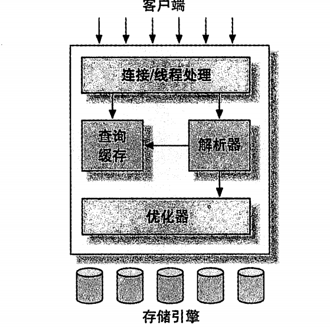
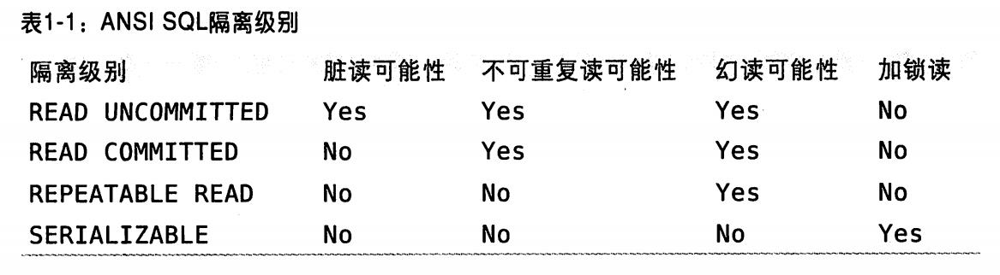

# 高性能MySQL(第3版)

# 第 1 章 MySQL架构与历史



### 1.2.2 锁的粒度

- 表锁：MySQL中最基本的锁策略，是开销最小的锁；在`ALTER TABLE`之类的语句中会使用表锁
- 行级锁：最大程度支持并发处理(同时也带来了最大的锁开销)

事物的ACID:
- A(atomicity):原子性
- C(consistency):一致性;
- I(isolation):隔离性
- D(durability):持久性；

### 1.3.1 隔离级别



InnoDB的处理死锁的方法是，将持有最少行级排他锁的事物进行回滚。

### 1.3.4 MySQL中的事物

MySQL中每个语句就是一个事物，会自动提交;可以通过`AUTOCOMMIT`变量来启用或者禁用自动提交模式

MYSQL 中可以通过执行`SET TRANSACTION ISOLATION LEVEL`命令来设置隔离级别。新的隔离级别会在下一个事物开始的时候生效。

事物主要是由下层的存储引擎实现的。所以在同一个事物中使用多种存储引擎是不可靠的。

InnoDB中存在两阶段锁定协议。在事物执行过程中执行锁定，锁只有在执行commit或者ROLLBACK的时候才会释放，并且所有的锁都是在同一时刻被释放。前面描述的锁定都是隐式的锁定。InnoDB会根据隔离级别在需要的时候自动加锁。

## 1.4 多版本并发控制(MVCC)

MVCC是行级锁的一个变种，在很多情况下避免了加锁操作。因此开销更低。主要是同保存数据在某个时间点的快照来实现的。

InnoDB通过在每行记录后面保存两个隐藏的列来保存行创建的时间和删除时间(系统版本号)。用来和查询到的每个版本号进行比较

SELECT 检查条件如下：
- 只查找早于当前事物版本的数据行(也就是，行的系统版本号小于或者等于事物的系统版本号)，确保事物的读取的行，要么是在事物开始前就已经存在的，要么是事物自身插入或者修改过的
- 行的删除版本要么未定义，要么大于当前事物版本号，保证事物读取到的行，在事物开始前未被删除

INSERT:
- InniDB为新插入的每一行保存当前系统版本号作为行版本号

DELECT
- InnoDB为删除的每一行保存当前系统版本号作为删除标识。

UPDATE
- InnoDB为插入一行新记录，保存当前系统版本好作为行版本号，同时保存当前系统版本号到原来的行作为行删除标识

## 1.5 MySQL的存储引擎

文件系统中，MySQL将每个数据库保存为数据目录下的一个子目录。创建表时，会创建.frm保存表的定义和数据

InnoDB是默认事物型引擎，设计用来处理大量的短期(short-liived)事物，短期事物大部分正常提交，很少会被回滚。它支持排序创建索引、删除或者增加索引时不需要复制全表数据、新的支持压缩的存储格式。

InnoDB可以通过[间隙锁](https://www.cnblogs.com/crazylqy/p/7821481.html)(检索条件必须有索引（没有索引的话，mysql会全表扫描，那样会锁定整张表所有的记录，包括不存在的记录，此时其他事务不能修改不能删除不能添加）)策略防止幻读的出现。

InnoDB能够自动在内存中创建hash索引，以加速读操作的自适应哈希索引;加速插入操作的插入缓冲区(insert buffer)等

### 1.5.2 MyISAM存储引擎

5.1之前的默认引擎但是，崩溃后无法恢复。

其将表存储在：
数据文件(.MYD):
索引文件(.MYI):

MyISAM可以对表进行压缩。压缩表是不能进行修改的(除非先将表解除压缩)；可以极大的减少磁盘空间占用，因此也可以减少磁盘I/O，从而提升查询性能。

### 1.5.5 选择合适的引擎

全文索引，建议优先考虑InnoDB加上Sphinx组合；MyISAM和ARchive存储引擎对开销低，插入速度非常快

对于更换引擎可以使用`ALTER TABLE`语句更换数据引擎。如下：
```sql
ALTER TABLE mytable ENGINE=InnoDB;
```
使用mysqldump工具将数据导出到文件

使用CREATE创建新表，再将旧表的数据导入新表之中

```sql
CREATE TABLE innodb_table LIKE myisam_table;
ALTER TABLE innodb_table ENGINE=InnoDB;
INSERT INTO innodb_table SELECT *FROM myisam_table;
```

## 1.7 MySQL的开发模式

# 第 2 章 MySQL基准测试

测试的指标：
- 吞吐量：单位时间内的事物处理数。
- 响应时间或者延迟：测试任务所需的整体时间。
- 并发性：同时工作中的线程数或者连接数。
- 可扩展性：增加资源，获取成倍的吞吐量

# 第 3 章 服务器性能剖析

## 3.1 性能优化简介


性能优化：在一定的工作负载下，尽可能地降低响应时间

应该尽量，搞清楚程序花费的时间在哪里

### 3.1.1 通过性能剖析进行优化

测量任务花费的时间，然后对结果进行统计和排序。将重要的任务排到前面。

测试脚本如下：

```sh
#!/bin/sh
INTERVAL=5
PREFIX=$INTERVAL-sec-status
RUNFILE=/home/benchmarks/runing
mysql -e 'SHOW GLOBAL VARIABLES' >> mysql-variables
while test -e $RUNFILE; do
    file=$(date+%F_%I)
    sleep=$(data+%s.%N awk "{print $INTERVAL - (\$1 % INTERVAL)}")
    sleep $sleep
    ts="$(data+"TS %s.%N %F %T")"
    loadavg="$(uptime)"
    echo "$ts $loadavg" >> $PREFIX-${file}-status
    mysql -e 'SHOW GLOBAL STATUS' >> $PREFIX-${file}-status &
    echo "$ts $loadavg" >> $PREFIX-${file}-innodbstatus
    mysql -e 'SHOW ENGINE INNODB STATUS \G' >> $PREFIX-${file}-status &
    echo "$ts $loadavg" >> $PREFIX-${file}-processlist
    mysql -e 'SHOW FULL PROCESSLIST \G' >> $PREFIX-${file}-processlist &
    echo $ts;
done
echo Exiting because $RUNFILE does not exist.
```
## 3.3 剖析MySQL查询

慢查询日志开销最低，精度最高的测量查询时间的工具--`pt-query-digest`([MySQL慢查询分析工具pt-query-digest详解](https://blog.csdn.net/xiaoweite1/article/details/80299754))。

### 3.3.2 剖析单条查询

1. 使用`SET profiling=1`:来开启单条时间统计查询功能。
2. 执行mysql相关语句。
3. 使用`SHOW PROFILE`:一条插叙提交给服务器式，会记录剖析信息到一张临时表，并给查询赋予一个从1开始的整数标识符。
4. `SHOW PROFILE FOR QUERY 1;`:显示比较小的查询时间

使用`SHOW STATUS`命令返回计数器，返回各个操作的相关执行次数.`SHOW STATUS`本身也会也会创建一个临时表，而且也会通过句柄操作访问此临时表。会影响到`SHOW STATUS`结果中对应的数字。

### 3.3.3 使用性能剖析


