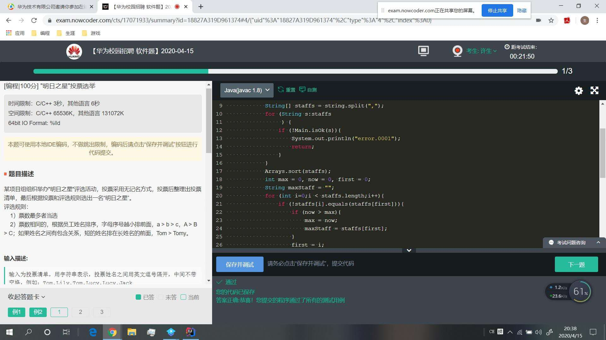
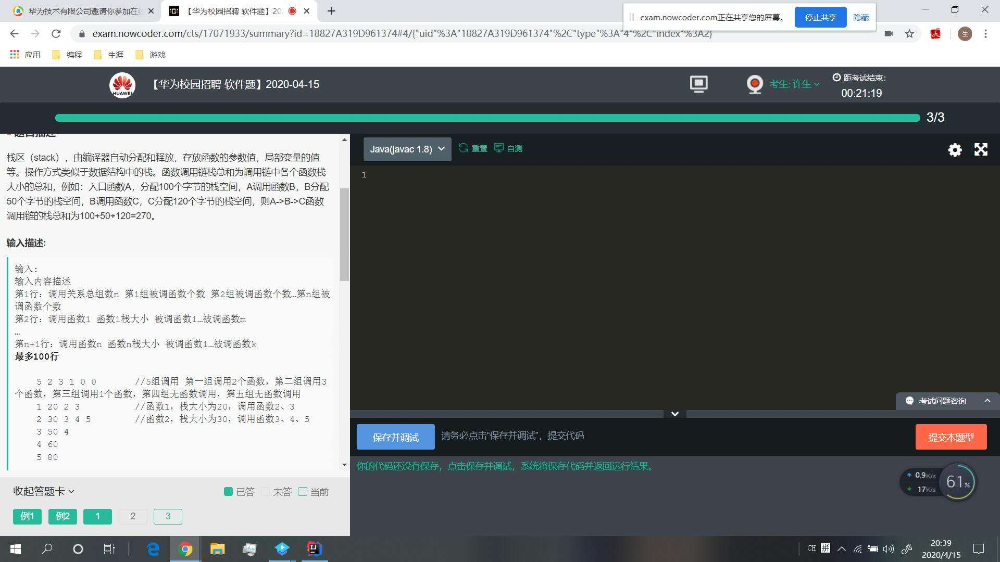

# 4月15华为笔试笔记

# 1. 明日之星选举投票



```c++
/*
主要思路:
使用uordered_map统计，并使用vector存储相同数量的名字；
最后进行排序即可
注意输入的格式错误
Tom,Lily,Tom,Lucy,Lucy,Jack,Tomy,Tomy,To,To

*/


#include <cmath>
#include <cctype>
#include <cstring>
#include <sstream>
#include <iostream>
#include <map>
#include <vector>
#include <stack>
#include <queue>
#include <unordered_map>
#include <unordered_set>
#include <algorithm>
#include <thread>
#include <mutex>
#include <condition_variable>
#include <future>
#include <cstdint>
#include <climits>

using namespace std;

//关闭流输出
static auto static_lambda = []()
{
    std::ios::sync_with_stdio(false);
    std::cin.tie(0);
    return 0;
}();
class Solution{
public:
      vector<string> GetMaxName(vector<string>& names){
          vector<string> res;
          unordered_map<string,int> name_count;
          //统计数目
          for(int i=0;i<names.size();++i){
              if(name_count.find(names.at(i))==name_count.end()){
                  name_count[names.at(i)]=1;
              }else{
                  ++name_count[names.at(i)];
              }
          }
          int max_count=1;
          for(unordered_map<string,int>::iterator it=name_count.begin();it!=name_count.end();++it){
            if(it->second==max_count){
                string temp_string(it->first);
                res.push_back(temp_string);
            }else if(it->second>max_count){
                string temp_string(it->first);
                max_count=it->second;
                while(!res.empty()){
                    res.pop_back();
                }
                res.push_back(temp_string);
            }
          }
          
          return res;
       }
};

bool CheckName(string temp_str)
{
    if(temp_str.empty()){
            return false;
    }else{ //检查是否为空串
        //检查第一个字母是否正确
        if(!(temp_str.at(0)<='Z'&&temp_str.at(0)>='A')){
            return false;
        }
                //检查是否正确
        for(int i=1;i<temp_str.size();++i){
            if((temp_str.at(i)<='z'&&temp_str.at(i)>='a')){
                continue;
            }else{
                return false;
            }
        }
    }
    return true;
}

int main(int argc,char* argv[]){
    Solution a;
    string org_str;
    cin>>org_str;
    //处理输入和输出，生成对应的名字序列
    int left=0;
    int right=0;
    bool is_input_error=false;
    vector<string> names;
    for(;right<org_str.size();++right){
        //检查是否为分割符
        if(org_str.at(right)==',')
        {
            string temp_str=org_str.substr(left,right-left);
            //cout<<temp_str<<endl;
            //非法输入
            if(CheckName(temp_str)){
                names.push_back(temp_str);
            }else{
                is_input_error=true;
                break;
            }
            //在这里跳过‘,’
            left=right+1;
        }
    }
    //获取最后的名字
    if(right>left){
        string temp_str=org_str.substr(left,org_str.size()-left+1);
        if(CheckName(temp_str)){
            names.push_back(temp_str);
        }else{
            is_input_error=true;
        }
    }
//    for(auto temp:names){
 //       cout<<temp<<endl;
 //   }
    if(is_input_error||names.empty()){
        cout<<"error.0001"<<endl;
    }else{
        auto res=a.GetMaxName(names);
        sort(res.begin(),res.end());
        cout<<res.at(0)<<endl;
    }
    return 0;
}

```

## 2. 输入 关键字 匹配字符串

输出：匹配值

XXXX XXXX［key=0x12，mask=0xf0，val=0x55］

空格前XXXX是关键字，空格后是关键字加［］以及里面的一些匹配值。规则1中括号前的关键字（也就是字符串中的关键字）要与给出的关键字一致，字母大小也要一样，规则2 "="后面的匹配值必须是是16进制的数

如果关键字不匹配，也就是字符串中的关键字和给出的不一致，匹配失败，输出FAIL

例子：输入
```shell
read read［key=0x12，mask=0xf0，val=0x55］read_wo［key=0x15，mask=0xf0，val=0x23］read［key=0x92，mask=0xf0，val=0x51］
```
注意：除了关键字read（第一个read）外，没有空格，那个看上去有空格是因为中括号的原因。

输出：
```shell
0x12 0xf0 0x55

0x92 0xf0 0x51
```
字符串匹配，c++没有字符串分割函数写起来真的有点操蛋，几个规则要读懂，但是最后总算AC了。代码相当丑陋。

```c++
/*
作者：求份offer压压惊
链接：https://www.nowcoder.com/discuss/409150?type=0&order=0&pos=37&page=1&channel=-1
来源：牛客网
*/
#include <iostream>
#include <string>
#include <vector>
using namespace std;
int main(){
    string keyword;
    string inform;
    //获取关键字和inform字符串
    while(cin >> keyword >> inform){
        //元素集合字符串
        vector<string> items;
        int pre = 0;
        //将元素添加到items中
        for(int i = 0; i <= inform.size(); i++){
            if(inform[i] == ']'){
                items.push_back(inform.substr(pre, i-pre+1));
                pre = i+2;
            }
        }
        if(items.size() < 1){
            cout << "FAIL" << endl;
            continue;
        }
        vector<string> name;
        vector<string> addr;
        vector<string> mask;
        vector<string> val;
        //遍历查找关键字符串的值
        for(int j = 0; j < items.size(); j++){
            if(items[j].find("addr=") != items[j].npos){
                //获取值开始的坐标
                int cnt = items[j].find("addr=") + 5;
                //检查是否为16进制
                if(items[j][cnt] != '0')
                    continue;
                //获取addr子字符串
                if(items[j][cnt+1] == 'x' || items[j][cnt+1] == 'X'){
                    int start = cnt;
                    for(; items[j][cnt] != ','; cnt++);
                    addr.push_back(items[j].substr(start, cnt-start));
                } else{
                    continue;
                }
            } else
                continue;
            //查找mask
            if(items[j].find("mask=") != items[j].npos){
                int cnt = items[j].find("mask=") + 5;
                if(items[j][cnt] != '0')
                    continue;
                if(items[j][cnt+1] == 'x' || items[j][cnt+1] == 'X'){
                    int start = cnt;
                    for(; items[j][cnt] != ','; cnt++);
                    mask.push_back(items[j].substr(start, cnt-start));
                } else
                    continue;
            } else
                continue;
            //查找val
            if(items[j].find("val=") != items[j].npos){
                int cnt = items[j].find("val=") + 4;
                if(items[j][cnt] != '0')
                    continue;
                if(items[j][cnt+1] == 'x' || items[j][cnt+1] == 'X'){
                    int start = cnt;
                    for(; items[j][cnt] != ']'; cnt++);
                    val.push_back(items[j].substr(start, cnt-start));
                } else
                    continue;
            } else
                continue;
            //遍历字符串查找第一个name,即匹配的名称
            for(int k = 0; k < items[j].size(); k++){
                if(items[j][k] == '['){
                    name.push_back(items[j].substr(0, k));
                }
            }
        }
        bool has = false;
        //检查keywor是否在name集合中，在就输出集合对应的值。
        for(int m = 0; m < name.size(); m++){
            if(name[m] == keyword){
                has = true;
                cout << addr[m] << " " << mask[m] << " " << val[m] << endl;
            }
        }
        if(has == false){
            cout << "FAIL" << endl;
            continue;
        }
    }
    return 0;
}

```

## 3. 栈的内存空间的调用

一个树到顶到叶子结点的距离，DFS，输入不知道说这个结点没有栈空间，不知道位置是有数字还是没有数字。最后70%难顶。



```c++
/**
作者：QK康哥在此
链接：https://www.nowcoder.com/discuss/409137
来源：牛客网

*/

#include<iostream>
#include<vector>
#include<map>
using namespace std;
int R=0,NA=0;
//全局变量，记录最大值
int max_le=0;
//记录调用函数队列
map<int,vector<int>> mp;
//记录函数和栈空间大小
map<int,int> mp1;
int n;
void dfs(int k,vector<int> &vis,int le)
{
    //如果没有子函数调用
    if(mp[k].size()==0)
        max_le=max(max_le,le);
    int a,b;
    for(int i=0;i<mp[k].size();i++)
        {
        	//获取子函数值
            a=mp[k][i];
        	b=mp1[a];
        	//产生越界直接返回
            if(b<=n){
                NA=1;
                return;
            }
        	//检查节点是否访问过，是则存在环路；直接返回
            if(vis[a]==1)
            {
                    R=1;
                    return ;
            }
        	//将节点设置为访问过
            vis[a]=1;
        	//再次深度遍历
            dfs(a,vis,le+b);
        	//检查是否存在环路
            if(R==1)
                return ;
        	//更改访问标志位
            vis[a]=0;
        }
}
int main()
{
    cin>>n;
    int m=0;
    //访问数组
    vector<int> vis(n,0);
    //被调用函数个数
    vector<int> v(n,0);
    for(int i=0;i<n;i++)
        cin>>v[i];
    int a,b;
    //记录函数调用关系
    while(m<n)
    {
        //函数编号和栈空间大小
        cin>>a>>b;
        mp1[a]=b;
        //将其调用函数，
        for(int i=0;i<v[m];i++){
            cin>>b;
            mp[a].push_back(b);
        }
        m++;
    }
    //对每个节点进行深度遍历
    for(int i=1;i<=n;i++)
        {
            vis[i]=1;
            dfs(i,vis,mp1[i]);
            if(R==1)
                break;
            vis[i]=0;
        }
    //如果产生环路。输出对应信息
    if(R==1)
        cout<<"R"<<endl;
    else
    {   
        if(NA==1){
        	cout<<"NA"<<endl;
            return 0;
        }
        //输出最大值
        cout<<max_le<<endl;
    }
    system("pause");
    return 0;
}

```
