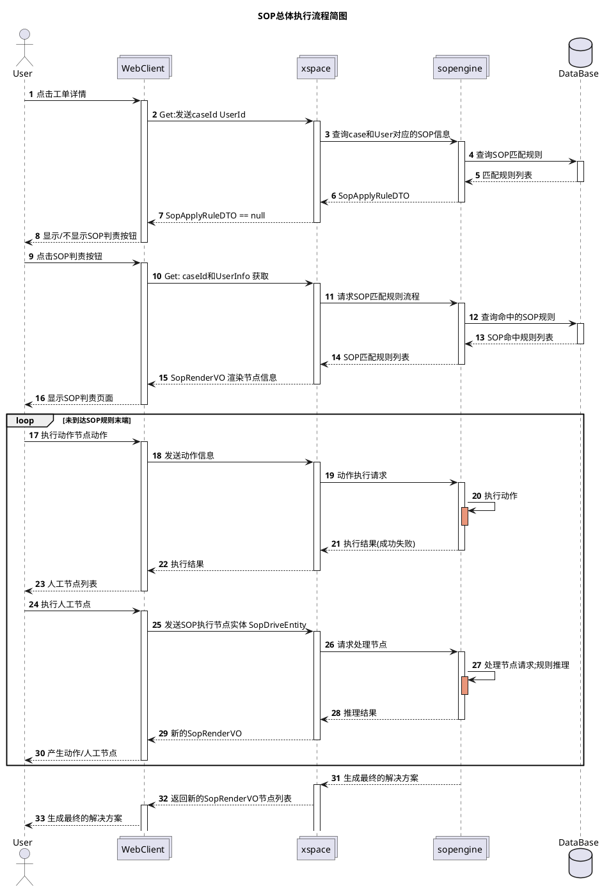
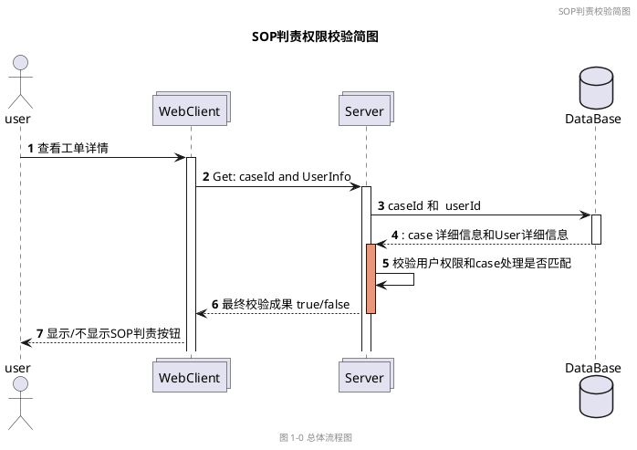
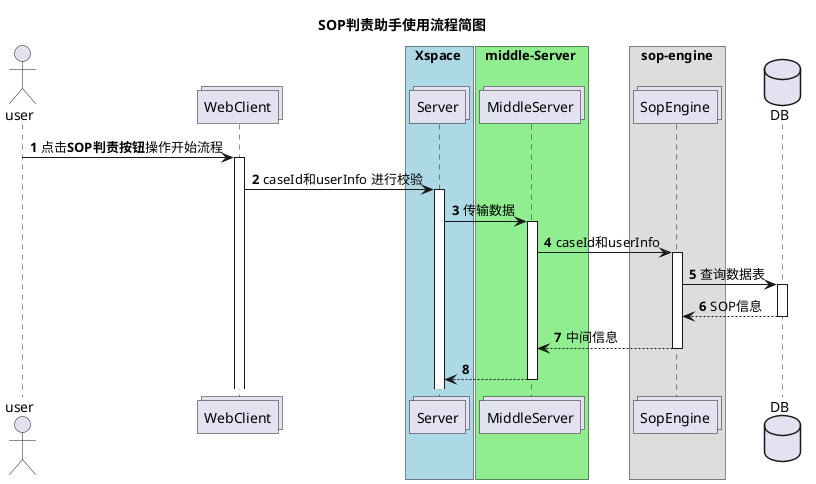

# SOP代码梳理和记录

## XSPACE 简单流程整理 

> 2020-06-23 09:50:58

## SOP 唤起流程图

SOP单主要的唤起流程如下:
1. 请求`/sopPlay/match`发送caseId和User信息；返回该用户是否拥有该case的修改权限
2. 根据修改权限返回值，决定是否出现SOP选择按钮
3. 点击选择按钮，请求`/sopPlay/play`开始播放当前任务，主要返回的数据是`SopRenderVO`
4. 对人工节点进行选择，请求`/sopPlay/drive`开始进行驱动并展示下一步的节点;
5. 当执行动作节点是，请求`/action/xxx`系列执行对应的请求；并返回对应执行结果。动作列表如下:
   1. 外呼
   2. 工单挂起
   3. 申请小二介入
   4. 留言
   5. 发送短信
6. 展现人工节点，填写结果信息；查找SOP标准流程表
7. 生成下一步的动作
8. 重复3-7步骤直到达到标准流程的终点，生成最终的解决方案

SOP判责的整体流程就是：
1. 根据当前情况，给出动作节点
2. 选择并执行动作，并填写人工节点结果
3. 根据人工节点结果，生成对应的动作节点和人工节点
4. 重复2-3步，直到走完SOP模板，最终生成对应的解决方案


项目主要结构:
1. web控制台：gaea-xspace-desk
2. SOP规则引擎：gaea-sop-engine
3. SOP匹配查询: gaea-application

### SOP检验的时序简图





### SOP权限校验时序图

```plantuml
@startuml
title SOP权限校验逻辑时序图
actor User
collections WebClient
box "gaea-xspace-desk" #LightBlue 
collections "SopPlayController\n.match()" as SopPlayController
collections "SopPlayManager\n.match()" as SopPlayManager
end box
box "gaea-application" #LightGreen
collections "SopMatchService\n.metchSopApplyWithApplyRule()" as SopMatchService
collections "SopMatchManager\n.matchSopApply" as SopMatchManager
end box
' 中间不知名调用链路
box "middle-link" #LightYellow
collections "middle link service " as MiddleService
end box


box "sop-engine" #LightRed
collections "sop-engine" as SopEngine
end box

database  DB
autonumber
User -> WebClient : 点击工单详情页面
activate WebClient

 
WebClient -> SopPlayController : 查询订单和用户权限
activate SopPlayController
SopPlayController ->  SopPlayController : AccountUtil\n.getAccountFromRequest \n获取用户数据
activate SopPlayController #DarkSalmon
SopPlayController -> SopPlayManager : caseId和Uer 查询是否匹配
activate SopPlayManager 
SopPlayManager -> SopMatchService : MetchSopApplyRequest\n检查是否存在匹配的规则
activate SopMatchService
SopMatchService -> SopMatchManager : MetchSopApplyRequest\n 请求Sop匹配
activate SopMatchManager

SopMatchManager -> MiddleService: MetchSopApplyRequest \n 请求服务


@enduml
```

### SOP判责助手使用流程




## SopEngine 代码查看记录

### 关键对外的HSF服务
1. `com.cainiao.gaea.platform.spi.component.sop.SopActionConfigService`:
- 主要功能: Sop动作适配的服务实现接口；其它没有实现，主要时通过ActionId获取对应的SopActionDTO；
- SopActionDTO 主要数据结构如下:
  ```java
  public class SopActionDTO extends BaseObject {
        // 基本数据域
        private Long id;
        private String name;
        private String code;
        private Date gmtCreate;
        private Date gmtModified;

        private String desc;
        private Integer actionCategory;
        private Integer responseCategory;
        // 
        private String preUrl;
        private String onlineUrl;
        
        private String feature;
        private Long creatorId;
        
        private Integer creatorDomain;
        private Long modifierId;
        private Integer modifierDomain;
        
        private String tenantCode;
   }
  ```
   - 对应Manager: `SopActionConfigManager`：主要功能是从SopActionDiamondConfig同步数据中根据id和tenantCode进行筛选。
   - 对应数据访问`SopActionDiamondConfig`
   - 主要是通过: DiamondConfig进行数据的同步和更新。
   - [Diamond类](http://mw.alibaba-inc.com/products/diamondserver/_book/api.html?spm=a1zco.8292286.0.0.57d42588rwJhEM)
1. `com.cainiao.gaea.platform.spi.component.sop.SopConfigServiceImpl`:
   - 主要功能: Sop规则的查询包括更新等操作
   - 对应的Manager:`SopConfigManager`:主要是对`gaea_sop_define`表的查询工作；
     - 注意：**这里的所有操作接口，都是由`Map<String, Object>`进行参数传入**
   - 主要的数据结构:
   ```java
   public class SopDTO extends BaseObject {
        private static final long serialVersionUID = -2530179139368713205L;

        private Long id;
        private Date gmtCreate;
        private Date gmtModified;
        // 名称以及相关域
        private String name;
        private Integer validStatus;
        private String desc;

        private Integer category;
        private String outerKey;
        private Long outerKeyId;
        private JSONObject tag;
        private Integer defaultSpeechTemplate;
        private String feature;

        private Long creatorId;
        private Integer creatorDomain;
        private Long modifierId;
        private Integer modifierDomain;
        
        private String tenantCode;
        private Integer enabledStatus;
   }
   ```
2. `com.cainiao.gaea.platform.spi.component.sop.SopRuntimeService`:
3. `com.cainiao.gaea.platform.spi.component.sop.SopTraceService`:

