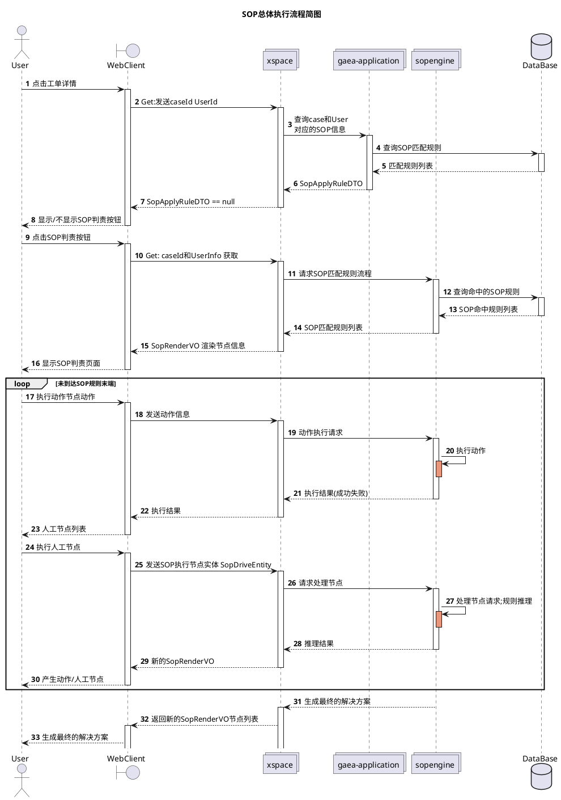
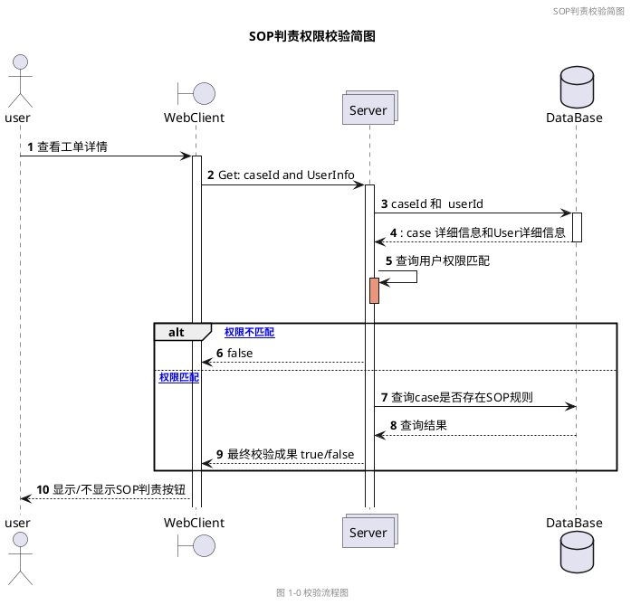
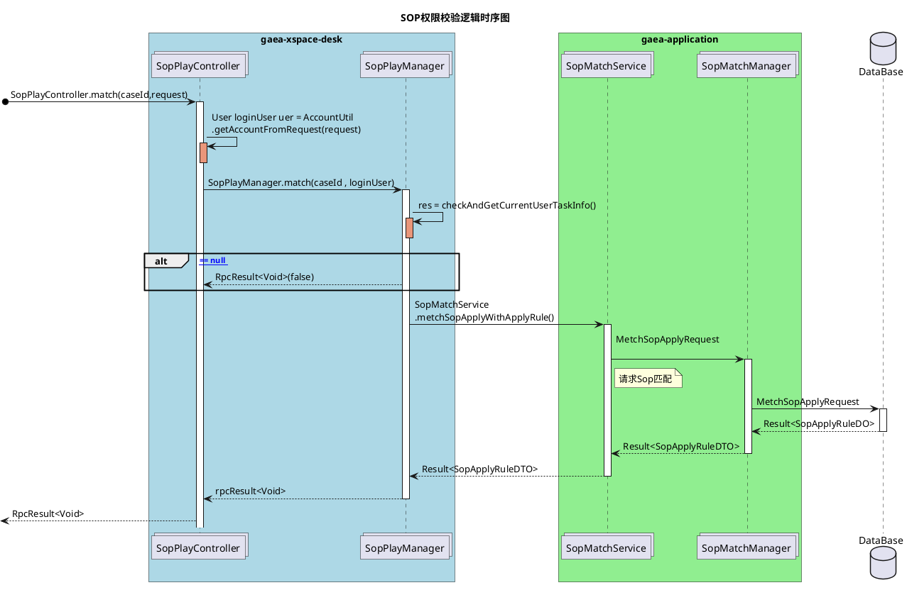
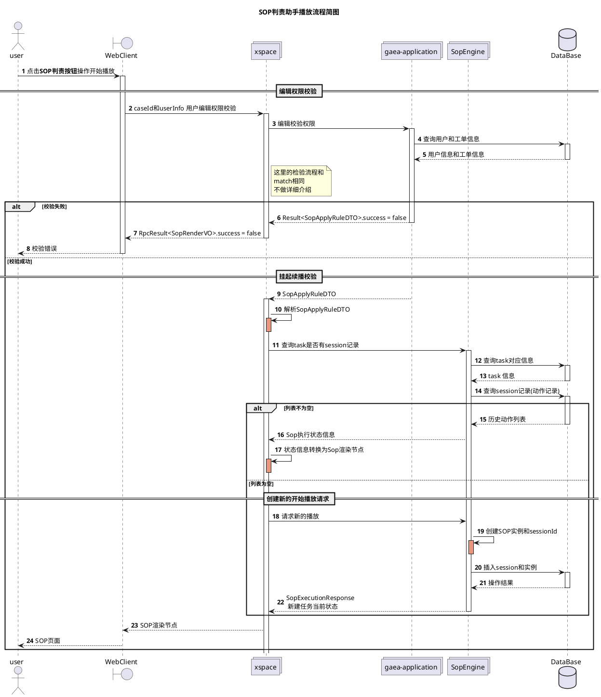
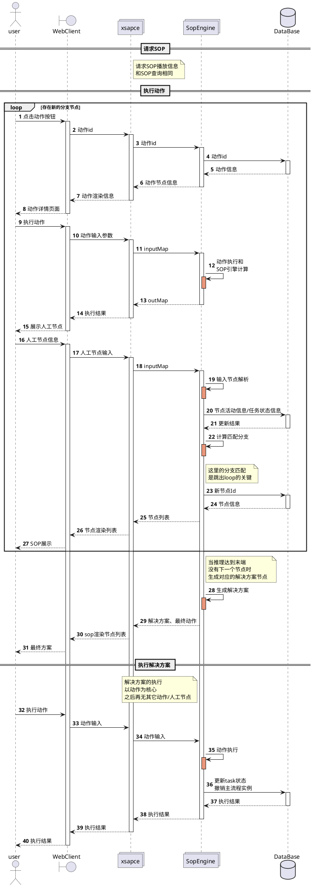

# SOP代码梳理和记录

> 2020-06-23 09:50:58

## SOP 唤起流程简述

SOP单主要的唤起流程如下:
1. 请求`/sopPlay/match`发送caseId和User信息；返回该用户是否拥有该case的修改权限
2. 根据修改权限返回值，决定是否出现SOP选择按钮
3. 点击选择按钮，请求`/sopPlay/play`开始播放当前任务，主要返回的数据是`SopRenderVO`
4. 对人工节点进行选择，请求`/sopPlay/drive`开始进行驱动并展示下一步的节点;
5. 当执行动作节点是，请求`/action/xxx`系列执行对应的请求；并返回对应执行结果。动作列表如下:
   1. 外呼
   2. 工单挂起
   3. 申请小二介入
   4. 留言
   5. 发送短信
6. 展现人工节点，填写结果信息；查找SOP标准流程表
7. 生成下一步的动作
8. 重复3-7步骤直到达到标准流程的终点，生成最终的解决方案

SOP判责的整体流程就是：
1. 根据当前情况，给出动作节点
2. 选择并执行动作，并填写人工节点结果
3. 根据人工节点结果，生成对应的动作节点和人工节点
4. 重复2-3步，直到走完SOP模板，最终生成对应的解决方案

项目主要结构:
1. web控制台：gaea-xspace-desk
2. SOP规则引擎：gaea-sop-engine
3. SOP匹配查询: gaea-application

### 2.1 SOP时序简图

### 2.2 SOP权限校验类时序图

### 2.3 SOP判责助手播放流程简图

### 2.4 SOP判责助手播放类时序图

下面是SOP判责助手按钮点击时的类流程图

### 2.5 SOP动作节点执行时序图

主要是SOP的动作节点的执行和人工节点填写的详细时序图

**注意:人工因子是单选框，表单因子是多选**

