# JAVA UML 学习笔记
> 2020-06-26 15:29:58

# 0. UML基础知识

# 1. PlantUML语法笔记
_参考链接:_
- [PlantUML官网](https://plantuml.com/zh/)
- [用户指南](https://plantuml.com/zh/guide)

PlantUML一般都是直接使用`@startuml`和`@enduml`作为开始和结束的标志。

## 1.1 时序图
_参考链接:_ 
- [实体类 边界类 控制类](https://blog.csdn.net/wulingmin21/article/details/6840819?utm_medium=distribute.pc_relevant.none-task-blog-baidujs-1)
- [UML中边界类、控制类和实体类](https://blog.csdn.net/greensure/article/details/70882308)

声明参与者:
- `actor` : 参与者
- `boundary`: 边界类;边界对象的抽象，通常是用来完成参与者（用户、外部系统）与系统之间交互的对象，例如：From、对话框、菜单、接口等。一般来说就是View层或者前端层。
- `control`: 控制类;控制对象的抽象，主要用来体现应用程序的执行逻辑，将其抽象出来，可以使变化不影响用户界面和数据库中的表。
- `entity`: 实体类;实体对象的抽象，通常来自域模型（现实世界），用来描述具体的实体，通常映射到数据库表格与文件中。比如对象成员域的状态值，枚举类等。相当于是DO
- `database`: 数据库
- 
使用示例如下:

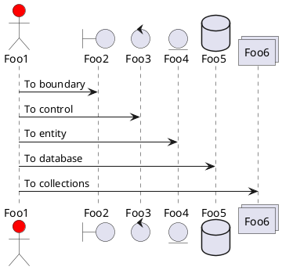

可以使用as结合字符串设置各个对象实体的别名。这样可以很容易更改它的名称。里面的字符串可以使用`\n`进行换行。也支持HTML的语法格式。

箭头的样式代码示例如下;也可以使用`-[#color]x`进行颜色的更改

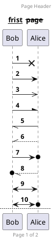
可以在设置编号时，格式是由 Java 的 DecimalFormat 类实现的；可以根据它的规则来更改格式。例如:
```
autonumber "<b>[000]"
autonumber 15 "<b>(<u>##</u>)"
autonumber 40 10 "<font color=red><b>Message 0 "
```
### 1.1.10 组合消息

我们可以通过以下关键词将组合消息： 
- alt/else : 相当于if/else
- opt:
- par:
- break:
- critical:
- group:可以嵌套使用

标签后面添加`end`表示结束。

### 1.1.11 给消息添加注释

我们可以通过如下方法；在消息后面注释；如
- `note left`/ `note right`
- `end note `来添加多行注释。
- `note over `在节点的相对位置添加注释

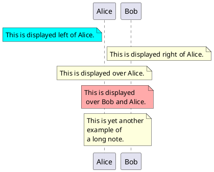

### 1.1.13 改变备注框的形状
你可以使用 hnote 和 rnote 这两个关键字来修改备注框的形状。 使用示例如下:

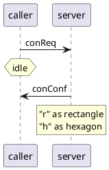
### 1.1.15 分隔符

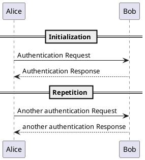
### 1.1.16 引用和延迟

你可以在图中通过使用 `ref over` 关键词来实现引用;`...`表示延迟。`|||来增加空间`
`activate/deactivate`来表示激活/结束 
使用示例如下:

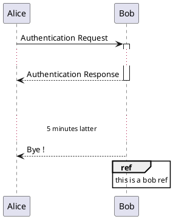
### 1.1.21 创建参与者

你可以把关键字 `create` 放在第一次接收到消息之前，以强调本次消息实际上是在创建新的对象。
也可以使用`return`快速返回

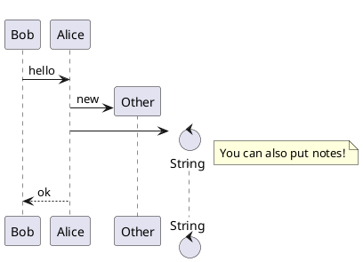
### 1.1.22 进入和发出消息
如果只想关注部分图示，你可以使用进入和发出箭头。 使用方括号 [和] 表示图示的左、右两侧。 
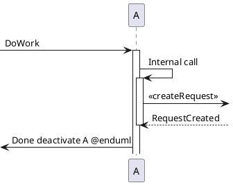

### 1.1.23 构造类型和圈点

可以使用 `<<` 和 `>>` 给参与者添加构造类型。 在构造类型中，你可以使用 (X,color) 格式的语法添加一个圆圈圈起来的字符。

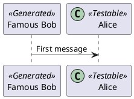

### 1.1.25 包裹参与者
可以使用 box 和 end box 画一个盒子将参与者包裹起来。 还可以在 box 关键字之后添加标题或者背景颜色。

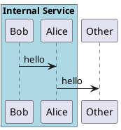
## 1.2 用例图


_参考链接:_
- [详解 UML 用例图画法 & 用例说明方式](https://baijiahao.baidu.com/s?id=1661400666935924580&wfr=spider&for=pc)

用例图主要是从用户的角度对，整个程序的结构和用例进行分析。主要是说明，参与者、用例以及参与者与用例之间的关系
- 参与者: 代表系统外部与系统发生交互的人或事物；需要注意，人指的是参与者与系统发生交互时的角色，不代指具体的人。
- 事务: 指的是某一个应用程序或者特殊进程；例如微信登录，通过跳转微信确认登录信息，微信对系统产生输入时，可以把微信作为参与者；而设定时间，强制退出账号时，时间这一特殊进程对系统产生输入，因此时间也可以作为参与者。
- 用例:用例是系统外部可见的一个功能单元，是某一个参与者在系统中做某件事从开始到结束的一系列活动的集合，以及结束时应该返回的可观测、有意义的结果,其中还包含可能的各种分支情况；具体用例在用例属性中说明。
  - 其特征如下:
    - 用例都是动宾结构;例如：登录账号
    - 用例都是相互独立的
    - 用例由参与者启动
    - 有可观测的执行结果
  - 角色和用例之间的关系主要包括:
    - 关联关系:表示参与者与用例之间的关系，带箭头的实线来描述。
    - 归纳(泛化)关系:表示参与者可以执行的动作一个用例可以被列举为多个子用例，这就被成为用例泛化，这与类间的泛化关系类似。例如客户预定可以泛化为预定大巴/小车.
    - 
    - 包含关系:指的是其中一个用例（称为基础用例）的行为包含了另一个用例（称为包含用例）。基础用例包含用例并依赖包含用例的执行结果。但是二者不能访问对方的属性。包含关系的图形为虚线箭头加`<<include>>`，箭头指向包含用例。例如汽车租赁中，预定、取车等动作都包含登录
    - 
    - 拓展关系:基础用例的增量扩展，它俩之间为扩展关系。使用虚线箭头，上面加`<<exclude>>`,箭头指向基础用例。往往表示特定情况的发生。
    - 依赖关系:一个用例需要另外一个用例的实现。直接使用直线将两个用例相互连接
  - 子系统：强调某部分用例的强关联性，使用子系统来概括，例如门户包括系统登录、首页信息展示等
    - 


### 1.2.1 用例

用例用圆括号括起来。 也可以用关键字 usecase 来定义用例。还可以用关键字 as 定义一个别名，这个别名可以在以后定义关 系的时候使用。

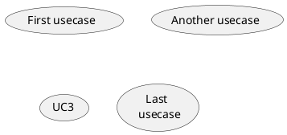
### 1.2.2 角色

角色用两个冒号包裹起来；也可以用 actor 关键字来定义角色。还可以用关键字 as 来定义一个别名，这个别名可以在以后定义关 系的时候使用。 后面我们会看到角色的定义是可选的。 

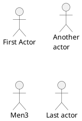
### 1.2.3 用例描述

如果想定义跨越多行的用例描述，可以用双引号将其裹起来。还可以使用这些分隔符：`--.. ==__`。并且还可以在分隔符中间放置标题。

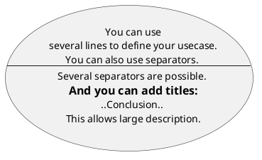
使用`-->`连接角色和用例`-`越多，箭头越长。可以通过在箭头定义后的后面加一个冒号以及文字的方式来添加标签。给箭头添加注释。

### 1.2.5 继承
使用`<|--`表示角色或者用例继承于另一个。

可以用 note left of,note right of,note top of,note bottom of 等关键字给一个对象添加注释。 注释还可以通过 note 关键字来定义，然后用.. 连接其他对象。 
使用示例如下:

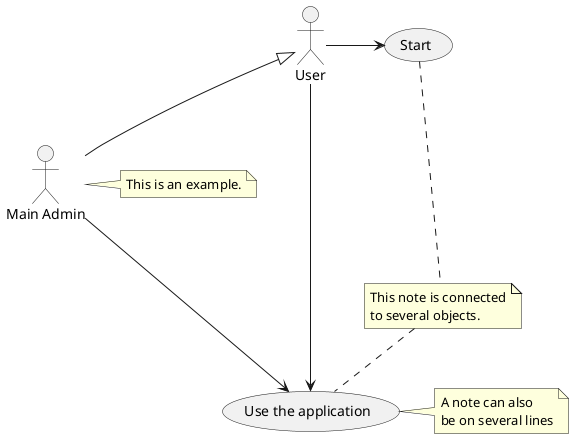

### 1.2.6 构造类型

用`<<`和`>>`来定义角色或者用例的构造类型
可以通过反转箭头改变方向
还可以通过给箭头添加 left,right,up 或 down 等关键字来改变方向。 
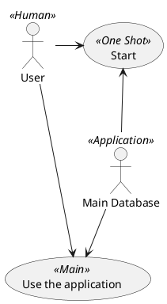

### 1.2.10 更改构建方向

可以通过`xxx to xxx direction`修饰来修改构图的方向。示例如下:

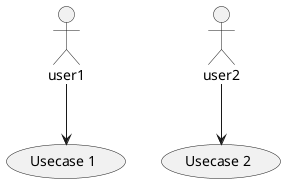

### 1.2.12 一个完整的例子

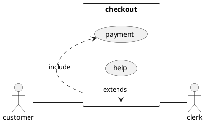

## 1.3 类图
_参考链接:_ 
- [产品经理必学UML：类图](http://www.woshipm.com/pd/2593231.html)
- [类和类之间的依赖、关联、聚合、组合关系](https://blog.csdn.net/weixin_38234890/article/details/80055362)
- [认识 UML 类关系——依赖、关联、聚合、组合、泛化](https://blog.csdn.net/K346K346/article/details/59582926?utm_medium=distribute.pc_relevant_t0.none-task-blog-BlogCommendFromMachineLearnPai2-1.nonecase&depth_1-utm_source=distribute.pc_relevant_t0.none-task-blog-BlogCommendFromMachineLearnPai2-1.nonecase)


类图（Class Diagrame）是描述类、接口、协作以及它们之间关系的图，用来显示系统中各个类的静态结构。

类图包含7个元素：
- 类:
- 接口
- 协作
- 依赖关系:表示某一类元以某种形式依赖于其他类元，它表现了这样一种场景，如下图，对于一个元素（提供者）的某些更改会影响或提供消息给其他元素（客户），即客户以某种形式依赖于提供者。
  - 
- 泛化关系:表示一种存在于一般元素和特殊元素之间的分级关系，描述了“is a kind of”（是……的一种）的关系，如汽车是交通工具的一种。在类中一般元素称为超类或父类，特殊元素称为子类。
  - 
- 实现关系:
  - 表示规格说明和其实现之间的关系，将一种模型元素和另一种模型元素连接起来，比如类和接口。 如打字员和键盘，键盘保证自己的部分行为可以实现打字员的行为。
    - 
- 关联关系:表示一组具有共同结构特征、行为特征、关系和语义的链接，是一种结构关系，指明一个事物的对象与另一个事物的对象间的关系。如学生和大学的关系，学生在大学里学习，大学又包括了很多学生，所以可以在学生和大学之间建立关联关系。
  - 
- 聚合（Aggregation）关系:是一种特殊形式的关联关系。表示整体与部分关系的关联，简单来说，就是关联关系中的一组元素组成了一个更大、更复杂的单元。描述了“has  a”的关系。如大学和学院，大学是由很多个学院组成的，因此两者之间是聚合关系。
  - 
- 组合关系:组合也是关联关系的一种特例，它体现的是一种contains-a的关系，这种关系比聚合更强，也称为强聚合。它同样体现整体与部分间的关系，但此时整体与部分是不可分的，整体的生命周期结束也就意味着部分的生命周期结束，比如人和人的大脑。表现在代码层面，和关联关系是一致的，只能从语义级别来区分。在UML类图设计中，组合关系以实心菱形加实线箭头表示。
- 相关小结:
  - 
- 小练习——简易听歌系统类图
  - 


