# JAVA UML 学习笔记
> 2020-06-26 15:29:58

# 0. UML基础知识

# 1. PlantUML语法笔记
_参考链接:_
- [PlantUML官网](https://plantuml.com/zh/)
- [用户指南](https://plantuml.com/zh/guide)

PlantUML一般都是直接使用`@startuml`和`@enduml`作为开始和结束的标志。

## 1.1 时序图
_参考链接:_ 
- [实体类 边界类 控制类](https://blog.csdn.net/wulingmin21/article/details/6840819?utm_medium=distribute.pc_relevant.none-task-blog-baidujs-1)
- [UML中边界类、控制类和实体类](https://blog.csdn.net/greensure/article/details/70882308)

声明参与者:
- `actor` : 参与者
- `boundary`: 边界类;边界对象的抽象，通常是用来完成参与者（用户、外部系统）与系统之间交互的对象，例如：From、对话框、菜单、接口等。一般来说就是View层或者前端层。
- `control`: 控制类;控制对象的抽象，主要用来体现应用程序的执行逻辑，将其抽象出来，可以使变化不影响用户界面和数据库中的表。
- `entity`: 实体类;实体对象的抽象，通常来自域模型（现实世界），用来描述具体的实体，通常映射到数据库表格与文件中。比如对象成员域的状态值，枚举类等。相当于是DO
- `database`: 数据库
- 
使用示例如下:

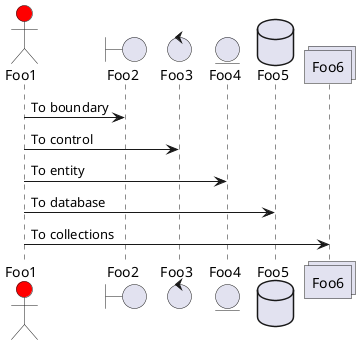

可以使用as结合字符串设置各个对象实体的别名。这样可以很容易更改它的名称。里面的字符串可以使用`\n`进行换行。也支持HTML的语法格式。

箭头的样式代码示例如下;也可以使用`-[#color]x`进行颜色的更改

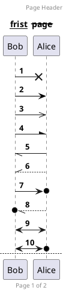
可以在设置编号时，格式是由 Java 的 DecimalFormat 类实现的；可以根据它的规则来更改格式。例如:
```
autonumber "<b>[000]"
autonumber 15 "<b>(<u>##</u>)"
autonumber 40 10 "<font color=red><b>Message 0 "
```
### 1.1.10 组合消息

我们可以通过以下关键词将组合消息： 
- alt/else : 相当于if/else
- opt:
- par:
- break:
- critical:
- group:可以嵌套使用

标签后面添加`end`表示结束。

### 1.1.11 给消息添加注释

我们可以通过如下方法；在消息后面注释；如
- `note left`/ `note right`
- `end note `来添加多行注释。
- `note over `在节点的相对位置添加注释

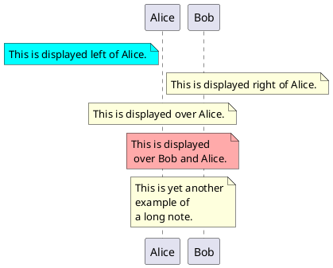

### 1.1.13 改变备注框的形状
你可以使用 hnote 和 rnote 这两个关键字来修改备注框的形状。 使用示例如下:

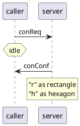
### 1.1.15 分隔符

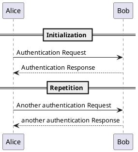
### 1.1.16 引用和延迟

你可以在图中通过使用 `ref over` 关键词来实现引用;`...`表示延迟。`|||来增加空间`
`activate/deactivate`来表示激活/结束 
使用示例如下:

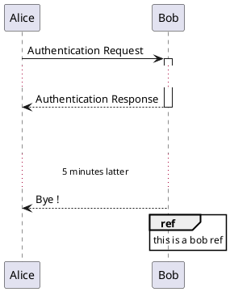
### 1.1.21 创建参与者

你可以把关键字 `create` 放在第一次接收到消息之前，以强调本次消息实际上是在创建新的对象。
也可以使用`return`快速返回

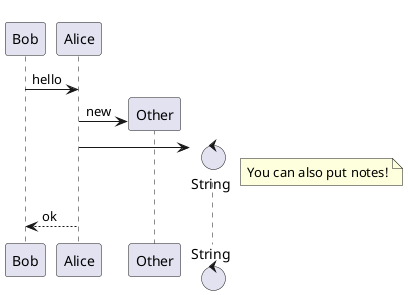
### 1.1.22 进入和发出消息
如果只想关注部分图示，你可以使用进入和发出箭头。 使用方括号 [和] 表示图示的左、右两侧。 
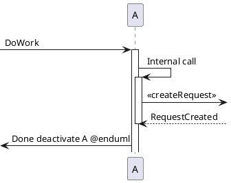

### 1.1.23 构造类型和圈点

可以使用 `<<` 和 `>>` 给参与者添加构造类型。 在构造类型中，你可以使用 (X,color) 格式的语法添加一个圆圈圈起来的字符。

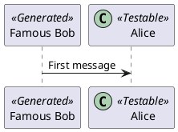

### 1.1.25 包裹参与者
可以使用 box 和 end box 画一个盒子将参与者包裹起来。 还可以在 box 关键字之后添加标题或者背景颜色。

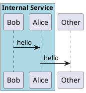
## 1.2 用例图

### 1.2.1 用例

用例用圆括号括起来。 也可以用关键字 usecase 来定义用例。还可以用关键字 as 定义一个别名，这个别名可以在以后定义关 系的时候使用。

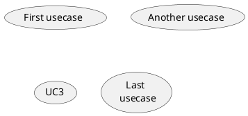
### 1.2.2 角色

角色用两个冒号包裹起来；也可以用 actor 关键字来定义角色。还可以用关键字 as 来定义一个别名，这个别名可以在以后定义关 系的时候使用。 后面我们会看到角色的定义是可选的。 

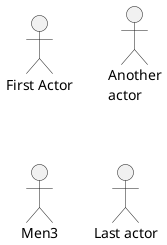
### 1.2.3 用例描述

如果想定义跨越多行的用例描述，可以用双引号将其裹起来。还可以使用这些分隔符：`--.. ==__`。并且还可以在分隔符中间放置标题。

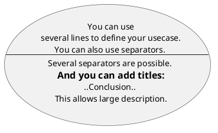