# SOP迁移想法关键节点记录

## sopengine中的引擎可能需要修改


## 3. SOP动作关键节点链路梳理

XSPACE 已有动作节点

1. [x] 留言
2. [x] 外呼
3. [x] 发短信
4. [x] 采纳SOP判责结论
5. [x] 不采纳SOP判责结论
6. [X] 代叫运力(裹裹呼叫运力)
7. [x] 取消裹裹订单
8. [X] 申请菜鸟小二介入
9. [x] 咨询工单完结
10. [x] 工单挂起
11. [x] 发起投诉
12. [x] 修改上门时间
13. [x] 添加驿站白名单
14. [x] 取消驿站白名单
15. [ ] 下发CP举证
16. [ ] 转交CP(没有要求)
17. [ ] 评价sop(没有要求)

### 3.2 处理组件

1. [x] 留言
2. [x] 外呼
3. [ ] 发短信
4. [ ] 采纳SOP判责结论
5. [ ] 不采纳SOP判责结论
6. [X] 代叫运力(裹裹呼叫运力)
7. [ ] 取消裹裹订单
8. [X] 申请菜鸟小二介入
9. [x] 咨询工单完结
10. [x] 工单挂起
11. [x] 发起投诉
12. [x] 修改上门时间
13. [ ] 添加驿站白名单
14. [ ] 取消驿站白名单
15. [x] 下发CP举证

## 关键代码函数调用链

### 2.1 获取联系人数据
获取联系人的数据;`/getOutBound`

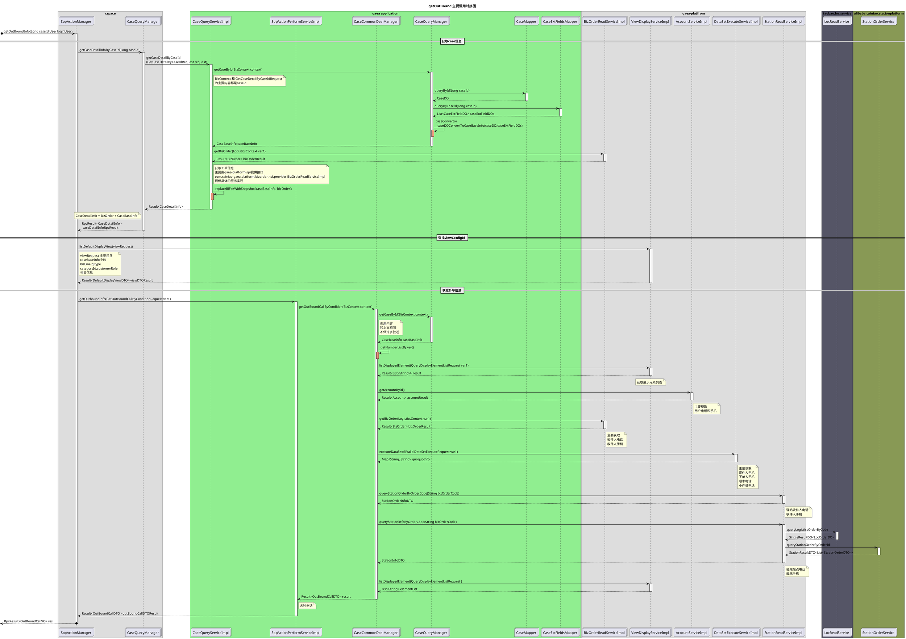

### 2.2 外呼的主要流程时序图

外呼的主要链接api: `/action/call`
```plantuml
@startuml
title 外呼主要流程时序图
' xspace
box xspace
collections "SopActionController" as SopActionController
collections "SopActionManager" as SopActionManager
'
collections "CaseQueryManager" as CaseQueryManager

end box
' gaea-apllication

box gaea-application #LightGreen
collections "CaseQueryManagerImpl"  as CaseQueryService
collections "MyTaskMapper" as MyTaskMapper
collections "SopActionPerformServiceImpl" as SopActionPerformService
collections "SopActionPerformManager" as SopActionPerformManager
collections "ActionManager" as ActionManager
end box

box "cxdc.xspace.account" #LightBlue
collections "CenterXspaceServicerService" as CenterXspaceServicerService
end box

box "xspacehotline" #Light
collections "XspaceHotlineCommonService" as XspaceHotlineCommonService
end box

== 查询任务信息 ==
SopActionController -> SopActionManager : call()
activate SopActionManager
'获取TaskId
SopActionManager -> CaseQueryManager : getActivateTaskBycaseId()
activate CaseQueryManager

CaseQueryManager -> CaseQueryService : listActiveTaskByCaseId
activate CaseQueryService

CaseQueryService -> MyTaskMapper : queryIdByCaseId
activate MyTaskMapper
return List<Long> taskIds
CaseQueryService -> MyTaskMapper : queryByIdsAndStatuses
activate MyTaskMapper
return List<TaskDO>

return List<TaskInfo>
return Result<List<TaskInfo>>
== 执行外呼 ==
' 执行外呼
SopActionManager -> SopActionPerformService : executeOutbound
activate SopActionPerformService

SopActionPerformService -> SopActionPerformManager : call
activate SopActionPerformManager
SopActionPerformManager -> CenterXspaceServicerService : getServicerByUicId
activate CenterXspaceServicerService
note right of CenterXspaceServicerService
主要获取
serviceId
hotLineNumber
calledNumber
end note
return XspaceServicerDO
SopActionPerformManager -> XspaceHotlineCommonService : sendCommandToXspace
note right of XspaceHotlineCommonService
执行命令
end note
activate XspaceHotlineCommonService
return Result<JSONObject> commandToXspace
SopActionPerformManager -> ActionManager : addAction
' 存储动作
activate ActionManager 
note right of ActionManager
添加动作记录
end note
deactivate
==  ==
return RpcResult<Void>
return RpcResult<Void>
return RpcResult<Void>
@enduml
```

### 2.3 添加外呼动作记录

主要动作链接`/addCallAction`
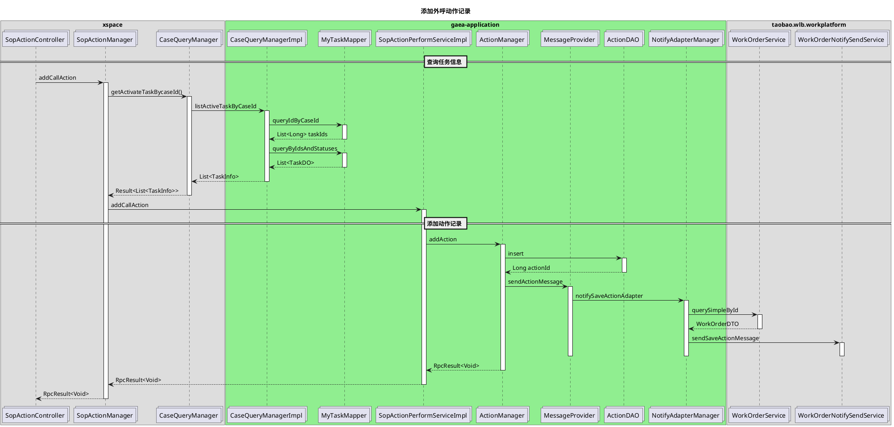
### 2.4 发短信

主要对应的链接:`/action/text`

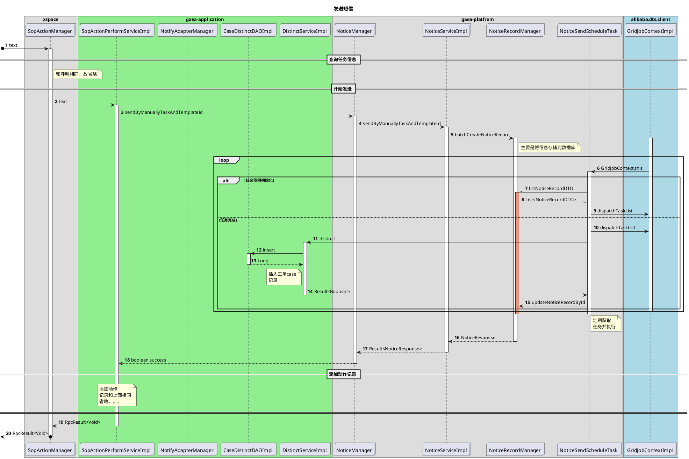

### 2.5 获取收信人列表
主要是根据caseId查询工单信息；主要path：`/listTextReceiver`

```plantuml
@startuml
title 获取收信人列表时序图

' xspace
box xspace
collections "SopActionManager" as SopActionManager
end box
' gaea-apllication
box "gaea-application" #LightGreen
collections "SopActionPerformServiceImpl" as SopActionPerformService
'collections "SopActionPerformManager" as SopActionPerformManager
collections "CaseQueryManager" as CaseQueryManager
collections "CaseMapper" as CaseMapper
collections "CaseExtFieldsMapper" as CaseExtFieldsMapper
collections "OrderSenderStrategy" as OrderSenderStrategy
collections "GuoguoManager" as GuoguoManager
end box

box "gaea-platform" #LightRed
collections "ResourceServiceImpl" as ResourceService
collections "AccountServiceImpl" as AccountService
collections "BizOrderReadService" as BizOrderReadService
collections "StationReadService" as StationReadService
end box

box "taobao.wlb.res.client" #LightBlue 
collections "ResourceReadService" as ResourceReadService
end box

box "cainiao.tdtradeplatform" #899
collections "TdTradeQueryService" as TdTradeQueryService
end box 

box "taobao.loc.service" #556
collections "LocReadService" as LocReadService
end box
box "alibaba.cainiao.stationplatform" #895
collections "StationOrderService" as StationOrderService
end box

' 开始请求
autonumber 
[o-> SopActionManager : listTextReceiver
activate SopActionManager

SopActionManager -> SopActionPerformService:listTextReceiver
activate SopActionPerformService

== 查询工单信息 ==
SopActionPerformService -> CaseQueryManager : getCaseByCaseId
activate CaseQueryManager
CaseQueryManager -> CaseMapper : queryById
activate CaseMapper
return CaseDO
CaseQueryManager -> CaseExtFieldsMapper : queryByCaseId
activate CaseExtFieldsMapper

note right of CaseExtFieldsMapper
获取额
外属性信息
主要是判责
end note

return List<CaseExtFieldDO> feature
' 填充判责信息
alt ParamsUtil.isNotEmpty(feature)
    loop ResponsibilityParty : List<ResponsibilityParty>
        alt responsibilityParty.getRole() == CP
            CaseQueryManager -> ResourceService : getResourceById
            activate ResourceService
            ResourceService -> ResourceReadService : cacheGetResourceById
            activate ResourceReadService
            return ResourceDTO
            return resourceName
        else 其它角色
            CaseQueryManager -> AccountService : getAccountById
            activate AccountService
            return accountName
        end alt
    end loop
end alt

note right of CaseQueryManager
主要提取
判责方
end note

return CaseBaseInfo

note right of SopActionPerformService
主要是获取
bizOrderCode
用来查询电话
end note
' 开始查询工单中不同角色的电话
== 查询各种联系人方式 ==

' 获取订单寄件人
SopActionPerformService -> OrderSenderStrategy :getMobile
activate OrderSenderStrategy
OrderSenderStrategy -> BizOrderReadService : getBizOrder
activate BizOrderReadService
return Result<BizOrder>
return String mobile

' 获取订单收件人
SopActionPerformService -> OrderSenderStrategy :getMobile
activate OrderSenderStrategy
OrderSenderStrategy -> BizOrderReadService : getBizOrder
activate BizOrderReadService
return Result<BizOrder>
return String mobile

' 获取订单下单人

SopActionPerformService -> OrderSenderStrategy :getMobile
activate OrderSenderStrategy
OrderSenderStrategy -> GuoguoManager : getOrderPlacerMobile
activate GuoguoManager
GuoguoManager -> BizOrderReadService :getBizOrder
activate BizOrderReadService
return BizOrder
GuoguoManager -> TdTradeQueryService : queryTdOrderByBuyerIdAndOrderId
activate TdTradeQueryService


return TdOrder
note right of GuoguoManager
主要是获取
ggUserId
accountDomain
end note

GuoguoManager -> AccountService: getAccountById
activate AccountService
return Result<Account>

return String moblie
return String mobile

' 获取驿站手机
SopActionPerformService -> StationReadService : queryStationInfoByOrderCode
activate  StationReadService

StationReadService -> LocReadService : queryLogisticsOrderByCode
activate LocReadService
return SingleResultDO<LocOrderDO> 
StationReadService -> StationOrderService :queryStationOrderByOrderId
activate StationOrderService

return StationResultDTO<List<StationOrderDTO>>

return stationInfoDTOResult

' note right of SopActionManager
' 和呼叫相同，故省略
' end note
==  ==
return Result<List<ContactDTO>>
return RpcResult<List<ContactVO>>
@enduml
```

### 2.6 采纳判责

根据处理实例；采纳判责；主要请求path:`/accpetJudge`；主要输入是`CaseDealEntity`

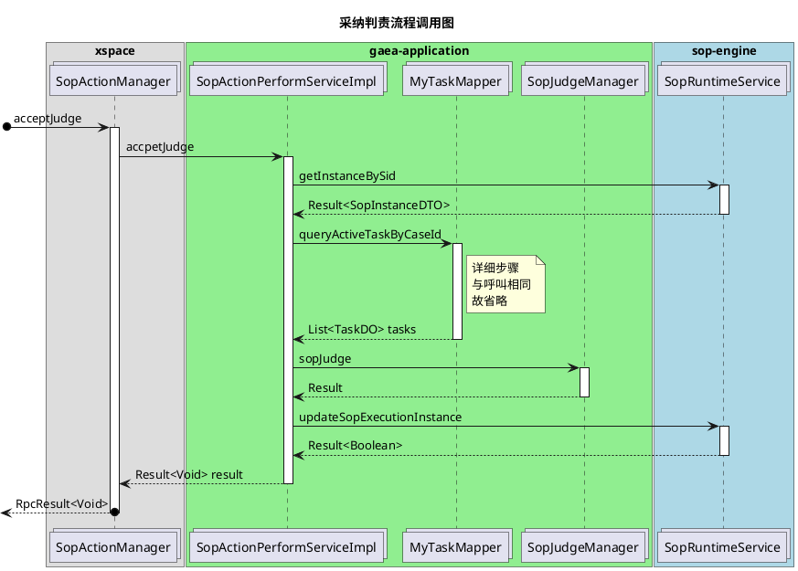

### 2.7 不采纳判责

主要请求path:`/rejectJudge`;输入参数:sessionId、caseId、memo

与采纳判责基本相同。不过多了工单执行动作的记录。上面调用流程详细。不做过多记录

### 2.8 取消裹裹订单
主要请求path:`/cancelGuoguo`；输入参数:caseId


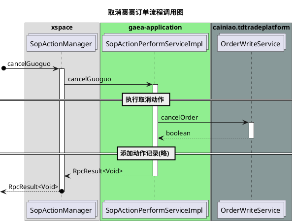

### 2.9 驿站添加白名单
主要请求path:`/addToStationWhiteList`;输入参数:caseId,HttpServletRequest。

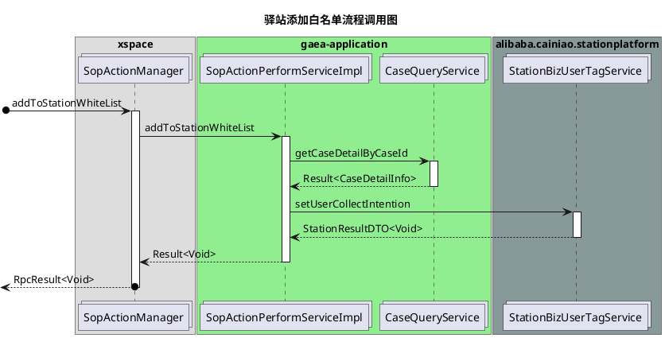


### 2.10 申请菜鸟介入
主要请求path:`/applyCnDealerStepIn`;输入参数caseId,taskId,memo,request

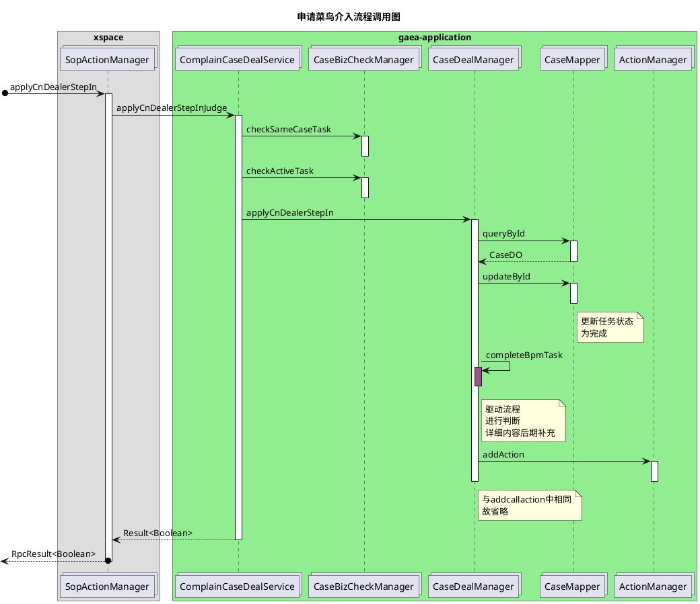

### 2.11 裹裹呼叫运力
主要请求路径`/callOutTransport`;输入参数caseId。

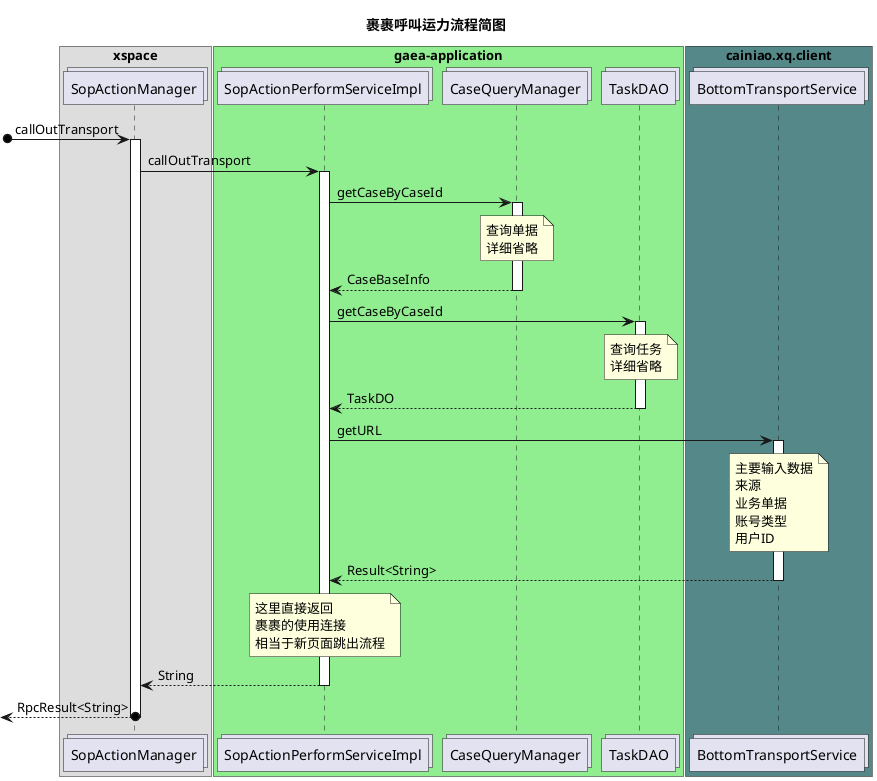


### 2.12 加载留言模板 
主要请求路径:`/loadSpeechTemplateContent`;输入参数:templateId、caseId
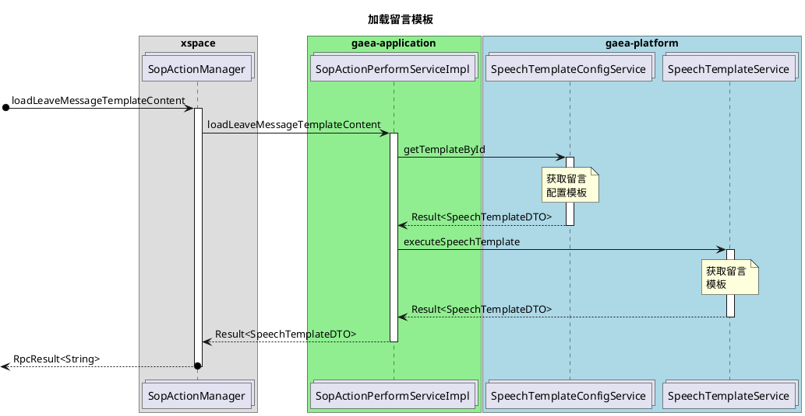


### 2.13 结单（咨询工单完结）
主要请求路径:`/finishTask`;输入参数:caseDealEntity,sessionId,request

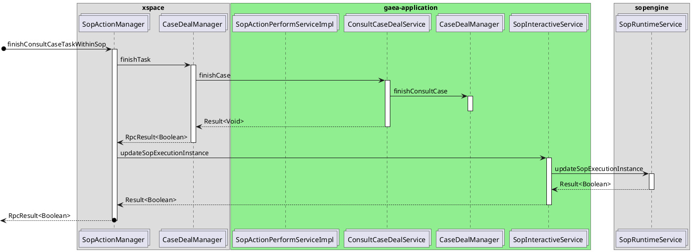


### 2.14 申请SP小二介入

主要请求路径:`/transferToSpXiaoEr`;输入参数:caseId、taskId、sessionId、request

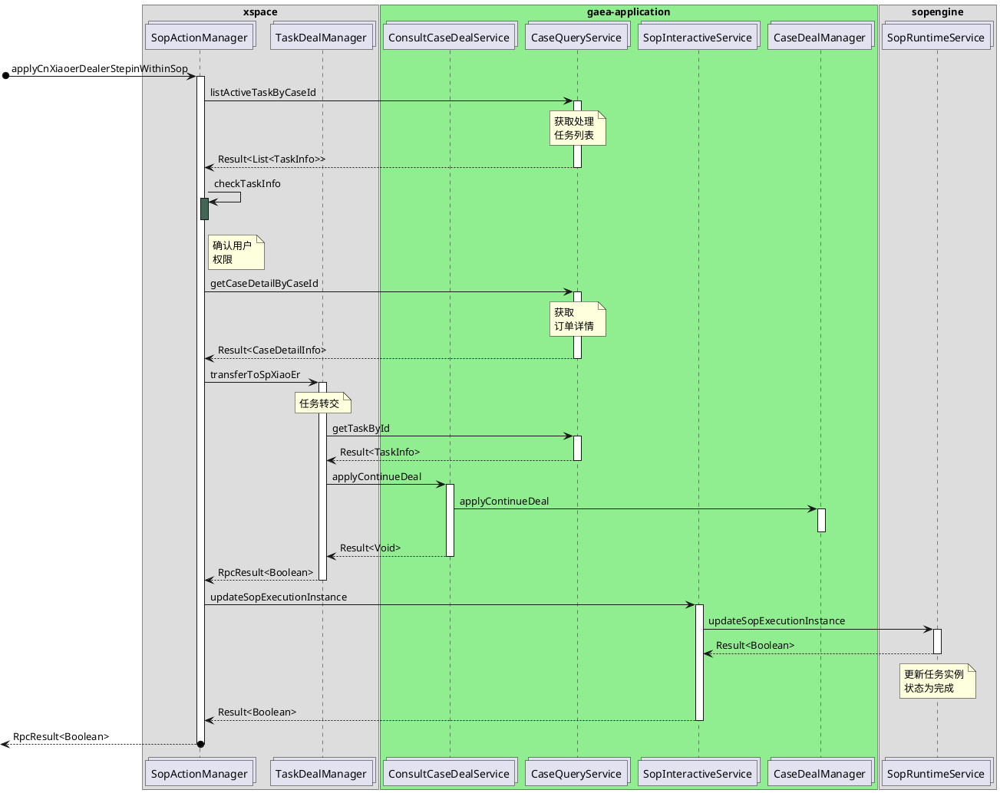

### 2.15 预览发短信

`/previewText`

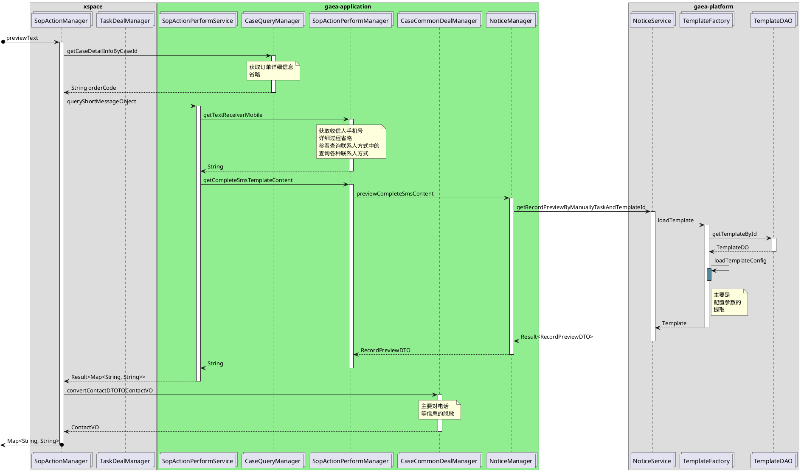

### 2.16 sop内发起投诉动作
`/createComplain`
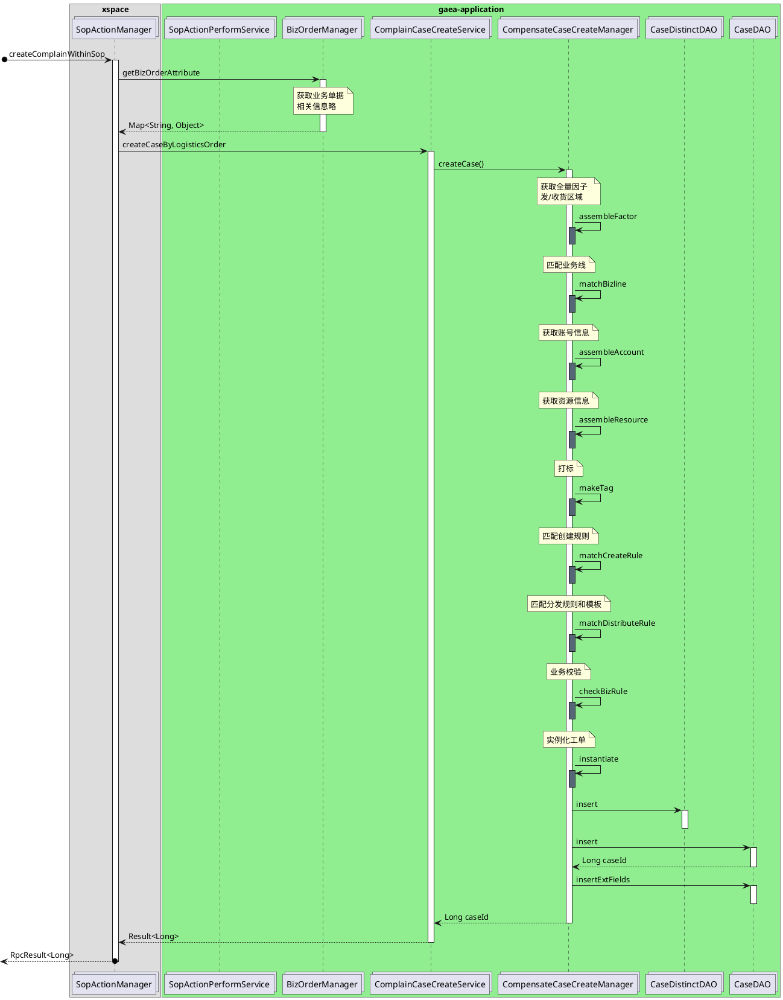


### 2.17 查询裹裹允许修改的时间范围

请求路径:`/queryGuoguoAllowTime`

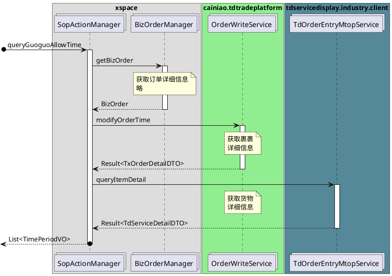


### 2.18 修改裹裹上门时间
请求路径:`/modifyDropInTime`

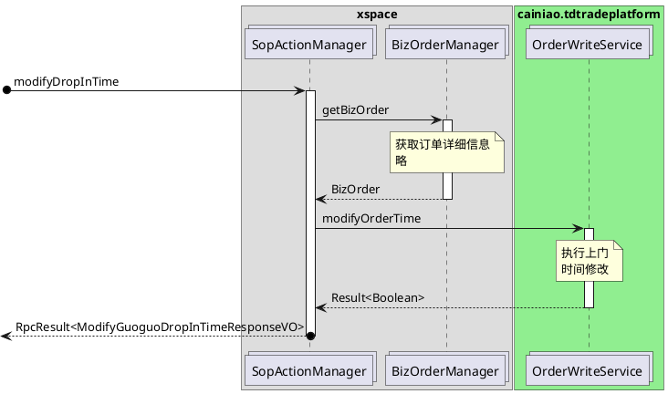

### 2.19 驿站取消白名单

与添加白名单基本相同；故不做太多记录


### 2.20 转交cp
主要路径:/transferFlowToCp;主要的请求参数是caseId
应该是交给application 应用更改数据库的执行人权限。

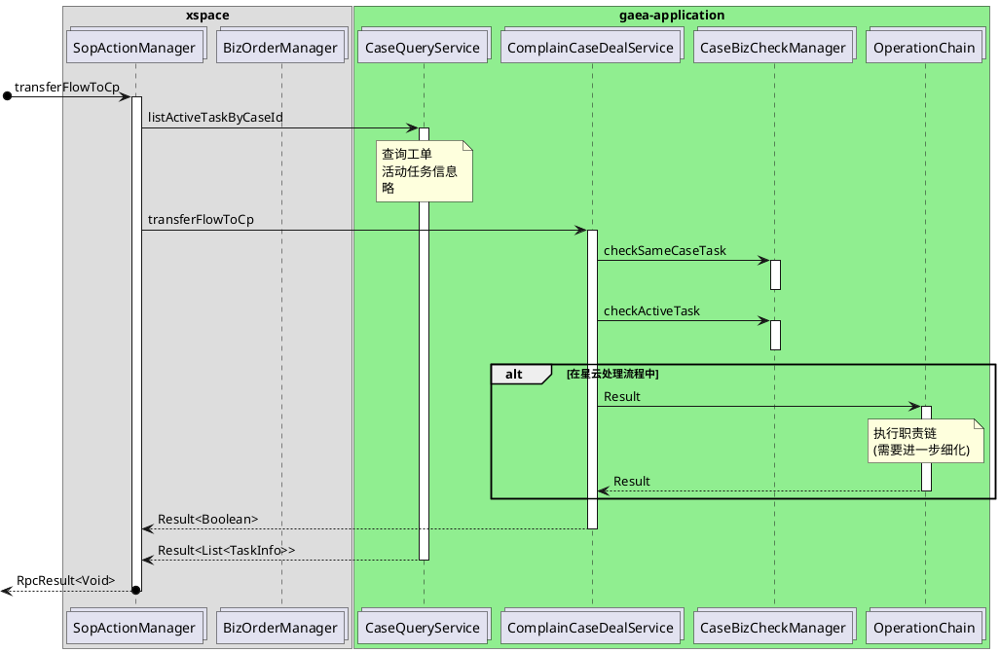


### 2.21 评价sop
主要请求路径:`/evaluateSop`;
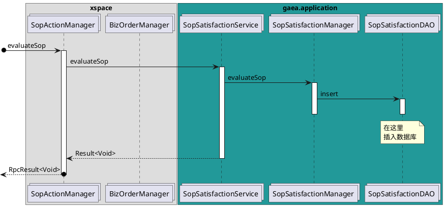


### 2.22 获取sop不满意类型
主要请求路径:`/getSopDownVoteType`
直接输出`SopDownVoteTypeEnum`枚举类中数据。无太多调用


### 2.23 发送留言信息

主要请求路径:`/caseDeal/newMessage`

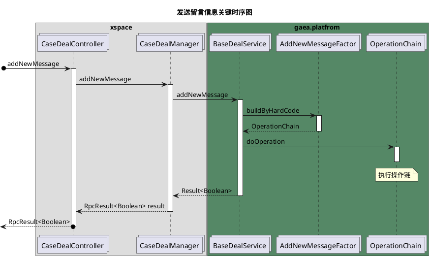

### 2.24 获取技能组

主要请求路径：`listXSpaceTransferSkillGroup`

```plantuml
@startuml
box xspace
collections "TaskDealManager" as TaskDealManager

end box
box gaea-application #LightBlue 
collections "BackDoorService" as BackDoorService
collections "XspaceToSpSkillGroupConfig" as XspaceToSpSkillGroupConfig
end box

box gaea-platfrom #LightGreen
collections "GroupManageService" as GroupManageService
collections "GroupMapper" as GroupMapper
end box

' 开始流程
[o->TaskDealManager: listXSpaceTransferSkillGroup
activate TaskDealManager
TaskDealManager -> BackDoorService :listXSpaceTransferSkillGroup
activate BackDoorService
BackDoorService -> XspaceToSpSkillGroupConfig :getSkillGroupMap
activate XspaceToSpSkillGroupConfig
note over XspaceToSpSkillGroupConfig
这里是通过
Diamond进行
数据的获取
end note

return List<Long>
loop id : List<Long>
BackDoorService -> GroupManageService:getGroupById
activate GroupManageService
GroupManageService -> GroupMapper:selectByPrimaryKey
activate GroupMapper
return Group
return Result<Group>
end loop
note over GroupManageService
获取技能组
详细信息
end note
return Result<List<SkillGroup>>

return  RpcResult<List<SkillGroup>>
@enduml
```


## 3 主要动作流程和请求发送

### 3.0 SOP判责助手
主要步骤:
1. 点击SOP判责按钮
2. 查询SOP评价信息:`action/getSopDownVoteType`
3. 展示播放界面:`sopPlay/play`


### 3.1 留言
主要步骤如下
1. 获取用户账号信息:`/getOutBound`
2. 获取留言模板:`/action/loadSpeechTemplateContent`
3. 点击发送留言信息:`/caseDeal/newMessage`执行留言


### 3.2 外呼

外呼这里有两个主要动作：
1. 获取外呼号码:`action/getOutBound`
2. 进行外呼和转接:`action/call`；注意x-space中这里并没有执行
3. 添加外呼动作记录:`action/addCallAction`

注意:这里的外呼节点存在问题：

SOP播放内的外呼只有`action/addCallAction`,并没有调用`action/call`
SOP外的外呼是调用`caseCommonDeal/outBoundCallExecute`

SOP播放中的应该没有执行`call`只是添加了一次记录。所以外呼是真的打出去了吗。

外面的外呼按钮主要动作有:
1. 页面加载时获取外呼信息:`caseCommonDeal/getOutBound`
2. 执行外呼:`caseCommonDeal/outBoundCallExecute`

### 3.3 发短信
1. 获取短信模板:`action/previewText`
2. 获取收信人列表:`action/listTextReceiver`
3. 发送短信:`action/text`

### 3.4 采纳SOP判责结论


### 3.5 不采纳SOP判责结论


### 3.6 代叫运力(裹裹呼叫运力)
1. 运力调度:`action/callOutTransport`


### 3.7 取消裹裹订单
1. 直接取消订单:`action/cancelGuoguo`


### 3.8 申请菜鸟小二介入
1. 确认任务技能组: `taskDeal/checkGetSkillGroup`
2. 技能组列表:`action/listXSpaceTransferSkillGroup`
3. 点击确定：申请小二介入:`actions/transferToSpXiaoEr`

注意:在cdesk中直接确认就好；没有技能组选项。

### 3.9 咨询工单完结
1. 获取留言模板:`/action/loadSpeechTemplateContent`
2. 点击确认咨询完结工单:`/action/finishTask`
3. 咨询完结工单的上传附件:
   1. `common/getOssTempPolicy`
   2. `https://56newroute.oss-cn-shanghai.aliyuncs.com/`

注意:这里点击之后就是工单完结；之后交给流程引擎来处理。但是100%返回成功。

### 3.10 工单挂起

1. 获取挂起信息:`taskDeal/listRemindType`
2. 点击确定执行:`taskDeal/setReminder`

### 3.11  发起投诉
1. 点击发起投诉按钮；获取订单信息和支持的投诉类型:
   1. 获取物流订单号:通过caseDeatial获取
   2. 投诉方:`com.cainiao.gaea.platform.spi.common.constant.CustomerRoleEnum`
    ```java
    /* 消费者(买家) */
    CONSUMERS(DictionaryConstants.ROLE_CONSUMERS, "买家"),
    /*商家 */
    SELLER(DictionaryConstants.ROLE_SELLER, "商家"),
    /*菜鸟合作伙伴*/
    CP(DictionaryConstants.ROLE_CP, "菜鸟合作伙伴"),

    OTHER(DictionaryConstants.ROLE_OTHERS,"其它");
    ```
   3. 服务类型:
   4. 投诉原因:memo
   5. 上传凭证:附件链接
2. 点击确定:`/createComplain`发送投诉

问题：如何获取业务投诉类型bizType列表


### 3.12 修改上门时间
1. 点击修改上门时间:查询可以上门时间:`action/queryGuoguoAllowTime`
2. 选择时间，点击确认:`action/modifyDropInTime`


### 3.13 添加驿站白名单


### 3.14 取消驿站白名单


### 3.15 下发CP举证


### 存在问题记录


1. 其中的应用名称需要修改
2. 云小二角色使用适配器模式来进行修改
3. 发起sop内投诉角色是小二。
4. TxOrder是什么
5. 流程转交到CP的时候；中的CaseDealManager中的transferFlowToCp中的代码段是否成立；什么情况下不会成立；条件有哪些？
6. CaseDealManager中的职责链处理需要重点查看
7. SOP不满意类型；直接在枚举类中定义SopDownVoteTypeEnum，不方便扩展
8. SOP播放内的外呼只有`action/addCallAction`,并没有调用`action/call`；SOP外的外呼是调用`caseCommonDeal/outBoundCallExecute`；SOP播放中的应该没有执行`call`只是添加了一次记录。所以外呼是真的打出去了吗
9.  代叫运力中，点击之后直接弹出新页面；操作完全在另外的页面进行；因此没有任何记录
10. 点击咨询完结工单；出现结单选项。但是出现备注为模板。具体字段如下
```
已运力调度，下单信息为${gaeaBizOrderCode}，接单小件员电话为${deliveryUserPhone}，预计上门时间为${expectDoorTime}，取件码为${pickUpCode}
```
11. 咨询工单完结之后，是马上处于完结状态，还是需要另外判断？？？
12. Xsapce中的申请小二介入中的技能组是；云小二专有的；是否需要根据角色进行适配
13. Xspace中的TaskDealManager中的`listXSpaceTransferSkillGroup` 使用了过时的方法（舒爽）
    1.  **解决方案: 使用cdesk中的申请小二记录的工单记录。**
14. gaea-application中的XspaceToSpSkillGroupConfig中的getDataId基本写死为`XSPACE_TO_SP_SKILL_GROUP_DIAMOND_DATAID`是否正常。
15. 外呼因为是和云小二绑定的，因此SOP中的外呼热线号码固定。所以如何获取非固定的热线号码接口。
16. 


### 需要注意的地方
1. BaseDealService 中的addNewMessage中抽象类的处理
2. Cdesk中用户角色的过滤；进行

## 主要设计方案
### 1. 主要面对问题
1. 不同的动作对于不同的角色，可能存在不同的显示和执行；可能不同，前端渲染可能也不同。
2. 解决方式:使用策略模式,根据角色的不同使用不同的调用方法。
   1. 使用公共默的抽象类实现基本一般的函数通用函数
   2. 对于不同的角色在使用Manager进行控制的时候进行判断。
   3. 在controller层对用户的角色进行判断，然后使用工厂生成不同的对象和类。
   4. 这里使用静态模式进行策略模式工厂([参考](https://www.jianshu.com/p/5ccf1706297d))
   5. 对于新的角色，只需要继承抽象类，并直接对不同的函数进行重载就可以了。
3. 注意cdesk中的基础服务调用中，自带动作记录。因此需要注意。


### cdesk中现在支持的动作组件

- 完结工单:`confirmFinish`
- 申请菜鸟小二介入:`cnDealerStepIn`
- 执行成功:`success`
- 判责成立:`judgeTrue`
- 判责不成立:`judgeFalse`
- 完结:`finish`
- CP认则不认赔
- CP成立非我则
- CP成立非我全则
- CP认则类型不一致
- CP认则认赔
- CP不忍责
- 要求继续处理
- 确认完结:`structFinish`
- CP举证:
- 代叫运力


处理组件列表:

|名称|code|Action|预发校验(是否存在)|
|:---:|:---:|:---|:---:|
|留言|`addNewMessage`|执行成功|是|
|提醒|`remind`|执行成功|是|
|工单撤销|`caseCanncel`|执行成功|否|
|申请菜鸟小二介入|`applyCnDealerStepIn`|申请菜鸟小二介入|是|
|系统外呼|`outBoundCall`|执行成功|是|
|转交|`caseTransfer`|执行成功|是|
|判责|`judge`|判责成立，判责不成立|是|
|sku判责|`judgeCaseByCpWithSku`|判责成立/判责不成立|是|
|定则定损|`warlordCpJudgeAndValue`|CP不认责,CP认责|是|
|继续处理|`continueDeal`|要求继续处理|是|
|确认结单|`confirmFinish`|确认完结|是|
|工单完结(结单)|`caseFinish`|工单完结，完结|是|
|结构化结单(结单)|`structFinish`|执行成功||
|申通测试处理组件|`TestSTOFunction1`|执行成功||
|工单拦截(拦截)|`caseIntercept`|完结||
|统一判责(定责)|`generalJudge`|判责成立，判责不成立||
|批量成立|`batchJudge`|判责成立||
|智能语音外呼(智能外呼)|`SmartCall`|执行成功||
|CP举证|`cpProof`|CP举证||
|工单挂起|`caseHangUp`|执行成功||
|任务申领|`taskApply`|执行成功||
|代叫运力|``|||
|承诺解决时间|`promiseSloveTime`|完结工单||
|异常原因确认|`errorConfirm`|完结工单||


|名称|类型|优先级|完成状况|测试状况|
| --- | --- | --- | --- | --- |
|采纳SOP判责结论|SOP|高|完成||
|不采纳SOP判责结论|SOP|高|完成||
|咨询完结工单|SOP|高|完成||
|申请菜鸟小二介入|SOP|高|完成||
|工单挂起|SOP||完成(获取提醒类型由前端获取)||
|留言|SOP||完成|成功|
|外呼|SOP||完成||
|发起投诉|SOP||完成||
|发短信|SOP||完成|成功|
|代叫运力(裹裹呼叫运力)|SOP||完成|成功|
|添加驿站白名单|SOP||完成||
|取消驿站白名单|SOP||完成||
|取消裹裹订单|SOP||完成|失败，总是返回false；orderWriteService异常|
|修改上门时间|SOP||完成||
|下发CP举证|SOP||||

sop播放: 测试成功
sopmetch:测试成功


获取sku信息

function/structJudge/getSkuMessage

**取消驿站白名单，使用的是驿站ID**

查询裹裹上门时间只有LP单才可以

m.cainiao.gaea.cdesk.cainiao.biz.manager.sop.impl.SopPlayManagerImpl.matchSop checkAndGetCurrentUserTaskInfo Failed;message:User is all 没有权限

package com.cainiao.xq.client.ability;

import com.cainiao.xq.client.basebean.Result;
import com.cainiao.xq.client.request.BottomTransportRequest;

public interface BottomTransportService {
    Result<Boolean> getIsShow(BottomTransportRequest var1);

    Result<String> getURL(BottomTransportRequest var1);
}
```java
 // 呼叫裹裹运力
public String callOutTransport(Long caseId) {

        CaseBaseInfo caseBaseInfo = caseQueryManager.getCaseByCaseId(caseId);
        String bizOrderCode = caseBaseInfo.getBizOrderCode();
        TaskDO taskDO = taskDAO.queryCurrentActiveTaskByCaseId(caseId);

        BottomTransportRequest bottomTransportRequest = new BottomTransportRequest();
        //来源
        bottomTransportRequest.setSource(XSPACE);
        //业务单据
        bottomTransportRequest.setBizCode(bizOrderCode);
        //账号类型
        bottomTransportRequest.setAccoutType(UIC);
        //用户ID
        bottomTransportRequest.setUserId(taskDO.getDealerId());

        //调用小乔的获取呼叫运力的URL
        com.cainiao.xq.client.basebean.Result<String> result = bottomTransportService.getURL(bottomTransportRequest);
        if (!result.isSuccess() || result.getData() == null) {
            logger.error("bottomTransportService Failed to getURL, caseId={}", caseId, result.getDetailMsg());
            throw new InvokeFailedBizException("bottomTransportService Failed to getURL" + result.getDetailMsg());
        }
        return result.getData();
        // 为什那么没有加动作记录？没有这个动作

}
```