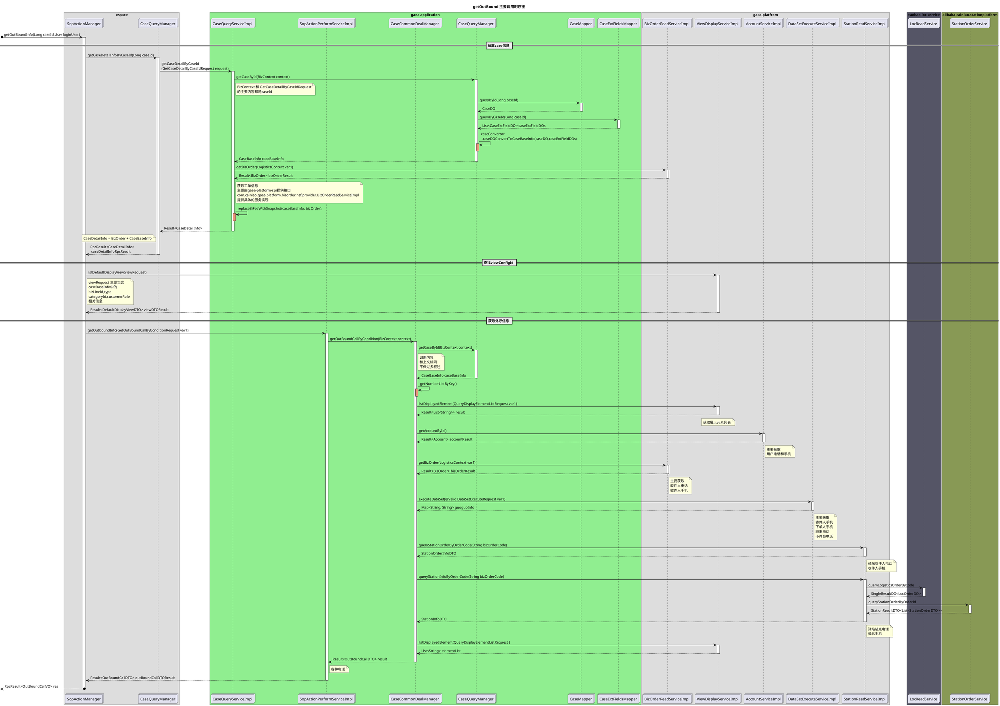
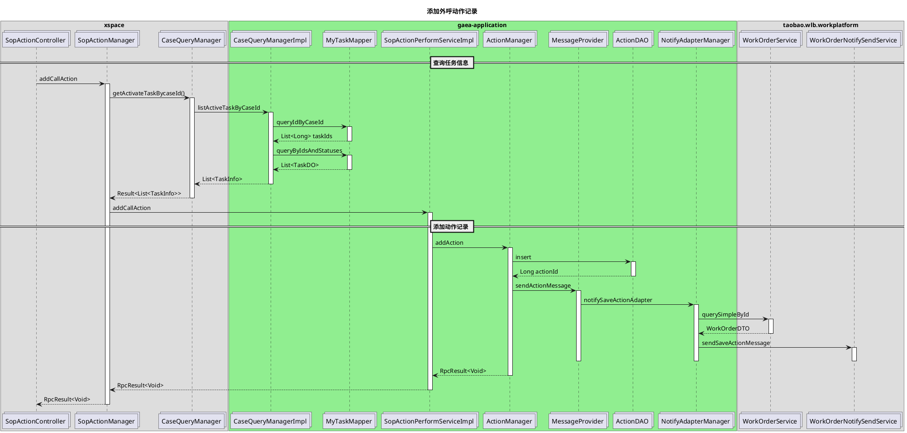
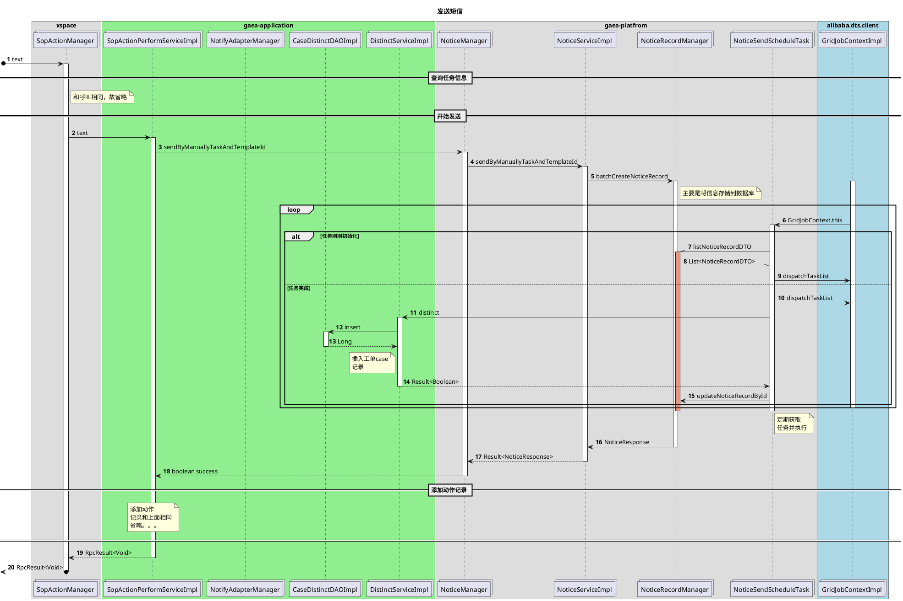

# SOP迁移想法关键节点记录

## sopengine中的引擎可能需要修改

## 查找C-desk中的动作按钮和各种驱动方式


## 3. SOP动作关键节点链路梳理

XSPACE 已有动作节点

1. [x] 留言
2. [x] 外呼
3. [x] 发短信
4. [x] 采纳SOP判责结论
5. [x] 不采纳SOP判责结论
6. [X] 代叫运力(裹裹呼叫运力)
7. [x] 取消裹裹订单
8. [X] 申请菜鸟小二介入
9. [x] 咨询工单完结
10. [x] 工单挂起
11. [x] 发起投诉
12. [x] 修改上门时间
13. [x] 添加驿站白名单
14. [x] 取消驿站白名单
15. [ ] 下发CP举证
16. [ ] 转交CP(没有要求)
17. [ ] 评价sop(没有要求)


## 关键代码函数调用链

### 2.1 获取联系人数据
获取联系人的数据;`/getOutBound`



### 2.2 外呼的主要流程时序图

外呼的主要链接api: `/action/call`
```plantuml
@startuml
title 外呼主要流程时序图
' xspace
box xspace
collections "SopActionController" as SopActionController
collections "SopActionManager" as SopActionManager
'
collections "CaseQueryManager" as CaseQueryManager

end box
' gaea-apllication

box gaea-application #LightGreen
collections "CaseQueryManagerImpl"  as CaseQueryService
collections "MyTaskMapper" as MyTaskMapper
collections "SopActionPerformServiceImpl" as SopActionPerformService
collections "SopActionPerformManager" as SopActionPerformManager
collections "ActionManager" as ActionManager
end box

box "cxdc.xspace.account" #LightBlue
collections "CenterXspaceServicerService" as CenterXspaceServicerService
end box

box "xspacehotline" #Light
collections "XspaceHotlineCommonService" as XspaceHotlineCommonService
end box

== 查询任务信息 ==
SopActionController -> SopActionManager : call()
activate SopActionManager
'获取TaskId
SopActionManager -> CaseQueryManager : getActivateTaskBycaseId()
activate CaseQueryManager

CaseQueryManager -> CaseQueryService : listActiveTaskByCaseId
activate CaseQueryService

CaseQueryService -> MyTaskMapper : queryIdByCaseId
activate MyTaskMapper
return List<Long> taskIds
CaseQueryService -> MyTaskMapper : queryByIdsAndStatuses
activate MyTaskMapper
return List<TaskDO>

return List<TaskInfo>
return Result<List<TaskInfo>>
== 执行外呼 ==
' 执行外呼
SopActionManager -> SopActionPerformService : executeOutbound
activate SopActionPerformService

SopActionPerformService -> SopActionPerformManager : call
activate SopActionPerformManager
SopActionPerformManager -> CenterXspaceServicerService : getServicerByUicId
activate CenterXspaceServicerService
note right of CenterXspaceServicerService
主要获取
serviceId
hotLineNumber
calledNumber
end note
return XspaceServicerDO
SopActionPerformManager -> XspaceHotlineCommonService : sendCommandToXspace
note right of XspaceHotlineCommonService
执行命令
end note
activate XspaceHotlineCommonService
return Result<JSONObject> commandToXspace
SopActionPerformManager -> ActionManager : addAction
' 存储动作
activate ActionManager 
note right of ActionManager
添加动作记录
end note
deactivate
==  ==
return RpcResult<Void>
return RpcResult<Void>
return RpcResult<Void>
@enduml
```

### 2.3 添加外呼动作记录

主要动作链接`/addCallAction`

### 2.4 发短信

主要对应的链接:`/action/text`


### 2.5 获取收信人列表
主要是根据caseId查询工单信息；主要path：`/listTextReceiver`

```plantuml
@startuml
title 获取收信人列表时序图

' xspace
box xspace
collections "SopActionManager" as SopActionManager
end box
' gaea-apllication
box "gaea-application" #LightGreen
collections "SopActionPerformServiceImpl" as SopActionPerformService
'collections "SopActionPerformManager" as SopActionPerformManager
collections "CaseQueryManager" as CaseQueryManager
collections "CaseMapper" as CaseMapper
collections "CaseExtFieldsMapper" as CaseExtFieldsMapper
collections "OrderSenderStrategy" as OrderSenderStrategy
collections "GuoguoManager" as GuoguoManager
end box

box "gaea-platform" #LightRed
collections "ResourceServiceImpl" as ResourceService
collections "AccountServiceImpl" as AccountService
collections "BizOrderReadService" as BizOrderReadService
collections "StationReadService" as StationReadService
end box

box "taobao.wlb.res.client" #LightBlue 
collections "ResourceReadService" as ResourceReadService
end box

box "cainiao.tdtradeplatform" #899
collections "TdTradeQueryService" as TdTradeQueryService
end box 

box "taobao.loc.service" #556
collections "LocReadService" as LocReadService
end box
box "alibaba.cainiao.stationplatform" #895
collections "StationOrderService" as StationOrderService
end box

' 开始请求
autonumber 
[o-> SopActionManager : listTextReceiver
activate SopActionManager

SopActionManager -> SopActionPerformService:listTextReceiver
activate SopActionPerformService

== 查询工单信息 ==
SopActionPerformService -> CaseQueryManager : getCaseByCaseId
activate CaseQueryManager
CaseQueryManager -> CaseMapper : queryById
activate CaseMapper
return CaseDO
CaseQueryManager -> CaseExtFieldsMapper : queryByCaseId
activate CaseExtFieldsMapper

note right of CaseExtFieldsMapper
获取额
外属性信息
主要是判责
end note

return List<CaseExtFieldDO> feature
' 填充判责信息
alt ParamsUtil.isNotEmpty(feature)
    loop ResponsibilityParty : List<ResponsibilityParty>
        alt responsibilityParty.getRole() == CP
            CaseQueryManager -> ResourceService : getResourceById
            activate ResourceService
            ResourceService -> ResourceReadService : cacheGetResourceById
            activate ResourceReadService
            return ResourceDTO
            return resourceName
        else 其它角色
            CaseQueryManager -> AccountService : getAccountById
            activate AccountService
            return accountName
        end alt
    end loop
end alt

note right of CaseQueryManager
主要提取
判责方
end note

return CaseBaseInfo

note right of SopActionPerformService
主要是获取
bizOrderCode
用来查询电话
end note
' 开始查询工单中不同角色的电话
== 查询各种联系人方式 ==

' 获取订单寄件人
SopActionPerformService -> OrderSenderStrategy :getMobile
activate OrderSenderStrategy
OrderSenderStrategy -> BizOrderReadService : getBizOrder
activate BizOrderReadService
return Result<BizOrder>
return String mobile

' 获取订单收件人
SopActionPerformService -> OrderSenderStrategy :getMobile
activate OrderSenderStrategy
OrderSenderStrategy -> BizOrderReadService : getBizOrder
activate BizOrderReadService
return Result<BizOrder>
return String mobile

' 获取订单下单人

SopActionPerformService -> OrderSenderStrategy :getMobile
activate OrderSenderStrategy
OrderSenderStrategy -> GuoguoManager : getOrderPlacerMobile
activate GuoguoManager
GuoguoManager -> BizOrderReadService :getBizOrder
activate BizOrderReadService
return BizOrder
GuoguoManager -> TdTradeQueryService : queryTdOrderByBuyerIdAndOrderId
activate TdTradeQueryService


return TdOrder
note right of GuoguoManager
主要是获取
ggUserId
accountDomain
end note

GuoguoManager -> AccountService: getAccountById
activate AccountService
return Result<Account>

return String moblie
return String mobile

' 获取驿站手机
SopActionPerformService -> StationReadService : queryStationInfoByOrderCode
activate  StationReadService

StationReadService -> LocReadService : queryLogisticsOrderByCode
activate LocReadService
return SingleResultDO<LocOrderDO> 
StationReadService -> StationOrderService :queryStationOrderByOrderId
activate StationOrderService

return StationResultDTO<List<StationOrderDTO>>

return stationInfoDTOResult

' note right of SopActionManager
' 和呼叫相同，故省略
' end note
==  ==
return Result<List<ContactDTO>>
return RpcResult<List<ContactVO>>
@enduml
```

### 2.6 采纳判责

根据处理实例；采纳判责；主要请求path:`/accpetJudge`；主要输入是`CaseDealEntity`

```plantuml
@startuml
title 采纳判责流程调用图

' xspace
box xspace
collections "SopActionManager" as SopActionManager
end box
' gaea-apllication
box "gaea-application" #LightGreen
collections "SopActionPerformServiceImpl" as SopActionPerformService
'collections "SopActionPerformManager" as SopActionPerformManager
collections "CaseQueryManager" as CaseQueryManager
collections "CaseMapper" as CaseMapper
collections "CaseExtFieldsMapper" as CaseExtFieldsMapper
collections "OrderSenderStrategy" as OrderSenderStrategy
collections "GuoguoManager" as GuoguoManager
end box

box "gaea-platform" #LightRed
collections "ResourceServiceImpl" as ResourceService
collections "AccountServiceImpl" as AccountService
collections "BizOrderReadService" as BizOrderReadService
collections "StationReadService" as StationReadService
end box

box "taobao.wlb.res.client" #LightBlue 
collections "ResourceReadService" as ResourceReadService
end box

box "cainiao.tdtradeplatform" #899
collections "TdTradeQueryService" as TdTradeQueryService
end box 

box "taobao.loc.service" #556
collections "LocReadService" as LocReadService
end box
box "alibaba.cainiao.stationplatform" #895
collections "StationOrderService" as StationOrderService
end box

' 开始流程
[o-> SopActionManager : acceptJudge
activate SopActionManager
return RpcResult<Void>

@enduml
```

### 2.7 不采纳判责

主要请求path:`/rejectJudge`;输入参数:sessionId、caseId、memo


### 2.8 取消裹裹订单
主要请求path:`/cancelGuoguo`；输入参数:caseId

### 2.9 驿站添加白名单
主要请求path:`/addToStationWhiteList`;输入参数:caseId,HttpServletRequest。
### 2.10 申请菜鸟介入
主要请求path:`/applyCnDealerStepIn`;输入参数caseId,taskId,memo,request

### 2.11 裹裹呼叫运力
主要请求路径`/callOutTransport`;输入参数caseId。

### 2.12 加载留言模板 
主要请求路径:`/loadSpeechTemplateContent`;输入参数:templateId、caseId

### 2.13 结单（咨询工单完结）
主要请求路径:`/finishTask`;输入参数:caseDealEntity,sessionId,request

### 2.14 申请菜鸟介入

主要请求路径:`/transferToSpXiaoEr`;输入参数:caseId、taskId、sessionId、request

### 3.1 留言
留言主要分为两步:
1. 获取留言模板
2. 获取用户账号信息


### 3.2 外呼

外呼这里有两个主要动作：
1. 获取用户外呼列表
2. 进行外呼和转接
3. 添加外呼动作记录
其UML关键节点如下:

