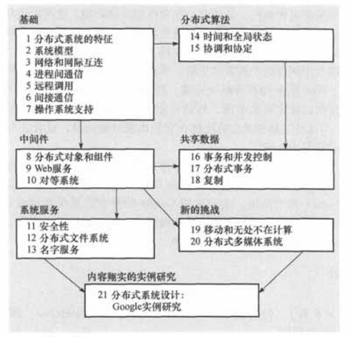

---
layout:     post
title:      分布式系统概念与设计学习笔记(一)
subtitle:   分布式系统概念与设计学习笔记(一)
date:       2020-08-05
author:     王鹏程
header-img: img/post-bg-ios10.jpg
catalog: true
tags:
    - 分布式系统
    - 读书笔记
    - 学习笔记
---

# 分布式系统概念与设计学习笔记(一)

_参考链接:_ 
- [书籍地址](https://github.com/wornxiao/IT_tech_Book/blob/master/%E5%88%86%E5%B8%83%E5%BC%8F%E7%B3%BB%E7%BB%9F%E6%A6%82%E5%BF%B5%E4%B8%8E%E8%AE%BE%E8%AE%A1%20%E5%8E%9F%E4%B9%A6%E7%AC%AC5%E7%89%88.pdf)

## 前言

分布式系统:其组件分布在联网的计算机上，组件之间通过消息传递进行通信和动作协调。

分布式系统的特点:
- 并发：
- 缺乏全局时钟：
- 故障的独立性

分布式系统的挑战:
- 异构性:在异构的计算机和网路上访问服务和运行应用程序。
- 开放性:能够加入和删除新的节点和计算机
- 安全性:
    - 网络的安全
    - 移动代码的安全
- 可伸缩性
    - 控制物理资源的开销
    - 控制性能损失
    - 防止软件资源用尽
    - 避免性能瓶颈
- 故障处理:
    - 遮掩故障
    - 容错
    - 故障恢复
    - 冗余:利用冗余组件，服务器可以实现容错。
- 并发性:
- 透明性:对于操作人员应该是一个整体。
- 服务质量:
    - 可靠性;安全性;性能

