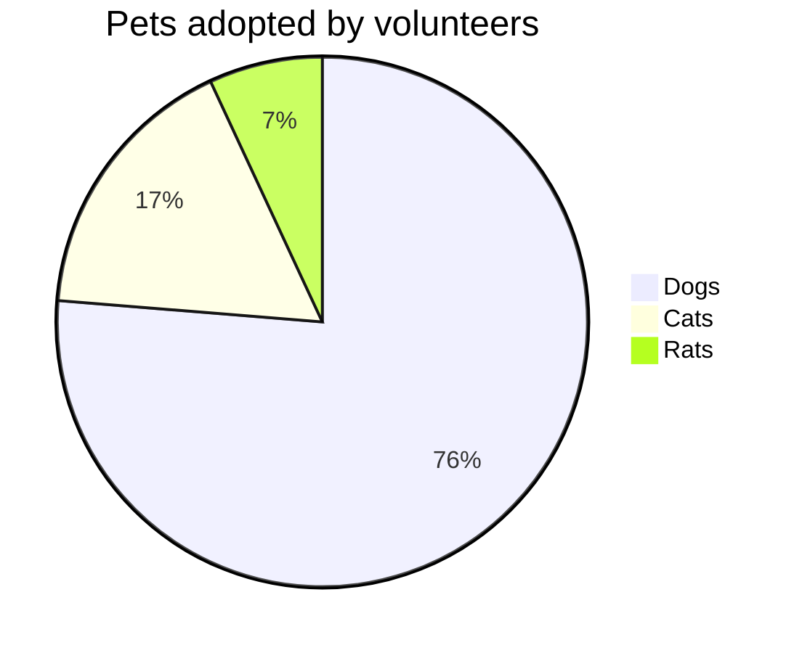

# jekyll-spcaeship功能测试

__参考链接__:
- [jekyll-spaceship插件说明](https://github.com/jeffreytse/jekyll-spaceship)
- [GitHub Action自动编译](https://github.com/jeffreytse/jekyll-deploy-action)
- [jekyll官方网站](https://jekyllrb.com/)
- [jekyll mac安装说明](https://jekyllrb.com/docs/installation/macos/)
- [标准状况地址](https://github.com/jeffreytse/jekyll-spaceship/edit/master/README.md)


### Table测试

|              Stage | Direct Products | ATP Yields |
| -----------------: | --------------: | ---------: |
|         Glycolysis |          2 ATP              ||
| ^^                 |          2 NADH |   3--5 ATP |
| Pyruvaye oxidation |          2 NADH |      5 ATP |
|  Citric acid cycle |          2 ATP              ||
| ^^                 |          6 NADH |     15 ATP |
| ^^                 |          2 FADH |      3 ATP |
|                               30--32 ATP        |||

#### Multiline

| :    Easy Multiline   : |||
| :----- | :----- | :------ |
| Apple  | Banana | Orange  \
| Apple  | Banana | Orange  \
| Apple  | Banana | Orange
| Apple  | Banana | Orange  \
| Apple  | Banana | Orange  |
| Apple  | Banana | Orange  |

#### Headerless

|--|--|--|--|--|--|--|--|
|♜| |♝|♛|♚|♝|♞|♜|
| |♟|♟|♟| |♟|♟|♟|
|♟| |♞| | | | | |
| |♗| | |♟| | | |
| | | | |♙| | | |
| | | | | |♘| | |
|♙|♙|♙|♙| |♙|♙|♙|
|♖|♘|♗|♕|♔| | |♖|

#### Cell Alignment


| :        Fruits \|\| Food       : |||
| :--------- | :-------- | :--------  |
| Apple      | : Apple : | Apple      \
| Banana     |   Banana  | Banana     \
| Orange     |   Orange  | Orange     |
| :   Rowspan is 4    : || How's it?  |
|^^    A. Peach         ||   1. Fine :|
|^^    B. Orange        ||^^ 2. Bad   |
|^^    C. Banana        ||  It's OK!  |

#### Cell Markdown

Sometimes we may need some abundant content (e.g., mathjax, image, video) in Markdown table
Therefore, here we also make markown syntax possible inside a cell.

| :                   MathJax \|\| Image                 : |||
| :------------ | :-------- | :----------------------------- |
| Apple         | : Apple : | Apple                          \
| Banana        | Banana    | Banana                         \
| Orange        | Orange    | Orange                         |
| :     Rowspan is 4     : || :        How's it?           : |
| ^^     A. Peach          ||    1. ![example][cell-image]   |
| ^^     B. Orange         || ^^ 2. $I = \int \rho R^{2} dV$ |
| ^^     C. Banana         || **It's OK!**                   |

[cell-image]: https://jekyllrb.com/img/octojekyll.png "An exemplary image"

#### Cell Inline Attributes

{:ref-name: #id .cls1 .cls2}
{:second: ref-name #id-of-other title="hallo you"}
{:other: ref-name second}


{: #id .cls1 .cls2} <!-- #id <=> id="id", .cls1 .cls2 <=> class="cls1 cls2" -->
{: ref-name title="hallo you"}
{: ref-name class='.cls3' .cls4}

#### 表格测试

{:color-style: style="background: black;"}
{:color-style: style="color: white;"}
{:text-style: style="font-weight: 800; text-decoration: underline;"}

|:             Here's an Inline Attribute Lists example                :||||
| ------- | ------------------ | -------------------- | ------------------ |
|:       :|:  <div style="color: red;"> &lt; Normal HTML Block > </div> :|||
| ^^      |   Red    {: .cls style="background: orange" }                |||
| ^^ IALs |   Green  {: #id style="background: green; color: white" }    |||
| ^^      |   Blue   {: style="background: blue; color: white" }         |||
| ^^      |   Black  {: color-style text-style }                         |||


### MathJax 测试


$ a * b = c ^ b $

$ 2^{\frac{n-1}{3}} $

$ \int\_a^b f(x)\,dx. $

### PlantUML测试

```plantuml!
Bob -> Alice : hello world
```
OR

@startuml
Bob -> Alice : hello
@enduml

### Mermaid Usage



@startmermaid
pie title Pets adopted by volunteers
  "Dogs" : 386
  "Cats" : 85
  "Rats" : 35
@endmermaid


### Media Usage


### Hybrid HTML with Markdown

<script type="text/markdown">
# Hybrid HTML with Markdown is a not bad choice ^\_^

## Table Usage

| :        Fruits \|\| Food       : |||
| :--------- | :-------- | :--------  |
| Apple      | : Apple : | Apple      \
| Banana     |   Banana  | Banana     \
| Orange     |   Orange  | Orange     |
| :   Rowspan is 4    : || How's it?  |
|^^    A. Peach         ||   1. Fine :|
|^^    B. Orange        ||^^ 2. Bad   |
|^^    C. Banana        ||  It's OK!  |

## PlantUML Usage

@startuml
Bob -> Alice : hello
@enduml

## Video Usage


</script>


### 7. Markdown Polyfill

Normal:

1. List item Apple.
3. List item Banana.
10. List item Cafe.

Escaped:

\1. List item Apple.
\3. List item Banana.
\10. List item Cafe.


### 8. Emoji Usage

I give this plugin two :+1:!


jekyll-spaceship:
  emoji-processor:
    src: "/assets/images/emoji"


### Modifying Element Usage

# Here is a comprehensive example

jekyll-spaceship:
  element-processor:
    css:
      - a: '<h1>Test</h1>'                     # Replace all `a` tags (String Style)
      - ['a.link1', 'a.link2']:                # Replace all `a.link1`, `a.link2` tags (Hash Style)
          name: img                            # Replace element tag name
          props:                               # Replace element properties
            title: Good image                  # Add a title attribute
            src: ['(^.*$)', '\0?a=123']        # Add query string to src attribute by regex pattern
            style:                             # Add style attribute (Hash Style)
              color: red
              font-size: '1.2em'
          children:                            # Add children to the element
            -                                  # First empty for adding after the last child node
            - "<span>Google</span>"            # First child node (String Style)
            -                                  # Middle empty for wrapping the children nodes
            - name: span                       # Second child node (Hash Style)
              props:
                prop1: "1"                     # Custom property1
                prop2: "2"                     # Custom property2
                prop3: "3"                     # Custom property3
              children:                        # Add nested chidren nodes
                - "<span>Jekyll</span>"        # First child node (String Style)
                - name: span                   # Second child node (Hash Style)
                  props:                       # Add attributes to child node (Hash Style)
                    prop1: "a"
                    prop2: "b"
                    prop3: "c"
                  children: "<b>Yap!</b>"      # Add children nodes (String Style)
            -                                  # Last empty for adding before the first child node
      - a.link: '<a href="//t.com">Link</a>'   # Replace all `a.link` tags (String Style)
      - 'h1#title':                            # Replace `h1#title` tags (Hash Style)
          children: I'm a title!               # Replace inner html to new text
