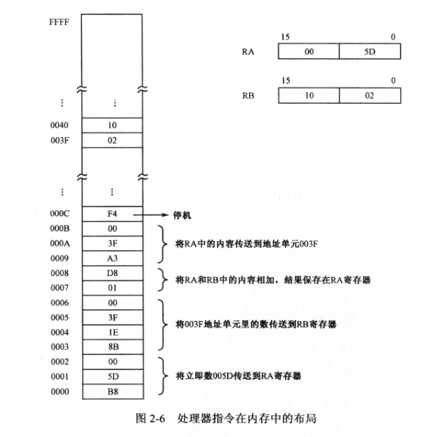

# x86汇编从实模式到保护模式

## _参考连接_
- [书籍地址](https://github.com/sunym1993/flash-linux0.11-talk/blob/main/%E4%B8%80%E4%BA%9B%E9%9D%9E%E5%BF%85%E8%A6%81%E7%9A%84%E8%B5%84%E6%96%99/x86%E6%B1%87%E7%BC%96%E8%AF%AD%E8%A8%80_%E4%BB%8E%E5%AE%9E%E6%A8%A1%E5%BC%8F%E5%88%B0%E4%BF%9D%E6%8A%A4%E6%A8%A1%E5%BC%8F(%E5%AE%8C%E6%95%B4%E6%89%AB%E6%8F%8F%E7%89%88).pdf)

## 第二章 处理器、内存和指令
- 内存存储: 存储器(Storage或Memory) 表示机器中的存储单元，单次访问就能够处理8、16、32位或者64位的二进制数，将数据交给中央处理器进行操作
- 指令和指令集合：处理器接受指令进行运算，不同的指令有着不同的作用，CPU根据指令进行下一步的相关操作，包含操作码和操作数构成，指令长度为1-15字节，主要取决于CPU寄存器的大小，指令参数可以立即从指令中取得称为立即数。处理器可以根据指令知道指令的长度并进行下一次指令的存取
    - 因为处理器与内存之间的数据线连接方式不同造成的大小端：Intel 使用小端进行处理  

- 古老的Intel 8086 处理器：含有8个16位的寄存器，分别为AX、BX、CX、DX、SI、DI、BP、SP
    - 连续的指令集合就是程序的段--代码段
    - 连续的数据的集合--数据段
- 内存分段机制：为了防止不同程序之间的数据相互访问，每个段内地址，只能相对自己所在的段进行地址偏移进行访问
- 代码段寄存器(Code Segment, CS)、数据段寄存器(Data Segment, DS): 支持地址段:偏移地址的内存访问模式，处理器访问内存时将指令中的内存地址当做段内的偏移地址。将DS中的数据段起始地址看做段内的偏移地址
- 