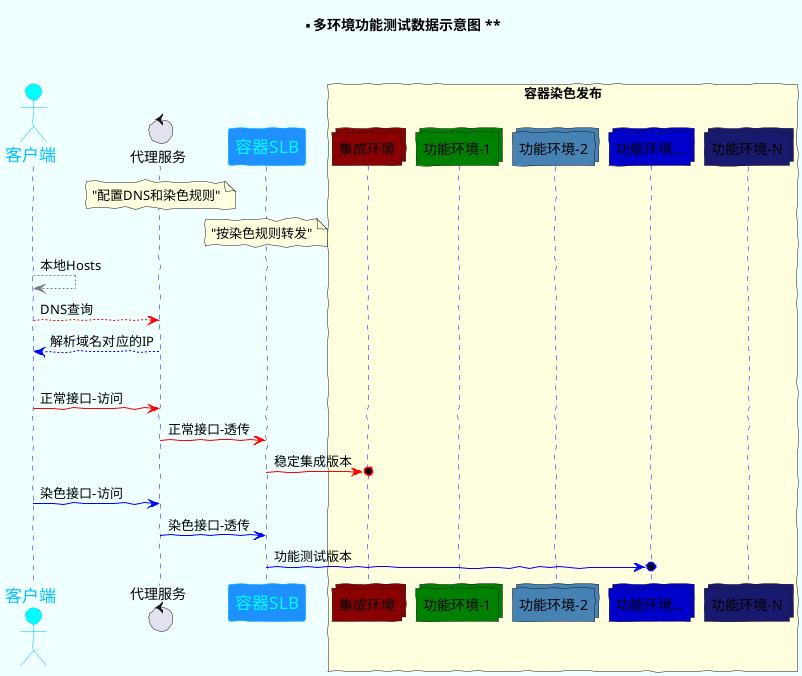
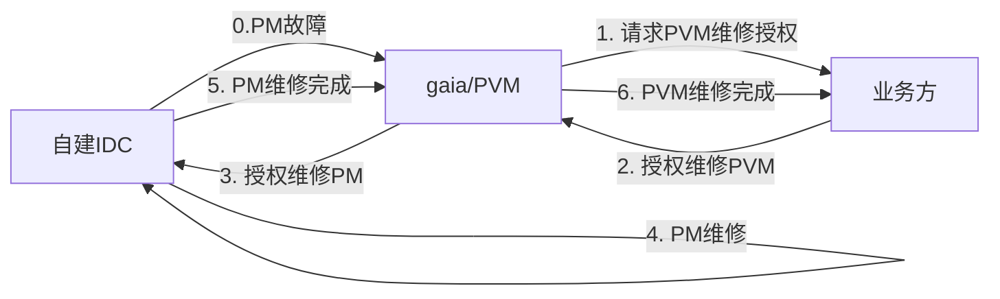
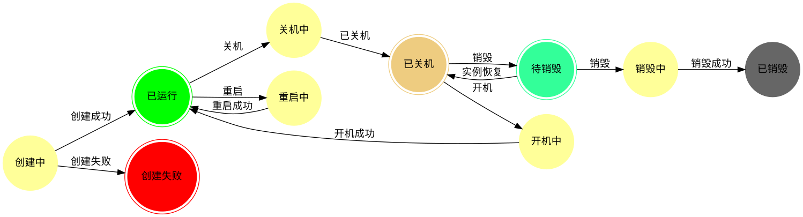

#  TensorRT 加速推理实践 -- YOLO 目标检测
_作者：_ 
## TensorRT 简介
高性能深度学习推断库
## 用法：
输入训练好的模型;主要流程如下


下面输入YOLOv3网络架构：


注意进行视频流处理时，需要及时free内存；

深度学习自动量化:
[深度学习神经网络量化](https://blog.csdn.net/qq_28413479/article/details/77479722)




资源过滤器执行顺序

```plantuml!
skinparam dpi 150
scale 13500 width
scale 2200 height
skinparam conditionStyle InsideDiamond
start
:等待过滤母机;
:1.资源组标签过滤器;
note right
    保证相同资源组标签
    才能进行分配
    无标签只从无标签资源组中分配
end note 
:2.机型过滤;
:3.内存过滤;
:4.母机磁盘过滤;
:5.ip过滤;
if (存在指定安全组) then (yes)
    :6.安全组过滤;
else (no)
endif

if (独占盘数量>0) then (yes)
    :7.独占盘过滤;
else (no)
endif
:8.cpu过滤;
:过滤后母机;
stop
```

母机权重计算排序方法

```plantuml!
skinparam conditionStyle InsideDiamond
start
while (遍历候选母机)
fork 
    :统计母机剩余CPU最大值RemainCpuMax;
    :统计母机剩余CPU最大值RemainCpuMin;
fork again
    :统计母机剩余memory最大值RemainMemoryMax;
    :统计母机剩余memory最小值RemainMemoryMin;
fork again
    :统计母机剩余磁盘最大值RemainDiskMax;
    :统计母机剩余磁盘最小值RemainDiskMin;
fork again
    :统计母机剩余IP数最大值RemainIPMax;
    :统计母机剩余IP数最小值RemainIPMin;

endfork
endwhile

while ( 遍历候选母鸡HOST )
    while (遍历权重指标集合(CPU、Mmeory、Disk、IP))
        :计算HOST[i]单项权重指标,如CPUWeigh;
        note right
            单项权重为均一映射至(0~1)的值
        endnote
    endwhile
    -> 遍历结束;
    :获取leo单项权重系数配置;
    :计算HOST[i]总权重;
    note right
        HOST[i]总权重=SUM(单项权重系数*单项权重均一值)
    endnote
endwhile
-> 遍历结束;
:根据HOST[i]总权重进行排序(降序);
:选出HOST[0]作为最终目标母机;
end
```

技术方案主要逻辑
```plantuml!
!theme bluegray
skinparam conditionStyle InsideDiamond
|<size:24>gaia-net</size>|
start
:录入母机CPU拓扑结构;
|#AntiqueWhite|<size:24>gaia-scheduler</size>|
:...;
partition 母机CPU过滤 {
    if (母机剩余CPU>需要CPU) then (是)
        if (**<color:red><size:14>查询母机机型CPU拓扑结构</size></color>**) then (成功)
            :1.**查询母机剩余可用CPU逻辑核编号**;
            :2.**生成CPU拓扑可用表**;
            if (**可用物理核对应逻辑核总数 > 需要CPU**) then (是)
                :母机CPU过滤成功;
                :...;
                detach
            else (否)
            endif
        else (失败)
        endif
    else (否)
    endif
    :<color:red> <b>过滤失败;
    
}
:...;
partition 目标母机CPUSet生成 {
    if (查询母机机型CPU拓扑结构) then (成功)
        :1.**查询母机剩余可用CPU逻辑核编号**;
        :2.**生成CPU拓扑可用表**;
        :3.**取出前N/2个空闲物理核对应N个逻辑核编号**;
    else (失败)
        :1.可用CPU逻辑编号中取出前N个;
        :...;
    endif
    :返回目标CPU逻辑编号列表;
    :...;
}
end
```


```plantuml!
!theme bluegray
skinparam conditionStyle InsideDiamond
|<size:24>gaia</size>|
start
:录入母机CPU拓扑结构;
|#AntiqueWhite|<size:24>gaia-scheduler</size>|
:...;
partition 母机CPU过滤 {
    if (母机剩余CPU>需要CPU) then (是)
        if (**<color:red><size:14>查询母机机型CPU拓扑结构</size></color>**) then (成功)
            :1.**查询母机剩余可用CPU逻辑核编号**;
            :2.**生成CPU拓扑可用表**;
            if (**可用物理核对应逻辑核总数 > 需要CPU**) then (是)
                :母机CPU过滤成功;
                :...;
                detach
            else (否)
            endif
        else (失败)
        endif
    else (否)
    endif
    :<color:red> <b>过滤失败;
    
}
:...;
partition 目标母机CPUSet生成 {
    if (查询母机机型CPU拓扑结构) then (成功)
        :1.**查询母机剩余可用CPU逻辑核编号**;
        :2.**生成CPU拓扑可用表**;
        :3.**取出前N/2个空闲物理核对应N个逻辑核编号**;
    else (失败)
        :1.可用CPU逻辑编号中取出前N个;
        :...;
    endif
    :返回目标CPU逻辑编号列表;
    :...;
}
end
```


```plantuml!

@startuml 流程图
digraph flowchart {
    # 自建
    host_broken [label="发现母机故障(IDC)", shape="box",style="rounded"];
    xcloud [label="消息事件转发(xcloud)",shape="box",style="rounded"];
     
    shouquwancheng [label="授权完成",shape="box",style="rounded"];
    host_borken_proc[label="查询母机子机",shape="box",style="rounded"]
        subgraph "cluster_request" {
            label="分发授权请求(gaia)"
            style=""
            shape="ellipse"
            pvm1;
            pvm2[ label ="..."];
            pvm3[label="pvmN"];
        };
    host_borken_proc->{ pvm1, pvm2, pvm3 }
    subgraph "cluster_yewu" {
        label="业务方"
        yewu1[label="业务方1"]
        yewu2[label="..."]
        yewu3[label="业务方N"]
    }
   
    shouquan[label="授权请求转发(事件中心)",shape="box",style="rounded"];
    host_broken-> xcloud[label="母机故障消息"];
    pvm1-> shouquan [label="请求授权"];
    pvm2-> shouquan [label="请求授权"];
    pvm3-> shouquan [label="请求授权"];
    xcloud -> host_borken_proc [label="故障通知"];
    shouquan -> { yewu1,yewu2,yewu3 } [label="请求授权"]
    { yewu1,yewu2,yewu3 } -> shouquwancheng [label="授权"]
     
    start_repair [label="维修",shape="box",style="rounded"];
    shouquwancheng -> start_repair [label="通知维修",shape="box",style="rounded"]
    finish_repair[label="维修完成",shape="box",style="rounded"]
    start_repair -> finish_repair [label="维修"]
    inform_uers[label="通知业务方",shape="box",style="rounded"]
    finish_repair-> inform_uers[label="维修完成"];
    
}
@enduml
```

数据图表




