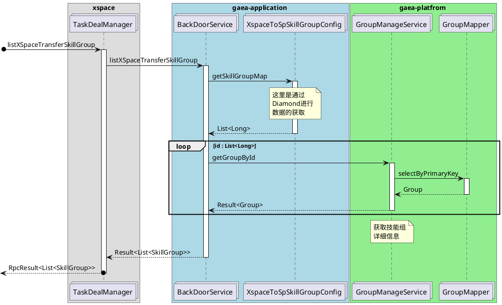

```plantuml
@startuml
box xspace
collections "TaskDealManager" as TaskDealManager

end box
box gaea-application #LightBlue 
collections "BackDoorService" as BackDoorService
collections "XspaceToSpSkillGroupConfig" as XspaceToSpSkillGroupConfig
end box

box gaea-platfrom #LightGreen
collections "GroupManageService" as GroupManageService
collections "GroupMapper" as GroupMapper
end box

' 开始流程
[o->TaskDealManager: listXSpaceTransferSkillGroup
activate TaskDealManager
TaskDealManager -> BackDoorService :listXSpaceTransferSkillGroup
activate BackDoorService
BackDoorService -> XspaceToSpSkillGroupConfig :getSkillGroupMap
activate XspaceToSpSkillGroupConfig
note over XspaceToSpSkillGroupConfig
这里是通过
Diamond进行
数据的获取
end note

return List<Long>
loop id : List<Long>
BackDoorService -> GroupManageService:getGroupById
activate GroupManageService
GroupManageService -> GroupMapper:selectByPrimaryKey
activate GroupMapper
return Group
return Result<Group>
end loop
note over GroupManageService
获取技能组
详细信息
end note
return Result<List<SkillGroup>>

return  RpcResult<List<SkillGroup>>
@enduml
```