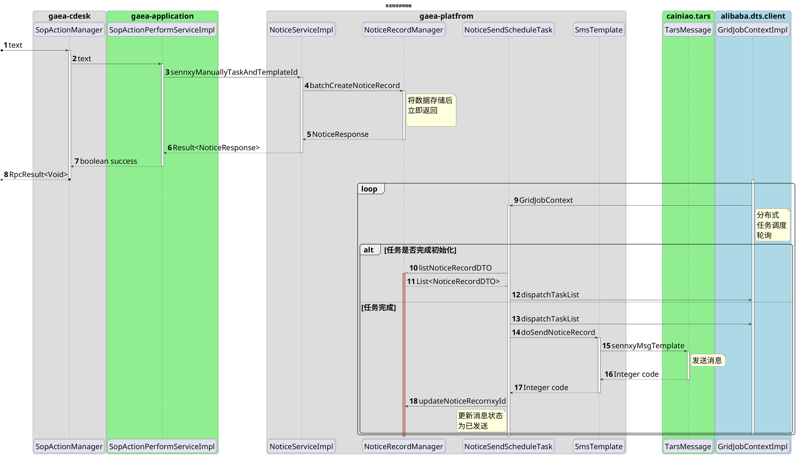

<!-- 

```plantuml
@startuml

skinparam sequenceArrowThickness 1
skinparam roundcorner 20
skinparam classFontColor red
skinparam classFontSize 200
skinparam classFontName Aapex
skinparam defaultFontSize 32
title 发送短信调用链路

' cdesk
box gaea-cdesk
collections "SopActionManager" as SopActionManager
end box
' gaea-apllication
box "gaea-application" #LightGreen
collections "SopActionPerformServiceImpl" as SopActionPerformService


end box

box "gaea-platfrom"

collections "NoticeServiceImpl" as NoticeService
collections "NoticeRecordManager" as NoticeRecordManager
collections "NoticeSendScheduleTask" as NoticeSendScheduleTask
collections "SmsTemplate" as SmsTemplate
end box

box "cainiao.tars" #LightGreen
collections "TarsMessage" as TarsMessage
end box

box "alibaba.dts.client" #LightBlue
collections "GridJobContextImpl" as GridJobContext
end box


autonumber 
[o-> SopActionManager : text
activate SopActionManager

SopActionManager -> SopActionPerformService : text
activate SopActionPerformService
SopActionPerformService -> NoticeService : sennxyManuallyTaskAndTemplateId
activate NoticeService
NoticeService -> NoticeRecordManager : batchCreateNoticeRecord
activate NoticeRecordManager
note right of NoticeRecordManager
将数据存储后
立即返回

end note
return NoticeResponse
return Result<NoticeResponse>

return boolean success


return RpcResult<Void>

loop

' NoticeRecordManager -> nx : List<NoticeRecordDO>
activate GridJobContext 
GridJobContext -> NoticeSendScheduleTask : GridJobContext
note right of GridJobContext
分布式
任务调度
轮询
end note
alt 任务是否完成初始化
activate  NoticeSendScheduleTask
NoticeSendScheduleTask -\\ NoticeRecordManager : listNoticeRecordDTO
activate NoticeRecordManager #DarkSalmon
NoticeRecordManager --\\ NoticeSendScheduleTask : List<NoticeRecordDTO>

NoticeSendScheduleTask -> GridJobContext : dispatchTaskList

else 任务完成

NoticeSendScheduleTask -> GridJobContext : dispatchTaskList

NoticeSendScheduleTask -> SmsTemplate : doSendNoticeRecord
activate SmsTemplate
SmsTemplate -> TarsMessage : sennxyMsgTemplate
activate TarsMessage
note right of TarsMessage
发送消息
end note

return Integer code
return Integer code
NoticeSendScheduleTask -> NoticeRecordManager : updateNoticeRecornxyId
note left of NoticeSendScheduleTask
更新消息状态
为已发送
end note

end alt
deactivate  GridJobContext
end loop
'NoticeSendScheduleTask 
deactivate NoticeRecordManager
deactivate NoticeSendScheduleTask


@enduml
``` -->

```plantuml
@startuml

skinparam sequenceArrowThickness 1
skinparam roundcorner 20
skinparam classFontColor red
skinparam classFontSize 200
skinparam classFontName Aapex
skinparam defaultFontSize 32
title SOP播放执行流程

collections "gaea-cdesk" as cdesk
collections "sop-engine" as engine
collections "data-mirror" as nx

[o-> cdesk : 节点上下文
activate cdesk
cdesk -> engine : 节点上下文
activate engine


loop 下一个节点是系统节点
engine -> nx : 因子计算
activate nx
return 计算结果

engine -> engine : 计算分支
activate  engine  #LightGreen
deactivate engine

end loop
return  节点视图列表

return 节点视图列表


[o-> cdesk : 节点上下文
activate cdesk
cdesk -> engine :人工节点输入
activate engine  
engine -> engine : 状态更新
activate engine #DarkSalmon
deactivate engine
loop 存在新的分支节点
engine -> nx : 节点计算
activate nx
return 计算结果
engine -> engine : 计算匹配分支
note right of engine
这里的分支匹配
是跳出loop的关键
end note 
activate engine #DarkSalmon
deactivate engine 

return 节点渲染列表
return 节点列表
end loop
' 到达末端
engine -> engine : 生成解决方案
activate engine #DarkSalmon
deactivate

engine --> cdesk : 解决方案结果渲染
activate cdesk
[o<--cdesk:最终方案
@enduml
```